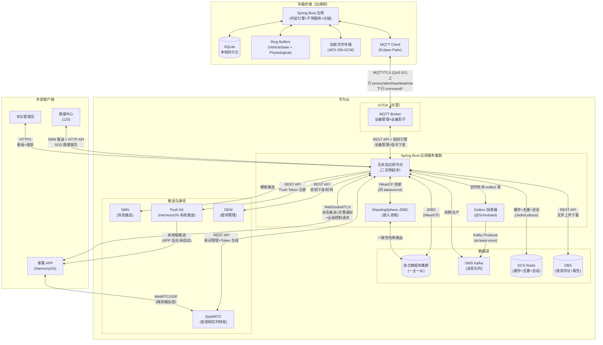

# 车载安全监测系统 基础设施/适配器层 OOD 设计方案（v12）

> 本文档为「智能物联——基于多传感器融合的车载安全监测系统」的**基础设施/适配器层**架构级 OOD 设计方案，承接领域层 OOD（`docs/ood_domain.md`）与应用层 OOD（`docs/ood_application.md`）。基础设施层的核心使命是：实现领域层声明的仓储接口、领域端口、事件总线契约，提供数据持久化、外部系统集成、云服务适配和安全隐私基础设施。
>
> 后端技术栈：**Java Spring Boot**，部署于**华为云**。数据库为**金仓**（兼容 PostgreSQL 协议，JPA 方言 `PostgreSQLDialect`），消息队列为**华为云 DMS Kafka**，设备接入通过**华为云 IoTDA**（MQTT），推送服务为**华为云 SMN** + Push Kit，音视频服务为**华为云 SparkRTC**，密钥管理为**华为云 DEW**。
>
> **统一主键策略**：所有聚合根表（`trip`、`driver`、`vehicle`、`system_account`、`road_rage_voice_record`）及独立实体表（`safety_alert_event`、`driver_health_profile`）的主键均采用**应用层生成 UUID**（`java.util.UUID.randomUUID().toString()`），在仓储 `save()` 调用前由领域服务或应用服务生成并赋值。理由：(a) 分布式无冲突生成——云边独立创建聚合后各自生成 UUID，同步时无主键碰撞风险，无需中心化序列分配；(b) 分片友好——UUID 不含单调递增语义，对 ShardingSphere-JDBC 一致性哈希分片无热点效应；(c) 数据库无关——不依赖数据库自增序列或 UUID 函数，边缘侧 SQLite 与云端金仓统一使用应用层生成逻辑。非聚合根的关联表（如 `guardianship`、`trip_physiological_snapshot`）主键同样采用应用层生成 UUID。

---

## 一、概述

### 设计目标

基础设施层的核心使命是：

- **实现领域契约**：为领域层声明的全部仓储接口、领域端口和事件总线契约提供面向生产环境的具体实现，将设计级的抽象契约落实为可运行的软件组件。
- **屏蔽技术细节**：将金仓数据库的 JPA 映射、华为云 DMS Kafka 的消息投递、IoTDA 的设备连接管理等技术细节封装在本层内部，上层（领域层、应用层）仅依赖接口契约，不感知具体技术选型。
- **保证数据一致性**：通过乐观锁版本号、outbox 事务性事件表和幂等去重机制，确保聚合根持久化、领域事件发布、CQRS 读模型投影之间的数据一致性。
- **支持云边协同**：为边缘侧和云端侧分别提供适合各自运行环境的实现——边缘侧以进程内同步调用和本地持久化为主，云端侧以数据库集群、消息队列和水平扩展为主。
- **内建安全隐私**：在基础设施层实现数据脱敏校验、AES-256-GCM 加密存储、二次身份验证集成等安全隐私机制，使上层无需背负加密算法和认证协议细节。

### 核心抽象层次

基础设施层在分层架构中的位置：

```
┌────────────────────────────────────────────────────────────┐
│            应用层（ood_application.md）                     │
│   六份 interface 契约 + 六份 class 实现                      │
└──────────┬───────────────────────────────────┬─────────────┘
           │ 编排调用                           │ 依赖注入
┌──────────▼───────────────────────────────────▼─────────────┐
│            领域层（ood_domain.md）                          │
│   领域服务 / 聚合根 / 仓储接口 / 端口接口 / 事件总线契约     │
└──────────┬───────────────────────────────────┬─────────────┘
           │ 接口声明                           │ 依赖注入
┌──────────▼───────────────────────────────────▼─────────────┐
│        基础设施/适配器层（本文档范围）                       │
│   仓储实现 / 端口适配器 / 事件总线实现 / 云服务适配          │
│   持久化映射 / 消息队列 / 安全加密 / MQTT 连接               │
└────────────────────────────────────────────────────────────┘
```

### 与领域层、应用层的职责边界

| 职责 | 归属层 | 说明 |
|------|--------|------|
| 仓储接口声明 | 领域层 | 以 Java `interface` 定义 |
| 仓储 JPA 实现 | 基础设施层 | 以 `@Repository` 标注，实现领域层仓储接口 |
| 端口接口声明 | 领域层 | VehicleStateBuffer、NotificationPort 等 |
| 端口适配器实现 | 基础设施层 | Ring buffer、SMN 客户端、IoTDA 连接器等 |
| 事件总线契约 | 领域层 | `publish` / `registerSyncHandler` 等 |
| 事件总线实现 | 基础设施层 | 边缘侧 Spring Event + 云端 Outbox + DMS Kafka |
| 聚合根持久化映射 | 基础设施层 | JPA `@Entity`、`@Embeddable` 注解 |
| 数据库连接池/分片 | 基础设施层 | HikariCP + ShardingSphere-JDBC |
| 安全加密/脱敏实现 | 基础设施层 | AES-256-GCM、华为云 DEW 集成 |

---

## 二、模块划分

### 2.1 模块一览

基础设施层按职责领域拆分为以下模块，各模块仅实现领域层声明的接口契约，模块间依赖方向为单向。

| 模块 | 职责 | 依赖的领域层契约 | 部署位置 |
|------|------|-----------------|:---:|
| `infra.persistence` | 聚合根 JPA 映射（Entity / Embeddable）、数据库表结构管理（Flyway/Liquibase 迁移）、乐观锁版本号管理 | 五份仓储接口 + VO 值对象定义 | 云端 |
| `infra.repository` | 仓储接口的 JPA 实现，含 Spring Data JPA `JpaRepository` 继承、自定义 JPQL/原生 SQL、EntityManager 复杂查询、乐观锁冲突重试 | 五份仓储接口 + CQRS 投影定义 | 云端 + 边缘 |
| `infra.eventbus` | 领域事件总线实现：边缘侧 Spring ApplicationEventPublisher + @EventListener 同步回调、云端 outbox 事务性写入 + DMS Kafka 投递、死信队列 | 领域事件总线契约（§3.6） | 云端 + 边缘 |
| `infra.messaging` | 消息队列连接管理：DMS Kafka 生产者/消费者配置、topic 管理、消费者组注册、消息序列化/反序列化、幂等去重缓存 | 无（纯基础设施） | 云端 |
| `infra.adapter` | 领域端口的适配器实现：VehicleStateBuffer ring buffer、PhysiologicalDataBuffer ring buffer、DrivingBehaviorTrackingPort 加速度监测回调、CameraOcclusionDetectionPort 遮挡检测回调、OTADeliveryPort IoTDA 下发、NotificationPort SMN 推送、RescueReportPort HTTP/SMN 投递、MediaSessionPort SparkRTC 集成 | 8 个领域端口接口 | 云端 + 边缘 |
| `infra.cloud` | 华为云服务适配：IoTDA MQTT 设备连接与设备影子管理、金仓数据库连接配置与分片策略、SMN 消息模板与路由、SparkRTC 房间与 Token 管理、DEW 密钥管理、Push Kit 推送集成、OBS 对象存储 | 无（纯基础设施） | 云端 |
| `infra.security` | 安全与隐私基础设施：AES-256-GCM 加密/解密、DEW 密钥下发/轮转、二次身份验证集成（华为云人机验证 + HarmonyOS 生物特征 API + SMS 验证码）、数据脱敏校验门控 | CameraOcclusionDetectionPort（解密端） | 云端 + 边缘 |
| `infra.edge` | 边缘侧专用基础设施：SQLite 本地持久化、断网数据缓冲与批量重传、MQTT 客户端管理、边缘-云端数据同步与幂等去重、本地加密文件存储 | 五份仓储接口（边缘实现）+ MQTT 下行 Topic | 边缘 |

### 2.2 依赖原则

- 基础设施层各模块**仅依赖领域层声明的接口契约**，不依赖领域层的具体实现类（领域服务、聚合根内部逻辑）。
- 基础设施层模块间允许单向调用：`infra.repository` 可依赖 `infra.persistence`；`infra.eventbus` 可依赖 `infra.messaging`；`infra.adapter` 可依赖 `infra.cloud` 和 `infra.security`。
- 基础设施层**禁止**向上依赖应用层（如直接注入应用服务实例）。
- 模块与部署位置的对应关系：除 `infra.edge` 仅在边缘侧部署、`infra.persistence` 仅在云端部署外，其余模块在两侧均有部署（但具体实现组件可能不同，如事件总线在边缘侧使用 Spring ApplicationEventPublisher、在云端使用 outbox + DMS Kafka）。

---

## 三、核心抽象

### 3.1 数据持久化映射

#### 3.1.1 聚合根表结构

基于领域层定义的五个聚合根，设计以下数据库表（金仓/PostgreSQL 类型）：

**AR-01 Trip 表（`trip`）**

| 职责 | 对应字段 | 列类型 | 约束 | 说明 |
|------|---------|--------|------|------|
| 唯一标识 | `trip_id` | `VARCHAR(64)` | PK, NOT NULL | 对应 TripId 值对象 |
| 乐观锁版本号 | `version` | `INTEGER` | NOT NULL, DEFAULT 0 | JPA `@Version`，并发控制 |
| 驾驶员引用 | `driver_id` | `VARCHAR(64)` | NOT NULL, FK→driver | 聚合间标识引用 |
| 车辆引用 | `vehicle_id` | `VARCHAR(64)` | NOT NULL, FK→vehicle | 聚合间标识引用 |
| 行程时间 | `started_at` | `TIMESTAMP` | NOT NULL | 点火时刻 |
| 行程时间 | `ended_at` | `TIMESTAMP` | NULL | 熄火时刻，NULL 表示行程进行中 |
| 驾驶行为计数 | `hard_braking_count` | `INTEGER` | NOT NULL, DEFAULT 0 | VO-16 DrivingBehaviorCounters，急刹计数 |
| 驾驶行为计数 | `hard_acceleration_count` | `INTEGER` | NOT NULL, DEFAULT 0 | VO-16 DrivingBehaviorCounters，急加速计数 |
| L3 自动驾驶追踪 | `l3_started_at` | `TIMESTAMP` | NULL | VO-17 L3DurationTracker，L3 激活开始时刻 |
| L3 自动驾驶追踪 | `l3_accumulated_seconds` | `INTEGER` | NOT NULL, DEFAULT 0 | VO-17 L3DurationTracker，累计 L3 时长（秒） |
| L3 自动驾驶追踪 | `l3_active` | `BOOLEAN` | NOT NULL, DEFAULT FALSE | VO-17 L3DurationTracker，L3 是否处于活跃状态 |
| 行程评分 | `score_value` | `INTEGER` | NULL | VO-05 TripScore，范围 [0,100] |
| 行程评分 | `score_calculated_at` | `TIMESTAMP` | NULL | 评分计算时间 |
| 创建/更新 | `created_at` | `TIMESTAMP` | NOT NULL, DEFAULT NOW() | |
| 创建/更新 | `updated_at` | `TIMESTAMP` | NOT NULL, DEFAULT NOW() | |

**索引设计**：
- 主键索引：`(trip_id)`
- 驾驶员查询索引：`(driver_id, started_at DESC)` — 按驾驶员 + 时间范围查询行程列表（报告生成场景）
- 车辆查询索引：`(vehicle_id, started_at DESC)` — 按车辆查询行程列表

**AR-02 Driver 表（`driver`）**

| 职责 | 对应字段 | 列类型 | 约束 | 说明 |
|------|---------|--------|------|------|
| 唯一标识 | `driver_id` | `VARCHAR(64)` | PK, NOT NULL | 对应 DriverId |
| 乐观锁版本号 | `version` | `INTEGER` | NOT NULL, DEFAULT 0 | |
| 姓名 | `name` | `VARCHAR(128)` | NOT NULL | |
| 综合风险评分 | `comprehensive_score` | `INTEGER` | NULL | VO-22，范围 [0,100] |
| 脱敏特征向量 | `face_feature_vector` | `JSONB` | NULL | 仅存脱敏后的数值特征 |
| 创建/更新 | `created_at` / `updated_at` | `TIMESTAMP` | NOT NULL | |

**索引设计**：
- 主键索引：`(driver_id)`

**AR-03 Vehicle 表（`vehicle`）**

| 职责 | 对应字段 | 列类型 | 约束 | 说明 |
|------|---------|--------|------|------|
| 唯一标识 | `vehicle_id` | `VARCHAR(64)` | PK, NOT NULL | 对应 VehicleId |
| 乐观锁版本号 | `version` | `INTEGER` | NOT NULL, DEFAULT 0 | |
| 车牌号 | `license_plate` | `VARCHAR(32)` | NOT NULL, UNIQUE | |
| 车架号 | `vin` | `VARCHAR(64)` | NOT NULL, UNIQUE | |
| 终端序列号 | `terminal_sn` | `VARCHAR(64)` | NOT NULL, UNIQUE | IoTDA 设备 ID |
| 所属车队 | `fleet_id` | `VARCHAR(64)` | NOT NULL | 车辆所属车队的标识，供看板投影按车队聚合查询。来源：车辆注册时从 IoTDA 设备元数据（`device_sdk_attr.fleet_id`）或车队管理配置获取写入。`fleet_id` 在车辆注册后不可变——若需变更归属车队，需注销车辆重新注册。对下游投影表（`alert_projection`、`fleet_dashboard_projection`）的级联影响：`fleet_id` 变更时需同步更新两张投影表中该车辆所有历史告警行的冗余 `fleet_id` 字段 |
| 固件版本 | `firmware_version` | `VARCHAR(64)` | NULL | VO-08 OTAVersion |
| 传感器自检状态 | `sensor_status` | `JSONB` | NULL | VO-06 SensorStatus，各传感器通道健康状态 |
| 脱线标记 | `offline_since` | `TIMESTAMP` | NULL | NULL 表示在线 |
| 最后心跳时刻 | `last_heartbeat_at` | `TIMESTAMP` | NULL | 车载终端最近一次心跳上报时刻，由 `infra.cloud` 模块的心跳监控定时任务更新 |
| OTA 升级阶段 | `ota_stage` | `VARCHAR(16)` | NULL | VO-19 OTAUpgradeStatus，UpgradeStage 枚举，NULL=无升级 |
| OTA 目标版本 | `ota_target_version` | `VARCHAR(64)` | NULL | VO-19 OTAUpgradeStatus，目标固件版本 |
| OTA 已传字节 | `ota_transferred_bytes` | `BIGINT` | NULL, DEFAULT 0 | VO-19 OTAUpgradeStatus，断点续传偏移量 |
| OTA 总字节数 | `ota_total_bytes` | `BIGINT` | NULL | VO-19 OTAUpgradeStatus，升级包总大小 |
| OTA 阶段进入时刻 | `ota_stage_entered_at` | `TIMESTAMP` | NULL | VO-19 OTAUpgradeStatus，进入当前阶段的时刻 |
| 创建/更新 | `created_at` / `updated_at` | `TIMESTAMP` | NOT NULL | |

**索引设计**：
- 主键索引：`(vehicle_id)`
- 终端序列号索引：`(terminal_sn)` — IoTDA 设备反向查找
- 车队索引：`(fleet_id)` — 看板投影按车队聚合查询
- 车牌号索引：`(license_plate)` — 运维查询

**AR-04 SystemAccount 表（`system_account`）**

| 职责 | 对应字段 | 列类型 | 约束 | 说明 |
|------|---------|--------|------|------|
| 唯一标识 | `account_id` | `VARCHAR(64)` | PK, NOT NULL | |
| 乐观锁版本号 | `version` | `INTEGER` | NOT NULL, DEFAULT 0 | |
| 手机号 | `phone` | `VARCHAR(32)` | NOT NULL, UNIQUE | |
| 角色 | `role` | `VARCHAR(16)` | NOT NULL | VO-14 AccountRole 枚举值 |
| 通知偏好 | `notification_preferences` | `JSONB` | NULL | VO-18，订阅风险等级集合 |
| 创建/更新 | `created_at` / `updated_at` | `TIMESTAMP` | NOT NULL | |

> **权限（VO-07 Permission）与监护关系**：家属对驾驶员的监护关系和权限以独立的关联表 `guardianship` 承载（非嵌入 SystemAccount 聚合），见 §3.1.2。

**索引设计**：
- 主键索引：`(account_id)`
- 手机号索引：`(phone)` — 登录查询

**AR-05 RoadRageVoiceRecord 表（`road_rage_voice_record`）**

| 职责 | 对应字段 | 列类型 | 约束 | 说明 |
|------|---------|--------|------|------|
| 唯一标识 | `record_id` | `VARCHAR(64)` | PK, NOT NULL | |
| 乐观锁版本号 | `version` | `INTEGER` | NOT NULL, DEFAULT 0 | |
| 关联告警 | `alert_id` | `VARCHAR(64)` | NOT NULL, UNIQUE | 1:1 引用 |
| 关联行程 | `trip_id` | `VARCHAR(64)` | NOT NULL | |
| 驾驶员引用 | `driver_id` | `VARCHAR(64)` | NOT NULL | |
| 车辆引用 | `vehicle_id` | `VARCHAR(64)` | NOT NULL | 冗余列，供分片路由使用 |
| 录制时间 | `started_at` / `ended_at` | `TIMESTAMP` | NOT NULL / NULL | ended_at NULL 表示录制进行中 |
| 加密文件引用 | `encrypted_file_path` | `TEXT` | NULL | 边缘侧本地路径 |
| 保留到期时间 | `expiry_time` | `TIMESTAMP` | NOT NULL | |
| 脱敏标记 | `is_sealed` | `BOOLEAN` | NOT NULL, DEFAULT FALSE | 封闭（录制结束）后为 TRUE |
| 创建/更新 | `created_at` / `updated_at` | `TIMESTAMP` | NOT NULL | |

**索引设计**：
- 主键索引：`(record_id)`
- 到期时间索引：`(expiry_time, is_sealed)` — 按到期时间批量查询待清除记录
- 告警引用索引：`(alert_id)` — 按告警 ID 查找存证
- 驾驶员引用索引：`(driver_id)` — 隐私合规审计

#### 3.1.2 实体独立表与关联表结构

**E-01 SafetyAlertEvent 表（`safety_alert_event`）**

SafetyAlertEvent 不是聚合根，但需支持跨行程独立查询（尤其车队管理员查询全队告警历史），因此设计为独立表，通过外键关联 Trip。

| 职责 | 对应字段 | 列类型 | 约束 | 说明 |
|------|---------|--------|------|------|
| 唯一标识 | `alert_id` | `VARCHAR(64)` | PK, NOT NULL | |
| 乐观锁版本号 | `version` | `INTEGER` | NOT NULL, DEFAULT 0 | |
| 关联行程 | `trip_id` | `VARCHAR(64)` | NOT NULL, FK→trip | 写侧通过此 FK 保持事务一致性 |
| 关联驾驶员 | `driver_id` | `VARCHAR(64)` | NOT NULL | 冗余以便独立查询 |
| 关联车辆 | `vehicle_id` | `VARCHAR(64)` | NOT NULL | 冗余以便车队维度查询 |
| 告警类型 | `alert_type` | `VARCHAR(32)` | NOT NULL | VO-02 AlertType 枚举值 |
| 风险等级 | `risk_level` | `VARCHAR(16)` | NOT NULL | VO-01 RiskLevel 枚举值 |
| 发生时间 | `occurred_at` | `TIMESTAMP` | NOT NULL | |
| 解析时间 | `resolved_at` | `TIMESTAMP` | NULL | 风险解除时间（如有） |
| 位置信息 | `gps_latitude` / `gps_longitude` | `DOUBLE PRECISION` | NULL | VO-04 GeoLocation |
| 特征快照 | `feature_snapshot` | `JSONB` | NULL | 异常特征摘要 |
| 创建时间 | `created_at` | `TIMESTAMP` | NOT NULL | |

**外键关系**：
- `trip_id` → `trip(trip_id)`：写侧通过 Trip 聚合根边界保证一致性
- `driver_id` → `driver(driver_id)`：冗余引用供读侧独立查询

**查询策略**：
- **读侧**：跨行程/跨驾驶员的告警历史查询、看板聚合和钻取均通过 CQRS 投影表（`alert_projection`）完成，不穿透 Trip 聚合根加载 SafetyAlertEvent 列表。查询请求直接路由至投影表，保证读模型查询性能。
- **写侧**：AlertPersistenceService 通过 TripRepository 加载 Trip 聚合、创建 SafetyAlertEvent 实体并持久化——写操作经 Trip 聚合根边界以保证事务一致性。

**索引设计**：
- 主键索引：`(alert_id)`
- Trip 关联索引：`(trip_id)` — 通过 Trip 聚合加载告警列表

> **索引策略说明**：读查询全部路由至 `alert_projection` 投影表（见 §3.2.3），主表仅承担写侧持久化和通过 `(trip_id)` 加载 Trip 聚合下属告警列表的职责。因此主表不再建立面向读侧查询的复合索引（如 `(driver_id, occurred_at DESC, alert_type, risk_level)` 和 `(vehicle_id, occurred_at DESC)`），避免索引维护拖累写性能。读侧所需的此类索引限定于 `alert_projection` 投影表。

**E-03 DriverHealthProfile 表（`driver_health_profile`）**

DriverHealthProfile 是 Driver 聚合内部的 1:1 实体，以独立表存储但通过 FK 关联 Driver 表。

| 职责 | 对应字段 | 列类型 | 约束 | 说明 |
|------|---------|--------|------|------|
| 唯一标识 | `driver_id` | `VARCHAR(64)` | PK, NOT NULL, FK→driver | 共享 Driver 主键，JPA `@OneToOne` + `@MapsId` 映射，1:1 关系 |
| 血型 | `blood_type` | `VARCHAR(8)` | NULL | |
| 过敏史 | `allergy_history` | `TEXT` | NULL | |
| 慢性病史 | `chronic_history` | `TEXT` | NULL | |
| 用药史 | `medication_history` | `TEXT` | NULL | |
| 基础生命体征 | `baseline_vitals` | `JSONB` | NULL | 静息心率、血压等 |
| 紧急联系人 | `emergency_contact` | `JSONB` | NULL | 姓名、手机号 |
| 创建/更新 | `created_at` / `updated_at` | `TIMESTAMP` | NOT NULL | |

**索引设计**：
- 主键索引：`(driver_id)` — 共享 Driver 主键，1:1 关系，同时也是 FK→driver 的外键索引

> **独立查询路径声明**：DriverHealthProfile 不是聚合根，但在以下场景需支持独立查询（不通过 Driver 聚合加载）：(a) 急救场景——救援中心根据驾驶员标识直接查询健康档案（血型、过敏史、紧急联系人），查询路径为 `SELECT * FROM driver_health_profile WHERE driver_id = ?`；(b) 隐私合规审计——数据保护官按驾驶员标识检索健康档案变更历史。独立查询通过 `infra.repository` 模块的 `DriverHealthProfileRepository`（独立于 DriverRepository 的 JPA Repository 接口，映射至 `driver_health_profile` 表）提供。写操作仍通过 Driver 聚合根边界：创建和更新 `driver_health_profile` 均经由 Driver 聚合加载后级联保存，保证 1:1 引用完整性。读查询可直接访问 `driver_health_profile` 表，无需穿透 Driver 聚合，避免加载不必要的 Driver 聚合字段（综合评分、脱敏特征向量等）。

**关联表：监护关系（`guardianship`）**

Driver 与 SystemAccount（家属角色）之间的多对多监护关系以独立关联表承载。

| 职责 | 对应字段 | 列类型 | 约束 | 说明 |
|------|---------|--------|------|------|
| 驾驶员引用 | `driver_id` | `VARCHAR(64)` | NOT NULL, FK→driver | |
| 账户引用 | `account_id` | `VARCHAR(64)` | NOT NULL, FK→system_account | |
| 权限范围 | `permissions` | `JSONB` | NOT NULL | VO-07 Permission 值对象 |
| 授权时间 | `granted_at` | `TIMESTAMP` | NOT NULL | 由应用层 `Instant.now()` 在 INSERT 时显式赋值，保证单调递增且不依赖数据库时间函数。客户端时钟可能不同步，因此时间戳由应用服务器统一生成 |
| 授权原因 | `grant_reason` | `VARCHAR(32)` | NOT NULL | 常规/高危/遮挡恢复 |
| 撤销时间 | `revoked_at` | `TIMESTAMP` | NULL | NULL 表示权限有效 |

**复合主键**：`(driver_id, account_id, granted_at)`——每次权限授予创建新行（granted_at 唯一标识一次授权事件），撤销以 `UPDATE revoked_at = NOW()` 更新活跃行而非物理删除，保留完整授权-撤销历史链。`(driver_id, account_id)` 组合上建**部分唯一索引** `WHERE revoked_at IS NULL`，确保同一 (driver, account) 至多存在一条活跃监护关系。

**当前有效授权判定规则**：撤销后再授予场景下同一 (driver, account) 可能有多行记录（各次授权均以不同的 `granted_at` 创建新行），DS-08 PermissionService 在执行权限校验时按以下规则判定当前有效授权：`SELECT * FROM guardianship WHERE driver_id = ? AND account_id = ? AND revoked_at IS NULL ORDER BY granted_at DESC LIMIT 1`——取 `granted_at` 最大的未撤销行作为当前有效授权，其 `permissions` 值对象即为当前生效的权限集合。`granted_at` 由应用层 `Instant.now()` 在每次 INSERT 授权行时显式赋值，保证单调递增，因此 `granted_at DESC` 排序等价于"最新一次授权"。

> **金仓兼容性验证**：部分唯一索引 `WHERE revoked_at IS NULL` 为 PostgreSQL DDL 扩展语法，金仓数据库的兼容性需在编码阶段验证（确认目标金仓版本的 SQL 解析器支持 `CREATE UNIQUE INDEX ... WHERE` 子句）。
>
> **金仓不支持时的替代方案**：若金仓不支持部分唯一索引，改为应用层悲观锁方案——在 `guardianship` 表（广播表，分布于所有分片）执行 INSERT 新授权行前，先对该 `(driver_id, account_id)` 的活跃行执行 `SELECT * FROM guardianship WHERE driver_id = ? AND account_id = ? AND revoked_at IS NULL FOR UPDATE`，锁定已有的活跃行。若 `SELECT ... FOR UPDATE` 查得结果，说明已存在活跃关系——根据场景决定：(a) 常规授予场景返回"权限已存在"错误；(b) 授权原因变更场景先对锁定行执行 `UPDATE SET revoked_at = NOW()` 撤销旧权限，再 INSERT 新授权行。此方案完全依赖数据库行锁的排他性（`FOR UPDATE` 在事务期间阻止并发 INSERT），不依赖部分唯一索引，通用性优于部分唯一索引。

> **广播表 `SELECT ... FOR UPDATE` 行为说明**：guardianship 是广播表，所有行遍布每个分片。在 ShardingSphere-JDBC LOCAL 模式下，`SELECT ... FOR UPDATE` 语句在执行时由 ShardingSphere-JDBC 路由至各物理分片执行，但各分片上获取的行锁相互独立——一个分片上的行锁不阻止另一分片上的并发写入。因此上述"应用层悲观锁方案"在广播表场景下不具备跨分片排他性：(a) 若当前线程路由至 shard-0 执行 `SELECT ... FOR UPDATE`，仅锁定 shard-0 上的 guardianship 行副本，shard-1、shard-2 等分片上的相同行仍可被并发事务修改；(b) ShardingSphere-JDBC 对广播表的写操作同步广播至所有分片——若并发事务在 shard-1 上修改了同一行，该修改仍会同步广播至 shard-0，导致脏写。\n> \n> **推荐替代方案（Redis SET NX 分布式锁）**：改用应用层分布式锁替代数据库层行锁——在执行 guardianship 权限变更前，以 `(driver_id, account_id)` 组合为锁键调用 `redis.set(key, owner, "NX", "EX", 10)` 获取排他锁。锁获取成功后在锁保护下执行广播表 INSERT/UPDATE，操作完成后释放锁。此方案：(a) 在应用层提供跨分片的全局排他性，不依赖 ShardingSphere-JDBC 的行锁语义；(b) 锁超时 10s 防止持锁进程崩溃后死锁；(c) 与 guardianship 表为广播表的事实解耦——锁语义由 Redis 单节点保证，不受分片拓扑影响。
>
> **Redis 不可用时的降级策略**：上述 Redis SET NX 分布式锁为 guardianship 权限变更的推荐并发控制机制。Redis 不可用时按以下两级降级：(a) **短期故障（≤30s）**——调用方（DS-08 PermissionService）捕获 Redis 连接异常后等待 100ms 并重试（最多 3 次），利用 Redis 的快速故障恢复窗口缓解暂时性不可用；(b) **长期不可用（>30s 或重试耗尽）**——降级为无锁模式，依赖数据库级约束兜底——guardianship 表的部分唯一索引 `(driver_id, account_id) WHERE revoked_at IS NULL` 防止同一 (driver, account) 重复出现活跃授权行，并发授予中后提交者因违反唯一约束而收到数据库层错误，DS-08 据此返回"权限已存在"或"并发冲突"错误。同时通过 SMN 推送"guardianship 分布式锁降级"告警通知运维。降级模式下撤销优先于授予的安全语义仍由 DS-08 对 SystemAccount 聚合加显式行锁（`SELECT ... FOR UPDATE`）保障，但该行锁不具备跨分片排他性（见上文广播表行锁说明），降级期间的极小概率并发竞争由唯一约束最终兜底。Redis 恢复后自动从降级模式恢复为 Redis 锁模式。

**关联表：OTA 升级状态（`ota_upgrade_status`）**

VO-19 OTAUpgradeStatus 是 Vehicle 聚合内部的值对象，因其具有独立的状态生命周期和追溯需求，设计为 Vehicle 表的嵌入字段组（非独立表）以利用值对象替换模式进行不可变更新：

| 嵌入字段 | 列类型 | 约束 | 说明 |
|---------|--------|------|------|
| `ota_stage` | `VARCHAR(16)` | NULL | UpgradeStage 枚举，NULL=无升级 |
| `ota_target_version` | `VARCHAR(64)` | NULL | 目标固件版本 |
| `ota_transferred_bytes` | `BIGINT` | NULL, DEFAULT 0 | 断点续传偏移量 |
| `ota_total_bytes` | `BIGINT` | NULL | 升级包总大小 |
| `ota_stage_entered_at` | `TIMESTAMP` | NULL | 进入当前阶段的时刻 |

> **值对象嵌入策略说明**：OTAUpgradeStatus 与 Vehicle 是 1:1 的强包含关系——一个 Vehicle 同一时刻至多存在一个活跃的升级状态，生命周期完全依附于 Vehicle 聚合，无独立查询需求。因此采用嵌入 Vehicle 表（`@Embeddable` + `@Embedded`）策略，避免不必要的关联表 JOIN。状态推进由 DS-15 以不可变替换模式更新 Vehicle 聚合。

#### 3.1.3 值对象嵌入映射策略

领域层定义的 22 个值对象的 JPA 映射策略分为以下三类：

**策略 A：嵌入聚合根表（`@Embeddable` + `@Embedded`）**

适用于与聚合根 1:1 强包含、无独立查询需求的值对象：

| 值对象 | 宿主聚合根表 | 映射方式 | 说明 |
|--------|:---:|------|------|
| VO-05 TripScore | `trip` | 嵌入列字段（`score_value` + `score_calculated_at`） | 行程评分是 Trip 的持久化属性 |
| VO-04 GeoLocation | `safety_alert_event` | 嵌入列字段（`gps_latitude` + `gps_longitude`） | 告警定位 |
| VO-07 Permission | `guardianship` | JSONB 嵌入 | 监护权限集合 |
| VO-14 AccountRole | `system_account` | 嵌入列字段（`role` VARCHAR） | 角色枚举 |
| VO-18 NotificationPreference | `system_account` | JSONB 嵌入 | 通知偏好集合 |
| VO-19 OTAUpgradeStatus | `vehicle` | 嵌入列字段组 | 详见上表 |
| VO-22 DriverComprehensiveScore | `driver` | 嵌入列字段（`comprehensive_score` INTEGER） | 综合评分 |
| VO-16 DrivingBehaviorCounters | `trip` | 嵌入列字段（`hard_braking_count` + `hard_acceleration_count` INTEGER） | 两个计数字段嵌入 Trip 表 |
| VO-17 L3DurationTracker | `trip` | 嵌入列字段（`l3_started_at` + `l3_accumulated_seconds` + `l3_active` BOOLEAN） | Trip:Driver=1:1，至多一个活跃 Tracker，独立嵌入列字段（`@Embedded`），非集合 |

**策略 B：集合嵌入聚合根表（`@ElementCollection` + `@CollectionTable`）**

适用于被聚合根持有为集合、无独立标识的值对象：

| 值对象 | 宿主聚合根 | 映射方式 | 说明 |
|--------|:---:|------|------|
| VO-03 PhysiologicalSnapshot | Trip | `@ElementCollection` → 独立关联表 `trip_physiological_snapshot`（trip_id + timestamp 复合主键） | Trip 聚合持有多个快照，新增即追加 |

> **PhysiologicalSnapshot 集合映射特别说明**：Trip 持有 PhysiologicalSnapshot 的不可变集合，新增即追加。JPA 以 `@ElementCollection` 映射至独立的 `trip_physiological_snapshot` 表。该表随 Trip 聚合的 save() 操作一同持久化（级联）。查询时随 Trip 聚合整体加载，不支持仅查询部分快照列表（如仅查最近 5 条）——此类读优化需求通过 trajectory_projection 投影表满足。
> 
> **trip_physiological_snapshot 表完整列结构**（该表承载 JPA @ElementCollection 级联写入、溢出优化 JDBC batch INSERT、边缘侧同步 JDBC batch INSERT 三路数据来源）：
> 
> | 列名 | 列类型 | 约束 | 写入方 | 说明 |
> |------|--------|------|--------|------|
> | `trip_id` | `VARCHAR(64)` | NOT NULL, PK 组成部分 | 三路均写入 | 关联 Trip 聚合的行程序号 |
> | `timestamp` | `TIMESTAMP` | NOT NULL, PK 组成部分 | 三路均写入 | 快照采样时刻 |
> | `heart_rate` | `INTEGER` | NULL | JPA 级联 / 边缘同步 | 心率（bpm） |
> | `blood_oxygen` | `DOUBLE PRECISION` | NULL | JPA 级联 / 边缘同步 | 血氧饱和度（%） |
> | `emotion_index` | `DOUBLE PRECISION` | NULL | JPA 级联 / 边缘同步 | 情绪指数（信号处理推导值） |
> | `respiratory_rate` | `INTEGER` | NULL | JPA 级联 / 边缘同步 | 呼吸频率（次/分） |
> | `systolic_bp` | `INTEGER` | NULL | JPA 级联 / 边缘同步 | 收缩压（mmHg） |
> | `diastolic_bp` | `INTEGER` | NULL | JPA 级联 / 边缘同步 | 舒张压（mmHg） |
> | `fatigue_index` | `DOUBLE PRECISION` | NULL | JPA 级联 / 边缘同步 | 疲劳指数（PERCLOS 等融合值） |
> | `body_temperature` | `DOUBLE PRECISION` | NULL | JPA 级联 / 边缘同步 | 体温（℃） |
> | `source` | `VARCHAR(16)` | NOT NULL, DEFAULT 'CASCADE' | 三路均写入 | 数据来源标记：`CASCADE`（JPA 级联）/ `OVERFLOW`（溢出 JDBC batch）/ `EDGE_SYNC`（边缘同步） |
> 
> **复合主键**：`(trip_id, timestamp)`——同一时刻同一行程仅一条快照。
> 
> **写入方职责**：
> - **JPA @ElementCollection 级联写入**（前 500 条）：写入除 `source` 外的所有业务列，`source` 列由 DB DEFAULT 填充为 `CASCADE`。
> - **溢出优化 JDBC batch INSERT**（第 501 条起）：写入所有列（`source = 'OVERFLOW'`），通过 JDBC `PreparedStatement` batch 执行，写入顺序按 `timestamp` 递增。
> - **边缘侧同步 JDBC batch INSERT**（断网恢复后）：写入所有列（`source = 'EDGE_SYNC'`），以 `INSERT ... ON CONFLICT (trip_id, timestamp) DO NOTHING` 幂等去重，防止断网期间部分批次重复传输覆盖已有数据。
> 
> **@ElementCollection 优化触发条件**：当单次行程的 PhysiologicalSnapshot 累积数量超过 500 条时（对应于 100ms 采样率下约 50 秒行程，或 500ms 采样率下约 4 分钟行程），触发优化方案——后续新增的快照不再通过 @ElementCollection 级联写入 Trip 聚合，改为通过 JDBC batch INSERT 直接写入 `trip_physiological_snapshot` 表（即 @ElementCollection 的实际底层存储表，绕过 JPA 级联路径）。该表同时承载三路数据来源——JPA @ElementCollection 级联写入（前 500 条）、溢出优化直接写入（第 501 条起）、边缘侧同步批量写入（断网恢复后）——后续 Trip 聚合加载时 JPA 从同一张表加载全部快照，数据完整性完整覆盖。
> >
> > **集合冻结技术实现**：超阈值后 Trip 聚合的 @ElementCollection 集合以**不可变包装**方式冻结——集合引用替换为 `Collections.unmodifiableList()` 包装后的不可变视图，Trip 聚合的 `addSnapshot()` 方法在冻结后抛出 `IllegalStateException`。JPA 的脏检查（dirty-checking）依赖对集合引用的 `==` 比较——不可变包装创建新的集合视图引用，Hibernate 在 flush 时检测到集合引用变化，但因 `@ElementCollection` 的 `@OrderColumn` 或级联配置，Hibernate 可能触发 DELETE+INSERT 覆盖操作。为避免此副作用，冻结时通过以下机制使 Hibernate 忽略集合的脏检查，确保后续 Trip 聚合的 `save()` 仅更新 Trip 表自身的列字段（行程时间、评分等），不再级联操作 `trip_physiological_snapshot` 表：(a) **推荐方案**——使用 Hibernate `StatelessSession` 执行冻结后的 Trip 更新。`StatelessSession` 绕过一级缓存和脏检查，仅执行显式指定的 UPDATE 语句，不会触发面向集合表的级联 DELETE 操作，规避 `detach()+merge()` 方案中 flush 时意外删除 `trip_physiological_snapshot` 已写入溢出行数据的风险；(b) **备选方案**——维护 `snapshotCollectionFrozen` 布尔标志，仓储层 `save()` 方法在检测到该标志为 `true` 时跳过 `@ElementCollection` 的级联保存（通过仅调用 `EntityManager.createNativeQuery` 执行 Trip 表列字段的 UPDATE，不调用 `merge()`）。**技术风险标注**：此冻结策略依赖 Hibernate 的具体行为（如 `StatelessSession` 对 `@ElementCollection` 的拦截语义、`detach()+merge()` 下 flush 的集合表 DELETE 行为），需在编码阶段通过集成测试验证 Hibernate 实际行为。此阈值在 Spring 配置中可调（`trip.physiological-snapshot.max-collection-size`）。

**策略 C：单列映射的值对象/枚举（无需 `@Embeddable`）**

适用于以单一 VARCHAR/JSONB 列持久化、但因结构简单而无需定义为独立 `@Embeddable` 类的值对象/枚举：

| 值对象 | 持久化方式 | 所在表 | 说明 |
|--------|-----------|--------|------|
| VO-01 RiskLevel | VARCHAR(16) 列 | `safety_alert_event` | 风险等级枚举值 |
| VO-02 AlertType | VARCHAR(32) 列 | `safety_alert_event` | 告警类型枚举值 |
| VO-06 SensorStatus | JSONB 列 | `vehicle` | 传感器自检状态，JSONB 提供各通道健康状态的灵活结构 |
| VO-08 OTAVersion | VARCHAR(64) 列 | `vehicle`（`firmware_version`） | 固件版本号 |

**策略 D：不持久化的值对象（瞬时/派生）**

适用于仅在内存中承载瞬时数据、不入数据库的值对象：

| 值对象 | 说明 |
|--------|------|
| VO-09 VehicleStateSnapshot | 瞬时值对象，仅在 ring buffer 内存中存在，不入金仓主表；边缘侧进程崩溃前可选择性序列化至 SQLite 供紧急回取（见 §3.4.2a EdgeSessionContext.destroy() 破坏性持久化流程） |
| VO-10 TimeRange | 查询参数值对象，不入库 |
| VO-11 SensorReading | 瞬时值对象，不入库 |
| VO-12 InterventionInstruction | 瞬时值对象，不入库 |
| VO-13 RescueReport | 瞬时值对象，不入库 |
| VO-15 DriverStatusSnapshot | 瞬时遥测快照，不入库（仅推送） |
| VO-20 DetectionWindow | 瞬时会话状态，不入库 |
| VO-21 OverrideSignal | 瞬时信号，不入库 |
| VO-23 RescueAuthorizationToken | 瞬时凭证，不入库 |

#### 3.1.4 乐观锁版本号统一规范

所有需要并发控制的表统一使用乐观锁版本号字段：

- **字段名**：`version`，类型 `INTEGER`，默认值 `0`
- **JPA 实现**：在聚合根 Entity 类中以 `@Version` 注解标注该字段，JPA 在每次 `save()` 时自动执行 `UPDATE ... SET version = version + 1 WHERE id = ? AND version = ?`。若受影响行数为 0，Hibernate/JPA 抛出 `OptimisticLockException`。
- **冲突处理**：仓储实现层捕获 `OptimisticLockException`，将其转换为领域层声明的 `PersistenceException.OptimisticLockConflict`，由调用方领域服务按场景决定重试或降级（见 §3.2.4）。
- **不适用场景**：DriverHealthProfile（E-03）嵌入 Driver 聚合，其乐观锁由 Driver 表统一管理；监护关系关联表（guardianship）以 `(driver_id, account_id, granted_at)` 复合主键保留历史记录——每次权限授予创建新行（含 `granted_at` 时间戳和 `revoked_at = NULL`），权限撤销以 `UPDATE SET revoked_at = NOW()` 更新当前活跃行而非物理删除，保留完整授权-撤销历史链。`(driver_id, account_id)` 组合上建部分唯一索引（`WHERE revoked_at IS NULL`）确保至多一条活跃监护关系，并发授予冲突由该唯一约束兜底，无需乐观锁版本号。撤销优先于授予的安全语义通过应用层 DS-08 PermissionService 在执行权限写操作前先加 SystemAccount 聚合的显式行锁（SELECT ... FOR UPDATE on system_account）实现完全串行化，而非依赖乐观锁；SafetyAlertEvent 为只追加不修改实体，理论上无并发写冲突，但仍保留乐观锁以防御运维操作。

**边缘侧 JDBC 层乐观锁实现**：

边缘侧使用 JDBC 直连 SQLite，无 JPA `@Version` 机制。各仓储的 JDBC 实现在执行 UPDATE 时手动构造带版本号条件的 SQL：

```sql
UPDATE {table} SET ..., version = version + 1
WHERE id = ? AND version = ?
```

执行后检查 JDBC `PreparedStatement.executeUpdate()` 返回的受影响行数——若为 0，说明版本号不匹配（已有并发修改），仓储实现抛出 `PersistenceException.OptimisticLockConflict`，与云端 JPA 实现保持相同的异常语义。此方案适用于所有需要乐观锁的边缘侧表（Trip、SafetyAlertEvent、RoadRageVoiceRecord）。边缘侧 Driver 和 Vehicle 表在边缘侧为只读缓存（从云端同步），不需要乐观锁。

#### 3.1.5 金仓数据库分库分表策略

- **分片键**：`vehicle_id`（分片列）
- **分片算法**：ShardingSphere-JDBC **一致性哈希分片算法**（`CONSISTENT_HASH`），基于 `vehicle_id` 的哈希值进行虚拟节点路由。一致性哈希在增减分片节点时仅影响相邻节点的数据，最小化数据迁移量，支持 §3.5.2 所述的动态扩容目标
- **分片中间件**：ShardingSphere-JDBC，嵌入应用进程中（非独立代理）
- **分片范围**：
  - **按 VehicleId 分片**：`trip` 表（Trip 归属于 Vehicle）、`trip_physiological_snapshot` 集合表（随 Trip）、`safety_alert_event` 表（关联至 Trip/Vehicle）、`road_rage_voice_record` 表（含冗余 `vehicle_id` 列供分片路由）、`trajectory_projection` 表（含冗余 `vehicle_id` 列供分片路由）。其中 `trip_physiological_snapshot` 表自身不含 `vehicle_id` 列，通过 ShardingSphere-JDBC 的**绑定表**（Binding Table）机制与 `trip` 表绑定——两表按相同的 `trip_id` → `vehicle_id` 映射关系路由至同一分片。ShardingSphere-JDBC 绑定表功能确保同一 `trip_id` 的 `trip` 行和 `trip_physiological_snapshot` 行始终落在同一物理分片上，避免跨分片 JOIN
  - **全局表（不分片）**：`driver`、`vehicle`、`system_account`、`driver_health_profile`、`guardianship`。这些表记录数相对有限（千级驾驶员/车辆），采用广播表策略（每个分片冗余一份，写操作同步广播至所有分片）
- **分片数量**：初始 4 片（ShardingSphere-JDBC 一致性哈希虚拟节点数 = 4 × 128 = 512），按数据增长动态扩容
- **扩容数据迁移方案**：增加分片节点时，ShardingSphere-JDBC 一致性哈希算法自动将受影响的虚拟节点数据迁移至新节点。迁移采用在线方式——通过 ShardingSphere-JDBC 的 scaling 模块执行增量数据同步：先全量同步存量数据，再增量追平变更，最后切换路由规则。迁移过程中业务读写不受影响（读写均路由至旧分片，切换后统一路由至新拓扑）。迁移完成后旧分片数据保留 7 天作为回滚窗口，确认无异常后手动清理

#### 3.1.6 概念级 DDL 概要

以下以两张代表性表（Trip 聚合根表、SafetyAlertEvent 独立实体表）的 CREATE TABLE DDL 语法展示核心表结构，覆盖主键约束、外键约束、唯一约束和默认值等关键表级约束：

**Trip 表 DDL 概要**：

```sql
CREATE TABLE trip (
    trip_id              VARCHAR(64)  NOT NULL,
    version              INTEGER      NOT NULL DEFAULT 0,
    driver_id            VARCHAR(64)  NOT NULL,
    vehicle_id           VARCHAR(64)  NOT NULL,
    started_at           TIMESTAMP    NOT NULL,
    ended_at             TIMESTAMP,
    hard_braking_count   INTEGER      NOT NULL DEFAULT 0,
    hard_acceleration_count INTEGER   NOT NULL DEFAULT 0,
    l3_started_at        TIMESTAMP,
    l3_accumulated_seconds INTEGER    NOT NULL DEFAULT 0,
    l3_active            BOOLEAN      NOT NULL DEFAULT FALSE,
    score_value          INTEGER,
    score_calculated_at  TIMESTAMP,
    created_at           TIMESTAMP    NOT NULL DEFAULT NOW(),
    updated_at           TIMESTAMP    NOT NULL DEFAULT NOW(),
    PRIMARY KEY (trip_id),
    FOREIGN KEY (driver_id)  REFERENCES driver(driver_id),
    FOREIGN KEY (vehicle_id) REFERENCES vehicle(vehicle_id)
);
```

**SafetyAlertEvent 表 DDL 概要**：

```sql
CREATE TABLE safety_alert_event (
    alert_id       VARCHAR(64)    NOT NULL,
    version        INTEGER        NOT NULL DEFAULT 0,
    trip_id        VARCHAR(64)    NOT NULL,
    driver_id      VARCHAR(64)    NOT NULL,
    vehicle_id     VARCHAR(64)    NOT NULL,
    alert_type     VARCHAR(32)    NOT NULL,
    risk_level     VARCHAR(16)    NOT NULL,
    occurred_at    TIMESTAMP      NOT NULL,
    resolved_at    TIMESTAMP,
    gps_latitude   DOUBLE PRECISION,
    gps_longitude  DOUBLE PRECISION,
    feature_snapshot JSONB,
    created_at     TIMESTAMP      NOT NULL DEFAULT NOW(),
    PRIMARY KEY (alert_id),
    FOREIGN KEY (trip_id)   REFERENCES trip(trip_id),
    FOREIGN KEY (driver_id) REFERENCES driver(driver_id)
);
```

> **说明**：上述 DDL 为概念级概要，展示核心字段、主键约束和外键关系，不包含索引定义（详见 §3.1.1-§3.1.5 各表索引设计）和 ShardingSphere-JDBC 分片路由规则（分片键和广播表策略在运行时由 ShardingSphere-JDBC 配置驱动，不在 DDL 中体现）。其余表的 DDL 遵循相同的结构模式——聚合根表含 `version` 列和 `created_at`/`updated_at` 审计列，独立实体表通过 FK 关联宿主聚合根。
>
> **外键约束的物理可行性说明**：上述 DDL 中的 `FOREIGN KEY` 子句为**文档级逻辑约束声明**——在设计层面表达表间引用关系，供代码审查和 DBA 理解数据模型。在实际数据库层面，由于 ShardingSphere-JDBC 管理多个物理数据库实例，跨分片物理外键不可创建（`trip.vehicle_id → vehicle.vehicle_id` 中 Trip 按 `vehicle_id` 分片但 Vehicle 为广播表，FK 子句在物理库上可能因目标表不存在于同一实例而失败）。实际建表时移除 `FOREIGN KEY` 子句，仅在概念级 DDL 中保留该语义声明，引用完整性由应用层仓储实现和领域服务保证。ShardingSphere-JDBC 5.x 对广播表间的 FOREIGN KEY 创建行为需在编码阶段通过集成测试验证——若验证通过则广播表间（如 `driver_id → driver`、`account_id → system_account`）可保留物理 FK；若验证不通过则全表移除物理 FK，统一由应用层保障。

---

### 3.2 仓储实现

#### 3.2.1 JPA 实现策略总览

| 仓储接口（领域层） | 实现策略 | 核心 JPA 能力 |
|---------|------|------------|
| TripRepository | Spring Data JPA 继承 `JpaRepository<TripEntity, String>`，自定义 `@Query` 方法 | `findById` → `findById`，`save` → `save` + 乐观锁 |
| DriverRepository | 同上，附加 `@Modifying @Query` 轻量更新方法 | `updateScore` → `@Modifying @Query("UPDATE DriverEntity d SET d.comprehensiveScore = :score, d.version = d.version + 1 WHERE d.id = :id AND d.version = :version")`。`@Modifying` 查询不触发 JPA `@Version` 自动乐观锁检测——更新操作执行后 JPA 返回受影响行数（`int`），仓储实现需手动检查返回值：受影响行数为 0 时说明版本号不匹配（已被并发修改），仓储层手动抛出 `PersistenceException.OptimisticLockConflict`，与标准 `save()` 的乐观锁异常语义保持一致 |
| VehicleRepository | 同上，标准 CRUD | `findById` + `save` |
| SystemAccountRepository | 同上，附加自定义查询 | `findByDriver` → `@Query("SELECT a FROM SystemAccountEntity a JOIN guardianship g ON a.id = g.accountId WHERE g.driverId = :driverId AND g.revokedAt IS NULL")` |
| RoadRageVoiceRecordRepository | 同上，附加自定义查询与删除 | `findByExpiryBefore` → `@Query`，`delete` → `deleteById` |

#### 3.2.2 复杂查询策略

**RoadRageVoiceRecordRepository.findByExpiryBefore（到期存证批量查询）**

- 云端实现：JPQL 查询 `SELECT r FROM RoadRageVoiceRecordEntity r WHERE r.expiryTime < :deadline AND r.isSealed = TRUE`
- 边缘侧实现（SQLite）：由于边缘侧存储为本地文件系统 + SQLite 元数据表，`findByExpiryBefore` 在边缘侧的实现为扫描本地加密文件目录 + SQLite 元数据查询的组合——先通过 SQLite 查询到期记录，再验证文件确实存在且未误操作，最后执行物理删除（含加密文件的磁盘擦除）。边缘侧清除操作需经二次校验（验证文件确实过期且关联告警已封闭），防止误删。

**TripRepository 中按时间范围和 DriverId 查询行程列表**

- JPQL 查询：`SELECT t FROM TripEntity t WHERE t.driverId = :driverId AND t.startedAt >= :from AND (t.endedAt IS NULL OR t.endedAt <= :to) ORDER BY t.startedAt DESC`——`endedAt IS NULL` 分支纳入进行中的行程，确保时间范围查询不遗漏尚未结束的当前行程
- 支持分页（`Pageable`）

**SystemAccountRepository.findByDriver（按驾驶员 ID 查询关联家属列表）**

- JPQL 查询：`SELECT a FROM SystemAccountEntity a JOIN guardianship g ON a.id = g.accountId WHERE g.driverId = :driverId AND g.revokedAt IS NULL`
- 仅返回权限当前有效的家属账户

#### 3.2.2a 边缘侧仓储 JDBC 实现策略

边缘侧以 JDBC 直连 SQLite 实现五份仓储接口，不依赖 JPA。以下说明各仓储在边缘侧的 JDBC 实现要点：

**TripRepository（边缘侧 JDBC 实现）**

- **findById**：`SELECT * FROM trip WHERE trip_id = ?`
- **save（INSERT/UPDATE）**：通过 `INSERT ... ON CONFLICT(trip_id) DO UPDATE SET ...`（SQLite 3.24+ 支持 UPSERT 语法）实现 upsert。若不存在 → INSERT；若存在 → 按版本号条件更新：`UPDATE trip SET ... , version = version + 1 WHERE trip_id = ? AND version = ?`，受影响行数为 0 则抛出 `OptimisticLockConflict`。注意边缘侧不支持 JPA `@ElementCollection`——PhysiologicalSnapshot 集合改为直接写入 `trip_physiological_snapshot` 表，由 JDBC batch INSERT 按批次写入
- **findByDriverAndTimeRange**：`SELECT * FROM trip WHERE driver_id = ? AND started_at >= ? AND (ended_at IS NULL OR ended_at <= ?) ORDER BY started_at DESC`
- **生理快照集合替代方案**：边缘侧不使用 @ElementCollection 级联。PhysiologicalSnapshot 的 JDBC 写入流程为：① 采集组件按固定频率生成 PhysiologicalSnapshot → ② 调用 `tripPhysiologicalSnapshotJdbcTemplate.batchUpdate(...)` 批量 INSERT 至 `trip_physiological_snapshot` 表 → ③ 加载 Trip 时通过 `SELECT * FROM trip_physiological_snapshot WHERE trip_id = ?` 单独查询快照列表。此方式避免 JPA 级联的内存开销，且支持按时间戳范围分页查询（仅查最近 N 条快照）

**DriverRepository（边缘侧 JDBC 实现）**

- 边缘侧的 Driver 数据为**云端驱动的只读缓存**——边缘侧不修改 Driver 聚合。Driver 数据通过 IoTDA MQTT 下行通道从云端同步至边缘侧 SQLite（仅在驾驶员切换或将车辆分配给新驾驶员时触发同步）
- `findById`：`SELECT * FROM driver WHERE driver_id = ?`
- `updateScore`：边缘侧不实现（评分计算在云端执行，结果写回云端 Driver 表）

**VehicleRepository（边缘侧 JDBC 实现）**

- 边缘侧的 Vehicle 数据为**云端驱动的只读缓存**（同 Driver），存储车辆基础信息（终端序列号、固件版本等）
- `findById`：`SELECT * FROM vehicle WHERE vehicle_id = ?`
- `save`：边缘侧不实现（Vehicle 聚合修改仅在云端执行，如 OTA 升级状态推进由云端 DS-15 驱动）

**SystemAccountRepository（边缘侧 JDBC 实现）**

- 边缘侧的 SystemAccount 数据为**云端驱动的只读缓存**——仅在权限变更事件（FamilyAccessGrantedEvent / FamilyAccessRevokedEvent）到达边缘侧时，由消费方同步更新本地缓存。缓存内容为 `account_id`、`role`、`notification_preferences` 及当前有效的 guardianship 权限
- `findByDriver`：`SELECT a.* FROM system_account a JOIN guardianship g ON a.account_id = g.account_id WHERE g.driver_id = ? AND g.revoked_at IS NULL`
- `save`：边缘侧仅在收到云端事件时执行本地缓存更新（upsert），不独立修改 SystemAccount

**RoadRageVoiceRecordRepository（边缘侧 JDBC 实现）**

- 已在 §3.2.2 首段描述。补充说明：`save` 操作同样使用版本号条件 UPDATE 实现乐观锁。边缘侧 `delete` 需先校验文件存在后执行 `DELETE FROM road_rage_voice_record WHERE record_id = ?` + 加密文件物理擦除

> **边缘侧仓储设计原则**：边缘侧只写 `trip`、`safety_alert_event`、`road_rage_voice_record` 三张表（当前活跃行程相关数据）。`driver`、`vehicle`、`system_account` 三张表为云端驱动的只读缓存，通过 MQTT/事件同步更新。边缘侧不部署 JPA——所有仓储实现基于 JDBC `JdbcTemplate` + SQLite，手动管理乐观锁版本号、SQL 语句和对象映射。此设计避免在资源受限的边缘设备上引入 Hibernate 框架开销。

#### 3.2.3 CQRS 读模型投影表设计

以下是三张 CQRS 投影表的字段设计与数据同步策略。投影表在数据库中独立存在，不参与领域层的聚合根事务边界。写侧由 AlertPersistenceService、ScoringService 等产出领域事件后，由投影同步器异步写入投影表。

**投影表 P1：alert_projection（告警历史查询投影表）**

| 字段 | 类型 | 说明 |
|------|------|------|
| `alert_id` | `VARCHAR(64)` PK | 与 SafetyAlertEvent 主键一致 |
| `driver_id` | `VARCHAR(64)` NOT NULL | |
| `vehicle_id` | `VARCHAR(64)` NOT NULL | |
| `trip_id` | `VARCHAR(64)` NOT NULL | |
| `alert_type` | `VARCHAR(32)` NOT NULL | |
| `risk_level` | `VARCHAR(16)` NOT NULL | |
| `occurred_at` | `TIMESTAMP` NOT NULL | |
| `resolved_at` | `TIMESTAMP` NULL | |
| `gps_latitude` / `gps_longitude` | `DOUBLE PRECISION` NULL | |
| `driver_name` | `VARCHAR(128)` NOT NULL | 冗余展示字段 |
| `license_plate` | `VARCHAR(32)` NOT NULL | 冗余展示字段 |
| `fleet_id` | `VARCHAR(64)` NOT NULL | 冗余字段，供看板投影即时聚合在同一 shard-0 内完成，避免跨分片 JOIN |

**索引**：
- 复合查询索引：`(driver_id, occurred_at DESC, alert_type, risk_level)` — 支持多条件过滤
- 车辆查询索引：`(vehicle_id, occurred_at DESC)`
- 时间范围索引：`(occurred_at DESC)`

**数据同步机制**：采用**应用层事件驱动异步写入**。AlertPersistenceService 创建 SafetyAlertEvent 后发出 `AlertTriggeredEvent`，投影同步器订阅该事件，将告警摘要（含冗余的驾驶员姓名、车牌号和 `fleet_id`——通过 Vehicle 广播表获取）异步写入 `alert_projection` 表。同步延迟 SLO ≤ 3s（P99）。同步失败（如投影表写入异常）时记录失败日志并在下一轮事件同步中重试，不阻塞主告警链路。选择应用层异步而非数据库层触发器的理由：触发器对 DDL 变更敏感，升级维护困难；应用层异步写入允许灵活的同步失败重试和延迟监控。

**投影表 P2：fleet_dashboard_projection（看板聚合查询投影表）**

| 字段 | 类型 | 说明 |
|------|------|------|
| `fleet_id` | `VARCHAR(64)` PK | 车队标识，复合主键组成部分 |
| `risk_level` | `VARCHAR(16)` PK | 风险等级，复合主键组成部分 |
| `alert_type` | `VARCHAR(32)` PK | 告警类型，复合主键组成部分 |
| `driver_count` | `INTEGER` | 该等级/类型组合下的活跃告警涉及驾驶员数量（去重计数） |
| `heatmap_data` | `JSONB` | 热力图坐标序列（GeoJSON FeatureCollection），聚合该车队下该等级/类型所有告警的 GPS 坐标点 |
| `refreshed_at` | `TIMESTAMP` NOT NULL | 投影刷新时间 |

**复合主键/唯一约束**：`(fleet_id, risk_level, alert_type)`——`INSERT ... ON CONFLICT (fleet_id, risk_level, alert_type) DO UPDATE` 以此保证原子覆盖写入。

**缓存/物化视图策略**：看板投影表本身即为计算结果表。刷新策略采用**事件驱动即时增量聚合 + 定时全量刷新兜底**的双路径：

- **路径 A（即时增量聚合，主路径）**：当 AlertTriggeredEvent（含 RiskLevel=L3）或 RiskResolvedEvent 到达时，触发事件驱动的即时重算——从 `alert_projection` 表（固定于 shard-0，含冗余 `fleet_id` 字段）查询该告警对应车队的所有当前活跃告警（`resolved_at IS NULL`），对该 `(fleet_id, risk_level, alert_type)` 组合基于 `alert_projection` 表（所有数据同在 shard-0，无跨分片 JOIN）执行增量聚合计算 `driver_count`（`COUNT(DISTINCT driver_id)`）和 `heatmap_data`（聚合 GPS 坐标），以 `INSERT ... ON CONFLICT (fleet_id, risk_level, alert_type) DO UPDATE` 同步更新投影表对应行。同步延迟 SLO ≤ 3s（P99）。同时主动失效对应车队的 Redis 缓存条目，下次看板查询即加载最新投影数据。\n\n   > **并发竞争声明**：两个告警事件并发到达时，路径 A 存在读-计算-写竞争窗口——两个并发处理线程可能读取同一快照、各自完成增量计算、后写入的一方覆盖前一次基于已过期快照的聚合结果，导致某次增量聚合被覆盖丢失。此偏差由路径 B 在下一个 5 分钟周期通过全量刷新自动修正。P99 ≤3s SLO 接受此偶发偏差——多数场景下两次告警事件到达时间差远大于单次聚合计算耗时，实际竞争概率极低
- **路径 B（定时全量刷新，兜底路径）**：由基础设施层 Scheduled Task 每 5 分钟触发一次全量聚合查询——以 `fleet_id` 为聚合维度，基于 `alert_projection` 表（同在 shard-0）按 `(fleet_id, risk_level, alert_type)` 分组聚合，全量覆盖写入 `fleet_dashboard_projection` 表。此路径作为兜底，修正增量聚合可能因消息乱序/丢失导致的偏差
- **缓存层**：应用层 IFleetManagementService 维护 Redis 缓存（TTL 5 分钟），与定时刷新周期对齐。事件驱动缓存失效由路径 A 在处理告警事件时一并执行

**聚合计算口径概要**：
- `driver_count`：`COUNT(DISTINCT alert_projection.driver_id)` WHERE 该车队下该等级/类型的未解析告警（`resolved_at IS NULL`）。非全部历史告警的驾驶员数，仅统计当前活跃告警涉及的驾驶员
- `heatmap_data`：将上述过滤后的告警记录的 `(gps_longitude, gps_latitude)` 坐标序列组装为 GeoJSON FeatureCollection，每个告警点为一个 Point Feature，`properties` 含 `alert_type` 和 `occurred_at`，供前端热力图渲染

**投影表 P3：trajectory_projection（轨迹点查询投影表）**

| 字段 | 类型 | 说明 |
|------|------|------|
| `trajectory_id` | `VARCHAR(64)` PK | 应用层生成 UUID，与统一主键策略一致 |
| `trip_id` | `VARCHAR(64)` NOT NULL | |
| `vehicle_id` | `VARCHAR(64)` NOT NULL | 冗余以供按车辆查询 |
| `driver_id` | `VARCHAR(64)` NOT NULL | 冗余以供按驾驶员查询 |
| `timestamp` | `TIMESTAMP` NOT NULL | 轨迹点时间戳 |
| `gps_latitude` | `DOUBLE PRECISION` NOT NULL | |
| `gps_longitude` | `DOUBLE PRECISION` NOT NULL | |
| `speed` | `DOUBLE PRECISION` NULL | 车速 (km/h) |

**索引**：
- 车辆查询索引：`(vehicle_id, timestamp)` — 按车辆 + 时间范围查询
- 驾驶员查询索引：`(driver_id, timestamp)` — 按驾驶员 + 时间范围查询
- Trip 查询索引：`(trip_id, timestamp)` — 按行程查询轨迹点序列

**数据同步机制**：边缘侧按固定间隔（如每 10 秒）将 Trip 的最新 GPS 位置通过 MQTT 上报云端，云端投影同步器消费 GPS 位置数据后写入 `trajectory_projection` 表。不同于 alert_projection 的"事件驱动"模式——轨迹点为高频遥测，体量大，不适合通过领域事件逐点触发。而是采用**批量写入**策略：云端接收 GPS 数据后在内存中缓冲至一定阈值或时间窗，再批量 INSERT 至投影表。

#### 3.2.4 乐观锁冲突的重试策略

仓储层在发生乐观锁冲突时（`OptimisticLockException`），向上抛出 `PersistenceException.OptimisticLockConflict`。不同业务场景的重试策略如下：

| 场景 | 重试策略 | 仓储层支持 |
|------|---------|-----------|
| 评分计算（DS-09 写回 TripScore） | 指数退避重试（50ms → 100ms → 200ms），最多 3 次 | 仓储层不封装重试，由领域服务 DS-09 捕获冲突后自行重试 |
| OTA 升级状态推进（DS-15） | 在重试上限内（5 次）按固定间隔（100ms）重试 | 同上，由 DS-15 在调用 VehicleRepository.save 时处理 |
| 传感器自检状态更新（DS-14） | 立即重试一次（间隔 10ms，边缘侧单线程环境，此间隔足以让并发写入者完成提交） | 同上，由 DS-14 处理 |
| 家属权限授予/撤销（DS-08） | 不重试，直接返回失败——权限变更以最后一次成功写入为准 | 领域层不重试 |
| 告警持久化（DS-19） | 不重试，记录错误日志——告警事件为只追加，理论上无冲突 | 领域层不重试 |

> **仓储层设计原则**：仓储层保持纯粹——仅负责持久化操作和冲突检测，不封装业务重试逻辑。重试策略的具体间隔、次数和退避算法由领域服务根据业务场景自行决定，仓储层仅忠实返回冲突信号。这样设计保持仓储层的可测试性和可替换性。

---

### 3.3 领域事件基础设施

#### 3.3.1 事件总线实现方案

基础设施层为领域事件总线契约（领域层 §3.6）提供两套实现，分别对应边缘侧和云端侧：

**边缘侧实现：进程内同步 EventBus**

- **底层机制**：基于 Spring Framework 的 `ApplicationEventPublisher` + `@EventListener` 注解实现。
- **行为语义**：`publish(event)` 在边缘侧同步执行——在 publish 返回前，所有通过 `registerSyncHandler` 注册的消费方（InterventionService、PermissionService、AlertPersistenceService 等）已在同一线程中同步执行完毕。
- **同步回调保证**：安全攸关的 RiskDeterminedEvent → InterventionService 的判定→干预链路在进程内同步完成，满足 ≤500ms 端到端时延（分心 ≤0.5s）。
- **注册方式**：
  - **声明式注册**：消费方在 `@Component` 标注的类中通过 `@EventListener` 注解标注消费方法，Spring 在 IoC 容器初始化时自动注册。
  - **编程式注册**：通过 EventBus 契约的 `registerSyncHandler(eventTypeName, handler)` 方法编程式注册（用于动态注册场景）。底层维护一个 `ConcurrentHashMap<String, List<Consumer<DomainEvent>>>` 的 handler 注册表。
- **错误隔离**：单个 handler 内部异常不阻断其他 handler 的执行——事件总线捕获异常并记录日志，但不向 publish 调用方传播。

**云端侧实现：Outbox 事务性事件表 + DMS Kafka 异步投递**

- **核心组件**：
  - **OutboxPersister**：负责在聚合根状态更新事务中同步写入事件至 `domain_event_outbox` 表。通过 Spring 的 `@TransactionalEventListener(phase = TransactionPhase.BEFORE_COMMIT)` 或直接在 Application Service 的事务方法中调用 `outboxPersister.persist(event)` 实现——事件写入与聚合根保存在同一数据库事务中提交。
  - **OutboxRelayer**（独立线程）：Spring `@Scheduled` 定时任务，以 1s 固定间隔轮询 `domain_event_outbox` 表中 `published = FALSE` 且已过退避等待期的记录，按 `last_attempt_at ASC NULLS FIRST` 排序获取待投递事件，投递至 DMS Kafka 对应 topic。投递成功后标记 `published = TRUE`。
  - **DeadLetterHandler**：将超过最大重试次数的事件移入 `domain_event_dlq` 表，通过 SMN 推送告警通知运维人员，或按计划批量回放。
- **投递保证级别**：at-least-once——outbox 投递器保证每条已持久化的事件至少被投递一次。消费方须基于 `event_id` 实现幂等去重。
- **事务边界**：outbox 表与聚合根状态更新在同一数据库事务中提交——若事务回滚，outbox 记录也不对外可见，保证"状态变更"与"事件已发布"的一致性。

#### 3.3.2 事件持久化表结构（`domain_event_outbox`）

| 字段 | 列类型 | 约束 | 索引角色 |
|------|--------|------|---------|
| `event_id` | `VARCHAR(64)` | PK, NOT NULL | 应用层生成 UUID，幂等去重键 |
| `event_type` | `VARCHAR(128)` | NOT NULL | 事件类型判别符（如 `RiskDeterminedEvent`） |
| `aggregate_id` | `VARCHAR(256)` | NOT NULL | AggregateId.value 字面值 |
| `aggregate_type` | `VARCHAR(64)` | NOT NULL | AggregateId.aggregateType 枚举值 |
| `payload` | `JSONB` | NOT NULL | 事件完整载荷（Jackson 序列化） |
| `occurred_at` | `TIMESTAMP` | NOT NULL | 事件发生时间 |
| `created_at` | `TIMESTAMP` | NOT NULL, DEFAULT NOW() | outbox 记录创建时间 |
| `last_attempt_at` | `TIMESTAMP` | NULL | 最近一次投递尝试的时间，NULL 表示从未尝试投递 |
| `published` | `BOOLEAN` | NOT NULL, DEFAULT FALSE | 投递状态 |
| `retry_count` | `INTEGER` | NOT NULL, DEFAULT 0 | 当前重试次数 |
| `last_error` | `TEXT` | NULL | 最近一次投递错误信息 |

**索引设计**：
- PK：`(event_id)`
- 投递器轮询索引：`(published, last_attempt_at)` — WHERE published = FALSE ORDER BY last_attempt_at ASC NULLS FIRST（NULL 优先，确保新事件尽快投递）。轮询 SQL 使用固定退避上界 60s 作为统一过滤条件：`WHERE published = FALSE AND (last_attempt_at IS NULL OR last_attempt_at < NOW() - INTERVAL '60 seconds')`——此条件排除最近 60s 内刚尝试过投递的事件。各事件的实际退避间隔（`min(2^retryCount × 1s, 60s)`）在 Java 层逐事件计算：遍历查询结果时，对每条事件按其 `retryCount` 计算精确退避时间，若 `last_attempt_at + 精确退避间隔 > NOW()` 则跳过该事件
- 审计追踪索引：`(aggregate_type, aggregate_id)` — 按聚合根追溯事件
- 事件重放索引：`(event_type, occurred_at)` — 按事件类型 + 时间范围重放

#### 3.3.3 死信表结构（`domain_event_dlq`）

| 字段 | 列类型 | 说明 |
|------|--------|------|
| `dlq_id` | `VARCHAR(64)` PK | 应用层生成 UUID |
| `event_id` | `VARCHAR(64)` NOT NULL | 原始事件标识，与 outbox 表统一主键策略一致 |
| `event_type` | `VARCHAR(128)` NOT NULL | |
| `aggregate_id` | `VARCHAR(256)` NOT NULL | |
| `payload` | `JSONB` NOT NULL | |
| `occurred_at` | `TIMESTAMP` NOT NULL | |
| `moved_at` | `TIMESTAMP` NOT NULL, DEFAULT NOW() | 移入死信时间 |
| `retry_count` | `INTEGER` NOT NULL | 最终重试次数 |
| `last_error` | `TEXT` NOT NULL | 最后一次投递失败原因 |

#### 3.3.4 消息队列选型与 Topic 设计

**选型**：华为云 DMS Kafka（分布式消息队列）。

**选型理由**：
- 高吞吐、低延迟：满足车载安全告警的准实时推送需求
- 持久化消息存储：消息写入磁盘后多副本复制，保证 at-least-once 投递
- 消费者组机制：每个应用服务作为独立 consumer group 订阅对应 topic，支持水平扩展
- 华为云托管：运维成本低，与 IoTDA、SMN 等服务同区域部署降低网络延迟

**Topic 命名规范**：`iot.safety.{domain}.{eventType}`（小写 + 点分隔）

| Topic 名称 | 对应领域事件 | 消费方 |
|-----------|-------------|--------|
| `iot.safety.risk.determined` | RiskDeterminedEvent | 云端：告警持久化投影写入、通知推送、看板缓存失效 |
| `iot.safety.risk.resolved` | RiskResolvedEvent | 云端：投影更新、看板缓存失效 |
| `iot.safety.alert.triggered` | AlertTriggeredEvent | 云端：家属通知推送、看板缓存失效 |
| `iot.safety.life.detected` | LifeDetectedEvent | 云端：家属告警推送 |
| `iot.safety.emergency.activated` | EmergencyActivatedEvent | 云端：救援上报、家属激活通知 |
| `iot.safety.trip.scored` | TripScoredEvent | 云端：报告生成、趋势统计 |
| `iot.safety.driver.score.updated` | DriverScoreUpdatedEvent | 云端：Driver 聚合评分写回 |
| `iot.safety.performance.warning` | PerformanceWarningEvent | 云端：管理员通知推送 |
| `iot.safety.family.access.granted` | FamilyAccessGrantedEvent | 云端：家属 APP Push 通知 |
| `iot.safety.family.access.revoked` | FamilyAccessRevokedEvent | 云端：家属 APP 会话清理 |
| `iot.safety.ota.upgrade.completed` | OTAUpgradeCompletedEvent | 云端：车队管理日志、CAN 干预恢复 |
| `iot.safety.ota.upgrade.failed` | OTAUpgradeFailedEvent | 云端：车队管理日志 |
| `iot.safety.driver.deactivated` | DriverDeactivatedEvent | 云端：隐私清理 |

#### 3.3.5 重试与死信策略

**Outbox 投递器重试逻辑**：

- **轮询间隔**：固定 1s
- **退避策略**：指数退避——各事件的单次投递失败后，不立即重试同一事件，而是由下一轮轮询（已过退避时间）再次投递。退避间隔 = `min(2^retryCount × 1s, 60s)`——retryCount 为当前已失败次数（失败后递增前的值，首次投递失败时 retryCount=0）。据此：首次失败后延迟 1s（2^0 × 1s），第 2 次 2s（2^1），第 3 次 4s（2^2），第 4 次 8s（2^3），第 5 次 16s（2^4），第 6 次及以后固定 60s
- **两层过滤实现**：退避间隔为 per-event 变量（依赖 `retryCount`），无法在单条 SQL WHERE 子句中表达。实施方案采用两层过滤：(a) SQL 层以固定上界 60s 统一过滤——`WHERE published = FALSE AND (last_attempt_at IS NULL OR last_attempt_at < NOW() - INTERVAL '60 seconds')`，排除最近 60s 内尝试过投递的事件（保证最慢退避 60s 内的已失败事件不被重复轮询）；(b) Java 层在遍历查询结果时逐事件计算精确退避间隔 `min(2^retryCount × 1s, 60s)`，若 `last_attempt_at + 精确退避间隔 > NOW()` 则跳过。由于 SQL 已排除 60s 内的所有事件，而最大退避即 60s，Java 层的二次过滤仅对恰好处于 60s 边界的事件做精确判断
- **`last_attempt_at` 字段职责**：每次投递尝试（无论成功或失败）后更新 `last_attempt_at = NOW()`。`last_attempt_at IS NULL` 表示新事件首次投递，直接纳入轮询
- **最大重试次数**：10 次
- **超限处理**：超限后该事件移入 `domain_event_dlq` 表，同时通过 SMN 推送 "事件投递失败" 告警至运维人员。死信事件支持两种恢复方式：① 运维人员手动审核后回放至指定 topic；② 定时任务（如每日凌晨）批量回放死信事件
- **投递超时**：每次 Kafka 投递等待 Ack 超时 = 5s
- **outbox 积压监控与降级**：当 DMS Kafka 长时间不可用（如服务故障超过 5 分钟）时，outbox 表持续累积未投递事件，存在存储膨胀风险。设立以下防护措施：(a) **监控告警**——outbox 表 `published = FALSE` 且 `created_at < NOW() - INTERVAL '5 minutes'` 的积压行数超过 10000 条时触发 SMN 告警通知运维人员；(b) **写入限流**——积压超过 50000 条时，OutboxPersister 启用内存缓冲降级：新事件先写入 Redis 列表 `outbox:overflow` 作为临时缓冲，outbox 表写入暂停，待 Kafka 恢复后优先回放 Redis 缓冲事件再恢复 outbox 表写入；(c) **降级恢复**——Kafka 恢复后 OutboxRelayer 以 2x 加速（500ms 轮询间隔）投递积压事件，直至积压降至 1000 条以下恢复 1s 正常轮询。
- **DLQ 自动清理策略**：`domain_event_dlq` 表按 `moved_at` 实施基于时间的保留窗口清理——`OfflineBufferCleanupTask`（`@Scheduled`，每日凌晨 3:00 执行）删除 `moved_at < NOW() - INTERVAL '30 days'` 的死信记录。保留 30 天为运维人员提供充足的审核和回放窗口。清理前通过 SMN 推送 "死信即将清理" 汇总通知（含清理数量和 event_id 列表），供运维最后一次审核。

**消费方幂等去重**：

- 每个消费方在 Redis 中维护已处理事件 ID 的 LRU 缓存（最近 N=10000 条），键为 `consumer_group:event_id`，TTL = 24h
- 消费方收到事件后先查询 Redis `EXISTS`，若已存在则跳过处理；若不存在则执行消费逻辑，成功后 `SET` 事件 ID 进 Redis
- 该方法保证 at-least-once 投递下的幂等处理，避免重复通知推送或重复投影写入

**MQTT 下行消息重试（IoTDA 维度的独立策略）**：

IoTDA 设备消息（下行指令如干预指令、车窗控制、OTA 下发）的重试由 IoTDA 平台自身管理——IoTDA 支持离线消息缓存（默认 24h），车辆重新上线后自动下发。应用层下发指令到 IoTDA 后，IoTDA 负责 MQTT 层的可靠投递。基础设施层的 `infra.cloud` 模块仅实现与 IoTDA REST API 的连接和指令转换，不封装 MQTT 层重试。

#### 3.3.6 事件消费者注册配置表（事件→消费方映射）

| 事件类型 | 消费方（领域服务/应用服务） | 消费模式 | 投递保证 |
|---------|-------------------------|:---:|:---:|
| RiskDeterminedEvent | InterventionService（边缘）、PermissionService（边缘）、PrivacyProtectionService（边缘）、AlertPersistenceService（边缘）、告警投影写入（云端） | 边缘同步 / 云端异步 | 边缘进程内 / at-least-once |
| RiskResolvedEvent | InterventionService（边缘）、PermissionService（边缘）、PrivacyProtectionService（边缘）、告警投影更新（云端） | 边缘同步 / 云端异步 | 边缘进程内 / at-least-once |
| AlertTriggeredEvent | 家属通知推送（云端）、看板缓存失效（云端）、投影写入（云端）、家属 APP Push（云端） | 异步 | at-least-once |
| LifeDetectedEvent | AlertPersistenceService（边缘）、家属告警推送（云端）、HMI 控制（边缘） | 边缘同步 / 云端异步 | 边缘进程内 / at-least-once |
| EmergencyActivatedEvent | EmergencyRescueService（云端）、PermissionService（边缘）、AlertPersistenceService（边缘）、救援上报（云端）、家属激活通知（云端） | 边缘同步 / 云端异步 | 边缘进程内 / at-least-once |
| TripScoredEvent | 报告生成（云端）、趋势统计（云端） | 异步 | at-least-once |
| DriverScoreUpdatedEvent | DriverScoreUpdateService（云端） | 异步 | at-least-once |
| PerformanceWarningEvent | 管理员通知推送（云端） | 异步 | at-least-once |
| FamilyAccessGrantedEvent | 家属 APP Push（云端）、家属端会话建立（云端）、HMI 声光提示（边缘） | 边缘同步 / 云端异步 | 边缘进程内 / at-least-once |
| FamilyAccessRevokedEvent | 家属 APP 会话清理（云端） | 异步 | at-least-once |
| OTAUpgradeCompletedEvent | 车队管理日志（云端）、CAN 干预恢复（边缘） | 边缘同步 / 云端异步 | 边缘进程内 / at-least-once |
| OTAUpgradeFailedEvent | 车队管理日志（云端） | 异步 | at-least-once |
| SensorFailureEvent | 车队看板脱线标记（云端）、HMI 语音提示（边缘） | 边缘同步 / 云端异步 | 边缘进程内 / at-least-once |
| CameraOcclusionDetectedEvent | PermissionService（边缘、权限临时撤销）、HMI 遮挡提示（边缘） | 边缘同步 | 边缘进程内 |
| CameraOcclusionRemovedEvent | PermissionService（边缘、权限恢复判断）、HMI 解除提示（边缘） | 边缘同步 | 边缘进程内 |
| VehicleIgnitionOffLockedEvent | LifeDetectionService（边缘） | 边缘同步 | 边缘进程内 |
| DriverDeactivatedEvent | PermissionService（云端）、PrivacyProtectionService（云端）、DriverCacheCleanupService（边缘，归属 `infra.edge`） | 边缘同步 / 云端异步 | 边缘进程内 / at-least-once |
| FamilyManualRescueRequestedEvent | 救援链路上报（云端）、家属 APP 确认推送（云端） | 异步 | at-least-once |

> **DriverDeactivatedEvent 边缘侧清理行为**：驾驶员注销后，云端发布 `DriverDeactivatedEvent` 经 MQTT 下行至对应车载终端的边缘侧。`DriverCacheCleanupService`（`@Component`，归属 `infra.edge`）订阅该事件，执行以下清理操作：(a) 删除 SQLite 中该驾驶员对应的 `driver` 缓存行；(b) 删除关联的 `system_account` 缓存行（含 `guardianship` 关联记录）；(c) 清空当前 EdgeSessionContext 中的 `driverId` 引用（若该驾驶员为当前行程驾驶员，标记行程为"驾驶员已注销"并终止当前行程）——确保注销后边缘侧不再保留该驾驶员及其家属的任何个人数据，满足隐私合规要求。

> **DriverStatusSnapshot（VO-15）的推送特别说明**：≥1Hz 常态快照不建模为领域事件（不走 outbox 表），而是通过独立的轻量推送通道——边缘侧 MQTT 直连云端推送网关 → 家属 APP WebSocket 长连接。这避免高频遥测数据（每秒 1 条/驾驶员）淹没 outbox 表和 Kafka topic。

---

### 3.4 外部端口适配器

#### 3.4.1 VehicleStateBuffer 适配器（30s ring buffer）

**角色与职责**：实现领域层 VehicleStateBuffer 端口，为 DS-06 EmergencyResponseService 提供事故前 30 秒车辆状态快照回取能力。

**实现方式**：
- **数据结构**：定长环形缓冲区（ring buffer），基于 Java `ArrayDeque` 配合容量管控策略实现固定容量语义——每次 `add()` 新快照前检查 `deque.size() >= capacity`，若已满则先调用 `deque.removeFirst()` 淘汰最旧的快照元素，再追加新快照，保证缓冲区始终不超过预设容量。边缘侧采集组件按固定频率（如 100ms）生成 VehicleStateSnapshot（VO-09）并追加至缓冲。缓冲区容量按采样频率和 30s 时间窗计算——如 100ms 采样率则容量 ≥300 槽。
- **线程安全**：边缘侧单线程环境（感知采集→判定链路串行执行）保证无并发竞争，无需额外同步。若未来多线程部署，改为 `ConcurrentLinkedDeque` 或对 `ArrayDeque` 加 `ReentrantLock`。
- **回取接口**：实现 `getSnapshotWindow(Instant from, Instant to)` → 按给定的起止时刻过滤缓冲区内的快照，返回按时序排列的 `List<VehicleStateSnapshot>`。若请求窗口超出缓冲保留范围（如行程刚开始不足 30s），抛出 `BufferException.WindowNotCoveredException`，DS-06 据此降级上报（以可得数据标注"快照不完整"）。
- **生命周期**：边缘侧随行程开始创建（点火时初始化），随行程结束销毁。一个 EdgeSessionContext 对应一个 VehicleStateBuffer 实例。

#### 3.4.2 PhysiologicalDataBuffer 适配器（≥10s 滚动缓冲）

**角色与职责**：实现领域层 PhysiologicalDataBuffer 端口，为 DS-06 提供碰撞前后 ≥10 秒生理数据回取能力。

**实现方式**：与 VehicleStateBuffer 同理，定长环形缓冲区，同样采用 ArrayDeque + 容量检查（满则淘汰最旧元素）实现固定容量语义。每个槽存储 PhysiologicalSnapshot（VO-03，含时间戳、心率、血氧、情绪指数）。边缘侧生理采集组件持续写入。容量按采样频率和 ≥10s 时间窗计算。当缓冲区满时，淘汰最旧的快照以容纳新读数；若回取请求的窗口超出当前缓冲保留范围（行程初期数据不足），抛出 `BufferException.WindowNotCoveredException`。回取接口实现 `getPhysiologicalWindow(Instant from, Instant to)`，按给定的起止时刻过滤缓冲区内快照，错误语义与 VehicleStateBuffer 一致。

**与 VehicleStateBuffer 的区分**：两缓冲分别服务于不同数据维度（车辆状态 vs 生理读数），由基础设施层分别独立实现和维护各自的 ring buffer 组件，互不共享缓冲空间。

#### 3.4.2a EdgeSessionContext 会话容器

**角色与职责**：EdgeSessionContext 是边缘侧的**非 Spring 管理 POJO**，作为单次行程（点火→熄火）期间所有边缘侧基础设施组件的生命周期容器。其核心职责是：(a) 管理 VehicleStateBuffer 和 PhysiologicalDataBuffer 的实例生命周期；(b) 持有当前行程的临时状态引用（如 `tripId`、`vehicleId`、`driverId`）；(c) 在行程结束时统一触发资源清理。EdgeSessionContext 实例的创建与销毁由 Spring 管理的 `SessionLifecycleManager`（`@Component`）通过工厂方法和销毁方法执行——EdgeSessionContext 本身不注册为 Spring Bean，避免 singleton scope 不支持运行时销毁再重建的限制。

**生命周期管理方式**：

- **实例化方式**：EdgeSessionContext 为纯 POJO，通过 `EdgeSessionContext.create(tripId, vehicleId, driverId)` 工厂方法创建实例。边缘侧同一时刻仅一个活跃行程，熄火后旧实例销毁、下次点火再创建新实例。
- **创建触发**：由 `VehicleIgnitionOnEvent` 驱动——`infra.edge` 模块的 `SessionLifecycleManager`（`@Component`）订阅该事件，调用工厂方法 `EdgeSessionContext.create(tripId, vehicleId, driverId)` 创建实例并持有引用，同步初始化 VehicleStateBuffer 和 PhysiologicalDataBuffer 两个 ring buffer 实例。
- **实例绑定关系**：一个 EdgeSessionContext 实例包含：
  - 一个 `VehicleStateBuffer`（30s ring buffer，由 EdgeSessionContext 构造时初始化）
  - 一个 `PhysiologicalDataBuffer`（≥10s 滚动缓冲，同上）
  - 对当前行程 `tripId`、`vehicleId`、`driverId` 的只读引用
- **销毁时机**：由 `VehicleIgnitionOffEvent` 驱动——`SessionLifecycleManager` 订阅该事件后，不立即执行销毁，而是启动一个可配置的**安全观察窗口**（默认 5s）。观察窗口期内，所有缓冲采集（VehicleStateBuffer、PhysiologicalDataBuffer）和判定链路继续正常运行——如果碰撞失能判定在熄火同时或之后被检测到，判定引擎仍能从缓冲中获取事故前的窗口数据。观察窗口到期后，判定引擎确认无待处理的安全判定（无活跃的 `RiskDeterminedEvent` 处理中），`SessionLifecycleManager` 执行 `EdgeSessionContext.destroy()`：
  1. 将 VehicleStateBuffer 和 PhysiologicalDataBuffer 中尚存的数据（碰撞前窗口内的快照）序列化写入 SQLite 本地持久化（供紧急救援事后回取）
  2. 清空内存缓冲区
  3. 释放 EdgeSessionContext 引用于 GC
- **观察窗口可配**：安全观察窗口时长通过 Spring 配置属性 `edge.session.safety-observation-window-seconds` 可调，默认 5s，可根据判定链路的端到端延迟调整

**碰撞前数据可用性保证**：DS-06 EmergencyResponseService 的碰撞判定对 VehicleStateBuffer（30s ring buffer）和 PhysiologicalDataBuffer（≥10s 滚动缓冲）有数据依赖性——碰撞发生后需回取碰撞前窗口内的快照数据。以下量化关系保证碰撞前数据的可用性：

- **容量保证**：VehicleStateBuffer 容量按 100ms 采样率 × 30s 时间窗 = 300 槽设计，PhysiologicalDataBuffer 容量按采样频率 × 10s 时间窗设计。两个缓冲的容量各自独立配置（`edge.buffer.vehicle-state.capacity` 和 `edge.buffer.physiological.capacity`），均不小于对应时间窗所需的槽数。因此即使碰撞发生在最极端情形（如安全观察窗口内的最后一刻），缓冲中仍保有完整的事故前窗口数据——缓冲容量 ≥ 时间窗 × 采样率，数据不会被提前淘汰。
- **判定延迟超限时的降级处理**：在极罕见场景下（如判定链路因硬件故障导致紧急响应延迟超过缓冲容量对应的时间窗），`getSnapshotWindow` / `getPhysiologicalWindow` 会抛出 `BufferException.WindowNotCoveredException`。DS-06 捕获该异常后执行降级处理：(a) 以缓冲中尚存的可得数据标注"快照不完整"并上报救援中心；(b) 同时尝试从边缘侧 SQLite 读取最近一次持久化的快照数据作为补充——`EdgeSessionContext.destroy()` 的破坏性持久化流程已将事故前快照序列化至 SQLite，即使内存缓冲已溢出部分数据仍可从磁盘回取。此降级路径确保在最不利条件下救援报告仍包含最大可得数据量，不因异常延迟导致数据完全缺失。
- **重启恢复策略**：若边缘侧进程在行程中崩溃重启，`SessionLifecycleManager` 在启动时扫描 SQLite 中标记为 `IN_PROGRESS` 的 Trip 记录——若存在，以该 Trip 的标识重新构建 EdgeSessionContext，并从 SQLite 恢复最近一次持久化的缓冲快照（尽管可能存在少量丢帧）。此策略保证在短暂重启后判定链路可恢复运行。

> **设计考量**：EdgeSessionContext 本身不是领域层端口——它是基础设施层内部的编排组件，封装了缓冲创建/销毁和会话生命周期管理的横切关注点。领域层不感知 EdgeSessionContext 的存在，仅通过 VehicleStateBuffer 和 PhysiologicalDataBuffer 端口接口与缓冲交互。SessionLifecycleManager 通过 Spring 事件间接驱动 EdgeSessionContext 的创建/销毁，领域层仅发布 VehicleIgnitionOnEvent / VehicleIgnitionOffEvent。

#### 3.4.3 DrivingBehaviorTrackingPort 适配器（加速度事件检测）

**角色与职责**：实现领域层 DrivingBehaviorTrackingPort 端口，全程持续监测加速度信号，在检测到急刹/急加速事件时回调端口方法通知领域层。

**实现方式**：
- **加速度信号采集**：边缘侧独立组件（区别于 VehicleStateBuffer 的 ring buffer）按固定频率（如 50ms）采样加速度传感器读数。
- **急刹/急加速检测**：当加速度采样值超过配置的可调阈值（减速度 > X m/s²、加速度 > Y m/s²）时，组装 `HardBrakingEvent` 或 `HardAccelerationEvent`（携带时间戳、加速度幅值）并通过端口回调方法 `onHardBrakingDetected` / `onHardAccelerationDetected` 同步通知领域层的 DS-17 DrivingBehaviorTrackingService。
- **阈值配置**：急刹/急加速阈值通过 Spring `@ConfigurationProperties` 注入（`hard-braking.threshold`、`hard-acceleration.threshold`），具体数值由车型/传感器标定确定。验收测试时以固定阈值（如减速度 > 3.5 m/s²，加速度 > 3.0 m/s²）注入以确保可复现性。
- **回调同步性**：回调在边缘侧进程内同步执行，DS-17 在回调中完成 Trip 聚合计数器更新，保证计数确定性。

#### 3.4.4 CameraOcclusionDetectionPort 适配器（遮挡检测回调）

**角色与职责**：实现领域层 CameraOcclusionDetectionPort 端口，通过视觉帧比对算法检测摄像头物理遮挡，并将遮挡/移除信号回调通知 DS-14 SensorSelfCheckService。

**实现方式**：
- **检测算法**（本期模拟）：定期比对连续帧画面差异——画面长时间无明显变化且非纯色（排除镜头盖完全覆盖），判定为物理遮挡。本期以模拟数据源直接注入遮挡/移除信号——模拟数据源在指定时间点发送 "OcclusionDetectedSignal" 或 "OcclusionRemovedSignal" 事件，端口适配器接收后回调 DS-14 的 `onOcclusionDetected` / `onOcclusionRemoved` 方法。
- **回调语义**：遮挡状态判断由端口适配器内部完成（本期为模拟数据驱动），DS-14 通过回调仅获知状态变更结果，并据此产出 CameraOcclusionDetectedEvent / CameraOcclusionRemovedEvent。
- **与 BR-08 传感器故障的区分**：遮挡检测是本端口的独立职责，不影响 Vehicle 聚合的 SensorStatus（传感器健康但被遮挡）。BR-08 故障路径由 DS-14 的 `runSelfCheck` 自检另行覆盖。

**信号载荷字段概要**：

| 信号 | 载荷字段 | 说明 |
|------|---------|------|
| `OcclusionDetectedSignal` | `timestamp`（Instant, NOT NULL）— 检测到遮挡的时刻；`occlusion_type`（String, NULL）— 遮挡类型标签，模拟阶段可选值：`"PHYSICAL_COVER"`（物体遮盖）、`"ADHESIVE"`（贴纸/污渍）、`"UNKNOWN"`（未能识别的遮挡模式） | 本期模拟阶段主要验证遮挡/移除状态变更的回调链路完整性，载荷字段以 timestamp 为必填其余可留空 |
| `OcclusionRemovedSignal` | `timestamp`（Instant, NOT NULL）— 遮挡移除的时刻；`removal_duration`（Long, NULL）— 遮挡持续时间（毫秒），从 OcclusionDetected 到 OcclusionRemoved 的时长 | — |

#### 3.4.5 OTADeliveryPort 适配器（IoTDA 升级包下发）

**角色与职责**：实现领域层 OTADeliveryPort 端口，通过 IoTDA MQTT 通道向车载终端下发 OTA 升级包。

**实现方式**：
- **MQTT 文件分片传输**：升级包（存储在 OBS）在云端侧按 64KB 分片大小切分，每片携带序号、总片数和 CRC32 校验和。分片通过 IoTDA 下行 Topic `iot/{vehicleId}/command/ota` 下发。
- **断点续传**：OTADeliveryPort 的 `deliverPackage` 方法接收 `resumeFrom` 参数——若为 `Optional.of(offset)`，则从已传输偏移量对应的分片开始下发，跳过已确认的分片。车载终端接收后按序号组装，传输中断后从最后确认的分片续传。
- **进度回调**：每片传输完成后通过 IoTDA 上行 Topic `iot/{vehicleId}/ota/progress` 接收终端的确认，OTADeliveryPort 据此更新 `DeliveryProgress` 并返回给 DS-15 驱动状态机。
- **传输超时**：单分片传输等待 Ack 超时 = 30s，超时视为传输中断，DS-15 据此进入重试/回滚分支。

**OTADeliveryPort 端口方法契约概要**（OTADeliveryPort 接口声明于领域层，此处描述适配器实现的方法职责）：

| 方法 | 职责 | 参数语义 | 返回值约定 |
|------|------|---------|-----------|
| `deliverPackage(vehicleId, packageRef, resumeFrom, progressCallback)` | 向指定车辆下发 OTA 升级包 | `vehicleId`：目标车辆标识；`packageRef`：OBS 对象存储中的升级包引用（bucket + key）；`resumeFrom`：断点续传偏移量，`Optional.empty()` 表示首次下发；`progressCallback`：进度回调接口，每分片传输完成后回调 | 返回 `DeliveryResult`——含 `SUCCESS`（全部分片已确认）、`PARTIAL`（部分分片已发送，终端未全部确认，需调用方轮询或等待终端上报）和 `FAILED`（传输中断，含中断分片序号和错误原因）。`progressCallback` 回调参数为 `DeliveryProgress` 对象——含 `totalShards`（总分片数）、`confirmedShards`（已确认分片数）、`currentOffset`（当前传输偏移量，用于断点续传） |
| `cancelDelivery(vehicleId)` | 取消进行中的升级包下发 | `vehicleId`：目标车辆标识 | 返回 `void`——取消操作向终端发送中止指令，终端丢弃已接收的分片并清理临时存储 |
| `verifyFirmwareSignature(vehicleId, firmwareVersion)` | 触发终端验证已接收固件包的数字签名 | `vehicleId`：目标车辆标识；`firmwareVersion`：待验证的固件版本号 | 返回 `SignatureVerificationResult`——含 `VALID`（签名验证通过）、`INVALID`（签名不匹配，固件包可能损坏或篡改）、`TIMEOUT`（终端未在 30s 内响应验证请求）。验证超时时 DS-15 可重试 3 次 |

> **异常声明**：`deliverPackage` 在 IoTDA 下发通道不可用（设备离线或 MQTT 连接中断）时抛出 `OTADeliveryException.ChannelUnavailableException`——此为非重试异常，DS-15 应将升级状态置为 `AWAITING_RECONNECT`；在分片校验失败（终端上报 CRC32 不匹配）时抛出 `OTADeliveryException.ChecksumMismatchException`，DS-15 据此重传当前分片。

**OTA 升级包下发与 IoTDA 离线消息缓存的协调**：当车辆在线时，升级包分片经 MQTT 即时下发；当车辆离线时，OTA 升级指令排队等待——IoTDA 利用离线消息缓存能力（最长 24h）在车辆恢复上线后自动下发。但 OTA 升级包分片通常超出单条 MQTT 消息体上限（每条分片 64KB，完整升级包可能达数十 MB），因此离线缓存仅缓存升级触发指令（通知终端"有升级包待下载"），不缓存升级包分片本身。车辆恢复上线后，终端收到触发指令后主动发起增量下载（从断点续传偏移量开始），OTADeliveryPort 据此从 OBS 获取相应分片并下发。

**车载终端侧 OTA 客户端（边缘侧）**：

车载终端侧 OTA 客户端（归属 `infra.edge` 模块）负责接收云端下发的升级包并完成本地刷写，与云端 OTADeliveryPort 适配器通过 MQTT 协同：

- **分片接收与校验**：终端侧 OTA 客户端订阅下行 Topic `iot/{vehicleId}/command/ota`，按分片序号逐一接收。每接收一个分片后校验 CRC32——校验通过则写入本地临时存储并回复 Ack（上行 Topic `iot/{vehicleId}/ota/progress`），校验失败则丢弃该分片并请求云端重传（回复 Nack + 期望序号）
- **组装与刷写**：全部分片接收完毕且校验通过后，OTA 客户端在终端本地组装完整固件包，写入备用分区。刷写前校验固件包整体数字签名（RSA-2048），签名验证通过后触发系统重启进入 bootloader 模式完成分区切换。

  **刷写前置条件**：OTA 客户端在进入刷写阶段前，必须校验车辆状态为驻车熄火（通过 CAN 总线读取驻车制动状态和发动机转速）。仅当车辆处于安全静止状态时才允许执行固件刷写。行驶中仅允许接收和暂存升级包分片至本地临时存储，禁止进入刷写阶段——刷写请求在 `VehicleSpeed > 0` 或驻车制动未激活时被拒绝，返回状态码 `OTA_REJECTED_VEHICLE_MOVING`。此前置条件从系统性层面消除刷写期间安全监测中断带来的风险——刷写仅发生在车辆静止无人驾驶场景，安全监测中断无实际安全后果。

  刷写阶段车载终端暂停所有感知和判定业务（安全降级为仅保留 HMI 基本反馈），预计中断窗口 ≤2 分钟。\n\n  **签名公钥可信根设计**：RSA-2048 签名验证所需的公钥预烧录至车载终端的 TEE（Trusted Execution Environment）或操作系统 KeyStore 安全区域——在设备出厂或 IoTDA 首次注册激活时，由云端 DEW 生成 RSA 密钥对，公钥经 TLS 安全通道写入终端的 TEE/KeyStore。公钥存储受硬件隔离保护（TEE 内不可被应用层读取和篡改），私钥由云端 DEW 安全托管。每次 OTA 升级前，云端应用服务调用 DEW 对固件包执行 RSA-2048 签名（SHA-256 哈希 + PKCS#1 v1.5 填充），签名值随升级包元数据下发。终端侧以 TEE/KeyStore 中预烧录的公钥验证签名有效性——若公钥被篡改（如恶意刷写），签名验证必然失败，阻止非授权固件的执行。作为替代方案，若 TEE 不可用，公钥以设备主密钥 HMAC-SHA256 签名保护存储于系统分区，终端在签名验证前先以设备主密钥校验公钥的真实性（HMAC 验证通过后方使用公钥验签）
- **升级结果上报**：刷写完成后（成功或失败），终端侧 OTA 客户端通过上行 Topic 上报最终状态——成功则上报新固件版本号，失败则上报错误码和失败阶段（接收/校验/组装/刷写）
- **回滚策略**：若刷写后系统无法正常启动（bootloader 看门狗超时），自动回滚至上一个已知良好的固件分区。回滚后终端上报回滚事件，云端 DS-15 据此标记升级失败并发出 `OTAUpgradeFailedEvent`

#### 3.4.6 NotificationPort 适配器（SMN 推送 + Push Kit）

**角色与职责**：实现领域层 NotificationPort 端口，向家属 APP、管理员和救援中心推送各类通知。

**实现方式**：
- **SMN Topic 路由**：
  - `iot-safety-alert` → 家属 APP 告警推送（含告警类型、风险等级、时间、位置、驾驶员脱敏状态色）
  - `iot-safety-sos` → 救援中心 SOS 救援报告推送（含 GPS 坐标、生命体征摘要、车辆状态快照）
  - `iot-safety-performance` → 管理员绩效预警推送（含驾驶员标识、评分值、所属周期、主要扣分项）
- **HarmonyOS Push Kit 组合**：家属 APP 端推送同时涉及三条通道——WebSocket 长连接（APP 前台时）、SMN 模板消息、华为云 Push Kit（HarmonyOS 系统级推送，APP 后台/未启动时）。NotificationPort 适配器内部封装了通道优先级路由策略：\n\n  **三通道优先级与去重策略**：\n  1. **通道优先级**：APP 前台时仅走 WebSocket 通道（实时性最佳，无需系统级推送开销）；APP 后台时走 Push Kit 通道（系统级推送，确保消息送达）。SMN 作为 Push Kit 的消息载体（SMN 模板渲染后经 Push Kit 传递），不独立作为家属端推送通道。\n  2. **APP 侧去重**：家属 APP 本端维护最近 N 条已处理消息的 `event_id` LRU 缓存（N=500，内存中），收到推送消息时先检查 `event_id` 是否已存在——若存在则静默丢弃（防重复通知），若不存在则展示并加入缓存。此去重覆盖 WebSocket 和 Push Kit 双通道的重复消息场景。\n  3. **NotificationPort 适配器内部路由**：适配器在推送前查询家属账户的 WebSocket 连接状态——若连接活跃（`WebSocketSession.isOpen()`），消息经 WebSocket 通道推送，不再走 Push Kit；若连接断开（APP 后台/离线），消息经 SMN + Push Kit 推送。此路由逻辑在每次推送时实时判断，不缓存连接状态以避免状态过期导致的通道误选。
- **消息模板**：SMN 消息体以模板化方式生成——模板定义于华为云 SMN 控制台，NotificationPort 仅传递模板变量（如告警类型、风险等级等），由 SMN 渲染最终消息。
- **端口方法契约概要**（NotificationPort 接口声明于领域层，此处描述适配器实现的方法职责）：
  - **告警推送**：接收 `PushAlertCommand`（含告警类型、风险等级、驾驶员标识、位置、时间戳），组装为目标家属账户列表并分别推送。适配器内部按家属账户的 `NotificationPreference`（VO-18）过滤——仅向订阅了对应风险等级的家属推送
  - **SOS 救援推送**：接收 `PushRescueReportCommand`（含 RescueReport VO-13 及事故定位），通过 SMN Topic `iot-safety-sos` 投递至救援中心，同时通过 Push Kit 推送"救援已激活"通知至家属 APP
  - **绩效预警推送**：接收 `PushPerformanceWarningCommand`（含驾驶员标识、评分值、评估周期、主要扣分项），推送至订阅了绩效预警的管理员通道
  - **家属常态快照推送**：此路径不走 NotificationPort——DriverStatusSnapshot（VO-15）通过独立轻量推送通道（边缘 MQTT → 云端 WebSocket 推送网关）按 ≥1Hz 直达家属 APP，见 §3.3.6 脚注说明

**三种 Command 对象载荷字段概要**：

| Command | 核心字段 |
|---------|---------|
| `PushAlertCommand` | `alertType`（String, NOT NULL）— 告警类型枚举值；`riskLevel`（String, NOT NULL）— 风险等级枚举值；`driverId`（String, NOT NULL）— 驾驶员标识；`vehicleId`（String, NOT NULL）— 车辆标识；`occurredAt`（Instant, NOT NULL）— 告警发生时刻；`gpsLatitude`/`gpsLongitude`（Double, NULL）— 告警发生位置坐标；`tripId`（String, NOT NULL）— 关联行程标识 |
| `PushRescueReportCommand` | `rescueReport`（RescueReport VO-13, NOT NULL）— 救援报告值对象（含事故位置、生命体征摘要、车辆状态快照等）；`target`（String, NOT NULL）— 投递目标——`"RESCUE_CENTER"`（救援中心）或 `"FAMILY_APP"`（家属 APP 激活通知）；`occurredAt`（Instant, NOT NULL）— 事故时间 |
| `PushPerformanceWarningCommand` | `driverId`（String, NOT NULL）— 驾驶员标识；`scoreValue`（Integer, NOT NULL）— 评分值 [0,100]；`periodStart`/`periodEnd`（LocalDate, NOT NULL）— 评估周期起止日期；`topDeductionItems`（List\<DeductionItem\>, NOT NULL）— 主要扣分项列表（每项含 `deductionType` 扣分类型和 `points` 扣分值）；`trendDirection`（String, NOT NULL）— 趋势方向（`"RISING"`/`"FALLING"`/`"STABLE"`） |
- **家属离线消息缓存**：家属 APP 离线期间的告警事件存入离线消息队列（Redis List，TTL 7 天），重连后按时间倒序补推（最多 20 条），超出部分仅推摘要。离线消息体以 AES-256-GCM 加密存储，隐私约束见领域层 S3。

#### 3.4.7 RescueReportPort 适配器（救援中心投递）

**角色与职责**：实现领域层 RescueReportPort 端口，向 120/救援中心投递 SOS 救援报告。

**实现方式**：
- **投递路径**：首选通过 SMN Topic `iot-safety-sos` 推送（与 NotificationPort 共享 SMN 通道）；备选通过 HTTP API 直连救援中心
- **HTTP API 备选路径接口概要**（标注为外部依赖，具体规范待与救援中心协调确认）：
  - **端点**：`POST /api/v1/sos/report`（HTTPS），请求体 `application/json`，包含事故位置、生命体征摘要、车辆状态快照、驾驶员标识、车牌号、事故时间
  - **认证**：HMAC-SHA256 签名认证，云端应用服务使用预共享密钥对请求体签名，救援中心验签后处理
  - **可重试状态码**：`5xx`（服务端临时故障）和 `429`（限流）可重试；`4xx`（除 429）视为投递失败不重试
- **指数退避重试**：退避算法 1s → 2s → 4s → 8s → 16s，最多 5 次。第 5 次失败后转人工干预——通过 SMN 推送 "SOS 投递失败" 通知至救援中心值班人员，救援记录状态标记为 "待人工补发"。
- **投递超时**：每次投递等待 Ack 超时 = 30s

#### 3.4.8 MediaSessionPort 适配器（SparkRTC 音视频会话）

**角色与职责**：实现领域层 MediaSessionPort 端口，通过华为云 SparkRTC 建立/拆除家属与车载终端之间的音视频对讲会话。

**实现方式**：
- **SparkRTC 房间管理**：
  - 房间 ID 格式：`{driverId}_{familyAccountId}_{timestamp}`
  - 房间创建：适配器调用 SparkRTC 服务端 REST API 创建房间，返回 roomId
  - Token 生成：通过 SparkRTC 服务端 SDK 生成临时鉴权 Token，有效期 30 分钟
- **Token 续期机制**：当会话持续超过 Token 有效期时，由云端 `MediaSessionPort` 适配器（作为会话管理方）在 Token 到期前 5 分钟主动调用 SparkRTC REST API 生成新 Token 并通过 WebSocket 推送至家属 APP 和车载终端。终端收到新 Token 后无缝替换，音视频流不中断。续期失败（如 SparkRTC 服务异常）时适配器提前 1 分钟再次尝试；若两次续期均失败，在 Token 到期后会话自动终止，云端通知双方"通话因服务异常中断"
- **音频流管理**：默认仅音频（低带宽场景）。家属端可通过 `SessionType.VIDEO` 请求升级为视频（低码率）。视频流经 BR-04 隐私约束——云端不存储原始音视频流，仅 SparkRTC 实时转发（端到端加密）。`SessionType` 枚举值：`AUDIO`（默认，仅音频对讲）、`VIDEO`（音频 + 低码率视频，由家属端主动请求升级）。`VIDEO` 枚举值的扩展理由：家属在远程查看驾驶员状态时，音频仅对话无法确认车内实际画面，视频通道提供视觉确认能力——此扩展为家属端产品需求所必需，且系统隐私约束（端到端加密、云端不存储）在视频通道下同样生效。
- **会话终止**：`endSession` 调用 SparkRTC REST API 销毁房间，释放参与者资源。方法命名与需求中 `MediaSessionPort` 端口契约保持一致（需求声明的端口方法为 `endSession`），对应关系：`endSession` → SparkRTC REST API `DELETE /rooms/{roomId}`。
- **异常处理**：SparkRTC 信令通道故障时抛出 `MediaSessionException.SessionEstablishFailedException`，由应用层 S3 处理并返回 `AppError.SessionEstablishFailed` 给家属 APP。

**会话生命周期约束**：

| 约束项 | 值 | 说明 |
|--------|------|------|
| 单个会话最大持续时长 | 30 分钟 | 超过此时长后云端 `MediaSessionPort` 适配器主动调用 `endSession` 终止会话，防止异常长连接占用 SparkRTC 房间资源。终止前 1 分钟通过 WebSocket 推送"会话即将超时"通知至双方，家属端可主动续期（续期后重置计时器，最多续期 3 次） |
| 空闲超时 | 5 分钟 | 音视频流无数据（无音频帧发送/接收）持续超过 5 分钟后视为空闲会话，自动终止并释放房间资源。空闲超时由 SparkRTC 服务端回调触发——适配器订阅 SparkRTC 的 `onUserOffline` 或 `onStreamInactive` 事件检测空闲 |
| 并发会话数限制 | 每驾驶员同时 ≤ 1 个活跃会话 | 同一驾驶员（DriverId）同一时间最多维持 1 条与家属的音视频会话。新会话请求到达时若已有活跃会话，适配器返回 `SessionEstablishFailedException`（含原因"该驾驶员已有会话进行中"）

---

### 3.5 华为云服务集成

#### 3.5.1 IoTDA 设备接入集成

**角色与职责**：管理车辆作为 IoTDA 设备的注册、连接、消息路由和设备影子同步。

**核心设计**：

- **设备注册**：
  - 设备 ID = Vehicle 的 `terminal_sn`（终端序列号），确保设备 ID 全局唯一
  - 设备注册通过 IoTDA REST API 在车辆首次激活时完成，注册时关联设备元数据（VehicleId、车牌号、固件版本）
  - 设备认证采用 X.509 证书（IoTDA 设备级 TLS 双向认证），证书由云端在注册时签发

- **设备影子（Device Shadow）**：
  - **desired 状态**（云端 → 车载终端）：云端应用服务通过 IoTDA REST API 更新设备影子的 desired 字段——车窗控制指令（`window.desired = {position: CLOSED}`）、车门锁控制指令
  - **reported 状态**（车载终端 → 云端）：车载终端通过 MQTT 上报实际执行状态（`window.reported = {position: CLOSED, result: SUCCESS}`）
  - 设备影子同步采用 IoTDA 的 delta 机制——云端更新 desired 后，IoTDA 自动计算 desired vs reported 的差异并通过 MQTT 下发 delta 给终端

- **MQTT Topic 路由设计**：

| Topic 模式 | 方向 | 数据内容 | QoS |
|-----------|:---:|------|:---:|
| `iot/{vehicleId}/sensor/data` | 上行 | 感知数据（SensorReading 序列化 JSON） | 0（频高，允许丢失） |
| `iot/{vehicleId}/alert/event` | 上行 | 告警事件摘要 | 1（至少一次） |
| `iot/{vehicleId}/status/heartbeat` | 上行 | 心跳包（终端在线/离线） | 0 |
| `iot/{vehicleId}/ota/progress` | 上行 | OTA 升级进度（分片确认） | 1 |
| `iot/{vehicleId}/command/intervention` | 下行 | 干预指令（VO-12 序列化 JSON） | 1 |
| `iot/{vehicleId}/command/ota` | 下行 | OTA 升级包分片 | 1 |
| `iot/{vehicleId}/command/window` | 下行 | 车窗控制指令 | 1（通过设备影子实现） |
| `iot/family/{accountId}/alert` | 下行 | 云端内部路由——IoTDA 规则引擎将告警消息转发至云端应用服务，再由应用服务通过 WebSocket/Push Kit 推送至家属 APP | 1 |
| `iot/family/{accountId}/status` | 下行 | 云端内部路由——IoTDA 规则引擎将状态快照转发至云端应用服务，再由应用服务通过 WebSocket 推送至家属 APP | 0 |

> **家属 APP 连接方式**：家属 APP 不直接连接 IoTDA MQTT——而是通过 WebSocket 长连接直连云端 Spring Boot 应用服务。告警推送和状态快照均由应用服务通过 WebSocket 推送给家属 APP，同时通过 Push Kit 作为系统级推送通道的补充（APP 在后台/未启动时）。家属 APP → 云端应用服务 → IoTDA → 车载终端的指令下发路径中，家属 APP 不感知 IoTDA 的存在。

**IoTDA 上行消息消费适配器（`infra.cloud` 模块）**

边缘侧通过 MQTT 上行 Topic（`iot/{vehicleId}/alert/event`、`iot/{vehicleId}/sensor/data` 等）将告警事件、行程状态变更、轨迹数据上报至 IoTDA。IoTDA 通过**数据转发规则**将上行消息直接路由至 DMS Kafka 的对应 topic（选型已确定，不再使用 HTTP 转发方案），由 `infra.cloud` 模块中的 **IoTDA 上行消息消费适配器**（`IotdaUplinkConsumer`，作为 DMS Kafka consumer group 成员）负责：

- 从 DMS Kafka 消费 IoTDA 转发的上行消息（消息体为 IoTDA 标准数据转发格式，含 `device_id`、`topic`、`payload`、`timestamp` 等元数据字段）
- 将上行告警事件摘要反序列化为领域事件（`AlertTriggeredEvent`、`RiskDeterminedEvent` 等），调用 `EventBus.publish()` 发布至 outbox 表
- 将上行 GPS 轨迹数据反序列化后交由 `TrajectorySyncAdapter` 批量写入 `trajectory_projection` 投影表（见 §3.2.3 P3）
- 将上行 Trip 状态变更（行程开始/结束）反序列化后触发 Trip 聚合的云端持久化更新

该适配器是边缘侧领域事件到达云端异步消费者（投影同步器、通知推送、看板缓存失效等）的关键桥接组件——边缘侧通过 MQTT 上报的领域事件经此适配器转换为标准的 outbox → DMS Kafka 投递链路，云端消费者无需区分事件来源是边缘侧还是云端侧。

**消费事务边界保障（双重写入问题处理）**：`IotdaUplinkConsumer` 从 DMS Kafka 消费消息后写入 outbox 表，两者分属独立事务资源（Kafka 偏移量 vs 数据库），存在双重写入断裂风险。以下三层机制共同保障消息不丢失：

- **(a) 手动提交偏移量**：消费者配置 `enable.auto.commit=false`，仅在 outbox 写入成功（事务提交）后才调用 `consumer.commitSync()` 提交 Kafka 偏移量。若 outbox 写入失败（数据库异常），偏移量不提交——该消息在 Kafka 中被保留，消费者重启或 rebalance 后重新消费。此策略保证"outbox 写入成功"是偏移量提交的前置条件，消除场景 B（outbox 写入失败 + 偏移量已提交）的丢失风险。
- **(b) 本地重试队列**：outbox 写入失败时（非事务性异常，如数据库连接超时），消息暂存至 Redis 列表 `iotda:retry:{consumer_group}`，由独立的后台补偿线程按退避策略（1s → 2s → 4s → 8s → 16s，最多 5 次）异步重试写入 outbox。补偿重试仍失败的消息移入 Redis DLQ（`iotda:dlq:{consumer_group}`，TTL 7 天），通过 SMN 推送"上行消息丢失"告警至运维人员。补偿重试最长延迟 ≤ 30s，满足 SLO。此策略作为手动提交的补充——在数据库持续不可用时避免 Kafka 消费完全停滞。
- **(c) 分布式事务保障路径**：极端场景（需跨资源的严格原子性）可利用 Seata AT 模式——将 Kafka 消费和 outbox 写入纳入同一 Seata 全局事务，Seata 通过数据库 UNDO 日志和二阶段提交协议保证两资源间的原子性。此为可选保障路径，默认不启用（性能开销较高），仅在业务增长至需要严格事务保证时引入。

消费方幂等去重（基于 `event_id` 的 Redis LRU 缓存）保证边缘侧批量重传时的重复消息安全丢弃。

#### 3.5.2 金仓数据库连接与分片配置

- **连接配置**：
  - JDBC 驱动：`com.kingbase8.Driver`
  - JPA 方言：`org.hibernate.dialect.PostgreSQLDialect`（金仓兼容 PostgreSQL 10 协议）
  - 连接池：HikariCP（Spring Boot 默认），配置最大连接数 = 20 * 分片数，最小空闲连接 = 5 * 分片数，连接超时 = 30s，空闲超时 = 10min
- **分片配置**（ShardingSphere-JDBC）：
  - 分片算法：ShardingSphere-JDBC 内置 `CONSISTENT_HASH` 一致性哈希分片算法，以 `vehicle_id` 为分片键，虚拟节点数 = 分片数 × 128。该算法保证增减分片时仅相邻虚拟节点数据受影响，最小化全量重分布范围
   - 分片表配置：`trip`、`trip_physiological_snapshot`、`safety_alert_event`、`road_rage_voice_record`、`trajectory_projection` 五张表按 VehicleId 一致性哈希分片。`trajectory_projection` 的写入必含 `vehicle_id`，分片路由无歧义
   - 广播表配置：`driver`、`vehicle`、`system_account`、`driver_health_profile`、`guardianship` 作为广播表（每个分片冗余一份）。`alert_projection` 和 `fleet_dashboard_projection` 作为全局只读表固定于 shard-0——其查询以车队/驾驶员/时间为维度（非 vehicle_id 分片键），数据在 shard-0 集中存储避免跨分片聚合查询。业务聚合根分片键 `vehicle_id` 与读模型查询维度 `fleet_id`/`driver_id` 不同，三张 CQRS 投影表均不按 `vehicle_id` 分片
   - **投影表写路由机制**：`alert_projection` 和 `fleet_dashboard_projection` 固定于 shard-0，写入时通过以下方案确保数据精确路由至 shard-0：(a) **推荐方案**——投影同步器在写入前通过 `HintManager.getInstance().setDatabaseShardingValue("shard-0")` 强制路由至 shard-0，写入完成后调用 `HintManager.close()` 清理线程级路由提示。此方案利用 ShardingSphere-JDBC HintManager 的强制路由能力，无需额外数据源配置，与 ShardingSphere-JDBC 现有分片配置共存；(b) **备选方案**——为投影表配置独立的 Spring DataSource Bean 直连 shard-0 物理数据库，投影同步器通过 `@Qualifier("projectionDataSource")` 注入该数据源，写入路径不经 ShardingSphere-JDBC 分片路由。此方案完全隔离读写路径，避免 HintManager 线程安全风险，但增加配置复杂度
  - `domain_event_outbox` 和 `domain_event_dlq` 表按**广播表**策略配置——每个分片数据库冗余一份完整的 outbox/DLQ 副本。写操作时 ShardingSphere-JDBC 同步广播至所有分片。此策略确保任意业务聚合根（无论路由至哪个分片）的 outbox 写入均与聚合根状态变更发生在**同一本地数据库事务**中——ShardingSphere-JDBC 对广播表的写入与同 shard 分片表的写入在同一个物理数据库上执行，由数据库本地事务保证原子性，outbox 模式的"聚合根状态变更与事件持久化原子提交"核心前提成立。OutboxRelayer 轮询时仅扫描**一个指定分片**（如 shard-0）的 outbox 表（避免重复投递），其余分片的 outbox 副本仅用于事务原子性保证，不参与投递

   > **广播表本地事务原子性待验证项**：上述"广播表写入与分片表写入在同一个本地事务中由数据库本地事务保证原子性"的前提，取决于 ShardingSphere-JDBC（目标版本 5.x）LOCAL 模式下对广播表的实际事务实现行为——即 ShardingSphere-JDBC 在事务提交时是否将广播表的广播写入与分片表的写入封装在同一本地事务边界内，官方文档未明确声明此行为。建议在编码阶段通过集成测试验证：在事务中同时写入分片表行和广播表行，模拟事务回滚场景，验证广播表行是否随分片表行一同回滚。(a) 若验证通过——维持当前广播表策略；(b) 若验证不通过——将 outbox 表改为固定于 shard-0（非广播表），接受聚合根变更与 outbox 写入之间的最终一致性，补充 outbox 写入失败的后台补偿重试机制和相应 SLO 标注（outbox 写入延迟 SLO ≤ 3s，补偿重试最长延迟 ≤ 30s）；(c) 备选保障路径——引入 ShardingSphere-JDBC XA 分布式事务模式（集成 Atomikos/Narayana），以性能开销换取完整的事务原子性保证

#### 3.5.3 SMN 消息模板与 Push Kit 组合

- **消息模板注册**：三类 SMN 消息模板在华为云 SMN 控制台预先注册，NotificationPort 适配器在推送时选择模板并传递变量值。各模板所需变量如下：
  - **告警推送模板（`iot-safety-alert`）**：`alert_type`（告警类型枚举值）、`risk_level`（风险等级枚举值）、`occurred_at`（发生时间）、`gps_latitude`/`gps_longitude`（位置坐标）、`driver_status_color`（驾驶员脱敏状态色码，绿/黄/橙/红）、`trip_id`（关联行程标识）
  - **SOS 救援报告模板（`iot-safety-sos`）**：`gps_latitude`/`gps_longitude`（事故位置坐标）、`heart_rate`（最近心率读数）、`blood_oxygen`（最近血氧读数）、`vehicle_speed`（碰撞前末速）、`impact_severity`（碰撞严重程度枚举）、`driver_id`（驾驶员标识）、`vehicle_license_plate`（车牌号）、`occurred_at`（事故时间）
  - **绩效预警模板（`iot-safety-performance`）**：`driver_id`（驾驶员标识）、`score_value`（评分值 0-100）、`period_start`/`period_end`（评估周期起止日期）、`top_deduction_items`（主要扣分项列表，含类型和扣分值）、`trend_direction`（趋势方向：上升/下降/平稳）
- **Push Kit 集成**：家属 APP（HarmonyOS）在首次启动时向华为云 Push Kit 注册设备 Token，云端应用服务存储 Token 映射（`AccountId → PushToken`）。推送时 NotificationPort 先走 SMN 模板生成消息体，再通过 Push Kit REST API 将消息体推至目标设备。

#### 3.5.4 SparkRTC 集成

- **服务端 SDK 集成**：云端 Spring Boot 应用服务集成 SparkRTC 服务端 Java SDK，通过 REST API 管理房间生命周期
- **临时 Token 生成**：应用服务使用 SparkRTC 的 `appId` + `appKey` 签名生成临时鉴权 Token，Token 含 roomId、userId、权限（发布/订阅）、过期时间戳。家属 APP 和车载终端使用 Token 加入房间进行音视频通信。
- **视频流隐私约束**：SparkRTC 仅提供端到端加密的实时音视频流转发，不提供云端录制或存储能力——这从技术层面强制 BR-04 的"云端不留存原始录像"约束。

#### 3.5.5 DEW 密钥管理与轮转策略

**设备主密钥生命周期**：

- **生成**：车辆在 IoTDA 首次注册激活时，云端应用服务调用 DEW API 为每个 `terminal_sn` 生成独立的 AES-256 设备主密钥。密钥由 DEW 托管，应用服务不存储密钥明文
- **下发**：DEW 通过 TLS 安全通道将设备主密钥下发至车载终端的 KeyStore/TEE 安全区域。下发过程使用 DEW 的安全传输信封加密（envelope encryption）
- **轮转周期**：设备主密钥默认每 **90 天**轮转一次。轮转触发条件：
  - 定时轮转：距上次轮转超过 90 天
  - 强制轮转：检测到密钥泄露风险事件（如终端异常登录、固件越狱等），由安全审计事件触发立即轮转
- **轮转流程**：
  1. DEW 生成新版本设备主密钥（保留旧版本作为解密密钥）
  2. 云端应用服务通过 IoTDA MQTT 下行通道向车载终端下发新密钥（TLS 加密传输）
  3. 车载终端接收后替换 KeyStore 中的设备主密钥，向云端确认轮转完成
  4. DEW 将旧版本标记为 `DECRYPT_ONLY`——仅用于解密历史数据，不再用于新数据的加密
  5. 旧版本密钥保持 `DECRYPT_ONLY` 状态，直至所有使用该密钥版本的加密文件均被删除或重新加密后，方可安全删除旧密钥版本。删除触发条件与数据保留策略挂钩——例如路怒语音存证按法规要求可能保留数年，（a）过期后文件被物理清除时触发旧密钥版本删除检查；(b) 或引入密钥归档机制，将旧密钥迁移至长期离线存储（如 DEW 的密钥归档功能），在解密归档数据时通过审批流程临时激活。不再采用固定 90 天自动删除策略——避免加密文件尚需保留但密钥已删除导致的永久不可解密风险
- **离线车辆密钥轮转处理**：车辆离线期间（如长期停驶、信号盲区）若触发密钥轮转，云端标记该车辆的密钥轮转状态为 `PENDING`，将新版本密钥加入该车辆的待下发队列。车辆恢复上线后，IoTDA 在完成 MQTT 连接建立后优先下发待轮转密钥（先于常规消息）。若离线期间超过一轮轮转周期（如离线 180 天跨两个轮转窗口），仅下发最新版本的设备主密钥（跳过已过期的中间版本），旧版本密钥按上述 DECRYPT_ONLY 策略保留。宽限期：车辆离线超过 365 天仍未上线则触发安全审计告警，由运维人员评估是否需要吊销该设备证书和密钥
- **密钥版本管理**：所有加密数据在密文中携带密钥版本标识（`key_version` 字段），解密时 DEW 根据该标识定位对应版本的解密密钥。确保轮转前后的加密文件均能正确解密
- **临时解密密钥**：用于语音存证授权解密场景（见 §3.6.2）的临时密钥由 DEW 签发，有效期 1 小时，单次使用后即从 DEW 中移除。临时密钥通过 HKDF 从当前活跃版本的设备主密钥派生，使用受限权限（仅能解密单个 recordId 对应的文件）
- **灾备**：DEW 对所有密钥版本提供跨 AZ 容灾备份。

**DEW 不可用时的分级降级策略**：

DEW 服务不可用时，边缘侧加密操作按以下三级降级路径处理：

| 等级 | 条件 | 行为 | 持续时间上限 | 说明 |
|:---:|------|------|:---:|------|
| L1（短期降级） | DEW 不可用 ≤ 30 分钟 | 使用本地安全区域（TEE/KeyStore）缓存的当前活跃版本设备主密钥继续执行加密操作。新语音存证仍按正常流程 AES-256-GCM 加密并写入本地文件系统 | 30 分钟 | 缓存密钥的本地有效期设为 30 分钟——与 DEW 的临时凭证默认 TTL 对齐。此降级对边缘侧感知组件和判定链路透明，不中断安全监测业务 |
| L2（中期降级） | DEW 不可用 30 分钟 ~ 6 小时 | 缓存密钥已过期。加密操作切换为**临时随机密钥模式**：每次加密操作（语音存证录制启动、生理快照加密落盘）使用 `SecureRandom` 生成的临时 AES-256 密钥加密，临时密钥明文经车辆终端本地安全区域的主密钥（若仍有效）包裹后与密文文件一同存储。同时通过 HMI 向驾驶员提示"密钥服务暂不可用，存证加密降级运行" | 6 小时 | 临时随机密钥模式保证加密操作不中断，但密钥管理复杂度上升——每个文件的解密需找到对应的包裹密钥。L2 触发条件为缓存密钥过期（距上次成功获取 DEW 密钥 > 30 分钟）且 DEW 仍不可用。此降级由 `infra.security` 模块的 `KeyDegradationMonitor`（`@Component`）检测并触发 |
| L3（长期降级） | DEW 不可用 > 6 小时 | 触发安全审计告警——通过 HMI 声光提示 + 边缘侧本地日志标记 "DEW 密钥服务持续不可用"。加密操作继续使用 L2 的临时随机密钥模式。同时：(a) 降低加密操作优先级——路怒语音存证的录制标记为"加密降级模式"，存证元数据 `encryption_mode = DEGRADED` 写入 `road_rage_voice_record` 表；(b) 各临时随机密钥的包裹密钥在本地 KeyStore 中以队列形式管理（最多保留 1000 个密钥版本），防止内存溢出。DEW 恢复后，由 `KeyDegradationMonitor` 自动将降级期间产生的临时密钥批量上传至 DEW 进行正式托管（上传成功后清除本地临时密钥队列） | 不限 | L3 级别触发 SMN 告警推送至运维人员（通过独立于 DEW 的旁路通道——若 MQTT 推送通道依赖的 DEW 密钥也受影响，改为本地声光 HMI 提示驾驶员手动联系运维）。DEW 恢复后自动从 L3 恢复到 L0（正常模式），降级期间的存证文件元数据保留 `encryption_mode = DEGRADED` 标记供后续审计 |

> **三级降级的设计考量**：分级基于"缓存密钥有效期"和"临时随机密钥的运维复杂度"两个维度——L1 利用缓存最小化影响（透明降级），L2 在缓存失效后引入临时密钥（可接受的管理成本），L3 在长期不可用时新增审计标记并触发运维告警。临时密钥的包裹密钥同时丢失的极端场景（本地 KeyStore 也损坏）属于灾难级故障，此时加密操作无法继续——存证录制标记为"加密失败"并触发 HMI 紧急提示，后续数据恢复依赖车载终端物理取证手段。

---

### 3.6 安全与隐私基础设施

#### 3.6.1 数据脱敏（人脸关键点提取）的边缘侧实现

**实现方式**：

- **数据流管道**：DMS 视觉感知组件接收原始摄像头帧 → 提取人脸关键点（本期以模拟数据源直接提供预提取的 landmark 数组和 PERCLOS/眨眼频率值，无需真实 CV 算法）→ 关键点提取完成后**立即丢弃**原始图像帧（不写入任何持久化存储、不进入 MQTT 上行通道）
- **脱敏校验门控**：在数据上云 MQTT 通道之前，基础设施层校验数据体中不包含 `raw_image` 字段。门控以独立前置处理器 `SecurityGateFilter`（`@Component`，归属 `infra.security` 模块）实现——该组件挂载于 MQTT 上行消息发布链路的前置拦截点（通过 Spring Integration MQTT 的 `MqttPahoMessageHandler` 消息转换链，在消息序列化后、入队前执行校验）。校验规则定义于 `classpath:schemas/sensor-data-schema.json` JSON Schema 文件，Schema 中明确禁止 `raw_image` 字段（`"additionalProperties": false` 结合白名单字段定义）。校验失败后的完整行为链：(a) 拒绝该消息上云（消息不入 MQTT 发送队列）；(b) 记录安全审计日志（含时间戳、数据源标识、违规字段名）；(c) 触发 `infra.security` 模块的 `SecurityAuditEvent` 事件（由 `@EventListener` 监听，可选推送到云端安全运维通道）；(d) 边缘侧继续正常运行——不阻断后续合法消息的发送。若检测到原始图像数据，拒绝上云并记录安全审计日志
>
> **脱敏校验门控的覆盖范围**：`SecurityGateFilter` 不仅挂载于 MQTT 上行消息发布链路，同时扩展覆盖至边缘侧 SQLite 本地持久化写入路径——在 DMS 视觉感知组件完成人脸关键点提取后、原始图像帧被丢弃前，`SecurityGateFilter` 在持久化层入口（`trip_physiological_snapshot` 表和 `safety_alert_event` 表的 JDBC 写入路径）执行相同的 JSON Schema 校验，确保任何写入 SQLite 的数据体均不包含 `raw_image` 字段。此双重门控（MQTT 上行 + SQLite 落盘）保证断网缓冲场景下原始图像不会通过本地持久化意外留存，满足需求"不写入任何持久化存储"的约束。校验失败的行为与 MQTT 路径一致——拒绝写入 + 安全审计日志 + SecurityAuditEvent，不阻断后续合法数据的正常持久化。
- **本期模拟验证**：模拟数据源直接提供"已脱敏的特征向量"字段（如 `face_landmarks: [[x1,y1], ...]` 和 `perclos: 0.32`），验证原始图像字段不在数据通道中出现

#### 3.6.2 语音存证边缘加密存储

**加密方案**：

- **算法**：AES-256-GCM（Galois/Counter Mode），提供认证加密（AEAD），防篡改
- **密钥管理**：
  - 设备密钥（Device Key）：每个车载终端预置独立的设备密钥，由华为云 DEW（Data Encryption Workshop）在设备注册时生成并下发至终端。密钥存储在终端的安全区域（如 TEE 或操作系统 KeyStore）
   - 音频加密：每次路怒存证录制启动时，使用设备密钥派生的会话密钥（Session Key = HKDF-Expand(DeviceKey, recordId)）进行 AES-256-GCM 加密。每个存证文件使用独立的密钥（防跨文件密钥复用攻击）。**HKDF 依赖说明**：HKDF（HMAC-based Key Derivation Function）不在 JDK 标准 `javax.crypto` 包中，需引入 BouncyCastle（`org.bouncycastle:bcprov-jdk18on`）作为依赖，或使用 Java 11+ 的 `javax.crypto` 手动实现 HKDF-Extract/Expand 步骤
- **存储**：加密文件写入 `/data/iot/road_rage_evidence/{record_id}.enc`，文件名包含存证 ID
- **清除**：边缘侧定期扫描到期存证，通过 RecordId 定位加密文件并物理删除。清除前执行两级二次校验：\n\n  1. **元数据级校验**：查询 `road_rage_voice_record` 表，验证 `expiry_time < NOW()`（确认保留期已过）AND `is_sealed = TRUE`（确认录制已封闭结束，非进行中录制），防止误删仍在录制中的或尚未到期的存证文件。\n  2. **文件系统级校验**：验证加密文件的物理创建时间戳（通过文件系统 `stat` / `Files.getAttribute("creationTime")` 获取）与元数据中的 `created_at` 一致（公差 ±1s），确认文件未被意外替换或路径错乱。同时检查文件是否被外部进程锁定（通过 Java `FileChannel.tryLock()` 尝试获取共享锁——若锁获取失败说明文件正被解密或上传操作使用中，跳过本次清除，留待下一轮扫描）。\n\n  两级校验均通过后，执行 `DELETE FROM road_rage_voice_record WHERE record_id = ?` + 加密文件物理擦除（`Files.delete()` 后以随机字节覆写磁盘块一次，防文件恢复）。
- **授权解密**：仅在交通事故定责、路怒投诉受理、司法协查三类场景下，经二次授权后由 PrivacyProtectionService 发起解密。由于事故场景下车载终端大概率离线（断电/损毁），需支持以下三种端到端解密路径：

  1. **在线解密路径（默认）**：车辆在线时，云端 DEW 下发临时解密密钥（单次使用，用完即弃）经 MQTT 下行通道传至车载终端 → 边缘侧以临时密钥解密音频 → 解密后的音频仅存于内存中用于播放/传输，不落盘。
  2. **离线云端解密路径（事故后终端离线）**：当车载终端离线无法接收下行密钥时，利用云端预存的加密会话密钥副本完成解密——设备主密钥包裹的加密会话密钥（Encrypted Session Key = AES-256-GCM(DeviceKey, SessionKey)）随同加密音频文件同步上传至 OBS 存储。云端在授权审批通过后，调用 DEW 临时解密设备主密钥的包裹层，提取 SessionKey，在云端安全沙箱环境中完成音频解密，解密后的音频通过安全通道（HTTPS + 短期 Token）传输至授权方。解密完成后 SessionKey 从内存中清除，沙箱临时文件物理擦除。
  3. **现场解密路径（物理取证）**：在司法取证或现场事故调查场景下，执法人员持物理安全令牌（硬件加密狗）配合 DEW 预下发的离线授权码，直连车载终端 OBD-II 接口，在终端本地安全区域（TEE/KeyStore）内完成解密。离线授权码由 DEW 签发，有效期 24 小时，与指定的 `record_id` 和授权方身份绑定，单次使用后即失效。

  三种路径的授权审批均需经过二次身份验证门控（见 §3.6.3），操作全量记录于安全审计日志。云端解密和现场解密路径确保即使在终端完全损毁的最不利条件下，授权方仍可合法获取存证音频，满足法规合规性要求。

#### 3.6.3 二次身份验证集成

**角色与职责**：实现领域层 PermissionService 的二次身份验证门控要求。基础设施层提供两种验证方案，通过统一的 `SecondaryAuthProvider` 接口抽象，PermissionService 仅依赖该接口进行门控校验。

**方案一（推荐）**：华为云人机验证服务 + HarmonyOS 生物特征认证 API

- 家属端 HarmonyOS APP 调用系统生物特征 API（指纹/人脸）获取生物特征 Token
- 云端应用服务通过华为 Account Kit 校验 Token 的有效性
- `SecondaryAuthProvider.verify(token, operation)` 返回通过/失败结果，PermissionService 据此决定是否进入后续权限判定

**方案二（备选）**：短信动态验证码

- 家属端请求发送短信验证码至注册手机号
- 通过华为云 SMS 服务实现验证码生成与发送
- 家属端输入验证码后，`SecondaryAuthProvider.verify(code, operation)` 校验验证码有效性

**高危失能场景豁免**：`SecondaryAuthProvider` 接口包含 `requiresSecondaryAuth(operation, scenario)` 方法——当 scenario 为 `EMERGENCY_ACTIVATED`（BR-06 自动激活）时返回 false，PermissionService 据此跳过门控。

---

### 3.7 边缘-云部署拓扑

#### 3.7.1 组件部署图

**边缘侧（车载终端）**：

| 组件 | 技术栈 | 说明 |
|------|--------|------|
| Spring Boot 应用实例 | Java/Spring Boot | 运行判定引擎 + 干预服务 + 仓储（边缘实现） |
| 感知数据模拟源 | Java | 本期以模拟数据注入感知输入，按固定频率生成 SensorReading |
| VehicleStateBuffer | 内存 ArrayDeque | 30s ring buffer |
| PhysiologicalDataBuffer | 内存 ArrayDeque | ≥10s 滚动缓冲 |
| 加速度事件检测组件 | Java | 全程加速度监测 + DrivingBehaviorTrackingPort 回调 |
| 摄像头遮挡检测组件 | Java（本期模拟） | 模拟数据驱动 CameraOcclusionDetectionPort 回调 |
| 语音存证加密存储 | Java + AES-256-GCM | 路怒音频加密/解密、本地文件管理 |
| 本地持久化 | SQLite / H2 Embedded | Trip、SafetyAlertEvent、RoadRageVoiceRecord 的边缘侧持久化 |
| MQTT 客户端 | Eclipse Paho / Spring Integration MQTT | 连接华为云 IoTDA，TLS 加密 |
| OTA 升级客户端 | Java | 接收升级包分片、校验、组装、刷写（本期模拟刷写） |
| 断网缓冲模块 | Java + Spring Integration MQTT `MqttPahoMessageHandler` 的 Decorator 包装 | 断网时本地缓存待上报数据（内存队列 + SQLite），网络恢复后批量重传。以 `OfflineBufferingDecorator`（实现 `MessageHandler` 接口）包装底层 Paho 消息处理器，通过 Paho `MqttCallback` 回调感知连接状态切换数据通路 |

**云端（华为云）**：

| 组件 | 技术栈 | 说明 |
|------|--------|------|
| Spring Boot 应用服务集群 | Java/Spring Boot | 无状态，可水平扩展，二实例起步 |
| IoTDA 设备接入服务 | 华为云 IoTDA（托管） | MQTT Broker，设备管理，设备影子 |
| 金仓数据库集群 | 金仓（主从复制） | 持久化存储，一主一从 |
| HikariCP 连接池 | Java/HikariCP | 数据库连接池，与应用共置 |
| ShardingSphere-JDBC | Java/ShardingSphere | 分片路由，嵌入应用进程 |
| DMS Kafka | 华为云 DMS Kafka（托管） | 消息队列，领域事件异步投递 |
| Outbox 投递器 | Spring @Scheduled | 应用进程内定时轮询 outbox 表并投递 Kafka |
| SMN 消息推送 | 华为云 SMN（托管） | 告警/救援/绩效通知模板推送 |
| Push Kit | 华为云 Push Kit | HarmonyOS 设备系统级推送 |
| SparkRTC 音视频服务 | 华为云 SparkRTC（托管） | 音视频房间管理 + 实时转发 |
| OBS 对象存储 | 华为云 OBS | 路怒语音存证加密文件、报告 PDF/Excel 导出文件 |
| Redis 缓存 | 华为云 DCS Redis | 看板缓存（5min TTL）、家属 WebSocket 会话管理、幂等去重缓存（event_id LRU, 24h TTL） |
| DEW 密钥管理 | 华为云 DEW | 设备密钥生成/下发、临时解密密钥签发 |

#### 3.7.2 整体部署架构图

以下 Mermaid flowchart 描述所有组件之间的网络连线关系，含协议标注：



**关键网络路径汇总**：

| 路径 | 协议 | 方向 | 说明 |
|------|------|:---:|------|
| 车载终端 → IoTDA | MQTT/TLS | 双向 | 上行感知/告警/心跳，下行指令/OTA |
| IoTDA → 云端应用服务 | REST + 规则引擎 | 双向 | 云端通过 REST API 下发指令；IoTDA 规则引擎转发上行数据 |
| 云端应用服务 → 金仓 | JDBC (HikariCP) | 双向 | 读写业务数据 + outbox 表，经 ShardingSphere-JDBC 分片路由 |
| 云端应用服务 → Kafka | Kafka 协议 | 生产/消费 | Outbox 投递器生产，投影同步器等消费 |
| 云端应用服务 → Redis | Redis 协议 | 双向 | 缓存看板、幂等去重、WebSocket 会话管理 |
| 云端应用服务 → OBS | HTTPS (REST API) | 上传/下载 | 语音存证加密文件、报告导出 |
| 家属 APP → 云端应用服务 | WebSocket/TLS | 双向 | ≥1Hz 状态推送、告警通知、远程控制请求 |
| 家属 APP ← Push Kit | HarmonyOS 推送通道 | 下行 | APP 在后台/未启动时的系统级通知 |
| 救援中心 → 云端应用服务 | SMN + HTTPS | 接收 | 接收 SOS 救援报告 |
| 车队管理员 → 云端应用服务 | HTTPS | 请求 | 看板查询、报告导出 |
| 家属 APP + 车载终端 → SparkRTC | WebRTC/UDP | 双向 | 端到端加密音视频流（云端不存储） |
| 车载终端 → DEW | HTTPS (TLS) | 下发 | 设备主密钥下发（注册时）、临时解密密钥签发 |

#### 3.7.3 MQTT 信道拓扑

```
┌──────────────────┐     MQTT/TLS      ┌─────────────────────┐
│  车载终端 (边缘)  │ ◄──────────────► │   华为云 IoTDA       │
│  (MQTT Client)   │   上行: sensor    │   (MQTT Broker)      │
│                  │    /alert/heartbeat│                      │
│                  │   下行: command/*  │                      │
└──────────────────┘                   └──────────┬──────────┘
                                                  │ 规则引擎 / 消息路由
                                                  ▼
┌──────────────────┐   WebSocket/TLS   ┌─────────────────────┐
│  家属 APP        │ ◄──────────────► │  Spring Boot         │
│  (HarmonyOS)     │  状态推送/告警    │  应用服务集群 (云端)  │
└──────────────────┘                   └──────────┬──────────┘
                                                  │ REST API
                                                  ▼
┌──────────────────┐                   ┌─────────────────────┐
│  救援中心        │ ◄──────────────► │  RescueReportPort    │
│  (120)           │   SMN / HTTP API  │  (云端)              │
└──────────────────┘                   └─────────────────────┘
```

**通信路径说明**：

1. **车载终端 ↔ IoTDA**：MQTT/TLS 双向通信。上行 Topic 上报感知数据、告警事件、心跳、OTA 进度。下行 Topic 接收干预指令、OTA 升级包、车窗控制指令。
2. **云端应用服务 ↔ IoTDA**：云端应用服务通过 IoTDA REST API 下发指令（干预、OTA、车窗控制）和更新设备影子 desired 状态；通过 IoTDA 规则引擎订阅上行 Topic 获取车载终端上报数据。
3. **家属 APP ↔ 云端应用服务**：WebSocket/TLS 长连接。云端应用服务通过此通道推送 DriverStatusSnapshot（≥1Hz）、告警通知；家属 APP 通过此通道发起远程对讲/视频/车窗控制请求和订阅/取消订阅操作。Push Kit 作为后台推送补充通道。
4. **救援中心 ↔ 云端应用服务**：SMN 模板推送 + HTTP API 备选，含指数退避重试。

#### 3.7.4 断网状态下的边缘侧正常运行策略

- **判定引擎**：RiskDeterminationService 及其子判定服务、LifeDetectionService、EmergencyResponseService 均在边缘侧本地运行，不依赖云端。断网时疲劳/分心/路怒/活体遗留/碰撞失能全部正常判定。
- **HMI 反馈**：InterventionService 生成的 InterventionInstruction 由边缘侧本地 HMI 适配器渲染——氛围灯变色、语音播报、座椅震动等直接通过本地 CAN/HMI 接口执行，无云端依赖。
- **数据缓冲**：Trip 状态变更和 SafetyAlertEvent 创建在边缘侧 SQLite 本地持久化，待网络恢复后通过 MQTT 批量上报云端。上报使用聚合标识 + 告警标识作为幂等键，云端通过幂等去重（Redis LRU）防止重复处理。

**断网缓冲模块与 MQTT 客户端的集成接口**：断网缓冲模块（`OfflineBufferingDecorator`，归属 `infra.edge`）以 Decorator/Wrapper 模式包装 Spring Integration MQTT 的 `MqttPahoMessageHandler`——在 MQTT 连接活跃时，缓冲模块作为透明代理直通消息至底层 Paho 客户端；在连接断开时（通过订阅 Paho `MqttCallback.connectionLost()` 回调感知），缓冲模块将消息缓存至内存队列 + SQLite 落盘。具体集成方式：

- **包装机制**：`OfflineBufferingDecorator` 实现 Spring Integration 的 `MessageHandler` 接口，内部持有 `MqttPahoMessageHandler` 的委托引用。`handleMessage()` 方法中检查 MQTT 连接状态——若连接活跃则调用 `delegate.handleMessage()` 直通；若断开则将消息加入内存缓存队列并异步写入 SQLite。
- **连接状态感知**：通过 Paho `IMqttToken` 回调机制——在 `MqttCallback.connectionLost(Throwable)` 回调中设置 `connectionActive = false`，在 `MqttCallback.connectComplete(boolean, String)` 回调中设置 `connectionActive = true` 并触发排队消息的批量重传。
- **重传触发**：连接恢复后，`OfflineBufferingDecorator` 先按 FIFO 顺序消费内存队列中的缓存消息 → 再通过 SQLite JDBC 分页查询磁盘缓存的消息（`SELECT ... ORDER BY queued_at ASC LIMIT 500`，分批读取避免内存溢出）→ 逐条或小批量经 `delegate.handleMessage()` 发送。每批发送成功后从 SQLite 中删除对应的缓存行（见 §3.7.4 清理触发机制）。
- **PhysiologicalSnapshot 批量同步**：边缘侧 JDBC 写入 SQLite 本地 `trip_physiological_snapshot` 表的快照数据，在断网恢复后同样通过 MQTT 批量上报至云端。云端 `infra.adapter` 模块的 `SnapshotSyncAdapter` 消费快照批量消息后，以 JDBC batch INSERT 直接写入金仓 `trip_physiological_snapshot` 表（绕过 JPA `@ElementCollection` 级联路径）。该表同时作为云端 JPA `@ElementCollection` 映射的存储表——后续加载 Trip 聚合时，JPA 从同一张表加载所有快照（含云端原生写入和边缘同步写入），数据完整性不受影响。同步批次按 `(trip_id, timestamp)` 复合主键幂等去重（`INSERT ... ON CONFLICT DO NOTHING`），防止断网期间部分批次重复传输。
- **断网兜底闭环**：感知数据采集 → 判定 → 干预指令下发链条在边缘侧完全闭合，端到端 ≤500ms 在断网状态下仍然成立。

- **缓冲数据同步成功后的清理触发机制**：边缘侧缓冲数据（告警事件、Trip 状态变更、生理快照）经 MQTT 批量上报云端后，需确认同步成功方可安全清理本地 SQLite 备份。采用以下两层确认机制：

  1. **端到端同步确认（推荐）**：云端在成功处理每批边缘同步消息后，通过 MQTT 下行 Topic `iot/{vehicleId}/command/sync_ack` 回复确认消息——确认消息包含 `batch_id`（批次号）和 `affected_rows`（处理行数）。边缘侧 `OfflineBufferingDecorator` 维护待确认批次的映射表（`ConcurrentHashMap<batchId, PendingBatch>`），收到 `sync_ack` 后从 SQLite 物理删除对应批次的缓存行。若 `sync_ack` 在超时窗口（默认 60s）内未到达，边缘侧重传该批次。
  2. **基于时间的保留窗口（兜底）**：无论是否能收到 `sync_ack`，边缘侧对所有 SQLite 缓冲数据实施 7 天保留窗口策略——`queued_at` 超过 7 天的缓存行由 `OfflineBufferCleanupTask`（`@Scheduled`，每日凌晨 3:00 执行）无条件物理删除。此策略作为兜底保护，确保即使在 `sync_ack` 机制失效的最坏情况下，SQLite 本地存储也不会无限增长。

  两种机制并行运行——`sync_ack` 提供及时的准确清理（正常路径），7 天保留窗口确保存储空间最终被回收（降级兜底路径）。
- **存储空间监控**：边缘侧缓冲模块监控本地存储空间和消息队列积压深度——当积压超过阈值时触发降级策略，按场景区分两类降级路径：(a) **MQTT 积压降级**：当 MQTT 上行消息队列深度 > 10000 条时，按优先级丢弃低优先级消息——先丢弃 GPS 轨迹数据（QoS 0），再丢弃生理快照（QoS 0），保留告警事件和 Trip 状态变更（QoS 1）；(b) **磁盘空间不足降级**：当磁盘可用 < 10% 时，删除已成功上报并超过保留期的 SQLite 本地备份数据，若仍不足则暂停生理快照的本地持久化（仅保留内存缓冲），优先保证告警事件和路怒语音存证的本地存储。两类降级场景独立判断，不共享同一优先级轴。

- **SQLite 核心表清理策略**：边缘侧 `trip`、`safety_alert_event`、`road_rage_voice_record` 三张表在数据同步至云端并收到 `sync_ack` 确认后，按以下策略清理本地行以控制存储增长：
  - **trip 表**：行程结束且已同步至云端后，保留 `ended_at` 距今 ≤ 7 天的已完成行程记录（供边缘侧短期内本地查询），超过 7 天的已同步 Trip 行由 `OfflineBufferCleanupTask` 物理删除。进行中行程（`ended_at IS NULL`）不纳入清理范围。
  - **safety_alert_event 表**：已同步至云端且 `occurred_at` 距今 > 7 天的告警行由清理任务物理删除。保留窗口 7 天确保短期内边缘侧仍可在断网时查询最近告警历史。
  - **road_rage_voice_record 表**：按 `expiry_time` 清理——`expiry_time < NOW()` 的记录经 §3.6.2 所述二级校验后执行 `DELETE` + 加密文件物理擦除。同步至 OBS 的存证文件其本地副本在 `expiry_time` 到期后一并清除，不额外保留。
  - **清理任务执行频率**：`OfflineBufferCleanupTask`（`@Scheduled`，归属 `infra.edge`）每日凌晨 3:00 执行，逐表清理。每次清理前检查磁盘可用空间——若清理后磁盘可用仍 < 5%，触发 HMI 告警提示驾驶员"存储空间不足"。

- **长期离线数据弥补策略（断网 > 24h）**：IoTDA 离线消息缓存上限为 24 小时——车辆离线超过 24 小时意味着部分离线期间产生的上行消息无法通过 IoTDA 缓存机制送达云端。边缘侧通过以下两级机制弥补：(a) **断网恢复批量补推**——MQTT 重连成功后，`OfflineBufferingDecorator` 扫描 SQLite 中所有 `queued_at` 距今 ≤ 7 天且未被 `sync_ack` 确认的缓冲行（trip 状态变更、告警事件、生理快照），按 FIFO 顺序批量重传至云端；(b) **幂等去重保障**——云端以 `(trip_id, timestamp)` 复合主键的 `INSERT ... ON CONFLICT DO NOTHING` 和基于 `event_id` 的 Redis LRU 去重，确保批量补推的重复数据不产生副作用；(c) **超限清理**——`queued_at` > 7 天的缓冲行由清理任务无条件物理删除（同 §3.7.4 基于时间的保留窗口策略），避免长期离线累积造成 SQLite 存储溢出。

#### 3.7.5 断网状态下云端功能的优雅降级

| 云端功能 | 降级行为 |
|---------|---------|
| 家属 APP 状态快照（≥1Hz） | 展示 "Disconnected" 状态 + 最后同步时间戳。WebSocket 连接感知断线后主动发送状态更新 |
| 车队看板 | 该车辆的最新数据标注"监测脱线"标记（基于心跳超时 90s = 3 个心跳周期 × 30s 判定）。心跳检测由 `infra.cloud` 模块的 `HeartbeatMonitor`（`@Scheduled` 定时任务，每 30s 执行一次）负责：车载终端每 30s 通过 MQTT Topic `iot/{vehicleId}/status/heartbeat`（QoS 0）上报心跳包，`IotdaUplinkConsumer` 消费后执行 `UPDATE vehicle SET last_heartbeat_at = NOW(), offline_since = NULL WHERE vehicle_id = ?`；`HeartbeatMonitor` 定时任务每 30s 扫描 `vehicle` 表：`UPDATE vehicle SET offline_since = NOW() WHERE last_heartbeat_at < NOW() - INTERVAL '90 seconds' AND offline_since IS NULL`，将超时未心跳的在线车辆标记为脱线。此设计保证心跳更新与脱线检测职责分离——更新由消费适配器在消息到达时实时执行，脱线检测由独立定时任务兜底 |
| 远程对讲/视频/车窗控制 | 云端无法与车载终端建立连接，应用层返回 `AppError.IoTDAChannelFailure`。家属 APP 展示 "车辆离线，功能暂不可用" |
| 云端判定/评分/报告 | 使用云端已持久化的历史数据正常服务（按已有数据计算，缺失时段在报告中标注） |
| OTA 升级 | 升级指令排队等待，车辆重新上线后 IoTDA 利用离线消息缓存能力自动下发（缓存最长 24h） |
| 网络恢复后 | 边缘侧批量上报缓存数据 → 云端按幂等键去重后写入数据库 → 家属 APP 恢复实时状态推送 → 车队看板清除脱线标记 |

---

## 四、关键行为契约

### 场景 1：聚合根持久化与乐观锁冲突处理

1. 领域服务 DS-09 ScoringService 计算 TripScore 后，调用 `TripRepository.findById(tripId)` 加载 Trip 聚合（含当前版本号）。
2. DS-09 将 TripScore 值对象写入 Trip 聚合的评分字段。
3. DS-09 调用 `TripRepository.save(trip)`，TripRepository 的 JPA 实现执行 `EntityManager.merge(tripEntity)`。
4. Hibernate 在 flush 时检测到并发修改（version 不匹配），抛出 `OptimisticLockException`。
5. TripRepository 实现捕获异常，转换为 `PersistenceException.OptimisticLockConflict` 抛出。
6. DS-09 捕获冲突，按评分计算的重试策略（指数退避 50ms→100ms→200ms，最多 3 次）重新执行步骤 1-5。
7. 若 3 次均冲突，DS-09 记录错误日志并放弃本次评分写入（不阻塞后续行程的评分计算）。

### 场景 2：Outbox 事件投递全链路

1. 应用服务在事务中调用 OutboxPersister.persist(event)：将事件（event_id、event_type、payload 等）INSERT 到 `domain_event_outbox` 表，与聚合根状态更新在同一事务内。
2. 事务提交成功后，outbox 表中的 event 变为对外可见（`published = FALSE`）。
3. OutboxRelayer 的 `@Scheduled(fixedDelay = 1000)` 定时任务触发，执行 `SELECT * FROM domain_event_outbox WHERE published = FALSE AND (last_attempt_at IS NULL OR last_attempt_at < NOW() - INTERVAL '60 seconds') ORDER BY last_attempt_at ASC NULLS FIRST LIMIT 100 FOR UPDATE SKIP LOCKED`——`FOR UPDATE SKIP LOCKED` 对选中行加排他行锁：若某行已被另一 OutboxRelayer 实例锁定（正在投递），则跳过该行返回下一行，避免多实例同时投递同一记录。SQL 层以固定上界 60s 统一过滤，排除近期已尝试投递的事件。`NULLS FIRST` 确保新事件优先于已失败重试事件投递。在 Java 层遍历查询结果时逐事件计算精确退避间隔（`min(2^retryCount × 1s, 60s)`），跳过尚未过退避期的事件。
4. 对每条通过 Java 层退避过滤的待投递事件：调用 DMS Kafka Producer 发送消息至对应 topic（按 event_type 路由）。
5. Kafka 发送成功 → UPDATE `published = TRUE`。
6. Kafka 发送失败 → UPDATE `retry_count = retry_count + 1, last_error = errorMessage`，等待下一轮轮询重试。
7. retry_count 达到 10 次后 → INSERT 到 `domain_event_dlq` 表 + DELETE 原 outbox 记录 + 发送 SMN 运维告警。

### 场景 3：CQRS 投影数据同步

1. AlertPersistenceService 创建 SafetyAlertEvent 后发出 AlertTriggeredEvent（边缘侧同步）。
2. 在云端侧：AlertTriggeredEvent 经 outbox 表 → DMS Kafka → 投影同步器消费。
3. 投影同步器收到 AlertTriggeredEvent 后，提取告警摘要信息，执行 `INSERT INTO alert_projection (...) VALUES (...)`。
4. 若 INSERT 失败（如数据库连接异常）：投影同步器记录失败日志，程序继续（不中断其他事件的投影同步）。投影写入失败不阻塞主告警链路。
5. 看板缓存失效：同时，投影同步器（或独立的缓存失效监听器）检测到 AlertType 和 RiskLevel 匹配高危条件（如 L3），调用 Redis `DEL` 失效对应车队的看板缓存条目。下次看板查询时触发即时重算。

### 场景 4：边缘断网数据缓冲与恢复同步

1. 边缘侧 MQTT 客户端检测到与 IoTDA 的连接断开。
2. 断网缓冲模块将后续所有待上报的 MQTT 消息（告警事件、Trip 状态变更）缓存至内存队列 + SQLite 持久化（防进程重启丢失）。
3. 边缘侧判定和干预链路继续正常运行（不依赖 MQTT 连接）。
4. MQTT 客户端持续尝试重连（指数退避：1s→2s→4s→8s→16s，最大 60s）。
5. 网络恢复、MQTT 连接重建后，断网缓冲模块按 FIFO 顺序批量发送缓存消息至对应 Topic。
6. 云端接收到消息后，通过幂等键（aggregate_id + 事件序列号）在 Redis 中查重。若已处理则跳过；若未处理则正常处理并标记。批量重传的重复消息被幂等机制静默丢弃。

---

## 五、错误处理策略

### 5.1 错误分类

基础设施层的错误分为三类：

**A 类——持久化故障**：数据库连接不可用、分片中间件路由异常、乐观锁冲突等。此类错误在仓储层捕获并转换为领域层声明的 `PersistenceException` 及其子类型（`ConnectionFailedException`、`OptimisticLockConflict`、`UnknownPersistenceException`），向上抛给调用方领域服务处理。

**B 类——外部服务集成故障**：IoTDA 连接中断、SMN 推送失败、SparkRTC 信令通道故障、Kafka 投递失败等。此类错误在适配器层捕获并按场景处理——短期故障（如暂时网络超时）由适配器内部重试；长期故障（如服务不可用）向上抛给领域层处理（领域层执行降级策略）。

**C 类——配置与环境异常**：分片键配置错误、MQTT Topic 未创建、金仓方言不兼容等。此类错误在应用启动阶段暴露，通过 Spring Boot 的 `ApplicationContext` 初始化校验机制在启动时检测并阻止启动。

### 5.2 错误表达方式选择

| 场景 | 策略 | 理由 |
|------|------|------|
| 仓储加载聚合根但记录不存在 | 返回 `Optional.empty()` | 与领域层仓储接口契约一致——不存在是正常业务情形 |
| 数据库连接不可用 | 抛出 `PersistenceException.ConnectionFailedException` | C 类系统级故障，调用方决定重试或熔断 |
| 乐观锁版本冲突 | 抛出 `PersistenceException.OptimisticLockConflict` | 调用方按场景决定重试策略 |
| Outbox 表持久化失败（与聚合根同事务） | 事务回滚，聚合根状态也不保存 | outbox 模式保证"状态变更"与"事件已发布"的原子性 |
| Kafka 投递失败（已出事务，outbox 已持久化） | outbox 投递器捕获并标记重试状态，不向上传播 | post-transaction 投递失败不影响聚合根状态的正确性 |
| IoTDA MQTT 连接断开 | 断网缓冲模块接管，MQTT 客户端持续重连 | 边缘侧判定链路不受影响 |
| SMN 推送失败 | NotificationPort 适配器内部重试 3 次后抛出 NotificationException | 调用方决定是否降级（如改用备用推送通道） |
| SparkRTC 房间创建失败 | 抛出 MediaSessionException | 应用层返回 AppError.SessionEstablishFailed 给家属 APP |
| DEW 密钥下发失败 | 抛出 SecurityException | 加密操作无法继续，调用的领域服务（PrivacyProtectionService）据此降级为"存证标记为加密失败、等待人工处理" |
| 分片键为 NULL 或无效 | 在应用启动时通过 ShardingSphere 配置校验抛出错误 | 防止运行时静默写入错误分片 |

### 5.3 整体原则

- 仓储层严格遵守领域层仓储接口契约——通过 `Optional<T>` 表达 "不存在" 的正常业务情形，通过 `PersistenceException`（unchecked）表达持久化故障。
- 适配器层对外接口与领域端口契约的返回类型一致——使用 `Result<T, E>` 或抛出 unchecked exception，与领域层的错误分类体系（§5.1-5.2）对齐。
- outbox 投递器和 IoTDA 重连客户端作为独立的后台线程运行，其内部的失败和重试不向上传播——失败由内部状态机管理，只将最终不可恢复的故障（如事件移入死信队列）通过 SMN 运维告警通知。
- 边缘侧缓冲模块采用"先内存后磁盘"的降级写入策略——内存队列满后溢出至 SQLite 磁盘存储，确保高负载下数据不丢失。

---

## 六、并发设计

### 6.1 整体线程模型

**边缘侧（车载终端）**：

单线程串行处理——感知数据采集、风险判定、干预指令生成在同一进程中按流水线方式串行执行。`EdgeSessionContext` 的临时状态（ActiveRiskSet、DetectionWindow）和持久化的 Trip 聚合均由该单线程顺序访问，无需加锁。边缘侧不承受高并发压力，重点在于确定性实时响应而非并发吞吐。

**云端侧（华为云）**：

Spring Boot 应用服务集群，多线程处理来自多车辆、多家属、多管理员的并发请求。并发控制重点在以下层面：

- **数据库层**：聚合根持久化使用乐观锁版本号（`@Version`），避免写冲突。
- **消息队列层**：DMS Kafka topic 按分区并行消费，同一分区的消息保证顺序性。投影同步器作为独立 consumer group 成员，与业务请求处理线程隔离。
- **缓存层**：Redis 缓存多客户端共享，看板缓存以 TTL 自然过期 + 事件驱动主动失效相结合。

### 6.2 共享状态管理

- **聚合根乐观锁**：Trip、Driver、Vehicle、SystemAccount、RoadRageVoiceRecord 五个表均使用 `version` INTEGER 列 + JPA `@Version` 实现乐观并发控制。冲突时底层事务回滚，领域服务根据场景决定重试或降级。
- **Outbox 表**：`domain_event_outbox` 表由 OutboxRelayer 定时任务串行扫描，无并发写冲突（写入仅发生在聚合根事务中，扫描侧的 UPDATE `published=TRUE` 以 `event_id` 为条件原子更新，不依赖版本号）。
- **CQRS 投影表**：`alert_projection`、`fleet_dashboard_projection`、`trajectory_projection` 三张投影表以 INSERT/UPDATE 为主——投影同步器按 `event_id` 幂等写入，同一条告警不会并发写入两次。看板投影的周期性刷新以 `INSERT ... ON CONFLICT DO UPDATE` 保证原子覆盖。
- **家属 WebSocket 会话**：每个家属账户在云端至多维持 1 条活跃 WebSocket 连接。连接映射（`AccountId → WebSocketSession`）以 `ConcurrentHashMap` 维护，put/remove 为原子操作。同一账户重复连接时，旧连接被主动关闭并替换为新连接。WebSocket 心跳以每 30s 一次 Ping 帧探测连接存活，连续 3 次未收到 Pong 响应（90s 超时）判定连接断开，触发会话清理和家属端"Disconnected"状态推送。家属 APP 端断线后以指数退避（1s→2s→4s→8s→16s，最大 30s）自动重连，重连成功后云端重新推送最新状态快照。

### 6.3 并发场景的具体策略

| 场景 | 策略 |
|------|------|
| 多个管理员同时查询车队看板 | 看板数据从 Redis 缓存或投影表只读查询，无写竞争。缓存 TTL 5min 自然过期，事件驱动的高危告警缓存失效确保 ≤3s 延迟 |
| 评分计算与告警事件并发写入同一 Trip | Trip 聚合根乐观锁，冲突时评分计算重试（见 §3.2.4） |
| OTA 升级状态更新与传感器自检状态更新同时对 Vehicle 聚合写 | Vehicle 聚合乐观锁，后提交者检测到冲突后按各自场景策略重试 |
| 家属权限授予/撤销的并发 | Guardianship 表以 `(driver_id, account_id, granted_at)` 复合主键保留历史记录——每次授予创建新行，撤销以 `revoked_at` 标记当前活跃行。同一 (driver, account) 的并发授予通过数据库 UNIQUE 约束 `(driver_id, account_id)` WHERE `revoked_at IS NULL`（部分唯一索引）防止重复激活行。撤销优先于授予的安全语义由 DS-08 PermissionService 在写操作前对 SystemAccount 聚合加显式行锁（SELECT ... FOR UPDATE）实现串行化，不依赖乐观锁版本号 |
| Outbox 投递器多实例部署（水平扩展） | 每条 outbox 记录的投递通过 `SELECT ... FOR UPDATE SKIP LOCKED` 行锁排他——选中行在事务期间被当前实例独占锁定，其他实例的相同查询自动跳过已锁定行，保证同一记录不被多实例同时投递。事务提交时执行 `UPDATE SET published = TRUE WHERE event_id = ? AND published = FALSE`（双条件保护），由行锁 + `published=FALSE` 条件共同杜绝重复投递。注意：投递至 Kafka 成功但 `published` 更新失败（极端情况如提交瞬间数据库故障）仍可能导致 at-least-once 投递——消费方幂等去重（基于 `event_id` 的 Redis LRU）兜底处理此场景 |
| Kafka 消费者组内多实例竞争 | 同一 consumer group 内各实例消费不同分区，Kafka 保证单个分区内消息顺序 |
| 投影同步器并发写入同一投影表 | 按 `event_id` 幂等写入，数据库 UNIQUE 约束兜底。INSERT 冲突时以 `ON CONFLICT DO NOTHING` 忽略重复写入 |

---

## 七、设计决策

### 决策 1：JPA `@Embeddable` 策略的选择标准

**理由**：领域层值对象的映射策略（§3.1.3）遵循以下选择标准：

- **嵌入聚合根表（@Embedded）**：值对象与聚合根是 1:1 强包含关系、无独立查询需求、字段数量有限（≤5 个）。如 TripScore 嵌入 Trip 表，OTAUpgradeStatus 嵌入 Vehicle 表。
- **独立集合表（@ElementCollection）**：值对象被聚合根持有为集合、集合大小不可预知（如 PhysiologicalSnapshot 集合）。因 JPA 集合级联操作的性能开销，建议在实现时评估集合大小——若单次行程的 PhysiologicalSnapshot 数量高达数千（如 100ms 采样率 × 数小时行程），则 @ElementCollection 的级联加载会成为瓶颈，届时可优化为仅通过 trajectory_projection 投影表查询而非持久化全部快照至 Trip 聚合。
- **JSONB 嵌入式**：值对象结构灵活、字段可扩展、无独立查询需求。如 Permission 权限集合、NotificationPreference 通知偏好。JSONB 方案牺牲了关系型查询能力，但提供了值对象结构的灵活性。
- **单列映射（无需 @Embeddable）**：值对象/枚举结构简单（单值枚举或值对象只含一个字段），以 VARCHAR/JSONB 单列存储于宿主表，无需定义为独立的 @Embeddable 类。如 RiskLevel、AlertType 枚举、SensorStatus、OTAVersion。
- **瞬时/不持久化**：值对象仅作为内存中的瞬时数据载体（如 VehicleStateSnapshot、InterventionInstruction），不入库。

### 决策 2：CQRS 投影采用应用层事件驱动异步写入而非数据库触发器/物化视图

**理由**：
- **应用层事件驱动异步写入**：投影同步器订阅领域事件后异步写入投影表。优点：(a) 与数据库引擎解耦——不依赖特定数据库的触发器和物化视图能力，迁移到其他数据库时改动小；(b) 灵活的同步失败处理——写入失败可在应用层重试或记录错误日志，不影响主业务链路；(c) 可观测——投影写入延迟、失败率可作为应用层指标监控。
- **数据库触发器**：触发器在 DDL 层面与业务表耦合，升级维护困难（修改主表结构需同步更新触发器）。触发器内执行的 SQL 错误难以调试和重试。
- **物化视图**：依赖于数据库引擎的物化视图刷新能力（如 PostgreSQL 的 `REFRESH MATERIALIZED VIEW CONCURRENTLY`）。金仓是否完全支持并发刷新需确认。此外物化视图的刷新策略（全量/增量）在数据库层配置，灵活性不如应用层控制。

**选型结论**：采用应用层事件驱动异步写入。

### 决策 3：事件总线在边缘侧使用 Spring ApplicationEventPublisher，在云端侧使用 Outbox + DMS Kafka

**理由**：
- **边缘侧 Spring ApplicationEventPublisher**：边缘侧判定链路是单线程同步的，Spring Event 的进程内同步回调天然满足 ≤500ms 端到端时延约束。无需引入消息队列的序列化/反序列化和网络延迟开销。
- **云端侧 Outbox + DMS Kafka**：云端需要跨服务（甚至未来可能跨进程）投递事件，且需保证事件不丢失。Outbox 模式提供事务性保证（事件与聚合根同事务提交），DMS Kafka 提供高吞吐、持久化和消费者组水平扩展能力。
- 两套实现共享同一领域事件总线接口契约（`EventBus.publish`、`registerSyncHandler`、`registerAsyncHandler`），消费方代码不感知底层实现差异——依赖注入时，边缘侧注入 SpringEventBus 实现，云端侧注入 OutboxEventBus 实现。

### 决策 4：边缘侧本地持久化使用 SQLite，不追求与云端的完全同构

**理由**：
- 边缘侧资源受限（内存和磁盘），SQLite 作为轻量嵌入式数据库，无需独立数据库进程，部署和维护成本极低。
- 边缘侧的持久化需求与云端不同——边缘侧仅需存储当前活跃行程的 Trip、告警和存证元数据，数据量和查询复杂度远低于云端（无需看板聚合、跨行程查询）。
- 边缘侧 SQLite 的 persistence 实现与云端 JPA 实现共用同一仓储接口（TripRepository 等在领域层以 interface 声明），但实现细节各自独立。边缘侧的实现不依赖 JPA（改用 JDBC 直接操作 SQLite），避免引入不必要的框架重载。

### 决策 5：ShardingSphere-JDBC 嵌入应用进程而非独立分片代理

**理由**：
- **嵌入应用进程**：ShardingSphere-JDBC 以 jar 依赖形式嵌入 Spring Boot 应用，通过配置（`application.yml` 中的分片规则）驱动分片路由。优点：(a) 无额外部署节点——不需要维护独立的 ShardingSphere-Proxy 进程，减少网络跳数和运维复杂度；(b) 性能优势——分片路由在进程内完成，无代理层的额外网络往返延迟；(c) 部署简单——分片配置随应用一起打包和部署。
- 缺点：分片配置变更需要重启应用（代理模式可在线变更）。在当前项目规模下（千辆车量级），嵌入式方案的维护成本更低且性能更优。
- 若未来数据量和节点数大幅增长需要独立的计算节点，可平滑迁移至 ShardingSphere-Proxy——二者配置规则兼容。

### 决策 6：OTA 升级包分片大小为 64KB

**理由**：
- 64KB 分片在 MQTT 消息体限制（IoTDA 默认最大 256KB）内留有足够余量，即使加上分片元数据（序号、校验和、总分片数）也不会超出上限。
- 分片过小（如 4KB）增加分片数量而导致 MQTT 收发开销比例升高；分片过大（如 256KB）增加单次传输失败后重传的代价。
- 64KB 是 MQTT 大文件传输中的常见经验值，与车载终端的有限带宽和内存环境相匹配。

### 决策 7：语音存证加密使用 AES-256-GCM 且每个文件独立密钥

**理由**：
- **AES-256-GCM**：GCM 模式提供认证加密（Authenticated Encryption with Associated Data），不仅加密数据，还生成认证标签（Authentication Tag）验证数据完整性——任何对加密文件的篡改都会被检测到（解密时认证标签校验失败 → 判定文件已损坏/篡改），满足"防篡改"需求。
- **每个文件独立密钥**：通过 HKDF-Expand 从设备主密钥派生出每个存证文件的独立会话密钥（派生因子 = recordId）。即使单个文件的密钥被泄露，不影响同一终端下其他存证文件的安全性（前向安全）。
- **设备主密钥存储于 DEW**：每个车载终端的设备主密钥由华为云 DEW 在注册时生成并安全下发至终端。终端的密钥存储利用操作系统的 KeyStore/TEE 能力——避免密钥以明文形式存储在文件系统中。

### 决策 8：家属常态状态快照不纳入领域事件体系

**理由**：
- DriverStatusSnapshot（VO-15）按 ≥1Hz 频率生成——若每 1 秒产生一条快照，按 1000 个活跃驾驶员计算，每秒 1000 条 outbox 写入 + Kafka 消息，这个体量会淹没 outbox 表（每日 8640 万条）和 Kafka topic，使真正关键的安全事件（RiskDeterminedEvent、EmergencyActivatedEvent）被淹没在高频遥测中。
- 领域事件体系的定位是"业务事实的状态变更信号"，而 DriverStatusSnapshot 是"常态遥测"——前者是离散的、有业务意义的事件，后者是连续的、高频的周期数据。二者语义上不匹配。
- 设计上采用独立的轻量推送通道——边缘侧 MQTT Topic（QoS 0，允许丢失）直连云端推送网关 → 家属 APP WebSocket。若某帧快照在 MQTT 层丢失，下一帧（1s 后）会自然覆盖，不影响家属端的常态感知。

---

## 修订说明（v2）

| 审查意见 | 修改措施 |
|---------|---------|
| §3.5.2 中 outbox 表/DLQ 表的放置方案提供"独立的事件数据库实例或不分片"两个选项，其中"独立数据库实例"选项与 §3.3.1 及 §4 场景 2 中"outbox 写入与聚合根保存同在数据库事务中提交"的核心设计前提相矛盾 | 已删除"独立的事件数据库实例"备选方案。§3.5.2 现明确表述：outbox 表和 DLQ 表与业务聚合根表位于同一数据库实例中、仅不参与 VehicleId 分片路由，固定于 shard-0 所在物理数据库。补充说明 ShardingSphere-JDBC 对同一 datasource 中分片表和非分片表的同一事务操作提供完整事务性保证，outbox 模式原子提交前提成立 |
| Guardianship 关联表未设计乐观锁版本号（§3.1.4），但 §6.3 的并发策略表中将其归于 SystemAccount 聚合乐观锁保护范围，而 guardianship 独立于 SystemAccount 表，不受该乐观锁保护 | §3.1.4 已补充说明：guardianship 以复合主键 + 权限值对象不可变替换模式实现，撤销优先于授予的安全语义由 DS-08 PermissionService 在写操作前对 SystemAccount 聚合加显式行锁（SELECT ... FOR UPDATE）实现完全串行化。§6.3 并发策略表已同步更新，移除对 SystemAccount 乐观锁的依赖表述 |
| Vehicle 表（§3.1.1）的显式列清单中缺少 `sensor_status` JSONB 列，该列在表格下方说明文字中被提及但未出现在列结构清单中 | 已在 Vehicle 表列清单中补入 `sensor_status JSONB` 行，并移除下方独立说明段落以避免重复 |
| PhysiologicalSnapshot 集合映射采用 @ElementCollection 级联加载策略，设计自身已在 §7 决策 1 中承认性能风险但未给出优化触发条件阈值 | §3.1.3 已补充明确的优化触发条件：当单次行程的 PhysiologicalSnapshot 累积数量超过 500 条时，后续快照不再通过 @ElementCollection 级联写入，改为仅写入 trajectory_projection 投影表。阈值通过 Spring 配置属性 `trip.physiological-snapshot.max-collection-size` 可调 |

## 修订说明（v3）

| 审查意见 | 修改措施 |
|---------|---------|
| **严重**：`road_rage_voice_record` 表分片键与表结构不匹配——§3.1.5 按 VehicleId 分片，但表结构中无 `vehicle_id` 列 | §3.1.1 已在 `road_rage_voice_record` 表中增加冗余 `vehicle_id VARCHAR(64) NOT NULL` 列，供分片路由使用。§3.1.5 分片范围说明已同步更新 |
| **严重**：分片策略使用取模运算 `hash(vehicle_id) % 4` 而非一致性哈希，与扩容目标矛盾 | §3.1.5 分片算法已改为 ShardingSphere-JDBC 内置 `CONSISTENT_HASH` 一致性哈希分片算法，含虚拟节点配置（4×128=512）。§3.5.2 分片配置已同步更新。同时补充了扩容数据迁移方案：在线 scaling 增量同步 + 切换路由 + 7 天回滚窗口 |
| **中等**：`EmergencyRescueService` 部署位置标注错误——§3.3.6 标注为"边缘"，但其职责依赖云端网络连通性 | §3.3.6 事件消费者注册表中 EmergencyActivatedEvent 的 EmergencyRescueService 消费方已改为"云端" |
| **中等**：`SafetyAlertEvent` 主表存在与 CQRS 读模型投影冗余的复合索引——`(driver_id, occurred_at DESC, alert_type, risk_level)` 和 `(vehicle_id, occurred_at DESC)` | §3.1.2 SafetyAlertEvent 索引设计已移除这两条复合索引，仅保留 `(alert_id)` PK 和 `(trip_id)` FK 索引。新增索引策略说明段落：读查询全部路由至 `alert_projection` 投影表，主表不维护读侧索引以避免拖累写性能 |
| **中等**：`EdgeSessionContext` 被多处引用但基础设施层未定义其管理方式 | 新增 §3.4.2a「EdgeSessionContext 会话容器」小节，详细说明：Spring Bean 作用域（进程级单例）、创建触发（VehicleIgnitionOnEvent → SessionLifecycleManager）、实例绑定（VehicleStateBuffer + PhysiologicalDataBuffer）、销毁时机（VehicleIgnitionOffEvent → destroy() 含缓冲持久化 + 资源释放）、重启恢复策略（SQLite 扫描 IN_PROGRESS Trip 重建） |
| **中等**：边缘侧仓储实现仅描述了 1/5，其余 4 个仓储的边缘实现缺失 | 新增 §3.2.2a「边缘侧仓储 JDBC 实现策略」小节，逐仓储说明：TripRepository（含 PhysiologicalSnapshot 集合替代方案——JDBC batch INSERT 替代 @ElementCollection）、DriverRepository（云端驱动只读缓存）、VehicleRepository（云端驱动只读缓存）、SystemAccountRepository（云端驱动只读缓存）、RoadRageVoiceRecordRepository（补充说明）。明确了边缘侧不部署 JPA、所有实现基于 JDBC + SQLite 的原则 |
| **中等**：outbox 表缺少指数退避重试所需的 `last_attempt_at` 字段 | §3.3.2 outbox 表结构已增加 `last_attempt_at TIMESTAMP NULL` 字段。轮询索引改为 `(published, last_attempt_at)`，轮询条件增加退避间隔判断。§3.3.5 退避策略已补充 `last_attempt_at` 的职责说明：每次投递尝试后更新，OutboxRelayer 据此判断各事件是否已过退避等待期。§6.3 并发策略表已同步更新引用 |
| **轻微**：MQTT Topic `iot/family/...` 用途与通信拓扑不一致——§3.5.1 明确家属 APP 不直接连接 IoTDA MQTT，但 Topic 路由表中存在这两个下行 Topic | §3.5.1 Topic 路由表中这两个 Topic 的用途已明确为"云端内部路由"——IoTDA 规则引擎将消息转发至云端应用服务，再由应用服务通过 WebSocket/Push Kit 推送至家属 APP。删除了"家属 APP 告警推送"等误导性描述 |
| **轻微**：部署架构图缺失 | 新增 §3.7.2「整体部署架构图」，包含：Mermaid flowchart 图（覆盖车载终端、华为云 IoTDA/应用服务集群/数据层/推送通信层、外部客户端，所有连线标注协议）；关键网络路径汇总表（含协议、方向、说明）。原有 §3.7.2 MQTT 信道拓扑图重新编号为 §3.7.3，后续小节编号顺延 |
| **轻微**：VO-16 DrivingBehaviorCounters 映射归类不准确——被列在策略 B（@ElementCollection）下，但实际为嵌入列字段 | VO-16 已从策略 B 表格移至策略 A 表格。策略 B 表格中对应行已删除 |
| **轻微**：各表缺少显式主键生成策略说明 | 设计文档头部（§一概述下方）已新增"统一主键策略"段落，说明所有聚合根表及独立实体表主键均采用应用层生成 UUID `java.util.UUID.randomUUID().toString()`，并给出三条理由（分布式无冲突、分片友好、数据库无关） |
| **轻微**：边缘侧 SQLite 环境下乐观锁实现方案未说明——§3.1.4 仅描述 JPA @Version，不适用于边缘侧 JDBC + SQLite | §3.1.4 已新增"边缘侧 JDBC 层乐观锁实现"小节，说明 JDBC 层手动构造带版本号条件的 UPDATE 语句（`WHERE id = ? AND version = ?`），受影响行数为 0 时抛出 `OptimisticLockConflict`，与云端 JPA 保持相同异常语义。同时明确了边缘侧哪些表需要乐观锁 |
| **诊断报告覆盖缺口**：分片扩容数据迁移方案缺失 | §3.1.5 扩容数据迁移方案已补充：ShardingSphere-JDBC scaling 模块在线增量同步（全量→增量→追平→切换路由），迁移期间业务读写不受影响，旧分片数据保留 7 天回滚窗口 |
| **诊断报告覆盖缺口**：DEW 密钥过期/轮转策略未说明 | 新增 §3.5.5「DEW 密钥管理与轮转策略」小节，说明：90 天定时轮转 + 强制轮转触发条件、轮转五阶段流程（生成→下发→确认→旧密钥标记 DECRYPT_ONLY→90 天后删除）、密钥版本标识嵌入密文、临时解密密钥 1 小时有效期、跨 AZ 灾备缓存策略 |

## 修订说明（v4）

| 审查意见 | 修改措施 |
|---------|---------|
| **一般**：Outbox 轮询查询三处描述不一致——§3.3.2 索引设计为 `(published, last_attempt_at)` + `ORDER BY last_attempt_at ASC NULLS FIRST`，§3.3.5 退避策略含退避间隔条件，但 §4 场景 2 步骤 3 使用 `ORDER BY created_at ASC` 且无退避间隔条件 | §4 场景 2 步骤 3 的轮询查询已改为与 §3.3.2 和 §3.3.5 一致：`WHERE published = FALSE AND (last_attempt_at IS NULL OR last_attempt_at < NOW() - 退避间隔) ORDER BY last_attempt_at ASC NULLS FIRST`。步骤 4 补充说明：当前 WHERE 条件已过滤未过退避期的事件，遍历中无需额外判断；若未来改为无 WHERE 过滤模式，可利用 `ORDER BY last_attempt_at ASC` 提前终止遍历 |
| **一般**：DriverHealthProfile 持久化模式与乐观锁归属矛盾——§3.1.2 设计为独立表（独立 PK `profile_id`），§3.1.4 描述为"嵌入 Driver 聚合，其乐观锁由 Driver 表统一管理" | §3.1.2 DriverHealthProfile 表结构已修正：`profile_id` 独立主键移除，改为 `driver_id` 同时作为 PK 和 FK→driver（JPA `@OneToOne` + `@MapsId` 映射，共享 Driver 主键）。索引设计同步简化为单一主键索引 `(driver_id)`。与 §3.1.4 中"乐观锁由 Driver 表统一管理"的描述一致——DriverHealthProfile 通过 Driver 级联保存，并发控制由 Driver 的 `@Version` 保证 |
| **一般**：看板投影 `fleet_dashboard_projection` 以 `fleet_id` 聚合，但数据模型缺少 `fleet_id` 来源 | Vehicle 表已增加 `fleet_id VARCHAR(64) NOT NULL` 列（含所属车队说明）和 `(fleet_id)` 索引。§3.2.3 P2 的缓存/刷新策略描述已补充：刷新 SQL 以 `fleet_id` 为聚合维度，JOIN `vehicle` 表获取 `fleet_id`→车队映射后再 JOIN 告警/行程表按车队分组聚合。事件驱动的缓存失效路径同样通过 Vehicle 表获取 `fleet_id` 定位对应缓存条目 |
| **轻微**：§3.3.6 DriverDeactivatedEvent 消费方标注格式为"边缘/云端"，与表中其他条目的格式不一致 | 已统一为"（云端）"标注，与 DriverDeactivatedEvent 实际为云端事件的语义一致 |

## 修订说明（v5）

| 审查意见 | 修改措施 |
|---------|---------|
| §3.1.3 策略 C 分类标题"不持久化的值对象（瞬时/派生）"与表中内容矛盾——VO-01 RiskLevel、VO-02 AlertType、VO-06 SensorStatus、VO-08 OTAVersion 实际会被持久化（以 VARCHAR/JSONB 列存储），不应归入"不持久化"类别。VO-23 RescueAuthorizationToken 描述"不入库"与"可持久化于审计表"自相矛盾 | 已将原策略 C 拆分为两个独立策略：(a) **策略 C：单列映射的值对象/枚举（无需 @Embeddable）**——涵盖 VO-01 RiskLevel、VO-02 AlertType、VO-06 SensorStatus、VO-08 OTAVersion，说明它们以单列 VARCHAR/JSONB 持久化但因结构简单无需 @Embeddable；(b) **策略 D：不持久化的值对象（瞬时/派生）**——涵盖 VO-09 至 VO-23 的真正瞬时值对象。VO-23 RescueAuthorizationToken 的矛盾描述已消除，统一为"瞬时凭证，不入库"。§7 决策 1 的映射策略选择标准已同步增补单列映射策略条目 |
| VO-17 L3DurationTracker 映射策略归类错误——§3.1.3 策略 B 表格中归为 `@ElementCollection` + `@CollectionTable`，但实际映射为嵌入列字段，Trip:Driver=1:1 基数下仅有一个活跃 Tracker，不具备集合语义 | VO-17 已从策略 B 表格移至策略 A 表格，归类为嵌入列字段（`@Embedded`），并注明其"单例嵌入"特征以区别于集合值对象 |
| 边缘-云端 PhysiologicalSnapshot 同步机制缺失——边缘侧 JDBC 直写 SQLite 本地表，云端 JPA `@ElementCollection` 管理。断网恢复后边缘侧 PhysiologicalSnapshot 如何同步至云端未给出方案 | §3.7.4 已补充 PhysiologicalSnapshot 批量同步机制：边缘侧通过 MQTT 批量上报快照至云端，云端 `SnapshotSyncAdapter` 以 JDBC batch INSERT 直接写入金仓 `trip_physiological_snapshot` 表。该表同时作为 JPA `@ElementCollection` 映射的存储表，后续加载 Trip 聚合时数据完整性不受影响。同步按 `(trip_id, timestamp)` 复合主键幂等去重 |
| 跨 shard 的 outbox 事务性保证未说明——§3.5.2 将 outbox 固定于 shard-0，但业务聚合根可能路由至其他物理数据库，outbox 写入与聚合变更不在同一事务内 | §3.5.2 已将 outbox/DLQ 表策略从"固定于 shard-0"改为**广播表**——每个分片冗余一份 outbox/DLQ 副本，写操作同步广播至所有分片。任意聚合根的 outbox 写入均与同 shard 业务变更在同一本地事务中原子提交。OutboxRelayer 仅扫描 shard-0 的 outbox 表投递，其余分片副本仅用于事务原子性保证 |
| EdgeSessionContext 的 Spring 集成方式描述矛盾——§3.4.2a 同时称其为"Spring Bean"和需要"手动生命周期管理"，但 singleton scope 不支持运行时销毁再重建 | §3.4.2a 已修正：明确 EdgeSessionContext 为**非 Spring 管理 POJO**，由 `SessionLifecycleManager`（`@Component`）通过工厂方法创建并持有引用。移除了"会话作用域 Bean"及"@Scope"等矛盾表述。生命周期管理段落从"Spring 集成方式"改为"生命周期管理方式" |
| DEW 密钥删除策略与数据保留策略不对齐——§3.5.5 规定旧版本密钥 90 天后自动删除，但路怒语音存证需长期保留（司法协查等场景远超 90 天） | §3.5.5 已修改旧版本密钥删除策略：不再采用固定 90 天自动删除。旧密钥保持 `DECRYPT_ONLY` 状态直至所有关联加密文件均被删除或重新加密。删除触发与数据保留策略挂钩——文件物理清除时触发密钥删除检查。同时引入密钥归档机制（DEW 密钥归档）作为长期保留旧密钥的备选方案 |
| HKDF-Expand 依赖未注明——§3.6.2 语音存证加密方案使用 HKDF-Expand，但不在 JDK 标准 `javax.crypto` 包中 | §3.6.2 已在 HKDF-Expand 调用处增加依赖说明：需引入 BouncyCastle（`org.bouncycastle:bcprov-jdk18on`）或使用 Java 11+ 手动实现 HKDF-Extract/Expand |
| 退避策略公式与示例不一致——§3.3.5 公式 `min(2^retryCount × 1s, 60s)` 与示例"第 1 次重试延迟 1s"存在数值偏差（若 retryCount 从 0 起始，首次失败后递增为 1，退避间隔为 2s，非 1s） | §3.3.5 已统一公式与示例：明确 retryCount 为当前已失败次数（失败后递增前的值），首次投递失败时 retryCount=0，退避间隔 = 2^0 × 1s = 1s，与示例"第 1 次重试延迟 1s"一致。描述了 retryCount 取值的语义边界，消除公式-示例歧义 |

## 修订说明（v6）

| 审查意见 | 修改措施 |
|---------|---------|
| **已核实并确认**：Trip 表（§3.1.1）缺少 VO-16 DrivingBehaviorCounters 的 2 个嵌入列（`hard_braking_count`、`hard_acceleration_count`）和 VO-17 L3DurationTracker 的 3 个嵌入列（`l3_started_at`、`l3_accumulated_seconds`、`l3_active`）；Vehicle 表（§3.1.1）缺少 VO-19 OTAUpgradeStatus 的 5 个嵌入列（`ota_stage`、`ota_target_version`、`ota_transferred_bytes`、`ota_total_bytes`、`ota_stage_entered_at`）。表结构定义与 §3.1.3 值对象映射策略存在内部不一致 | §3.1.1 Trip 表列清单已补入：`hard_braking_count`（INTEGER, DEFAULT 0）、`hard_acceleration_count`（INTEGER, DEFAULT 0）、`l3_started_at`（TIMESTAMP, NULL）、`l3_accumulated_seconds`（INTEGER, DEFAULT 0）、`l3_active`（BOOLEAN, DEFAULT FALSE）。Vehicle 表列清单已补入：`ota_stage`、`ota_target_version`、`ota_transferred_bytes`、`ota_total_bytes`、`ota_stage_entered_at` 五个 OTA 嵌入列（均在 §3.1.2 OTA 小节已有详细说明，此次仅为补充表定义清单） |
| **轻微**：边缘侧产生的领域事件到达云端异步消费者（如投影同步器订阅 Kafka topic）的实时路径缺少显式的桥接组件设计。§3.7.3 描述了 MQTT → IoTDA → 云端应用服务的数据通路，但未说明云端哪个组件负责将 MQTT 上行数据转换为领域事件并发布至 outbox/Kafka | §3.5.1 新增「IoTDA 上行消息消费适配器」小节，描述了 `IotdaUplinkConsumer`（`@Component`，归属 `infra.cloud` 模块）的职责：消费 IoTDA 转发至应用服务的上行消息 → 反序列化为领域事件 → 调用 `EventBus.publish()` 发布至 outbox 表 → 经 DMS Kafka 投递至云端异步消费者。同时明确了 GPS 轨迹数据经 `TrajectorySyncAdapter` 批量写入投影表、Trip 状态变更触发聚合根云端持久化更新的路径。该适配器使云端消费者无需区分事件来源是边缘侧还是云端侧 |

## 修订说明（v7）

| 审查意见 | 修改措施 |
|---------|---------|
| **已核实并确认**：PhysiologicalSnapshot 的 @ElementCollection 优化溢出目标指定为 `trajectory_projection` 投影表，但该表字段仅包含 GPS 轨迹数据（`trajectory_id`、`trip_id`、`vehicle_id`、`driver_id`、`gps_latitude`、`gps_longitude`、`speed`），缺少 PhysiologicalSnapshot 所需的核心字段（`heart_rate`、`blood_oxygen`、`emotion_index`）。`trajectory_projection`（P3）与 PhysiologicalSnapshot 语义不匹配——轨迹点（位置、速度）与生理快照（心率、血氧、情绪指数）不可互相替代，按此描述实现将导致溢出生理快照数据丢失 | §3.1.3 策略 B 的 @ElementCollection 优化触发条件已修正：溢出目标从 `trajectory_projection` 改为 `trip_physiological_snapshot` 表（@ElementCollection 的实际底层存储表）。溢出快照以 JDBC batch INSERT 直接写入该表，绕过 JPA 级联路径。该表同时承载三路数据来源——JPA @ElementCollection 级联写入（前 500 条）、溢出优化直接写入（第 501 条起）、边缘侧同步批量写入（断网恢复后）——与 §3.7.4 中边缘侧快照同步方案一致，数据完整性完整覆盖 |

## 修订说明（v8）

| 审查意见 | 修改措施 |
|---------|---------|
| **严重**：fleet_dashboard_projection 投影表缺主键/唯一约束——§3.2.3 P2 字段定义缺主键，导致 `INSERT ... ON CONFLICT DO UPDATE` 操作无法执行 | §3.2.3 P2 已增加复合主键 `(fleet_id, risk_level, alert_type)`，字段表中标注各字段的 PK 角色。新增复合主键/唯一约束说明段落，明确 `ON CONFLICT` 写入机制 |
| **一般**：trajectory_projection 分片策略未明确——§3.2.3 P3 未纳入 §3.1.5 分片清单，PK `BIGSERIAL` 在跨分片下冲突 | §3.2.3 P3 主键 `trajectory_id` 已从 `BIGSERIAL` 改为 `VARCHAR(64)`（应用层生成 UUID）。§3.1.5 分片范围已加入 `trajectory_projection` 表（按 `vehicle_id` 一致性哈希分片）。§3.5.2 分片表配置同步更新 |
| **一般**：心跳监控缺 last_heartbeat_at 字段——§3.1.1 Vehicle 表无最后心跳时间戳 | §3.1.1 Vehicle 表已增加 `last_heartbeat_at` 列（TIMESTAMP NULL）。§3.7.5 车队看板行的心跳检测描述已补充完整的心跳监控定时任务职责——`HeartbeatMonitor`（`@Scheduled`）每 30s 扫描并标记超时车辆，心跳更新由 `IotdaUplinkConsumer` 在消费心跳 MQTT 消息时实时执行 |
| **一般**：Outbox 投递器轮询 SQL 逻辑缺陷——per-event 退避间隔变量无法在单条 SQL WHERE 子句中计算 | 选定方案 A（SQL 固定上界 60s + Java 层逐事件计算退避）。§3.3.2 轮询索引说明、§3.3.5 退避策略、§4 场景 2 步骤 3-4 三处已同步修改：SQL 层以 `INTERVAL '60 seconds'` 统一过滤，Java 层按 `min(2^retryCount × 1s, 60s)` 逐事件精确判断。三处描述现已一致 |
| **一般**：guardianship 权限变更策略矛盾——§3.1.2/§3.1.4/§6.3 中 DELETE 与 REVOKED 状态标记矛盾 | 统一为保留历史记录方案：§3.1.2 guardianship 复合主键改为 `(driver_id, account_id, granted_at)`，每次授予创建新行，撤销以 `UPDATE revoked_at = NOW()` 标记。新增 `(driver_id, account_id)` 部分唯一索引（`WHERE revoked_at IS NULL`）确保至多一条活跃关系。§3.1.4 不适用场景、§6.3 并发策略表已同步更新，移除 DELETE 相关矛盾描述 |
| **一般**：IoTDA 上行消息消费机制未选定方案——§3.5.1 使用了"或"字未选定消费方式 | 已选定 IoTDA 数据转发至 DMS Kafka 方案。§3.5.1 IotdaUplinkConsumer 描述已改为：IoTDA 通过**数据转发规则**将上行消息路由至 DMS Kafka，消费适配器作为 Kafka consumer group 成员消费，移除原有的 HTTP 转发/REST API 订阅备选方案 |
| **一般**：fleet_dashboard_projection 缓存策略路径断裂——事件驱动缓存失效仅删 Redis key 不更新投影表，"即时重算"回退到陈旧数据 | §3.2.3 P2 已重构为事件驱动即时增量聚合（路径 A）+ 定时全量刷新兜底（路径 B）双路径：路径 A 在 AlertTriggeredEvent/RiskResolvedEvent 到达时执行对 `(fleet_id, risk_level, alert_type)` 的增量聚合并以 `INSERT ... ON CONFLICT DO UPDATE` 同步更新投影表，同时失效 Redis 缓存；路径 B 每 5 分钟全量刷新作为兜底修正。消除了"删缓存 → 读旧数据"的断裂路径 |
| **一般**：@ElementCollection 冻结技术实现未说明——集合冻结后 JPA 脏检查可能触发级联 DELETE+INSERT 覆盖溢出数据 | §3.1.3 策略 B 的集合冻结技术实现已补充：超阈值后 Trip 聚合的 @ElementCollection 集合以不可变包装方式冻结——集合引用替换为 `Collections.unmodifiableList()` 包装后的不可变视图，`addSnapshot()` 冻结后抛出 `IllegalStateException`。推荐方案使用 Hibernate `StatelessSession` 执行冻结后 Trip 更新（绕过脏检查，不触发级联 DELETE），备选方案为维护 `snapshotCollectionFrozen` 标志配合 `createNativeQuery` 跳过级联保存 |
| **一般**：NotificationPort 端口方法契约未呈现——§3.4.6 缺少方法签名列表 | §3.4.6 已新增"端口方法契约概要"段落，按告警推送、SOS 救援推送、绩效预警推送、家属常态快照推送四类方法描述各自的职责、输入参数语义和适配器内部行为（如按 NotificationPreference 过滤、双通道推送逻辑） |
| **一般**：OTA 升级车载终端侧设计缺失——§3.4.5 仅覆盖云端下发，边缘侧分片接收校验、组装刷写、回滚策略均未涉及 | §3.4.5 已新增"车载终端侧 OTA 客户端（边缘侧）"小节，描述：分片接收与 CRC32 校验、组装与数字签名验证后刷写（中断窗口 ≤2min）、升级结果上报、bootloader 看门狗自动回滚策略 |
| **一般**：RescueReportPort HTTP API 备选路径缺接口规范——缺少 endpoint/格式/认证/可重试状态码 | §3.4.7 已新增 HTTP API 备选路径接口概要：端点 `POST /api/v1/sos/report`、HMAC-SHA256 签名认证、可重试状态码划分（5xx/429 可重试，4xx 不重试）。标注为外部依赖，具体规范待与救援中心协调确认 |
| **一般**：DEW 密钥轮转离线车辆场景未覆盖——车辆离线期间密钥轮转未处理 | §3.5.5 已新增"离线车辆密钥轮转处理"段落：离线期间标记为 `PENDING` 并加入待下发队列，上线后优先下发；跨多轮转窗口仅下发最新版本；365 天未上线触发安全审计告警 |
| **轻微**：trip_physiological_snapshot 绑定表机制未说明——子表未含 vehicle_id 列，依赖 ShardingSphere 绑定表机制但未说明 | §3.1.5 分片范围描述已补充：`trip_physiological_snapshot` 通过 ShardingSphere-JDBC 绑定表（Binding Table）机制与 `trip` 表绑定，按相同的 `trip_id` → `vehicle_id` 映射路由至同一分片，避免跨分片 JOIN |
| **轻微**：TripRepository JPQL 未处理行程进行中场景——查询条件 `endedAt <= :to` 排除未结束行程 | §3.2.2 TripRepository JPQL 查询已改为 `(t.endedAt IS NULL OR t.endedAt <= :to)`，纳入进行中行程 |
| **轻微**：DriverRepository @Modifying @Query 乐观锁异常转换链路未说明——受影响行数 0 时需手动抛异常但文档未说明 | §3.2.1 DriverRepository 行已补充说明：`@Modifying` 查询不触发 JPA `@Version` 自动检测，仓储实现需手动检查受影响行数，为 0 时手动抛出 `PersistenceException.OptimisticLockConflict`，与标准 `save()` 异常语义一致 |
| **轻微**：传感器自检重试间隔 0ms——即时重试在并发场景下可能再次冲突 | §3.2.4 传感器自检重试间隔已从 0ms 改为 10ms，并标注边缘侧单线程环境下此间隔足以让并发写入者完成提交 |
| **轻微**：SMN 消息模板变量列表未定义——三类模板各需哪些变量未列出 | §3.5.3 已为三类 SMN 模板逐一列出所需模板变量：告警推送模板 6 项变量、SOS 救援报告模板 9 项变量、绩效预警模板 5 项变量 |
| **轻微**：SparkRTC Token 续期机制未描述——续期触发者、时机、失败行为均未说明 | §3.4.8 已新增 Token 续期机制：由云端 MediaSessionPort 适配器在到期前 5 分钟续期，通过 WebSocket 推送新 Token；到期前 1 分钟再次尝试；两次续期均失败后会话自动终止并通知双方 |
| **轻微**：三张 CQRS 投影表分片归属未定义——§3.5.2 分片清单中缺 alert_projection/fleet_dashboard_projection/trajectory_projection | §3.5.2 分片配置已补充：`trajectory_projection` 按 VehicleId 一致性哈希分片；`alert_projection` 和 `fleet_dashboard_projection` 作为全局只读表固定于 shard-0（其查询维度为 fleet_id/driver_id，非 vehicle_id 分片键，集中存储避免跨分片聚合），并解释了业务聚合根分片键与读模型查询维度不同时 CQRS 投影表不分片的理由 |
| **轻微**：看板刷新聚合 SQL 无具体概要——driver_count 计算口径和 heatmap_data 组装逻辑未说明 | §3.2.3 P2 已新增"聚合计算口径概要"段落：`driver_count` 为 `COUNT(DISTINCT safety_alert_event.driver_id)` 仅统计当前活跃告警（`resolved_at IS NULL`）；`heatmap_data` 为 GeoJSON FeatureCollection 格式，每个告警点为一个 Point Feature 含 alert_type 和 occurred_at 属性 |
| **轻微**：家属 WebSocket 心跳/重连机制缺失——§6.2 vs §3.7.5 缺少 ping/pong 参数和重连策略 | §6.2 家属 WebSocket 会话描述已补充：每 30s Ping 帧探测，连续 3 次无 Pong（90s）判定断线；家属 APP 端指数退避自动重连（1s→2s→4s→8s→16s，最大 30s）；重连成功后云端重新推送最新状态快照 |
| **轻微**：边缘存储降级优先级分类不清晰——将生理快照与告警事件混在同一优先级轴比较 | §3.7.4 存储空间监控描述已拆分为两类独立降级路径：(a) MQTT 积压降级——按 MQTT QoS 优先级丢弃（先 GPS 轨迹 QoS 0，再生理快照 QoS 0，保留告警事件 QoS 1）；(b) 磁盘空间不足降级——删除已上报过期 SQLite 数据，再暂停生理快照持久化，保留告警和语音存证。两类场景独立判断，不共享同一优先级轴 |

## 修订说明（v9）

| 审查意见 | 修改措施 |
|---------|---------|
| **中等**：CQRS 投影表写路由机制缺失（§3.5.2 vs §3.2.3）— `alert_projection` 和 `fleet_dashboard_projection` 配置为全局只读表固定于 shard-0，但投影同步器通过 ShardingSphere-JDBC 写入时如何确保数据精确路由至 shard-0 未说明 | §3.5.2 已新增"投影表写路由机制"小节：推荐方案使用 `HintManager.getInstance().setDatabaseShardingValue("shard-0")` 强制路由，备选方案为投影表配置独立 DataSource 直连 shard-0 物理数据库。两种方案均确保投影写入数据精确路由至 shard-0 |
| **中等**：@ElementCollection 冻结技术实现中 Hibernate detach()+merge() 行为风险未充分评估（§3.1.3）— 将集合字段置 null 后执行 detach()+merge() 可能在 flush 时触发面向集合表的 DELETE 语句，意外删除已写入的溢出行数据 | §3.1.3 冻结技术实现已重写：推荐方案改为 Hibernate `StatelessSession`（绕过一级缓存和脏检查，仅执行显式 UPDATE），备选方案为维护 `snapshotCollectionFrozen` 标志让仓储层跳过级联保存。同时标注为技术风险项，要求编码阶段通过集成测试验证 Hibernate 实际行为 |
| **一般**：outbox 广播表策略下的跨分片事务原子性假设未验证（§3.5.2）— 设计断言广播表写入与分片表写入在同一个本地事务中由数据库本地事务保证原子性，但该前提在 ShardingSphere-JDBC LOCAL 模式下的实际行为未经官方文档或实验验证 | §3.5.2 已新增"广播表本地事务原子性待验证项"说明：标注 ShardingSphere-JDBC 目标版本 5.x，要求编码阶段通过集成测试验证事务回滚场景下广播表行是否随分片表行一同回滚。给出三种路径：(a) 验证通过则维持当前策略；(b) 验证不通过则改为 outbox 固定于 shard-0 + 最终一致性 + 补偿重试；(c) 备选引入 XA 分布式事务（Atomikos/Narayana）作为保障路径 |
| **一般**：fleet_dashboard_projection 即时增量聚合的跨分片 JOIN 可行性存疑（§3.2.3 P2 vs §3.5.2）— 路径 A 描述实时 JOIN 分布在不同物理数据库的 `safety_alert_event`、`trip` 表，ShardingSphere 是否支持跨分片 JOIN 且性能满足 ≤3s SLO 未经验证 | §3.2.3 P2 路径 A 和路径 B 的聚合数据源已从 `safety_alert_event` + `trip` 跨分片 JOIN 改为基于 `alert_projection` 表（同在 shard-0）聚合。`alert_projection` 表新增冗余 `fleet_id` 字段，数据同步机制同步更新写入逻辑。路径 A/B 的增量/全量聚合均在 shard-0 内完成，消除跨分片 JOIN 依赖 |
| **轻微**：文档标题版本号与文件名不一致（文档第 1 行）— 标题标注为 v2（`a_v1 / v2`） | 文档标题已修正为 `（v4）` |
| **轻微**：VehicleStateBuffer/PhysiologicalDataBuffer 的 ArrayDeque 固定容量实现方式不明确（§3.4.1、§3.4.2）— JDK 标准 ArrayDeque 为无界队列，设计未说明如何实现固定容量语义 | §3.4.1 已补充固定容量实现方式：每次 add() 前检查 `deque.size() >= capacity`，已满则先 `deque.removeFirst()` 淘汰最旧元素再追加。§3.4.2 同步更新为同样的容量管控策略，并补充了窗口溢出时 `BufferException.WindowNotCoveredException` 的行为描述 |
| **轻微**：EdgeSessionContext destroy() 与碰撞检测的时序安全间隙未定义（§3.4.2a vs §3.7.4）— `VehicleIgnitionOffEvent` 触发时立即执行 destroy() 清空缓冲，但碰撞失能可能在熄火同时或之后才被检测到，导致无法获取事故前窗口数据 | §3.4.2a 销毁时机已修改：`VehicleIgnitionOffEvent` 到达后不立即执行 destroy()，先启动可配置的安全观察窗口（默认 5s），观察窗口期间判定链路继续正常运行。观察窗口到期且确认无待处理安全判定后，再执行 destroy() 序列化缓冲数据并释放资源。观察窗口时长通过 Spring 配置属性 `edge.session.safety-observation-window-seconds` 可调 |

## 修订说明（v10）

| 审查意见 | 修改措施 |
|---------|---------|
| **严重**：IoTDA 上行消息消费与 outbox 写入之间存在事务边界断裂——消息丢失风险（§3.5.1 + §3.3.1） | §3.5.1 IotdaUplinkConsumer 已新增"消费事务边界保障"三层机制：(a) 消费者配置 `enable.auto.commit=false`，仅 outbox 写入成功后才手动提交 Kafka 偏移量——消除"outbox 写入失败 + 偏移量已提交"的丢失风险；(b) 补充 Redis 本地重试队列（`iotda:retry:{consumer_group}`），outbox 写入失败时暂存并异步补偿重试（退避 1s→2s→4s→8s→16s，最多 5 次），补偿失败移入 Redis DLQ 并通过 SMN 告警；(c) 标注 Seata AT 模式作为可选分布式事务保障路径（默认不启用） |
| **严重**：语音存证授权解密依赖云端 DEW 下发临时密钥，事故后车载终端可能离线导致解密链断裂（§3.6.2 + §3.5.5） | §3.6.2 授权解密已重构为三种端到端解密路径：(a) 在线解密路径（默认，MQTT 下发临时密钥）；(b) 离线云端解密路径（设备主密钥包裹的加密会话密钥随音频文件同步上传 OBS，云端在安全沙箱中完成解密后通过安全通道传输）；(c) 现场解密路径（物理安全令牌 + DEW 预下发离线授权码，直连终端 OBD-II，TEE 内完成解密）。三种路径覆盖"终端在线""终端离线""终端损毁"全部场景，满足法规合规性 |
| **一般**：OutboxRelayer 多实例部署下的重复投递缺乏数据库层并发排他机制（§6.3 + §4 场景 2 步骤 3） | §4 场景 2 步骤 3 的轮询 SQL 已增加 `FOR UPDATE SKIP LOCKED`——对选中行加排他行锁，其他实例的相同查询自动跳过已锁定行。§6.3 并发策略表已同步更新：明确行锁 + `UPDATE ... WHERE published=FALSE` 双条件保护机制，同时标注极端故障下的 at-least-once 兜底由消费方幂等去重处理 |
| **一般**：fleet_dashboard_projection 事件驱动即时增量聚合缺少读-计算-写竞争保护（§3.2.3 P2 路径 A） | §3.2.3 P2 路径 A 已新增"并发竞争声明"：显式声明两个并发告警事件可能导致读-计算-写竞争，最坏情况某次增量聚合结果被覆盖丢失，由路径 B 在下一个 5 分钟周期全量刷新修正。P99 ≤3s SLO 接受此偶发偏差 |
| **一般**：脱敏校验门控的具体实现位置和触发时机未明确——可编码性不足（§3.6.1） | §3.6.1 脱敏校验门控已补充：(a) 组件归属——`SecurityGateFilter`（`@Component`）归属 `infra.security`；(b) 挂载方式——Spring Integration MQTT `MqttPahoMessageHandler` 消息转换链的前置拦截点；(c) Schema 路径——`classpath:schemas/sensor-data-schema.json`；(d) 校验失败后行为链——拒绝上云 + 安全审计日志 + SecurityAuditEvent + 不阻断后续合法消息 |
| **一般**：家属 APP 多通道消息推送缺乏去重设计——用户可能收到重复通知（§3.4.6 + §3.5.3 + §3.7.2） | §3.4.6 已重构三通道推送策略：(a) 明确三通道优先级——APP 前台仅走 WebSocket，后台走 Push Kit（SMN 为 Push Kit 消息载体而非独立推送通道）；(b) APP 侧基于 `event_id` 本地 LRU 去重（最近 500 条）；(c) NotificationPort 适配器内部按 WebSocket 连接状态实时路由推送通道 |
| **一般**：OTA 升级固件签名的公钥来源和存储未说明——缺乏可信根设计（§3.4.5 车载终端侧 OTA 客户端） | §3.4.5 OTA 客户端组装与刷写已新增"签名公钥可信根设计"段落：公钥预烧录至 TEE/KeyStore 安全区域，硬件隔离防篡改；备选方案以设备主密钥 HMAC-SHA256 签名保护公钥存储。明确公私钥生命周期——公钥在出厂/注册时写入，私钥由云端 DEW 托管 |
| **一般**：Guardianship 表"部分唯一索引"的金仓兼容性未经验证（§3.1.2 + §6.3） | §3.1.2 guardianship 表定义已新增"金仓兼容性验证"说明：要求在编码阶段验证目标金仓版本对 `CREATE UNIQUE INDEX ... WHERE` 语法的支持。同时给出金仓不支持时的应用层悲观锁替代方案——`SELECT ... FOR UPDATE` 锁定已有活跃行后再 INSERT，不依赖部分唯一索引 |
| **一般**：`trip_physiological_snapshot` 表列结构未显式定义——三路数据来源共享同一张表但字段无从获取（§3.1.3 策略 B + §3.2.2a + §3.7.4） | §3.1.3 策略 B 已新增"trip_physiological_snapshot 表完整列结构"表格：定义 11 列（`trip_id`、`timestamp`、`heart_rate`、`blood_oxygen`、`emotion_index`、`respiratory_rate`、`systolic_bp`、`diastolic_bp`、`fatigue_index`、`body_temperature`、`source`），标注三路数据来源（JPA 级联/溢出 JDBC batch/边缘同步）对各列的写入义务。补增复合主键 `(trip_id, timestamp)` 和写入方职责说明 |
| **轻微**：需求 §六.2「二次校验」要求的具体操作步骤未充分展开（§3.6.2「清除」段落） | §3.6.2 清除段落已重构为两级二次校验：(a) 元数据校验——`expiry_time < NOW() AND is_sealed = TRUE`；(b) 文件系统校验——验证文件物理创建时间戳与元数据一致（公差 ±1s）、检查文件是否被外部进程锁定（`FileChannel.tryLock()`）。两级校验均通过后执行 DELETE + 磁盘擦除 |
| **轻微**：VO-09 VehicleStateSnapshot 分类为"不持久化"与 EdgeSessionContext 崩溃恢复中的序列化持久化行为矛盾（§3.1.3 策略 D vs §3.4.2a） | §3.1.3 策略 D 表格中 VO-09 说明已改为："瞬时值对象，仅在 ring buffer 内存中存在，不入金仓主表；边缘侧进程崩溃前可选择性序列化至 SQLite 供紧急回取"——消除分类标签与崩溃恢复行为之间的矛盾 |
| **轻微**：DriverDeactivatedEvent 的事件消费者仅标注云端，但边缘侧应同步清理该驾驶员的数据（§3.3.6） | §3.3.6 事件消费者注册表中 DriverDeactivatedEvent 已增加边缘侧消费方 `DriverCacheCleanupService`（归属 `infra.edge`）。新增脚注详细说明清理行为：删除 SQLite 中 driver/system_account/guardianship 缓存行、清空 EdgeSessionContext 引用 |
| **轻微**：断网缓冲模块与 MQTT 客户端的集成接口未定义（§3.7.4 + §3.7.1） | §3.7.4 已新增"断网缓冲模块与 MQTT 客户端的集成接口"段落：以 Decorator/Wrapper 模式包装 `MqttPahoMessageHandler`（`OfflineBufferingDecorator` 实现 `MessageHandler` 接口），通过 Paho `MqttCallback` 回调感知连接状态切换数据通路。§3.7.1 组件表同步更新 |
| **轻微**：边缘侧缓冲数据同步成功后缺乏清理触发机制——SQLite 本地存储可能无限增长（§3.7.4） | §3.7.4 已新增"缓冲数据同步成功后的清理触发机制"段落：两层确认机制——(a) 端到端同步确认（云端回复 `sync_ack` 下行消息，边缘侧据此清理）；(b) 基于时间的 7 天保留窗口策略（`OfflineBufferCleanupTask` 每日凌晨无条件物理删除过期缓存行），作为 sync_ack 失效时的兜底保护 |
| **轻微**：§3.1.3 策略 B 集合冻结实现描述与修订记录 v8 声称的实现方式不一致——正文与修订记录矛盾（§3.1.3 正文 vs §修订说明 v8） | 修订说明 v8 中 @ElementCollection 冻结条目已修正为与当前正文一致：「不可变包装 + StatelessSession」方案，移除了旧的「置 null + detach() + merge()」矛盾描述 |

## 修订说明（v11）

| 审查意见 | 修改措施 |
|---------|---------|
| **严重**：SystemAccountRepository.findByDriver 的 JPQL 在 §3.2.1 与 §3.2.2 中矛盾——§3.2.1 写为 `JOIN a.guardianships g`（隐含 SystemAccountEntity 上存在 `guardianships` 字段），§3.2.2 的正确 JPQL 为 `JOIN guardianship g ON a.id = g.accountId` | §3.2.1 的 JPQL 已修正为与 §3.2.2 一致的跨表 JOIN 写法：`SELECT a FROM SystemAccountEntity a JOIN guardianship g ON a.id = g.accountId WHERE g.driverId = :driverId AND g.revokedAt IS NULL` |
| **严重**：文档标题版本号与内容修订层级不一致——标题标注为"（v5）"，但修订说明从 v2 延续至 v10 | 文档第 1 行标题已修正为 `（v11）`，与本次迭代新增的修订说明 v11 对齐。产出版本号 = 标题版本号 = 最新修订说明版本号 |
| **严重**：修订说明「v5」标题出现两次（重复）——第 1385 行和第 1391 行各存在一个"修订说明（v5）"标题 | 两个 v5 批次已合并为单一"修订说明（v5）"小节，表格内包含全部 8 条审查意见 |
| **一般**：缺失需求 §一.5 要求的概念级 DDL 概要——当前仅以 Markdown 表格列出字段，缺少 CREATE TABLE 语法级别的结构展示 | §3.1 末尾新增 §3.1.6「概念级 DDL 概要」小节，以 CREATE TABLE 语法展示 Trip 表和 SafetyAlertEvent 表两张代表性表，覆盖主键约束、外键约束、默认值。其余表遵循相同结构模式 |
| **一般**：DriverHealthProfile 表设计缺少独立查询路径的显式声明——需求 §一.3 明确 DriverHealthProfile "不是聚合根但需要独立查询" | §3.1.2 DriverHealthProfile 索引设计下方已新增「独立查询路径声明」段落：明确急救场景和隐私合规审计场景的独立查询路径（`SELECT * FROM driver_health_profile WHERE driver_id = ?`），独立查询通过 DriverHealthProfileRepository 提供（读写分离——写操作仍经由 Driver 聚合根边界级联保存） |
| **一般**：修订说明中使用 REJECTED 标记不符合设计文档规范——v6（第 1407 行）和 v7（第 1414 行）中各有一条审查意见以 **REJECTED** 为前缀 | v6 和 v7 修订说明中的 `**REJECTED**` 已替换为中性表述 `**已核实并确认**`，修订说明面向最终读者 |
| **一般**：OTA 升级刷写期间安全监测中断的安全风险未被承认——未对中断期间发生安全事件如何处理给出陈述 | §3.4.5 OTA 客户端组装与刷写已新增「刷写前置条件」段落：触发刷写前校验车辆状态为驻车熄火（通过 CAN 总线读取驻车制动状态和发动机转速），行驶中仅允许接收和暂存升级包，禁止进入刷写阶段。刷写仅在车辆静止无人驾驶场景发生，安全监测中断无实际安全后果 |
| **一般**：VehicleStateBuffer.getSnapshots 方法签名与需求中的端口契约不一致——需求 §四.1 要求 `getSnapshotWindow(Instant from, Instant to)`，设计描述为 `getSnapshots(tripId, window)` | §3.4.1 回取接口描述已修正为 `getSnapshotWindow(Instant from, Instant to)`，与需求 §四.1 的端口方法契约一致。不再使用 `tripId` 参数（缓冲本身已绑定于当前行程，无需外部传入） |
| **一般**：guardianship 表广播表策略下的悲观锁替代方案未说明跨分片 SELECT...FOR UPDATE 的执行方式 | §3.1.2 guardianship 表已新增「广播表 `SELECT ... FOR UPDATE` 行为说明」段落：在 ShardingSphere-JDBC LOCAL 模式下，广播表的行锁在各分片上相互独立，不具备跨分片排他性。推荐替代方案改为 Redis SET NX 分布式锁（以 `(driver_id, account_id)` 为锁键，锁超时 10s）——在应用层提供跨分片全局排他性，不依赖数据库行锁语义 |
| **一般**：PhysiologicalDataBuffer.getReadings 方法签名与需求中的端口契约不一致——需求 §四.2 要求 `getPhysiologicalWindow(Instant, Instant)`，设计描述为 `getReadings(tripId, window)` | §3.4.2 回取接口描述已修正为 `getPhysiologicalWindow(Instant from, Instant to)`，与需求 §四.2 的端口方法契约一致 |
| **一般**：OTADeliveryPort 端口方法契约不够完整——deliverPackage 的完整方法签名、参数类型、返回值约定、异常声明、进度回调接口均未以接口形式呈现 | §3.4.5 已新增「OTADeliveryPort 端口方法契约概要」表格，定义 `deliverPackage`、`cancelDelivery`、`verifyFirmwareSignature` 三个方法的参数语义、返回值约定和异常声明。同时补充了 OTA 升级包下发与 IoTDA 离线消息缓存的协调说明 |
| **一般**：MediaSessionPort 会话超时与并发限制未定义——单个会话的最大持续时长、空闲超时、并发会话数限制均遗漏 | §3.4.8 已新增「会话生命周期约束」表格：单个会话最大持续时长 30 分钟（可续期，最多 3 次）、空闲超时 5 分钟、每驾驶员并发会话数 ≤ 1 |
| **一般**：Outbox 表 / DLQ 表在消息队列长时间不可用时的存储膨胀——outbox 积压监控告警和降级策略缺失，DLQ 表无自动清理策略 | §3.3.5 已新增：(a) outbox 积压监控告警——积压 > 10000 条触发 SMN 告警，> 50000 条启用 Redis 内存缓冲降级；(b) DLQ 自动清理策略——`OfflineBufferCleanupTask` 每日凌晨删除 `moved_at` > 30 天的死信记录，清理前推送汇总通知 |
| **一般**：边缘侧 SQLite 核心表无容量管理与清理策略——trip、safety_alert_event、road_rage_voice_record 在数据同步至云端后无清理策略 | §3.7.4 已新增「SQLite 核心表清理策略」段落：trip 表保留 `ended_at` ≤ 7 天的已完成行程；safety_alert_event 表保留 `occurred_at` ≤ 7 天；road_rage_voice_record 按 `expiry_time` 清理。清理任务 `OfflineBufferCleanupTask` 每日凌晨执行，逐表清理 |
| **一般**：IoTDA 离线消息缓存 24 小时上限与长期离线车辆的矛盾——车辆离线超过 24 小时后的数据弥补策略未定义 | §3.7.4 已新增「长期离线数据弥补策略」段落：(a) 断网恢复后扫描 SQLite 中未确认缓冲行批量补推；(b) 云端幂等去重保障不重复处理；(c) `queued_at` > 7 天的缓存行由清理任务无条件物理删除，防止长期离线累积溢出 |
| **一般**：DEW 密钥服务不可用时的边缘侧加密降级策略不完整——缓存密钥的有效期、缓存密钥同时丢失时的降级路径未定义 | §3.5.5 已新增「DEW 不可用时的分级降级策略」段落：三级降级——L1（≤30min，使用缓存密钥透明降级）、L2（30min~6h，切换为临时随机密钥模式，临时密钥明文经主密钥包裹后与密文同存）、L3（>6h，触发安全审计告警 + HMI 提示，DEW 恢复后自动恢复并批量上传临时密钥）。同时标注了本地 KeyStore 也损坏的灾难级场景处理路径 |
| **轻微**：guardianship 表描述中存在格式化 artifact `\n\n`——第 266 行末尾原文包含字面量字符串 `\n\n` | 已将 `\n\n` 和 `\n>` 字面量字符替换为标准 Markdown 空行分隔和块引用格式 |
| **轻微**：domain_event_dlq 表主键使用 BIGSERIAL 与文档声明的统一主键策略不一致 | §3.3.3 DLQ 表 `dlq_id` 已从 `BIGSERIAL` 改为 `VARCHAR(64)`，标注为"应用层生成 UUID"，与其他表统一主键策略保持一致 |
| **轻微**：看板投影 P2 中 driver_count 的聚合语义与数据源不一致——路径 A 使用 alert_projection 为数据源，口径概要使用 safety_alert_event | §3.2.3 P2「聚合计算口径概要」中的数据源引用已统一为 `alert_projection`（`COUNT(DISTINCT alert_projection.driver_id)`），与路径 A 的实际数据源一致 |
| **轻微**：CameraOcclusionDetectionPort 的遮挡/移除信号的载荷结构未定义——OcclusionDetectedSignal 和 OcclusionRemovedSignal 的载荷字段未定义 | §3.4.4 已新增「信号载荷字段概要」表格：OcclusionDetectedSignal 含 `timestamp`（必填）和 `occlusion_type`（可选）；OcclusionRemovedSignal 含 `timestamp`（必填）和 `removal_duration`（可选）。标注模拟阶段主要验证回调链路完整性，载荷字段可留空 |
| **轻微**：NotificationPort 各方法接收的 Command 对象载荷字段未定义——PushAlertCommand、PushRescueReportCommand、PushPerformanceWarningCommand 的字段未定义 | §3.4.6 已新增「三种 Command 对象载荷字段概要」表格：PushAlertCommand 含 8 个字段、PushRescueReportCommand 含 3 个字段、PushPerformanceWarningCommand 含 5 个字段 |
| **轻微**：边缘侧 EmergencyRescueService 的碰撞判定时间窗口与 ring buffer 容量之间的量化关系未给出——两个缓冲的容量独立配置，无机制确保碰撞发生后缓冲均含有碰撞前完整数据 | §3.4.2a 已新增「碰撞前数据可用性保证」段落：明确容量保证——缓冲容量 ≥ 时间窗 × 采样率，保证碰撞前完整数据不被提前淘汰。补充判定延迟超限时的降级处理——抛出 `BufferException.WindowNotCoveredException` 后以可得数据标注"快照不完整"并尝试从 SQLite 读取持久化快照作为补充 |
| **轻微**：IoTDA 离线消息缓存 24 小时上限 | 与问题 15 合并处理，见上述「长期离线数据弥补策略」条目 |

## 修订说明（v12）

| 审查意见 | 修改措施 |
|---------|---------|
| **一般**：`domain_event_outbox.event_id` 字段类型（PostgreSQL 原生 `UUID`）与统一主键策略（`VARCHAR(64)`）不一致，`domain_event_dlq.dlq_id` 已修正但 outbox 表未同步 | §3.3.2 outbox 表 `event_id` 列类型已从 `UUID` 改为 `VARCHAR(64)`，标注为"应用层生成 UUID"。§3.3.3 DLQ 表 `event_id` 列同步改为 `VARCHAR(64)`，与 outbox 表统一主键策略一致 |
| **一般**：§3.1.6 概念级 DDL 中外键约束在分片环境下物理不可行——ShardingSphere-JDBC 管理多物理数据库时跨分片物理外键是否可实际创建未经说明 | §3.1.6 已新增「外键约束的物理可行性说明」段落：DDL 中的 `FOREIGN KEY` 子句为文档级逻辑约束声明，实际数据库层面移除物理 FK 子句，引用完整性由应用层仓储实现和领域服务保证。标注 ShardingSphere-JDBC 5.x 对广播表间 FK 创建行为需编码阶段集成测试验证 |
| **一般**：guardianship 并发控制以 Redis SET NX 分布式锁为唯一机制，Redis 不可用时所有权限操作全部失败，缺少降级路径 | §3.1.2 已新增「Redis 不可用时的降级策略」段落：短期故障（≤30s）由调用方重试（100ms 间隔 × 3 次）；长期不可用降级为无锁模式，依赖数据库部分唯一索引兜底防重复活跃行，撤销优先语义由 DS-08 行锁保障，并通过 SMN 告警通知运维。Redis 恢复后自动恢复锁模式 |
| **一般**：数据脱敏校验仅在 MQTT 上行路径执行，未覆盖边缘侧 SQLite 本地持久化路径，断网缓冲场景下原始图像可能通过本地持久化意外留存 | §3.6.1 已新增「脱敏校验门控的覆盖范围」段落：`SecurityGateFilter` 扩展覆盖至 SQLite 持久化写入路径（`trip_physiological_snapshot` 和 `safety_alert_event` 表的 JDBC 写入入口），与 MQTT 上行门控使用相同的 JSON Schema 校验规则，断网缓冲场景下原始图像同样不会写入 SQLite |
| **轻微**：Vehicle 表 `fleet_id` 字段的写入时机和管理组件未定义，下游投影表依赖该值但来源不明确 | §3.1.1 Vehicle 表 `fleet_id` 列说明已补充：来源为车辆注册时从 IoTDA 设备元数据或车队管理配置获取写入；`fleet_id` 在车辆注册后不可变；对下游 `alert_projection` 和 `fleet_dashboard_projection` 的级联影响——变更时需同步更新冗余字段 |
| **轻微**：guardianship"撤销后再授予"场景下新旧行时序语义未定义，`granted_at` 的生成约定和当前有效授权的优先级判定规则缺失 | §3.1.2 已新增「当前有效授权判定规则」段落：`granted_at` 由应用层 `Instant.now()` 在 INSERT 时显式赋值保证单调递增；DS-08 判定当前有效授权规则为 `SELECT ... WHERE revoked_at IS NULL ORDER BY granted_at DESC LIMIT 1`——取 `granted_at` 最大的未撤销行 |
| **轻微**：`MediaSessionPort` 方法命名与需求不一致（`terminateSession` vs `endSession`），`SessionType` 枚举值扩展超出需求范围但未记录变更理由 | §3.4.8 会话终止方法已统一为 `endSession`，对应关系明确标注为 SparkRTC REST API。音频流管理段落已显式列出 `SessionType` 枚举值——`AUDIO`（默认）和 `VIDEO`（低码率视频），并记录了 `VIDEO` 扩展理由：家属端产品需求需视频通道提供车内画面视觉确认能力，隐私约束（端到端加密、云端不存储）在视频通道下同样生效 |

