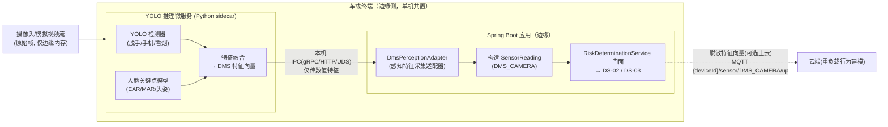
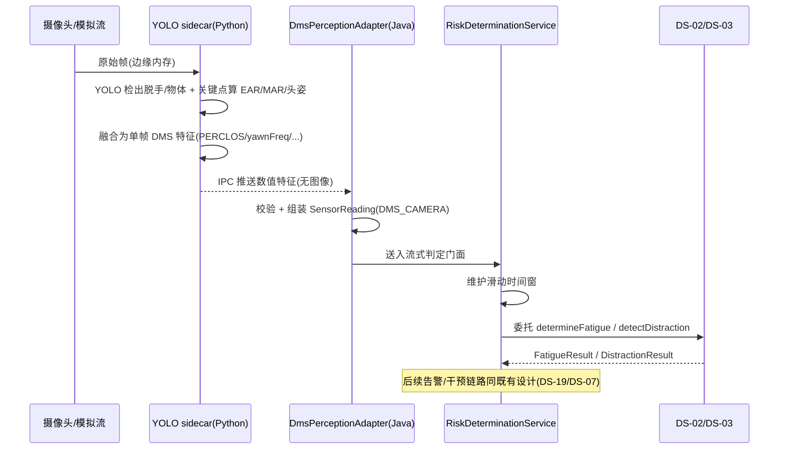

# 车载安全监测系统 视觉感知层（YOLO）OOD 设计方案（v1）

> 本文档为「智能物联——基于多传感器融合的车载安全监测系统」的**视觉感知层（DMS 计算机视觉）**架构级 OOD 设计方案，作为四份主 OOD 文档（`ood_domain.md` / `ood_application.md` / `ood_infrastructure.md` / `ood_interface.md`）的补充分册，专门描述基于 YOLO 的真实视觉感知实现方案。
>
> **定位**：本方案是 DMS 视觉通道的一套**可插拔的"真实感知实现"**，与现有的「感知数据模拟源」（`ood_infrastructure.md` §3.7.1）并列——二者产出**完全相同**的 `SensorReading`（DMS_CAMERA 通道）契约，可通过配置无缝切换。因此本方案的引入**不改变**领域层、应用层任何契约，也不破坏需求文档确立的「本期可验收 / 远期目标」双层验收框架。
>
> **技术形态**：YOLO 推理以 **Python 推理微服务（sidecar）** 形态与边缘侧 Java Spring Boot 应用协同——Python 侧承担 CV 推理，Java 侧承担特征封装、判定编排与 `SensorReading` 生成。二者共置于同一车载终端（边缘侧），通过本机 IPC 通信，不引入跨网络往返，满足 500ms 边缘本地时延口径。
>
> 后端主技术栈同主文档：Java Spring Boot；本分册新增 Python 推理运行时（ultralytics YOLO + 人脸关键点模型）。

---

## 一、概述

### 1.1 设计目标

- **填充预留契约，不改契约**：领域层已通过 **VO-11 `SensorReading`**（`ood_domain.md` §3.3，"封装感知通道类型、采集时间戳、通道级原始载荷引用和已提取的特征向量"）为感知采集层预留了统一输入契约；接口层已在 `ood_interface.md` §2.2 为 `DMS_CAMERA` 通道预留了精确的 `values` 字段。本方案的唯一职责是用真实 CV 模型**填充这些既有字段**，领域判定服务（DS-02 疲劳、DS-03 分心）无感知。
- **满足 BR-04 隐私边界**：DMS 原始图像在**边缘侧**完成脱敏——YOLO/关键点推理只输出数值特征，原始帧仅驻留边缘终端内存、不落盘、不上云（呼应 `ood_domain.md` DS-13 `PrivacyProtectionService` 与 `ood_interface.md` §5 数据脱敏门控）。
- **保证边缘实时性**：视觉推理在边缘本地完成，判定→干预链路端到端时延 ≤ 500ms（边缘本地口径），断网时视觉感知与安全告警链路仍成立。
- **可插拔可降级**：真实 YOLO 感知与模拟感知源、以及推理失败时的降级策略，均以同一 `SensorReading` 契约对上层透明。

### 1.2 边界与非目标

- 本方案**不涉及**领域层判定规则（BR-01/分心规则）本身——判定逻辑仍归 DS-02/DS-03，本方案只负责"给判定服务喂正确格式的特征向量"。
- 本方案**不涉及**生理、语音、毫米波雷达、后排红外通道——仅覆盖 DMS 视觉通道（`DMS_CAMERA`）。
- 真实摄像头硬件驱动、真实车载算力上的模型量化部署与端到端识别准确率（95%/90%）仍属**远期目标**；本期可验收对象是"给定输入帧 → 产出符合契约的特征向量 → 驱动既有判定逻辑"这一软件链路的正确性。

---

## 二、集成点：预留接口如何被填充

### 2.1 统一契约锚点 —— SensorReading（DMS_CAMERA）

领域层 VO-11 `SensorReading` 与接口层 MQTT Payload 已定义 DMS 视觉通道的最小字段（`ood_interface.md` §2.2）：

| `values` 字段 | 语义 | 服务于的判定规则 |
|------|------|------|
| `PERCLOS` | 单位时间眼睑闭合比例（0~1） | BR-01 重度疲劳（眼睑闭合 >1.5s） |
| `yawnFreq` | 打哈欠频率 | BR-01 疲劳辅助因子 |
| `headNodFreq` | 点头频率（次/10s） | BR-01 重度疲劳（点头 >2 次/10s） |
| `gazeDeviationCumulative` | 视线偏离前方累计时长（滑动窗口内，秒） | 分心规则（累计 >3s 判定分心）；BR-01 轻度疲劳（视线偏离 >15s） |
| `handsOffWheel` | 双手脱离方向盘（0/1 或置信度） | 分心行为因子 |

> **这就是"预留接口"**：领域层判定服务只消费上述数值字段，完全不感知它们由模拟源生成、还是由 YOLO+关键点模型推理得到。YOLO 方案的全部工作即"正确产出这 5 个字段"。

### 2.2 各字段的视觉来源分工

单一 YOLO 检测器无法覆盖全部字段（YOLO 输出目标框，缺乏精细几何与时序）。本方案采用**双模型协同**：

| 字段 | 主要来源模型 | 计算方式 |
|------|------|------|
| `PERCLOS`、`headNodFreq`、`yawnFreq` | **人脸关键点模型**（如 MediaPipe FaceMesh / 68 点 landmark） | 由眼部 EAR（Eye Aspect Ratio）、嘴部 MAR（Mouth Aspect Ratio）、头部姿态在**时间窗**上统计 |
| `gazeDeviationCumulative` | **人脸关键点 + 头部姿态/视线估计** | 由头部朝向/视线向量偏离前方的时长在滑动窗口内累计 |
| `handsOffWheel` | **YOLO 目标检测** | 检测"手/方向盘"目标框的空间关系；YOLO 亦可扩展检测手机、香烟等分心物体 |

> **YOLO 的角色**：负责"行为/物体类"检出（脱手、手机、香烟——后两者为可选扩展字段），置信度高、实时性好；关键点模型负责"疲劳/视线类"精细几何指标。二者输出在 Python 侧融合为单帧 DMS 特征后交给 Java。
>
> 时序类指标（PERCLOS、各频率、视线累计）的**滑动时间窗维护**与领域层职责边界一致：Python 侧只产出单帧/短窗的原子特征，领域层门面（`RiskDeterminationService`）仍负责跨帧滑动窗口维护（见 `ood_domain.md` DS-02/DS-03 "时间窗由门面维护"）；若为减轻上行频率，也可在 Python 侧预聚合 PERCLOS 等窗口值——两种粒度均落在同一契约字段内，具体粒度见 §七待确认项。

---

## 三、组件架构

### 3.1 组件划分（边缘侧）

### 3.2 组件职责

| 组件 | 部署位置 | 技术栈 | 职责 |
|------|------|------|------|
| YOLO 推理微服务 | 边缘侧（sidecar 进程） | Python + ultralytics YOLO + 关键点模型（ONNX/PyTorch） | 消费原始帧，输出单帧 DMS 数值特征；原始帧不出本进程 |
| 本机 IPC 通道 | 边缘侧 | gRPC / 本地 HTTP / Unix Domain Socket | Python→Java 传输数值特征（非图像），低延迟、无跨网络往返 |
| `DmsPerceptionAdapter` | 边缘侧（Java） | Java / Spring | 感知特征采集适配器：接收 IPC 特征帧，校验、组装为 `SensorReading(DMS_CAMERA)` 送入领域层；管理连接与降级 |
| `RiskDeterminationService` 门面 + DS-02/DS-03 | 边缘侧（Java，既有） | Java | 消费 `SensorReading`，维护滑动窗口，执行 BR-01/分心判定（**无需改动**） |

> **与既有拓扑的关系**：本方案的 `DmsPerceptionAdapter` + Python sidecar 组合，**替换/并列**于 `ood_infrastructure.md` §3.7.1 边缘侧组件表中的「感知数据模拟源（Java）」一行的 DMS 通道部分。生理/雷达/加速度等其余通道仍可沿用模拟源。

---

## 四、关键数据流（时序）

### 4.1 疲劳/分心判定链路（含视觉推理）

- 原始帧的生命周期止于 Python 进程内存；跨 IPC 传出的仅是数值特征——从物理上保证 BR-04。
- 判定→干预全程在边缘单机内串行完成，满足 500ms 本地口径与断网可用。

---

## 五、隐私与安全（BR-04 对齐）

| 约束 | 本方案落地 |
|------|------|
| DMS 原始图像不上云 | 原始帧仅存 Python sidecar 内存，推理后即释放；IPC 与 MQTT 上行均只承载数值特征向量 |
| 边缘侧完成脱敏 | 脱敏动作即"帧→特征向量"的推理过程本身，等价于 `ood_domain.md` 所述"人脸关键点提取/模糊化" |
| 上云前脱敏门控 | 上云路径仍经 DS-13 `PrivacyProtectionService.validateDataDesensitization` 校验：特征向量标签 ≠ 原始图像方可上云（`ood_interface.md` §5 拦截点） |
| 脱敏特征向量留存 | 沿用既有策略：DMS 脱敏特征向量 180 天（`ood_interface.md` §5） |
| 传输安全 | IPC 为本机通道（无网络暴露）；上云沿用 IoTDA MQTT + TLS，QoS 1 |

---

## 六、可插拔切换、降级与容错

### 6.1 实现切换（真实 / 模拟）

DMS 视觉感知源以配置项选择实现，对领域层完全透明：

| 配置 | 感知源实现 | 用途 |
|------|------|------|
| `aiot.perception.dms.mode=mock` | 既有 Java 模拟源 | 单元/集成测试、无摄像头环境、CI |
| `aiot.perception.dms.mode=yolo` | Python sidecar + `DmsPerceptionAdapter` | 真实视觉感知演示/部署 |

二者均实现同一 `SensorReading(DMS_CAMERA)` 产出契约，切换不触及判定/应用/接口层代码。

### 6.2 降级与容错

| 故障 | 处理 |
|------|------|
| sidecar 未启动 / IPC 断开 | `DmsPerceptionAdapter` 视为 DMS 通道不可用：向 DS-02/DS-03 输入缺失 → 判定服务返回 `InputInvalid`/`None`（"无法判定"，见 `ood_domain.md` A 类判定失败），不阻断其他通道判定 |
| 摄像头遮挡 | 沿用既有 `CameraOcclusionDetectionPort`（`ood_domain.md` DS-14）——YOLO 侧检出画面被遮挡时经该端口回调，触发 BR-08 失效保护，与本方案正交 |
| 推理超时/掉帧 | 按帧超时丢弃，采用最近有效特征或标记该窗口置信度下降；不得阻塞判定主循环 |
| sidecar 崩溃 | 由边缘侧进程守护（如 systemd / 容器 restart 策略）拉起；期间 DMS 通道降级为不可用 |

---

## 七、与验收框架的关系 & 待确认项

### 7.1 本期可验收 / 远期目标

- **【本期可验收】**：`SensorReading(DMS_CAMERA)` 契约填充链路（sidecar→IPC→adapter→判定）的正确性；mock/yolo 切换；推理失败降级；BR-04 原始帧不出边缘。可用录制视频/公开数据集在开发机上复现。
- **【远期目标】**：真实车载算力上的模型部署、量化优化、95%/90% 识别准确率、7×24 稳定性——依赖真实硬件，非本期验收门槛（与需求文档第一节一致）。

### 7.2 已定默认决策（可后续按需调整）

| # | 项 | 默认决策 | 理由 |
|---|------|------|------|
| 1 | 特征窗口粒度归属 | **单帧原子特征 + Java 门面维护滑动窗口** | 与领域层 DS-02/DS-03「时间窗由门面维护」职责边界一致，sidecar 保持无状态、易替换 |
| 2 | IPC 协议 | **gRPC**（`.proto` 强类型 + 双向流） | 强类型契约、流式低延迟、跨语言成熟；退路为本地 HTTP |
| 3 | YOLO 扩展字段 | **本期仅 handsOffWheel；手机/香烟列为可选扩展** | 先跑通最小契约，扩展字段需同步改 `ood_interface.md` §2.2 与分心因子 |
| 4 | 关键点模型 | **MediaPipe FaceMesh** | 开箱即用、CPU 实时、Apache-2.0 许可证友好；退路为 YOLOv8-pose |
| 5 | 上行频率 | **推理 ≥10Hz，上云降采样至 1~2Hz** | 边缘本地判定用全帧率，上云特征向量降采样以控带宽（沿用 §2.1 约定） |

> 上述为默认起点，任何一项调整只影响本分册与感知层实现，不触及领域/应用层契约。

---

## 九、实现骨架任务清单

> 按依赖顺序拆解。P = Python sidecar，J = Java 边缘侧，X = 契约/联调。均标注对应设计锚点。

### 9.1 契约与骨架（前置）

- [ ] **X.1 定义 gRPC 契约** `dms_perception.proto`：`DmsFeatureFrame`（timestamp、sensorId、PERCLOS、yawnFreq、headNodFreq、gazeDeviationCumulative、handsOffWheel、confidence）+ 流式 `StreamFeatures` rpc（§2.1、§7.2#2）
- [ ] **X.2 特征字段字典**：与 `ood_interface.md` §2.2 DMS_CAMERA `values` 字段逐一对齐，锁定单位与取值范围

### 9.2 Python 推理微服务（sidecar）

- [ ] **P.1 服务骨架**：ultralytics YOLO + MediaPipe FaceMesh 加载，帧输入源抽象（摄像头 / 本地视频文件，供开发复现）
- [ ] **P.2 YOLO 检出**：handsOffWheel（手/方向盘空间关系）；预留手机/香烟类别开关（§7.2#3）
- [ ] **P.3 关键点特征**：EAR→闭眼状态、MAR→哈欠、头部姿态→点头/视线偏离原子信号
- [ ] **P.4 单帧特征融合**：组装 `DmsFeatureFrame`（不做跨帧聚合，§7.2#1）
- [ ] **P.5 gRPC server + 帧超时丢弃**：实现 X.1 契约；原始帧用后即释放，绝不落盘/外传（BR-04，§五）
- [ ] **P.6 进程守护配置**：systemd/容器 restart 策略（§6.2）

### 9.3 Java 边缘侧适配器

- [ ] **J.1 `DmsPerceptionAdapter`**（`infra.adapter` 或 `infra.edge`）：gRPC client 消费特征流 → 校验 → 组装 `SensorReading(DMS_CAMERA)` → 送入 `RiskDeterminationService` 门面
- [ ] **J.2 感知源可插拔**：`aiot.perception.dms.mode=mock|yolo` 配置开关（§6.1），mock 复用既有模拟源
- [ ] **J.3 降级处理**：sidecar 断连/超时 → DMS 通道置不可用 → 判定服务返回 `InputInvalid/None`，不阻断其他通道（§6.2）
- [ ] **J.4 遮挡正交接入**：sidecar 报告画面遮挡时经既有 `CameraOcclusionDetectionPort` 回调（不新增端口，§6.2、DS-14）
- [ ] **J.5 上云脱敏门控**：上行前经 DS-13 `validateDataDesensitization` 校验（§五）

### 9.4 联调与验证

- [ ] **X.3 端到端验证**：录制视频/公开数据集输入 → 特征帧 → 疲劳/分心判定触发正确（【本期可验收】，§7.1）
- [ ] **X.4 mock/yolo 切换回归**：两种模式下 DS-02/DS-03 判定行为一致性
- [ ] **X.5 BR-04 断言**：验证原始帧不落盘、IPC/MQTT 上行仅含数值特征

---

## 八、交叉引用

| 主文档 | 关联点 |
|------|------|
| `ood_domain.md` | VO-11 SensorReading（输入契约锚点）、DS-02/DS-03（判定消费方）、DS-13 PrivacyProtectionService（脱敏门控）、DS-14 CameraOcclusionDetectionPort（遮挡正交处理）、A 类判定失败（降级语义） |
| `ood_infrastructure.md` | §3.7.1 边缘侧组件表（本方案替换/并列「感知数据模拟源」DMS 部分）、`infra.adapter`/`infra.edge` 模块（DmsPerceptionAdapter 归属） |
| `ood_interface.md` | §2.2 SensorReading Payload DMS_CAMERA 字段约定（预留字段）、§2.1 上行 Topic `{deviceId}/sensor/{sensorType}/up`、§5 数据脱敏门控与留存 |
| `ood_application.md` | S1 RiskMonitoringService（流式判定会话，上游消费本方案产出的感知输入） |
