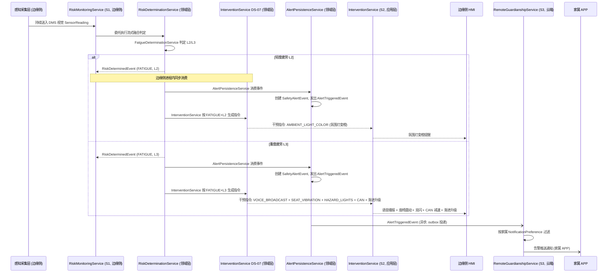
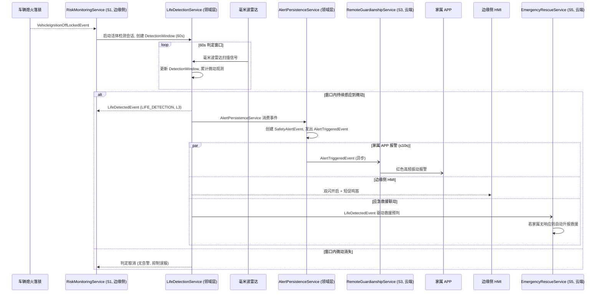
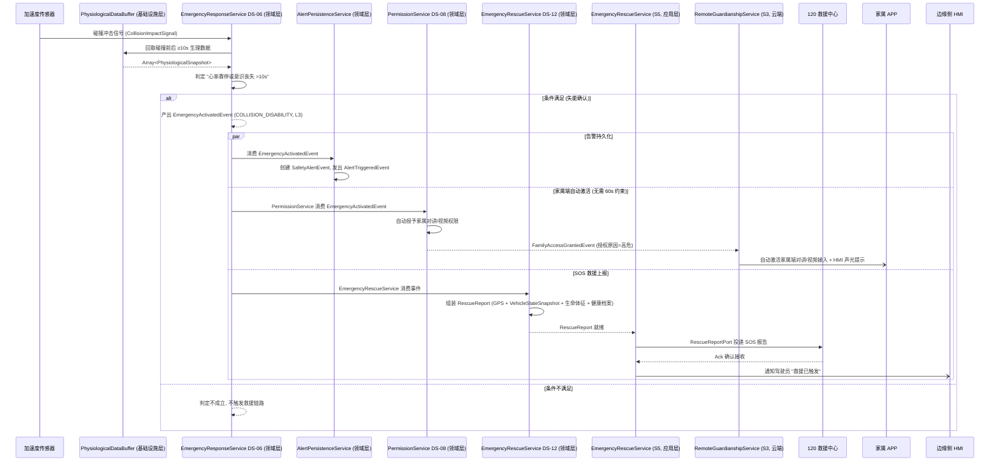

# 车载安全监测系统 应用层 OOD 设计方案（a_v1 / v2）

> 本文档为「智能物联——基于多传感器融合的车载安全监测系统」的**应用层**架构级 OOD 设计方案，承接领域层 OOD 产出（a_v10_design_v1.md），遵循 DDD 分层思想。应用层持有一组应用服务（Application Service），每个应用服务作为对应功能域的**入口门面**，负责编排领域服务、仓储和基础设施端口，处理事务边界、安全门控和外部请求适配，自身不包含领域业务逻辑。设计目标语言为仓颉（Cangjie），方案在仓颉类型系统能力范围内做抽象，不涉及具体代码实现。

---

## 一、概述

### 设计目标

应用层的核心使命是：**为外部接口层（家属 APP、车队大屏、救援中心、OTA 管理平台等）提供统一、内聚的用例入口，将来自不同前端的请求转换为对领域层服务与仓储的编排调用，管理事务边界，并保证安全门控与输入校验在进入领域层之前完成**。

设计遵循以下目标：

- **薄层原则**：应用服务不包含业务逻辑——业务规则归属于领域层，应用服务仅负责编排、适配和事务管理。
- **安全门控前置**：认证、授权校验在应用服务入口完成，通过后委托领域服务执行，避免领域服务背负横切安全关注。
- **清晰边界**：每个应用服务对应一个功能域，服务间通过领域事件解耦，避免直接的编译期循环依赖。
- **可验收导向**：每个应用服务的方法契约明确输入/输出/异常语义，验收测试可直接通过应用服务入口驱动全链路验证。

### 核心抽象层次

应用层在分层架构中的位置：

```
┌──────────────────────────────────────┐
│         接口层（UI / API）            │
│  家属APP (ArkTS) / 车队大屏 / MQTT   │
└────────────────┬─────────────────────┘
                 │ DTO / HTTP / MQTT
┌────────────────▼─────────────────────┐
│         应用层（本文档范围）           │
│  六个应用服务 + 编排 + 安全门控       │
└────────────────┬─────────────────────┘
                 │ 编排调用
┌────────────────▼─────────────────────┐
│         领域层（a_v10_design_v1.md）  │
│  领域服务 / 聚合根 / 实体 / 值对象    │
└──────────────────────────────────────┘
```

### 与领域层的职责边界

| 职责 | 归属 | 说明 |
|------|------|------|
| 业务规则与判定逻辑 | 领域层 | 疲劳判定、干预映射、评分公式等 |
| 事务边界管理 | 应用层 | 开启/提交/回滚事务，协调多个仓储写操作 |
| 安全认证与授权门控 | 应用层 | 在进入领域服务前完成二次身份验证等安全检查 |
| 领域事件发布 | 领域层 | 领域服务产出事件，领域事件总线负责路由 |
| DTO 与领域对象转换 | 应用层 | 将外部请求格式转换为领域层理解的类型 |
| 聚合根持久化操作 | 领域层 | 仓储接口在领域层声明，基础设施层实现 |

---

## 二、模块划分

### 2.1 模块一览

应用层按功能域拆分为独立的应用服务模块，每个模块依赖领域层中对应的模块，模块间不允许直接调用（通过领域事件解耦）。

| 模块 | 职责 | 依赖的领域层模块 |
|------|------|-----------------|
| `application.risk` | RiskMonitoringService：风险监测用例编排，管理边缘侧流式判定会话生命周期，提供云端历史风险查询入口 | `domain.risk`、`domain.life`、`domain.emergency`、`domain.event`、`domain.model` |
| `application.intervention` | InterventionService：干预执行用例编排，接收前端干预指令请求并提供干预状态查询 | `domain.intervention`、`domain.event`、`domain.model` |
| `application.guardianship` | RemoteGuardianshipService：远程监护用例编排，家属 APP 的实时状态查询、告警推送订阅、音视频对讲请求管理 | `domain.family`、`domain.event`、`domain.model` |
| `application.fleet` | FleetManagementService：车队管理用例编排，看板刷新、钻取查询、报告生成请求、绩效预警订阅 | `domain.fleet`、`domain.event`、`domain.model` |
| `application.emergency` | EmergencyRescueService：应急救援用例编排，SOS 上报确认、救援授权管理、家属手动救援触发 | `domain.emergency`、`domain.event`、`domain.model` |
| `application.ota` | OTAManagementService：OTA 升级用例编排，升级任务创建、升级进度查询、回滚指令下发 | `domain.ota`、`domain.event`、`domain.model` |

### 2.2 依赖原则

- 应用层**仅依赖领域层**，不依赖基础设施层的具体实现（仓储实现和端口实现通过依赖注入注入应用服务）。
- 应用服务之间**禁止直接调用**。跨功能域的协作统一通过订阅领域事件完成。
- 应用服务**持有对仓储接口和领域端口的引用**，使用方在应用层装配阶段注入。
- 应用服务**可同时依赖多个领域模块**（如 EmergencyRescueService 同时依赖 `domain.emergency` 和 `domain.risk`），但遵循单向依赖——不允许领域层反向依赖应用层。

---

## 三、核心抽象

### 3.1 应用服务总览

六个应用服务及其核心职责摘要：

| 序号 | 应用服务 | 类型形态 | 职责摘要 |
|------|---------|---------|---------|
| S1 | RiskMonitoringService | `class`（应用服务） | 风险监测入口：管理边缘侧判定会话生命周期，提供查询当前风险状态、历史告警列表的云端 API |
| S2 | InterventionService | `class`（应用服务） | 干预执行入口：提供驾驶员覆盖信号上报、当前干预状态查询、干预指令历史查询 |
| S3 | RemoteGuardianshipService | `class`（应用服务） | 远程监护入口：家属 APP 的实时状态订阅、音视频对讲请求管理、告警推送偏好配置 |
| S4 | FleetManagementService | `class`（应用服务） | 车队管理入口：看板数据查询、钻取查询、驾驶行为报告生成、绩效预警订阅 |
| S5 | EmergencyRescueService | `class`（应用服务） | 应急救援入口：SOS 上报确认、救援授权凭证管理、家属手动救援触发 |
| S6 | OTAManagementService | `class`（应用服务） | OTA 升级入口：升级任务创建与下发、升级进度查询、回滚指令管理 |

**为何全部使用 `class`（而非 `interface`）**：应用服务是实现特定用例的编排者，其职责是调用领域服务、仓储和端口，不存在多态替换场景（不会为同一应用服务提供不同实现），因此以具体类建模即可。若未来需要为不同前端提供不同的编排策略，可将应用服务中的门控逻辑抽取为接口。

### 3.2 S1 — RiskMonitoringService（风险监测服务）

#### 角色与职责

RiskMonitoringService 是**风险监测功能域的应用层入口**。它负责：

**边缘侧职责**（运行于车载边缘终端，单线程环境）：
- 对接边缘侧感知采集层，接收流式感知数据并分发至领域层的 RiskDeterminationService 进行判定
- 管理边缘侧**判定会话（RiskMonitoringSession）** 的生命周期——会话随行程开始创建、随行程结束销毁，会话内持有边缘侧临时判定状态（ActiveRiskSet、DetectionWindow 等）的引用

**云端侧职责**（运行于华为云，可水平扩展）：
- 对外提供**查询当前驾驶员风险状态**的云端 API（供家属 APP / 车队大屏调用）
- 对外提供**查询历史告警列表**的云端 API（供车队管理员查询）

> **部署边界说明**：S1 横跨边缘侧与云端两侧部署——流式判定编排与会话管理在边缘侧本地执行，查询 API 在云端部署。两侧通过云边协同通道（IoTDA/MQTT）同步会话状态和告警事件。后续实现阶段应将边缘侧编排逻辑与云端查询逻辑拆分为独立组件，但共享同一应用服务标识以保持功能域内聚。

#### 类型定位

`class`（应用服务）。它不是领域服务——不包含判定逻辑，而是编排领域服务（RiskDeterminationService 及其子判定服务）和仓储（TripRepository、DriverRepository）完成用例。

#### 协作关系

- **依赖的领域服务**：RiskDeterminationService（流式融合判定门面）、LifeDetectionService（活体遗留判定）、EmergencyResponseService（碰撞失能判定）
- **依赖的仓储**：TripRepository（查询当前行程告警列表）、DriverRepository（查询驾驶员信息）
- **依赖的领域事件**：订阅 AlertTriggeredEvent（用于将告警推送至云端通知通道）
- **持有的会话上下文引用**：RiskMonitoringSession（边缘侧会话级状态容器，不是领域对象）
- **与前端的关系**：家属 APP、车队大屏通过云端 API 网关调用本服务的查询方法

#### 接口契约

本服务对外暴露以下方法契约（不含实现细节，仅描述意图）：

- **启动一次风险监测会话**：当车辆点火时，前端/边缘侧调用此方法创建 RiskMonitoringSession，关联当前 Driver 和 Vehicle 标识，初始化会话上下文中的 ActiveRiskSet 为空集，返回会话句柄。会话句柄供后续所有边缘侧判定的方法调用携带。
- **流式感知数据处理**（边缘侧高频调用）：接收单帧 SensorReading，携带会话句柄，委托 RiskDeterminationService 执行流式融合判定。RiskDeterminationService 按需产出 RiskDeterminedEvent / RiskResolvedEvent，事件在边缘侧同步消费（InterventionService 等 500ms 内完成链路）。本方法本身不产出事件，仅作为编排者将感知数据路由至判定门面。
- **活体检测会话启动**：车辆熄火落锁后，边缘侧调用此方法启动一次活体检测会话。本方法委托 LifeDetectionService 在 60s 窗口内执行判定，按需等待 LifeDetectedEvent 或窗口到期。本方法本身不判定，仅编排会话启动与窗口管理。
- **获取驾驶员当前风险状态**（云端 API）：按驾驶员标识查询当前行程的活跃风险集（ActiveRiskSet），返回各 AlertType 的当前 RiskLevel 映射和派生状态色。无活跃行程或已熄火时返回空结果。
- **查询历史告警列表**（云端 API）：按驾驶员标识 + 时间范围查询历史 SafetyAlertEvent 列表，支持按 AlertType / RiskLevel 过滤和分页。数据来源为读模型投影（CQRS 读侧），不穿透 Trip 聚合根。
- **异常处理策略**：
  - 感知数据缺失（传感器离线）→ 判定服务返回 `Option.None`，应用层记录日志但不中断会话
  - 会话不存在（传入无效会话句柄）→ 返回业务错误 `SessionNotFound`
  - 数据源不可用（仓储连接失败）→ 标记为系统故障，返回错误，由调用方重试

### 3.3 S2 — InterventionService（应用层干预执行服务）

#### 角色与职责

InterventionService 是**闭环干预与反馈功能域的应用层入口**。它负责：
- 接收驾驶员覆盖信号（OverrideSignal）上报，并委托领域层 InterventionService（DS-07）判定是否中止干预升级
- 对外提供**查询当前干预状态**的 API（供边缘侧 HMI 和云端车队大屏查询）
- 对外提供**查询干预指令历史**的 API（供审计和车队管理）

注意：应用层 InterventionService 与领域层 InterventionService（DS-07）同名不同层——前者为应用服务负责编排，后者为领域服务负责业务逻辑。

#### 类型定位

`class`（应用服务）。它在驾驶员覆盖信号的接收和干预状态查询两个方向上编排领域服务与仓储。

#### 协作关系

- **依赖的领域服务**：DS-07 InterventionService（领域层干预执行服务，生成干预指令和判定覆盖）
- **依赖的仓储**：TripRepository（查询当前行程的干预指令历史）
- **依赖的领域事件**：订阅 RiskDeterminedEvent / RiskResolvedEvent（用于边缘侧同步触发干预指令生成）
- **与前端的关系**：边缘侧 HMI 查询当前干预指令集合以渲染界面；车队大屏查询干预历史用于审计

#### 接口契约

- **上报驾驶员覆盖信号**：接收 OverrideSignal（操作类型：转向/制动/加速 + 时间戳），委托 DS-07.handleOverride 判定是否中止当前干预升级。返回干预状态变更结果（Aborted / Continuing / Resumed），不返回异常。
- **查询当前干预状态**：按行程标识查询当前活跃的干预指令集合（InterventionInstruction 列表），包括指令类型、目标设备和执行优先级。
- **查询干预指令历史**：按行程标识 + 时间范围查询已执行和已中止的干预指令列表，支持分页。
- **异常处理策略**：
  - 行程不存在（查询干预状态时）→ 返回空集合
  - 覆盖信号处理时判定服务内部错误 → 记录日志，默认维持当前干预状态不中断（安全优先：不确定时不盲目中止干预）

### 3.4 S3 — RemoteGuardianshipService（远程监护服务）

#### 角色与职责

RemoteGuardianshipService 是**远程监护功能域的应用层入口**，面向家属 APP。它负责：
- **家属 APP 实时状态订阅**：家属 APP 建立与云端的长连接后，本服务将 DriverStatusSnapshot（≥1Hz 推送）接入家属订阅通道
- **音视频对讲请求管理**：家属发起对讲/视频请求时，本服务执行安全门控（二次身份验证校验 + PermissionService 权限判定）后，通过 MediaSessionPort 建立音视频会话
- **告警推送偏好配置**：家属 APP 设置/修改通知偏好（NotificationPreference），本服务更新 SystemAccount 聚合
- **家属手动救援触发**：家属一键触发应急救援联动，本服务委托 EmergencyRescueService（领域层 DS-12）执行上报

#### 类型定位

`class`（应用服务）。它是家属 APP 所有非浏览性操作的统一入口——状态订阅为单向推送，对讲/视频/救援为双向请求-响应。

#### 协作关系

- **依赖的领域服务**：DS-08 PermissionService（权限判定）、DS-12 EmergencyRescueService（家属手动救援联动）、DS-16 DriverStatusBroadcastService（常态状态同步）
- **依赖的仓储**：SystemAccountRepository（更新家属通知偏好）、DriverRepository（查询驾驶员）
- **依赖的领域事件**：订阅 FamilyAccessGrantedEvent（通知家属权限已就绪）、FamilyAccessRevokedEvent（通知家属权限已撤销）、AlertTriggeredEvent（按家属偏好过滤后推送告警）
- **依赖的领域端口**：MediaSessionPort（音视频会话建立与拆除）、NotificationPort（告警推送与状态快照下发）
- **与前端的关系**：家属 APP（ArkTS）通过 WebSocket/长连接与本服务交互

#### 接口契约

- **订阅驾驶员状态**：家属 APP 通过 WebSocket 订阅指定 Driver 的实时状态。本服务校验家属与该 Driver 的监护关系后，将 DriverStatusSnapshot 推送流关联至该订阅的 WebSocket 连接（家属常态状态快照属于单向推送、非请求-响应模式）。监护关系不存在时返回未授权。
- **取消订阅驾驶员状态**：家属 APP 断开 WebSocket 或主动取消订阅，本服务清理推送流关联。
- **请求音视频对讲**：家属请求与指定 Driver 建立音频对讲或视频监控会话。
  - 安全门控流程：① 校验请求者身份与 AccountRole（须为 FAMILY）→ ② 校验二次身份验证结果（家属须已完成指纹/人脸/动态短信验证）→ ③ 委托 PermissionService 判定该家属是否持有对讲/视频授权。任何一步不通过即返回拒绝原因为 `SecondaryAuthRequired` 或 `PermissionDenied`。
  - 授权通过后，通过 MediaSessionPort 建立音视频会话，返回会话句柄。会话建立成功后在驾驶员侧 HMI 发出"对讲/视频已接通"的声光提示。
- **结束音视频对讲**：家属主动挂断或系统因权限撤销自动挂断时，本服务通过 MediaSessionPort 终止会话并释放资源。权限撤销路径由 FamilyAccessRevokedEvent 驱动（本服务订阅该事件后主动终止会话）。
- **配置告警推送偏好**：家属设置希望接收的风险等级集合。本服务创建新 NotificationPreference 实例，通过 SystemAccountRepository 更新 SystemAccount 聚合。
- **触发手动应急救援**：家属一键触发救援联动。本服务校验请求者角色和监护关系后，委托 DS-12 EmergencyRescueService.triggerManualRescue 执行上报，返回救援请求确认。
- **异常处理策略**：
  - 二次身份验证未通过 → 返回 `SecondaryAuthRequired`，不进入后续权限判定
  - 权限不足 → 返回 `PermissionDenied`（携带具体拒绝原因：无授权/授权已过期/授权已撤销）
  - 音视频会话建立失败（SparkRTC 信令通道故障）→ 返回 `SessionEstablishFailed`，记录事件日志
  - 订阅状态推送时驾驶员无活跃行程 → 推送"离线"状态，不返回异常

### 3.5 S4 — FleetManagementService（车队管理服务）

#### 角色与职责

FleetManagementService 是**车队运营管理功能域的应用层入口**，面向车队大屏和管理员后台。它负责：
- 看板数据查询：车队级疲劳指数分布、风险热力图、监测脱线车辆列表
- 钻取查询：按风险等级下钻至高风险司机明细
- 驾驶行为报告生成：按驾驶员 + 时间范围请求生成分析报告
- 绩效预警订阅：管理员订阅车队级评分低于 60 的绩效预警推送

#### 类型定位

`class`（应用服务）。它是所有只读查询（看板、钻取、报告）的编排入口——查询类操作为只读，不涉及事务写。

#### 协作关系

- **依赖的领域服务**：DS-10 FleetAnalyticsService（看板聚合与钻取）、DS-11 ReportGenerationService（报告生成），以及 DS-09 ScoringService（周期评分查询）
- **依赖的仓储**：DriverRepository、TripRepository（只读查询，经 CQRS 读模型投影）
- **依赖的领域事件**：订阅 PerformanceWarningEvent（用于将绩效预警推送至管理员通知通道）
- **依赖的领域端口**：NotificationPort（绩效预警推送）
- **与前端的关系**：车队大屏（ArkTS / Web）通过 HTTP API 调用本服务的查询方法；报告以 PDF/Excel 文件下载

#### 接口契约

- **获取车队疲劳指数分布**：返回车队维度的各风险等级占比映射和风险热力图坐标序列。数据来源为领域层的 FleetAnalyticsService 聚合查询。默认按 5 分钟周期缓存，支持手动刷新（Cache-Control: no-cache）。
- **钻取高风险司机明细**：按指定 RiskLevel 下钻，返回该等级下的驾驶员摘要列表（Driver 标识、综合风险评分、最近行程摘要、主要扣分项）。本服务调用 FleetAnalyticsService.drillDown 完成查询。
- **生成驾驶行为报告**：按 Driver 标识 + TimeRange（周/月/季）请求生成报告。
  - 本服务调用 ReportGenerationService.generateReport，在 15s SLA 内返回报告数据结构或超时错误。
  - 报告生成完成后，将 ReportData 交由基础设施层渲染为 PDF/Excel 并返回下载链接。15s SLA 覆盖整个流程（查询+组装+渲染+下载链接生成）。
- **订阅车队绩效预警**：管理员订阅车队级绩效预警推送通道，当 ScoringService 产出 PerformanceWarningEvent 时，本服务消费该事件并通过 NotificationPort 推送至管理员。
- **异常处理策略**：
  - 看板查询超时 → 返回上次缓存结果（如有）并标注"数据可能不是最新"
  - 报告生成时间范围内无数据 → 返回空报告（"所选时间范围内无行驶记录"），非错误
  - 报告生成超时（>15s）→ 返回 `ReportGenerationTimeout`，提示管理员缩小时间范围或稍后重试

### 3.6 S5 — EmergencyRescueService（应用层应急救援服务）

#### 角色与职责

EmergencyRescueService 是**应急救援联动功能域的应用层入口**，面向救援中心、云端救援协调系统和家属 APP。它负责：
- SOS 上报的确认与追踪：接收并确认 SOS 救援报告已成功投递至 120 救援中心
- 救援授权凭证管理：管理 RescueAuthorizationToken 的签发、分发、校验和消费生命周期
- 家属手动救援触发编排（复用 S3 中的家属入口，本服务作为后台编排者）
- 远程解锁与健康档案调取的授权编排

注意：应用层 EmergencyRescueService 与领域层 EmergencyRescueService（DS-12）同名不同层——前者为应用服务负责编排和安全门控，后者为领域服务负责救援业务逻辑。

#### 类型定位

`class`（应用服务）。救援流程涉及多个外部系统（120 救援中心、云端救援协调系统、SMN 推送）的协调，应用服务负责编排这些交互并管理事务。

#### 协作关系

- **依赖的领域服务**：DS-12 EmergencyRescueService（领域层应急救援服务，负责救援报告组装与上报）
- **依赖的仓储**：VehicleRepository（更新车门锁状态）、DriverRepository（查询驾驶员）、TripRepository（查询最新生理快照）
- **依赖的领域事件**：订阅 EmergencyActivatedEvent（碰撞失能自动触发救援）、FamilyManualRescueRequestedEvent（家属手动救援触发）
- **依赖的领域端口**：RescueReportPort（向 120 投递救援报告）、NotificationPort（救援状态通知推送）
- **与前端的关系**：救援中心通过本服务接收 SOS 上报并回传确认；云端救援协调系统通过本服务签发救援授权凭证

#### 接口契约

- **确认 SOS 救援报告投递状态**：救援中心在收到 RescueReport 后回传确认（Ack），本服务更新救援记录状态为"已确认"。若超时未收到 Ack，标记为"待补发"并触发重试。
- **签发救援授权凭证**：云端救援协调系统在险情核实后调用此方法，生成 RescueAuthorizationToken，设置有效期和授权操作集合（远程解锁 / 健康档案调取），通过外部通道传递给救援机构。
- **校验救援授权凭证**：救援机构执行远程解锁或健康档案调取前，调用此方法校验 RescueAuthorizationToken 的有效性（三重校验：未过期、未消费、目标匹配）和持有者角色（AccountRole=RESCUE）。校验通过后执行操作（更新 Vehicle 聚合车门锁状态或调取 DriverHealthProfile），并标记凭证为已消费。校验失败返回 `AccessDenied`（含拒绝原因）。
- **查询救援记录**：按 Driver 标识或 Vehicle 标识查询救援上报历史，供审计和事后分析。
- **异常处理策略**：
  - 救援报告投递失败（120 链路故障）→ 标记"待补发"，按退避策略重试，同时告知前端"救援已触发，等待救援中心确认中"
  - 救援授权凭证已过期 → 返回 `AccessDenied`（拒绝原因："授权已过期"），建议重新申请
  - 救援授权凭证已消费（重放攻击）→ 返回 `AccessDenied`（拒绝原因："授权已被使用"），触发安全审计日志

### 3.7 S6 — OTAManagementService（OTA 升级管理服务）

#### 角色与职责

OTAManagementService 是**OTA 固件升级管理功能域的应用层入口**，面向车队管理后台和云端 OTA 平台。它负责：
- 升级任务创建与下发：运维人员通过管理后台发起固件升级任务（指定目标车辆 + OTAVersion）
- 升级进度查询：运维人员和管理员查询单辆车或车队的升级进度
- 回滚指令下发：升级失败或需要回滚时，运维人员手动触发回滚
- 升级历史查询：查询车辆的历史升级记录

#### 类型定位

`class`（应用服务）。它编排领域层 OTAUpdateService（DS-15）与基础设施层 OTADeliveryPort，管理升级任务的全生命周期编排。

#### 协作关系

- **依赖的领域服务**：DS-15 OTAUpdateService（领域层 OTA 升级管理服务）
- **依赖的仓储**：VehicleRepository（查询当前固件版本和 OTA 升级状态）
- **依赖的领域事件**：订阅 OTAUpgradeCompletedEvent（通知运维人员升级成功）、OTAUpgradeFailedEvent（通知运维人员升级失败并回滚）
- **依赖的领域端口**：OTADeliveryPort（通过 IoTDA 下发升级包至车载终端）、NotificationPort（升级结果通知推送）
- **与前端的关系**：车队管理后台（Web）通过 HTTP API 调用本服务

#### 接口契约

- **创建升级任务**：运维人员指定目标车辆列表和目标 OTAVersion，本服务为每辆车创建一条升级任务，委托 DS-15.initiateUpgrade 执行版本比对和初始状态设置。
  - 单次调用可批量创建多条任务（如对整个车队下发同一升级包），每辆车的升级状态独立追踪。
  - 若目标车辆已有进行中的升级会话（OTAUpgradeStatus 为 PENDING/TRANSMITTING/UPGRADING 等非终态），返回 `UpgradeInProgress` 错误并跳过该车辆。
- **查询升级进度**：按 Vehicle 标识查询当前升级阶段（OTAUpgradeStatus 的当前 UpgradeStage）和传输进度。支持批量查询（车队级），返回每辆车的升级阶段、进度百分比和预估剩余时间。
- **手动触发回滚**：当升级卡住或需要紧急回退时，运维人员手动触发指定车辆的回滚。本服务委托 DS-15 将升级状态机推进至 ROLLED_BACK 阶段，保证终端可回退至升级前固件版本。
- **查询升级历史**：按 Vehicle 标识查询历史升级记录（含成功和失败），返回旧版本、新版本、升级耗时、最终状态。
- **异常处理策略**：
  - 目标车辆不存在 → 返回 `VehicleNotFound`
  - 目标版本与车辆型号不兼容 → 返回 `IncompatibleTarget`
  - 升级下发失败（IoTDA 通道不可达）→ 记录失败事件，标记任务为"下发失败"，等待运维人员手动重试
  - 升级状态已处于终态（COMPLETED / ROLLED_BACK）→ 拒绝重复操作，返回 `UpgradeAlreadyFinished`

---

## 四、服务间协作关系

### 4.1 协作关系总览

六个应用服务之间的调用/事件依赖关系图（箭头方向 = 依赖方向）：

```
                         ┌──────────────────────┐
                         │  RiskMonitoringService│ (S1)
                         │  流式感知判定入口      │
                         └──────────┬───────────┘
                                    │ 产出 RiskDeterminedEvent /
                                    │ RiskResolvedEvent / LifeDetectedEvent
          ┌─────────────────────────┼──────────────────────────┐
          ▼                         ▼                          ▼
┌──────────────────────┐  ┌──────────────────────┐  ┌──────────────────────┐
│ InterventionService  │  │RemoteGuardianshipService│ │FleetManagementService│
│ (S2) 干预执行入口    │  │ (S3) 远程监护入口      │  │ (S4) 车队管理入口    │
└──────────────────────┘  └──────────┬───────────┘  └──────────────────────┘
          │                          │
          │                          │ 家属手动救援触发
          │                          ▼
          │                ┌──────────────────────┐
          │                │EmergencyRescueService│ (S5)
          │                │ 应急救援入口          │
          │                └──────────────────────┘
          │
          ▼
┌──────────────────────┐
│  OTAManagementService│ (S6)
│  OTA 升级管理入口     │
└──────────────────────┘
```

### 4.2 协作链路分解

#### 链路 A：判定 → 干预（边缘侧同步，≤500ms）

```
S1 RiskMonitoringService
    │  流式感知数据
    ▼
[领域层] RiskDeterminationService → RiskDeterminedEvent
    │  (边缘侧进程内同步消费)
    ▼
[领域层] InterventionService (DS-07) → 生成干预指令集合
    │
    ▼
S2 InterventionService (应用层) → 查询当前干预状态 API
    │  (供 HMI 查询渲染)
    ▼
边缘侧 HMI 执行干预指令
```

#### 链路 B：告警 → 推送（云端异步，秒级）

```
[领域层] RiskDeterminedEvent / LifeDetectedEvent / EmergencyActivatedEvent
    │
    ▼
[领域层] AlertPersistenceService → SafetyAlertEvent → AlertTriggeredEvent
    │  (outbox + 消息队列异步投递)
    ├──► S3 RemoteGuardianshipService → 按 NotificationPreference 过滤 → NotificationPort 推送家属 APP
    ├──► S4 FleetManagementService → 看板刷新 + 绩效预警推送
    └──► S5 EmergencyRescueService (仅 EmergencyActivatedEvent 路径) → RescueReportPort 投递 120
```

#### 链路 C：家属手动救援联动

```
S3 RemoteGuardianshipService (家属 APP 一键触发)
    │  角色校验 + 二次身份验证
    ▼
[领域层] DS-12 EmergencyRescueService.triggerManualRescue
    │
    ▼
FamilyManualRescueRequestedEvent
    │  (outbox 异步投递)
    ├──► S5 EmergencyRescueService → RescueReportPort 投递 120
    └──► S3 RemoteGuardianshipService → NotificationPort 推送家属 APP 确认通知
```

#### 链路 D：OTA 升级期间干预抑制

```
[领域层] OTAUpgradeStartedEvent / OTAUpgradeCompletedEvent (DS-15 产出)
    │  (outbox 异步投递)
    ▼
S2 InterventionService (订阅 OTA 升级状态事件)
    │  查询 Vehicle 聚合中当前 OTAUpgradeStatus 阶段
    │  若升级处于 UPGRADING 阶段（固件刷写中）
    ▼
S2 抑制 CAN 级干预指令下发（CAN_DECELERATION_REQUEST 等）
    │  （非 CAN 级干预如氛围灯、语音播报、座椅震动仍正常执行）
    │  升级完成（COMPLETED / ROLLED_BACK）后自动恢复 CAN 级干预能力
    ▼
```


- **应用服务间零直接调用**：所有跨功能域协作均通过领域事件完成。例如 S1 判定完成产出事件后，S3 通过订阅事件获知告警并推送，而非 S1 直接调用 S3。
- **应用服务与领域服务单向依赖**：应用服务可调用领域服务和仓储，领域服务不可反向调用应用服务。领域事件是唯一的解耦机制——领域服务产出事件，应用服务订阅事件。
- **同步与异步路由在应用层决策**：哪些事件在边缘侧同步消费（判定→干预）、哪些在云端异步消费（告警推送→家属 APP），由应用层在装配时通过事件总线注册策略决定，领域层不感知此路由差异。

> **基础设施实现假设**：本设计方案中涉及的领域事件总线（EventBus）、outbox 事务性事件表、CQRS 读模型投影等机制均属于基础设施层关注点。应用层方案中将其作为已存在的底层能力引用来描述服务间协作关系，其具体实现（如事件总线的消息队列选型、outbox 的数据库方案、读模型投影的同步延迟 SLO）由基础设施层设计阶段确定。

---

## 五、核心时序图

以下时序图以 Mermaid sequenceDiagram 语法描述三条关键路径的全链路消息交互，覆盖边缘端→云端→APP/大屏 全链路。

### 5.1 路径 1：疲劳判定 → 告警 → 干预链路



### 5.2 路径 2：活体遗留 → 报警链路



### 5.3 路径 3：碰撞失能 → SOS + 家属自动激活链路



---

## 六、错误处理策略

### 6.1 应用层错误分类

应用层继承领域层的错误分类体系（A/B/C 三类），并补充应用层特有的错误类别：

| 类别 | 说明 | 表达方式 | 示例 |
|------|------|---------|------|
| **A 类 — 输入无效** | 调用方传入的请求参数不合法 | `Result<T, ValidationError>` | 会话句柄无效、时间范围起始晚于结束 |
| **B 类 — 业务拒绝** | 调用方请求被业务规则拒绝 | `Result<T, BusinessError>` | 权限不足、二次验证未通过、授权已过期 |
| **C 类 — 系统故障** | 基础设施不可用 | `Result<T, SystemError>`，由基础设施层抛出异常后，应用层捕获并转换为 Result 返回调用方 | 数据库连接失败、消息队列不可达、IoTDA 通道故障 |

### 6.2 各应用服务错误处理策略

| 应用服务 | 典型错误场景 | 策略 |
|---------|-------------|------|
| S1 RiskMonitoringService | 会话句柄无效 | 返回 `SessionNotFound`，调用方终止本次判定请求 |
| S1 | 仓储查询数据源不可用 | C 类系统故障，基础设施层异常由应用层捕获后转换为 `Result<T, SystemError>` 返回调用方，由调用方决定重试策略 |
| S2 InterventionService | 干预指令查询时行程不存在 | 返回空集合，非错误 |
| S3 RemoteGuardianshipService | 家属未持有对讲/视频权限 | 返回 `PermissionDenied`（含拒绝原因），前端据此提示家属 |
| S3 | 二次身份验证未通过 | 返回 `SecondaryAuthRequired`，前端引导家属完成二次验证 |
| S3 | 音视频会话建立失败 | 返回 `SessionEstablishFailed`，前端提示"连接失败，请稍后重试" |
| S4 FleetManagementService | 看板查询超时 | 返回缓存数据 + 标注"数据可能不是最新" |
| S4 | 报告生成超时 (>15s) | 返回 `ReportGenerationTimeout`，提示缩小范围或重试 |
| S4 | 报告时间范围内无数据 | 返回空报告 + "所选时间范围内无行驶记录"，非错误 |
| S5 EmergencyRescueService | 救援授权凭证已过期/已消费 | 返回 `AccessDenied`（含拒绝原因），触发审计日志 |
| S5 | 救援报告投递失败 | 标记"待补发"，退避重试，SOS 链路不因投递失败而中断 |
| S6 OTAManagementService | 目标车辆已有进行中升级 | 返回 `UpgradeInProgress`，跳过该车辆 |
| S6 | 目标版本与车型不兼容 | 返回 `IncompatibleTarget`，提示运维人员确认版本 |
| S6 | 升级包下发失败 (IoTDA) | 记录失败，标记任务状态，等待手动重试 |

### 6.3 安全门控统一原则

所有应用服务的危险操作（远程对讲/视频/车窗控制/SOS）在进入领域层之前必须经过以下门控链：

1. **身份认证**（基础设施层完成，应用层校验 Token/Session）
2. **角色校验**（AccountRole 匹配——只有 FAMILY 可请求对讲/视频/救援，只有 RESCUE 可远程解锁/调取健康档案）
3. **二次身份验证**（高敏操作门控，应用层校验二次验证结果）
4. **权限校验**（委托领域层 PermissionService 判定授权范围）

任一门控步骤不通过即立即拒绝并返回明确的拒绝原因，避免"先放行再校验"导致的安全漏洞。

---

## 七、并发设计

### 7.1 应用层的无状态性

所有六个应用服务均设计为**无状态**——它们不持有个体请求之间的可变状态，会话级状态全部归属于：
- **边缘侧**：RiskMonitoringSession（S1 管理的边缘侧会话上下文引用）
- **领域层**：Trip 聚合（持久化）、EdgeSessionContext（临时状态）
- **基础设施层**：WebSocket 连接池、缓存

应用服务自身的无状态性使其在云端可以水平扩展，各请求之间互不干扰。

### 7.2 并发场景策略

| 场景 | 策略 |
|------|------|
| 多家属并发查询同一驾驶员状态 | 只读查询，读已提交，无需锁 |
| 家属端常态状态快照推送 (≥1Hz) | 单向异步推送，无共享写状态 |
| 多个管理员同时请求看板刷新 | 看板缓存控制刷新频率 (5min)，重复请求命中缓存 |
| 家属请求对讲与系统自动撤销权限并发 | SystemAccount 聚合（AR-04，定义见领域层 OOD `a_v10_design_v1.md` §3.1）乐观锁，先完成者胜出，后者重试 |
| OTA 升级任务下发与传感器自检并发写 Vehicle | Vehicle 聚合（AR-03，定义见领域层 OOD `a_v10_design_v1.md` §3.1）乐观锁，冲突时 OTA 重试、自检下一周期重试 |
| SOS 救援上报与家属手动救援并发 | 两类救援路径独立，通过各自的领域事件驱动，不互斥 |

### 7.3 边缘侧线程模型

边缘侧 RiskMonitoringService (S1) 不运行在云端，其在边缘侧的编排逻辑运行于边缘侧单线程环境中——感知数据按时间序列顺序送达，判定→干预链路同步执行（≤500ms），无并发竞争。

---

## 八、设计决策

### 决策 A1：应用服务以 class 建模，不引入应用层接口抽象

**理由**：应用服务的职责是编排，不存在"同一功能域有多个不同编排策略"的替换场景。六个应用服务各自对应唯一的调用方和应用场景，不需要 interface 以实现多态替换。如果未来出现"家属 APP 和车队大屏需要不同的监护业务编排"的场景，可将编排策略抽取为策略对象，应用服务仍作为统一入口。

**仓颉语言考量**：`class` 在仓颉中可持有对其他对象的引用（领域服务、仓储、端口），适合作为编排者。若未来需要测试隔离（如对应用服务进行单元测试时 mock 领域服务），可为各应用服务提取最小接口作为依赖注入的契约，当前阶段暂不引入以保持设计简洁。

### 决策 A2：应用层不直接创建领域事件，事件由领域层产出

**理由**：领域事件反映的是"领域层发生的业务事实"——只有领域层有权决定"一次疲劳判定成立"或"一次权限被撤销"是否真实发生。应用层若绕过领域层直接创建事件会导致业务事实来源不唯一，破坏事件溯源和审计链。应用层的职责是编排触发条件（如"家属发起对讲请求"是应用层的输入），但最终"是否有权限、是否授予权限"由领域层判定并产出事件。

### 决策 A3：家属 APP 通过应用服务（S3）间接访问领域，不直接调用领域服务

**理由**：家属 APP 运行在 HarmonyOS 设备上，无法直接调用云端部署的领域服务。S3 RemoteGuardianshipService 是云端应用服务，负责：
- 接收家属 APP 的 WebSocket/HTTP 请求（DTOS → 领域对象转换）
- 执行安全门控校验
- 委托领域层完成业务判定
- 将领域事件转换为推送消息发回家属 APP

家属 APP 与领域层之间始终隔着应用层，保证了安全门控不会因前端绕过而失效。

### 决策 A4：应用服务间的协作全部通过订阅领域事件完成，不使用直接方法调用

**理由**：若 S1 RiskMonitoringService 在判定完成后直接调用 S3 RemoteGuardianshipService 的方法来推送告警，则 S1 对 S3 产生了编译期依赖，破坏了功能域之间的独立性和可替换性。通过领域事件解耦——S1 产出 RiskDeterminedEvent，S3 订阅该事件并自行决定推送策略——两个服务在编译期互不知晓对方的存在，仅通过事件总线在运行时协作。这与领域层"模块间禁止直接调用、通过领域事件协作"的原则（领域层设计 §2.2）一脉相承。

### 决策 A5：安全门控（认证、授权、二次验证）在应用层而非领域层完成

**理由**：认证（"你是谁"）和二次身份验证（指纹/人脸/动态短信）是纯技术关注点——它们依赖基础设施层（身份认证模块、生物识别硬件、短信网关），与领域业务规则无关。将这些门控置于应用层可以：
- 保持领域服务的纯粹性（领域服务仅关心业务状态——"该家属是否有权限"，不关心"该请求是否通过了二次验证"）
- 允许安全门控策略独立演进（如从短信验证码升级为人脸识别，领域层无感知）
- 避免领域服务背负对基础设施层安全模块的依赖

应用层在执行高敏操作前，主动完成所有安全校验，将"已通过安全校验"的认证结果以门控通过后的领域对象标识传递给领域层，领域层仅需关心"该标识对应的家属是否有权限"（委托 PermissionService）。

---

## 九、修订说明（v2）

| 审查意见 | 修改措施 |
|---------|---------|
| **【REJECTED】** 服务间协作关系图（§4.1）中存在 S2 InterventionService → S6 OTAManagementService 的依赖箭头，但 §4.2 协作链路分解中无任何文字描述该依赖关系，文档内部不一致 | 在 §4.2 中新增**链路 D：OTA 升级期间干预抑制**，说明 S2 通过订阅 OTAUpgradeStartedEvent / OTAUpgradeCompletedEvent 获知当前升级阶段，在 UPGRADING 阶段抑制 CAN 级干预指令（避免固件刷写期间的总线冲突），非 CAN 级干预不受影响，升级完成后自动恢复。该依赖基于领域事件解耦，符合 §4.3 原则 |
| **【轻微】** §3.1 决策 A1 中应用服务无接口抽象会导致单元测试不可 mock，建议未来有需求时考虑提取最小接口 | 接受建议，在决策 A1 的"仓颉语言考量"段中补充：若未来需要测试隔离，可为各应用服务提取最小接口作为依赖注入的契约。当前阶段暂不引入，保持设计简洁 |
| **【轻微】** 事件总线/outbox 基础设施实现假设应在文档中明确标注 | 在 §4.3 末尾新增「基础设施实现假设」说明块，明确事件总线、outbox、CQRS 读模型投影均属基础设施层关注点，应用层仅作为已存在能力引用，具体选型由基础设施层设计阶段确定 |
| **【轻微】** §六 C 类系统故障描述为"抛异常"，与各接口以 Result 返回错误的方式不一致 | 将 §6.1 C 类错误的表达方式从"异常抛出，由基础设施层兜底"修改为"`Result<T, SystemError>`，由基础设施层抛出异常后，应用层捕获并转换为 Result 返回调用方"。同步更新 §6.2 S1 错误处理策略中对应条目的描述 |
| **【轻微】** §2.1 模块划分表中 S1 RiskMonitoringService 标注依赖 `domain.risk`、`domain.event`、`domain.model`，未体现对 `domain.life` 和 `domain.emergency` 的依赖（§3.2 详细描述中明确依赖 LifeDetectionService 和 EmergencyResponseService） | 修正 §2.1 表中 S1 的依赖领域层模块列为 `domain.risk`、`domain.life`、`domain.emergency`、`domain.event`、`domain.model`，与 §3.2 协作关系描述保持一致 |
| **【轻微】** S1 RiskMonitoringService 职责涵盖边缘侧会话管理和云端查询 API 两类部署环境，建议明确标注切分边界 | 在 §3.2 S1 角色与职责中拆分为「边缘侧职责」和「云端侧职责」两个子段落，并新增「部署边界说明」块，明确标注两侧部署环境和后续拆分建议 |
| **【轻微】** §七.2 并发策略中提及"Vehicle 聚合乐观锁"和"SystemAccount 聚合乐观锁"，未引用领域层设计中对应聚合根的明确路径 | 在 §7.2 表格中对应条目补充领域层 OOD 文档引用 `a_v10_design_v1.md` §3.1 及对应聚合根编号 AR-03 / AR-04 |

