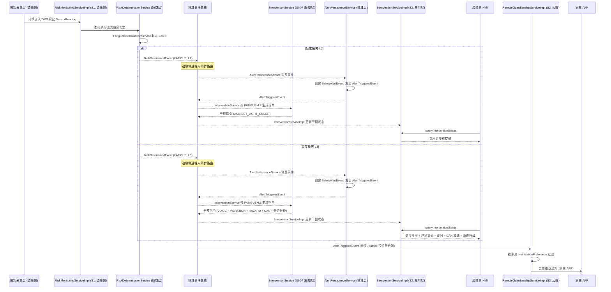
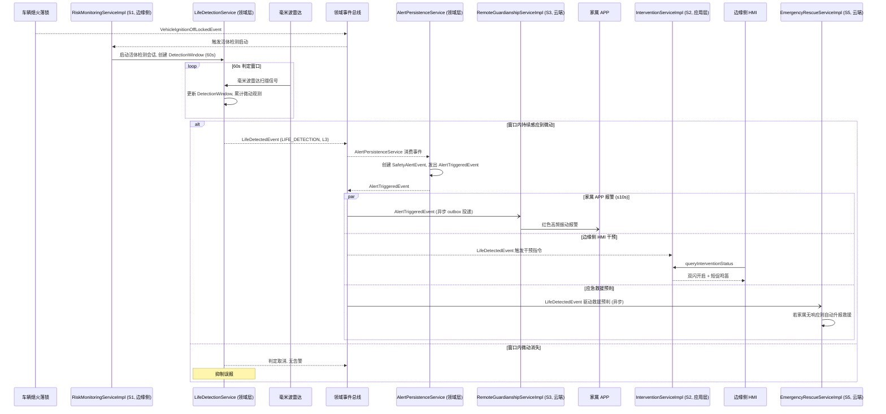
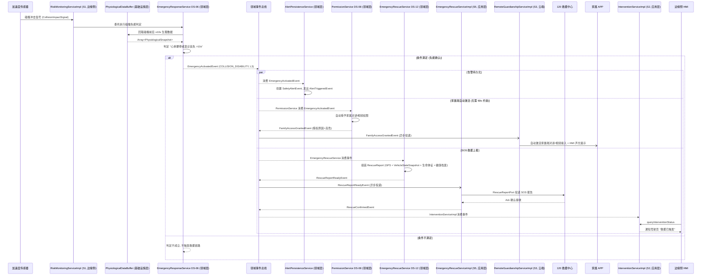

# 车载安全监测系统 应用层 OOD 设计方案（a_v4 / v1）

> 本文档为「智能物联——基于多传感器融合的车载安全监测系统」的**应用层**架构级 OOD 设计方案，承接领域层 OOD 产出（`a_v10_design_v1.md`），遵循 DDD 分层思想。应用层持有一组应用服务契约（interface）及对应实现（class），每个应用服务作为对应功能域的**入口门面**，负责编排领域服务、仓储和基础设施端口，处理事务边界、安全门控和外部请求适配，自身不包含领域业务逻辑。设计目标语言为仓颉（Cangjie），方案在仓颉类型系统能力范围内做抽象，不涉及具体实现代码。

---

## 一、概述

### 设计目标

应用层的核心使命是：**为外部接口层（家属 APP、车队大屏、救援中心、OTA 管理平台等）提供统一、内聚、类型安全的用例入口，将来自不同前端的请求转换为对领域层服务与仓储的编排调用，管理事务边界，并保证安全门控与输入校验在进入领域层之前完成**。

设计遵循以下目标：

- **薄层原则**：应用服务不包含业务逻辑——业务规则归属于领域层，应用服务仅负责编排、适配和事务管理。
- **契约先行**：每个应用服务以仓颉 `interface` 定义对外契约（仅声明方法签名），由 `class` 实现具体编排逻辑。契约与实现分离支持测试 mock 和未来扩展。
- **安全门控前置**：认证、授权校验在应用服务入口完成，通过后委托领域服务执行，避免领域服务背负横切安全关注。
- **清晰边界**：每个应用服务对应一个功能域，服务间通过领域事件解耦，避免直接的编译期循环依赖。
- **类型完备**：所有跨层传输类型（DTO）、服务方法签名中的参数类型和返回值类型、错误枚举均有明确定义，接口层可直接据此编写调用代码。
- **可验收导向**：每个应用服务的方法契约明确输入/输出/异常语义，配合验收测试场景规范，验收测试可直接通过应用服务入口驱动全链路验证。

### 核心抽象层次

应用层在分层架构中的位置：

```
┌──────────────────────────────────────┐
│         接口层（UI / API）            │
│  家属APP (ArkTS) / 车队大屏 / MQTT   │
└────────────────┬─────────────────────┘
                 │ DTO / HTTP / WebSocket / MQTT
┌────────────────▼─────────────────────┐
│         应用层（本文档范围）           │
│  六份 interface 契约 + 六份 class 实现│
│  + DTO 定义 + 安全门控 + 事务编排     │
└────────────────┬─────────────────────┘
                 │ 编排调用
┌────────────────▼─────────────────────┐
│         领域层（a_v10_design_v1.md）  │
│  领域服务 / 聚合根 / 实体 / 值对象    │
└──────────────────────────────────────┘
```

### 与领域层的职责边界

| 职责 | 归属 | 说明 |
|------|------|------|
| 业务规则与判定逻辑 | 领域层 | 疲劳判定、干预映射、评分公式等 |
| 事务边界管理 | 应用层 | 开启/提交/回滚事务，协调多个仓储写操作 |
| 安全认证与授权门控 | 应用层 | 在进入领域服务前完成二次身份验证等安全检查 |
| 领域事件发布 | 领域层 | 领域服务产出事件，事件总线负责路由 |
| DTO 与领域对象转换 | 应用层 | 将外部请求格式转换为领域层理解的类型 |
| 聚合根持久化操作 | 领域层 | 仓储接口在领域层声明，基础设施层实现 |
| 接口契约定义 | 应用层 | 以仓颉 `interface` 定义六个应用服务的对外契约 |

---

## 二、模块划分

### 2.1 模块一览

应用层按功能域拆分为独立模块，每个模块包含一份 `interface`（契约）和一份 `class`（实现）。模块间不允许直接调用（通过领域事件解耦）。

| 模块 | 契约 interface | 实现 class | 职责 | 依赖的领域层模块 |
|------|:---:|:---:|------|-----------------|
| `application.risk` | `IRiskMonitoringService` | `RiskMonitoringServiceImpl` | 风险监测用例编排：管理边缘侧流式判定会话生命周期，提供云端历史风险查询入口 | `domain.risk`、`domain.life`、`domain.emergency`、`domain.event`、`domain.model` |
| `application.intervention` | `IInterventionService` | `InterventionServiceImpl` | 干预执行用例编排：接收前端干预指令请求并提供干预状态查询 | `domain.intervention`、`domain.event`、`domain.model` |
| `application.guardianship` | `IRemoteGuardianshipService` | `RemoteGuardianshipServiceImpl` | 远程监护用例编排：家属 APP 的实时状态查询、告警推送订阅、音视频对讲请求管理 | `domain.family`、`domain.event`、`domain.model` |
| `application.fleet` | `IFleetManagementService` | `FleetManagementServiceImpl` | 车队管理用例编排：看板刷新、钻取查询、报告生成请求、绩效预警订阅 | `domain.fleet`、`domain.event`、`domain.model` |
| `application.emergency` | `IEmergencyRescueService` | `EmergencyRescueServiceImpl` | 应急救援用例编排：SOS 上报确认、救援授权管理、家属手动救援触发 | `domain.emergency`、`domain.event`、`domain.model` |
| `application.ota` | `IOTAManagementService` | `OTAManagementServiceImpl` | OTA 升级用例编排：升级任务创建、升级进度查询、回滚指令下发 | `domain.ota`、`domain.event`、`domain.model` |

### 2.2 依赖原则与依赖注入

#### 依赖方向
- 应用层**仅依赖领域层**，不依赖基础设施层的具体实现（仓储实现和端口实现通过依赖注入装配）。
- 应用服务之间**禁止直接调用**。跨功能域的协作统一通过订阅领域事件完成。
- 应用服务**持有对仓储接口和领域端口的引用**，使用方在应用层装配阶段注入。
- 应用服务**可同时依赖多个领域模块**（如 EmergencyRescueServiceImpl 同时依赖 `domain.emergency` 和 `domain.risk`），但遵循单向依赖——不允许领域层反向依赖应用层。

#### 仓颉依赖注入方式

应用层采用**构造器注入**模式：每个应用服务 `class` 的构造器接收其依赖的 interface（领域服务、仓储、端口），不直接依赖具体实现。装配阶段（`main` 或 IoC 容器初始化）负责创建具体实例并注入。

在仓颉中，依赖注入通过以下模式实现：

- **手动装配**：在应用的入口模块中，显式创建各领域服务、仓储实现和端口实现的对象，然后作为参数传入应用服务 `class` 的构造器。适合当前项目规模和团队约定。
- **IoC 容器**（后续可选）：若项目后续引入轻量级 IoC 容器（如仓颉社区 `cangje-ioc`），可将接口与实现类的绑定注册到容器，由容器自动解析依赖链。

当前设计方案不依赖特定 IoC 容器，装配逻辑集中在一处，便于审计和调试。

#### 应用层接口契约的定位

六份 `interface` 的引入目的：

1. **契约先行**：接口层开发人员看到的是 `interface` 而非 `class`，形成清晰的"仅依赖契约"的约束。
2. **测试 mock**：验收测试和单元测试可针对 `interface` 编写 mock 实现，无需依赖真实的领域服务或基础设施。
3. **版本演进**：若未来某功能域需不同的编排策略（如车队大屏和家属 APP 对状态推送有不同的过滤逻辑），可提供不同的 `class` 实现同一 `interface`。

---

## 三、核心抽象

### 3.0 类型约定

本文档中使用的类型命名约定：

| 类别 | 命名模式 | 示例 | 说明 |
|------|---------|------|------|
| 应用服务接口 | `I` + 服务名 | `IRiskMonitoringService` | 仓颉 `interface`，仅声明方法签名 |
| 应用服务实现 | 服务名 + `Impl` | `RiskMonitoringServiceImpl` | 仓颉 `class`，实现编排逻辑 |
| 输入 DTO | 操作名 + `Request` | `StartMonitoringRequest` | 不可变数据对象，接口层→应用层 |
| 输出 DTO | 操作名 + `Response` | `StartMonitoringResponse` | 不可变数据对象，应用层→接口层 |
| 跨层数据类型 | 领域语义名 | `SensorReading`, `DriverStatusSnapshot` | 在应用层和领域层间传递的结构化数据 |
| 错误类型 | `AppError` 枚举变体 | `AppError.SessionNotFound` | 仓颉 `enum`，携带上下文信息 |

### 3.1 S1 — IRiskMonitoringService / RiskMonitoringServiceImpl（风险监测服务）

#### 接口契约：IRiskMonitoringService

`IRiskMonitoringService` 是仓颉 `interface`，声明风险监测功能域的对内契约。其实现类 `RiskMonitoringServiceImpl` 负责编排领域服务、仓储和端口。

#### 类型定位

`interface`（契约）+ `class`（编排实现）。它不是领域服务——不包含判定逻辑，而是编排领域服务（RiskDeterminationService 及其子判定服务）和仓储（TripRepository、DriverRepository）完成用例。

#### 角色与职责

RiskMonitoringServiceImpl 是**风险监测功能域的应用层入口**，负责：

**边缘侧职责**（运行于车载边缘终端，单线程环境）：
- 对接边缘侧感知采集层，接收流式感知数据（覆盖疲劳、分心、异常驾驶行为三类风险）并分发至领域层的 RiskDeterminationService 进行判定
- 管理边缘侧**判定会话（RiskMonitoringSession）** 的生命周期——会话随行程开始创建、随行程结束销毁，会话内持有边缘侧临时判定状态的引用

**云端侧职责**（运行于华为云，可水平扩展）：
- 对外提供**查询当前驾驶员风险状态**的云端 API（供家属 APP / 车队大屏调用）
- 对外提供**查询历史告警列表**的云端 API（供车队管理员查询）

> **部署边界说明**：S1 横跨边缘侧与云端两侧部署——流式判定编排与会话管理在边缘侧本地执行，查询 API 在云端部署。两侧通过云边协同通道（IoTDA/MQTT）同步会话状态和告警事件。后续实现阶段应将边缘侧编排逻辑与云端查询逻辑拆分为独立组件，但共享同一应用服务标识以保持功能域内聚。
>
> **事务边界说明**：边缘侧流式处理为单线程无共享状态操作，不涉及事务。云端查询为只读操作，无需显式事务边界。

#### 协作关系

- **依赖的领域服务**：RiskDeterminationService（流式融合判定门面，协调 FatigueDeterminationService、DistractionDeterminationService、AbnormalDrivingDeterminationService 等子判定服务）、LifeDetectionService（活体遗留判定）、EmergencyResponseService（碰撞失能判定）
- **依赖的仓储**：TripRepository（查询当前行程告警列表）、DriverRepository（查询驾驶员信息）
- **依赖的领域事件**：订阅 AlertTriggeredEvent（用于将告警推送至云端通知通道）
- **持有的会话上下文引用**：RiskMonitoringSession（边缘侧会话级状态容器，不是领域对象）
- **与前端的关系**：家属 APP、车队大屏通过云端 API 网关调用本服务的查询方法

#### 接口方法契约

| 方法签名 | 输入 DTO | 输出 DTO / 返回类型 | 事务 | 说明 |
|---------|---------|-------------------|:--:|------|
| `startMonitoringSession` | `StartMonitoringRequest` | `Result<StartMonitoringResponse, AppError>` | — | 车辆点火时创建 RiskMonitoringSession，关联当前 Driver 和 Vehicle，初始化 ActiveRiskSet 为空集，返回会话句柄 |
| `processSensorReading` | `ProcessSensorDataRequest` | `Result<Unit, AppError>` | — | 边缘侧高频调用，接收单帧 SensorReading，委托 RiskDeterminationService.executeStreamFusion 执行流式融合判定。判定结果以领域事件方式产出（RiskDeterminedEvent / RiskResolvedEvent），事件在边缘侧同步消费 |
| `startLifeDetection` | `StartLifeDetectionRequest` | `Result<StartLifeDetectionResponse, AppError>` | — | 车辆熄火落锁后，启动活体检测会话。委托 LifeDetectionService.startDetectionWindow 在 60s 窗口内执行判定，返回窗口句柄和窗口持续时间 |
| `getDriverRiskStatus` | `GetDriverRiskStatusRequest` | `Result<GetDriverRiskStatusResponse, AppError>` | 只读 | 按驾驶员标识查询当前行程的活跃风险集（ActiveRiskSet），返回各 AlertType 的当前 RiskLevel 映射和派生状态色。无活跃行程时返回空结果 |
| `queryAlertHistory` | `QueryAlertHistoryRequest` | `Result<QueryAlertHistoryResponse, AppError>` | 只读 | 按驾驶员标识 + 时间范围查询历史 SafetyAlertEvent 列表，支持按 AlertType / RiskLevel 过滤和分页。数据来源为 CQRS 读模型投影 |

#### 异常处理策略

- 感知数据缺失（传感器离线）→ 判定服务返回 `Option.None`，应用层记录日志但不中断会话
- 会话不存在（传入无效会话句柄）→ 返回 `AppError.SessionNotFound(sessionHandle)`
- 数据源不可用（仓储连接失败）→ 返回 `AppError.DataSourceUnavailable("TripRepository")`，由调用方重试

### 3.2 S2 — IInterventionService / InterventionServiceImpl（应用层干预执行服务）

#### 接口契约：IInterventionService

`IInterventionService` 是仓颉 `interface`，声明干预执行功能域的对内契约。

#### 类型定位

`interface`（契约）+ `class`（编排实现）。它在驾驶员覆盖信号的接收和干预状态查询两个方向上编排领域服务与仓储。

> 注意：应用层 IInterventionService / InterventionServiceImpl 与领域层 InterventionService（DS-07）同名不同层——前者为应用服务负责编排，后者为领域服务负责业务逻辑。

#### 角色与职责

**闭环干预与反馈功能域的应用层入口**，负责：
- 接收驾驶员覆盖信号（OverrideSignal）上报，并委托领域层 InterventionService（DS-07）判定是否中止干预升级
- 对外提供**查询当前干预状态**的 API（供边缘侧 HMI 和云端车队大屏查询）
- 对外提供**查询干预指令历史**的 API（供审计和车队管理）

#### 协作关系

- **依赖的领域服务**：DS-07 InterventionService（领域层干预执行服务）
- **依赖的仓储**：TripRepository（查询当前行程的干预指令历史）
- **依赖的领域事件**：订阅 RiskDeterminedEvent / RiskResolvedEvent（用于边缘侧同步触发干预指令生成）、LifeDetectedEvent（活体遗留检测成立时触发边缘侧紧急干预指令，如双闪+鸣笛）
- **与前端的关系**：边缘侧 HMI 查询当前干预指令集合以渲染界面；车队大屏查询干预历史用于审计

#### 接口方法契约

| 方法签名 | 输入 DTO | 输出 DTO / 返回类型 | 事务 | 说明 |
|---------|---------|-------------------|:--:|------|
| `reportOverride` | `ReportOverrideRequest` | `Result<ReportOverrideResponse, AppError>` | — | 接收驾驶员覆盖信号（操作类型 + 时间戳），委托 DS-07.handleOverride 判定是否中止当前干预升级。返回干预状态变更结果（Aborted / Continuing / Resumed） |
| `queryInterventionStatus` | `QueryInterventionStatusRequest` | `Result<QueryInterventionStatusResponse, AppError>` | 只读 | 按行程标识查询当前活跃的干预指令集合，包括指令类型、目标设备和执行优先级 |
| `queryInterventionHistory` | `QueryInterventionHistoryRequest` | `Result<QueryInterventionHistoryResponse, AppError>` | 只读 | 按行程标识 + 时间范围查询已执行和已中止的干预指令列表，支持分页 |

> **事务边界说明**：`reportOverride` 为无持久化写的编排操作（领域层 DS-07 在内存中判定覆盖结果，结果经领域事件同步给 HMI），不需要显式事务。两个查询方法为只读操作。

#### 异常处理策略

- 行程不存在（查询干预状态时）→ 返回空集合，非错误
- 覆盖信号处理时判定服务内部错误 → 记录日志，默认维持当前干预状态不中断（安全优先：不确定时不盲目中止干预）

### 3.3 S3 — IRemoteGuardianshipService / RemoteGuardianshipServiceImpl（远程监护服务）

#### 接口契约：IRemoteGuardianshipService

`IRemoteGuardianshipService` 是仓颉 `interface`，声明远程监护功能域的对内契约。

#### 类型定位

`interface`（契约）+ `class`（编排实现）。它是家属 APP 所有非浏览性操作的统一入口——状态订阅为单向推送，对讲/视频/救援为双向请求-响应。

#### 角色与职责

**远程监护功能域的应用层入口**，面向家属 APP，负责：
- **家属 APP 实时状态订阅**：家属 APP 建立与云端的长连接后，本服务将 DriverStatusSnapshot（≥1Hz 推送）接入家属订阅通道
- **音视频对讲请求管理**：家属发起对讲/视频请求时，本服务执行安全门控后，通过 MediaSessionPort 建立音视频会话
- **告警推送偏好配置**：家属 APP 设置/修改通知偏好，本服务更新 SystemAccount 聚合
- **家属手动救援触发**：家属一键触发应急救援联动，本服务委托领域层执行上报

#### 协作关系

- **依赖的领域服务**：DS-08 PermissionService（权限判定）、DS-12 EmergencyRescueService（家属手动救援联动）、DS-16 DriverStatusBroadcastService（常态状态同步）
- **依赖的仓储**：SystemAccountRepository（更新家属通知偏好）、DriverRepository（查询驾驶员）
- **依赖的领域事件**：订阅 FamilyAccessGrantedEvent、FamilyAccessRevokedEvent、AlertTriggeredEvent（按家属偏好过滤后推送告警）
- **依赖的领域端口**：MediaSessionPort（音视频会话建立与拆除）、NotificationPort（告警推送与状态快照下发）
- **与前端的关系**：家属 APP（ArkTS）通过 WebSocket / 长连接与本服务交互

#### WebSocket 连接生命周期管理

家属 APP 与本应用服务的 WebSocket 连接遵循以下生命周期策略：

| 生命周期事件 | 处理策略 |
|-------------|---------|
| **连接建立** | 家属 APP 发起 WebSocket 握手，云端校验 Token 后建立连接，绑定 AccountRole=FAMILY。系统维护每个家属账户的连接映射（一个家属最多 1 条活跃连接；同一账户重复连接时旧连接被替代） |
| **心跳维持** | 云端每 30s 发送 PING 帧，家属 APP 须在 10s 内回复 PONG。连续 3 次未收到 PONG 视为连接断开。判定断开后服务端动作：① 主动发送 CLOSE 帧关闭 WebSocket 连接；② 释放该连接关联的推送流和订阅关系（同主动断开清理逻辑）；③ 清除该家属账户的连接映射，允许后续重连 |
| **意外断开处理** | 连接意外中断后，家属 APP 侧执行指数退避重连（1s、2s、4s、8s、16s，上限 5 次）。重连成功后：① 自动恢复断开前持有的所有有效订阅；② 云端推送断开期间错过的告警摘要（最近一条告警的快照，不全量补推历史告警） |
| **主动断开** | 家属 APP 主动关闭连接或取消订阅时，清理该连接关联的所有推送流和订阅关系，释放服务端资源 |
| **连接数限制** | 单个驾驶员最多被 3 个家属同时订阅状态推送；超限时拒绝新订阅请求，返回 `AppError.SubscriptionLimitExceeded(driverId, 3)` |
| **离线消息补推** | 断开期间的告警事件会暂存于离线消息队列（每条告警保留 7 天），家属重连后按时间倒序补推（最多 20 条），超出部分仅推摘要通知 |

#### 接口方法契约

| 方法签名 | 输入 DTO | 输出 DTO / 返回类型 | 事务 | 说明 |
|---------|---------|-------------------|:--:|------|
| `subscribeDriverStatus` | `SubscribeDriverStatusRequest` | `Result<SubscribeDriverStatusResponse, AppError>` | — | 家属 APP 通过 WebSocket 订阅指定 Driver 的实时状态。本服务校验监护关系后建立推送流关联。监护关系不存在时返回 `AppError.PermissionDenied(NotRelated)`。**无活跃行程时**：tripStatus 设为 `NOT_STARTED` 或 `COMPLETED`（依据最新行程状态），activeAlertLevels 为空 Map，gpsLocation 和 speed 设为 `Option.None`，physiologicalSummary 设为 `Option.None` |
| `unsubscribeDriverStatus` | `UnsubscribeDriverStatusRequest` | `Result<Unit, AppError>` | — | 家属 APP 主动取消订阅，清理推送流关联 |
| `requestMediaSession` | `RequestMediaSessionRequest` | `Result<RequestMediaSessionResponse, AppError>` | — | 家属请求建立音频对讲或视频监控。安全门控：角色校验 → 二次身份验证 → 权限判定。授权通过后通过 MediaSessionPort 建立会话 |
| `endMediaSession` | `EndMediaSessionRequest` | `Result<Unit, AppError>` | — | 家属主动挂断或系统因权限撤销自动挂断时，通过 MediaSessionPort 终止会话并释放资源。权限撤销路径由 FamilyAccessRevokedEvent 驱动 |
| `updateNotificationPreference` | `UpdateNotificationPreferenceRequest` | `Result<Unit, AppError>` | 写 | 家属设置希望接收的风险等级集合。通过 SystemAccountRepository 更新 SystemAccount 聚合。**事务边界**：单个聚合写操作，隔离级别为读已提交 |
| `triggerManualRescue` | `TriggerManualRescueRequest` | `Result<TriggerManualRescueResponse, AppError>` | — | 家属一键触发救援联动。校验角色和监护关系后，委托 DS-12.triggerManualRescue 执行上报 |

> **事务边界说明**：`updateNotificationPreference` 为单聚合写操作，由 SystemAccountRepository 内部管理事务（读已提交）。其余方法为编排操作或只读查询，不涉及跨聚合事务。

#### "离线"状态的语义定义

驾驶员状态推送中的"离线"分两种语义，前端 UI 应区分展示：

| 离线状态 | 语义 | UI 展示建议 | 产生条件 |
|----------|------|-----------|---------|
| **Inactive（无活跃行程）** | 驾驶员当前无进行中的行程，系统无数据可推送 | 灰色图标 + "未出车" 文案 | 行程状态为 NotStarted 或 Completed |
| **Disconnected（连接中断）** | 驾驶员有活跃行程，但家属 APP 与云端 WebSocket 连接已断开，无法接收推送 | 灰色图标 + "连接已断开，正在重连..." 文案 | WebSocket 连接因心跳超时或网络故障中断 |

#### 异常处理策略

- 二次身份验证未通过 → 返回 `AppError.SecondaryAuthRequired`
- 权限不足 → 返回 `AppError.PermissionDenied(reason)`（含具体拒绝原因：无授权/授权已过期/授权已撤销）
- 音视频会话建立失败（SparkRTC 信令通道故障）→ 返回 `AppError.SessionEstablishFailed("SparkRTC信令通道不可达")`
- 订阅状态推送时驾驶员无活跃行程 → 推送"离线（Inactive）"状态，不返回异常
- 订阅数超限 → 返回 `AppError.SubscriptionLimitExceeded(driverId, 3)`

### 3.4 S4 — IFleetManagementService / FleetManagementServiceImpl（车队管理服务）

#### 接口契约：IFleetManagementService

`IFleetManagementService` 是仓颉 `interface`，声明车队管理功能域的对内契约。

#### 类型定位

`interface`（契约）+ `class`（编排实现）。它是所有只读查询（看板、钻取、报告）的编排入口——查询类操作为只读，不涉及事务写。唯一写操作为订阅注册，不涉及领域聚合持久化。

#### 角色与职责

**车队运营管理功能域的应用层入口**，面向车队大屏和管理员后台，负责：
- 看板数据查询：车队级疲劳指数分布、风险热力图、监测脱线车辆列表
- 车辆轨迹查询：按车辆或驾驶员 + 时间范围查询历史轨迹点序列（含 GPS 坐标、时间戳、车速）
- 钻取查询：按风险等级下钻至高风险司机明细
- 驾驶行为报告生成：按驾驶员 + 时间范围请求生成分析报告
- 绩效预警订阅：管理员订阅车队级评分低于 60 的绩效预警推送

#### 看板缓存与事件驱动失效机制

看板数据采用两级缓存策略以提高响应速度和降低领域层负载：

| 缓存类型 | 刷新策略 | 失效触发 |
|---------|---------|---------|
| **宏观统计缓存**（车队级疲劳指数分布、风险热力图） | 默认每 5 分钟周期刷新，支持手动刷新（Cache-Control: no-cache） | 自然过期（TTL 5min）后按需重新计算 |
| **高危告警车辆列表缓存** | 事故级别告警（L3）需准实时反映 | **事件驱动失效**：本服务订阅 AlertTriggeredEvent（含 RiskLevel = L3 的告警）和 RiskResolvedEvent（含 RiskLevel = L3 的解除），事件到达时主动使对应车队的高危车辆列表缓存失效，下次查询时重新计算。最长延迟 ≤ 领域事件投递延迟（目标 < 3s） |

上述策略确保高危告警在看板上的反映延迟从"最长 5 分钟"降至"秒级"，同时宏观统计仍受益于缓存。

#### 协作关系

- **依赖的领域服务**：DS-10 FleetAnalyticsService（看板聚合与钻取）、DS-11 ReportGenerationService（报告生成）、DS-09 ScoringService（周期评分查询）
- **依赖的仓储**：DriverRepository、TripRepository（只读查询，经 CQRS 读模型投影，含轨迹点数据）
- **依赖的领域事件**：订阅 PerformanceWarningEvent、AlertTriggeredEvent（L3 告警用于缓存失效）、RiskResolvedEvent（L3 解除用于缓存失效）
- **依赖的领域端口**：NotificationPort（绩效预警推送）
- **与前端的关系**：车队大屏（ArkTS / Web）通过 HTTP API 调用本服务的查询方法；报告以 PDF/Excel 文件下载

#### 接口方法契约

| 方法签名 | 输入 DTO | 输出 DTO / 返回类型 | 事务 | 说明 |
|---------|---------|-------------------|:--:|------|
| `getFatigueDistribution` | `GetFatigueDistributionRequest` | `Result<GetFatigueDistributionResponse, AppError>` | 只读 | 返回车队维度的各风险等级占比映射和风险热力图坐标序列。委托 FleetAnalyticsService.getFatigueDistribution 执行聚合查询。宏观统计缓存 5 分钟 TTL |
| `queryVehicleTrajectory` | `QueryTrajectoryRequest` | `Result<QueryTrajectoryResponse, AppError>` | 只读 | 按车辆标识或驾驶员标识 + 时间范围查询历史轨迹点序列。轨迹点包含 GPS 坐标、时间戳、车速。数据来源为 CQRS 读模型投影，支持分页 |
| `drillDownHighRisk` | `DrillDownHighRiskRequest` | `Result<DrillDownHighRiskResponse, AppError>` | 只读 | 按指定 RiskLevel 下钻，返回该等级下驾驶员摘要列表（DriverId、综合风险评分、最近行程摘要、主要扣分项）。不缓存 |
| `generateReport` | `GenerateReportRequest` | `Result<GenerateReportResponse, AppError>` | 只读 | 按 Driver 标识 + TimeRange（周/月/季）生成驾驶行为报告。调用 ReportGenerationService.generateReport，15s SLA 内返回报告数据和下载链接 |
| `subscribePerformanceWarning` | `SubscribePerformanceWarningRequest` | `Result<SubscribePerformanceWarningResponse, AppError>` | — | 管理员订阅车队级绩效预警推送通道。当领域层产出 PerformanceWarningEvent 时，本服务消费该事件并通过 NotificationPort 推送 |

> **事务边界说明**：`subscribePerformanceWarning` 为推送通道注册操作，不涉及领域聚合写，无事务需求。其余方法均为只读查询。

#### 异常处理策略

- 看板查询超时 → 返回上次缓存结果（如有）并标注 "数据可能不是最新"（响应中 `dataFreshness` 字段 = `STALE`）
- 轨迹查询时间范围内无数据 → 返回空轨迹点序列，非错误
- 报告生成时间范围内无数据 → 返回空报告（`isEmpty = true`，"所选时间范围内无行驶记录"），非错误
- 报告生成超时（>15s）→ 返回 `AppError.ReportGenerationTimeout("建议缩小时间范围或稍后重试")`

### 3.5 S5 — IEmergencyRescueService / EmergencyRescueServiceImpl（应用层应急救援服务）

#### 接口契约：IEmergencyRescueService

`IEmergencyRescueService` 是仓颉 `interface`，声明应急救援功能域的对内契约。

#### 类型定位

`interface`（契约）+ `class`（编排实现）。救援流程涉及多个外部系统（120 救援中心、云端救援协调系统、SMN 推送）的协调，应用服务负责编排这些交互并管理事务。

> 注意：应用层 IEmergencyRescueService / EmergencyRescueServiceImpl 与领域层 EmergencyRescueService（DS-12）同名不同层。

#### 角色与职责

**应急救援联动功能域的应用层入口**，面向救援中心、云端救援协调系统和家属 APP，负责：
- SOS 上报的确认与追踪：接收并确认 SOS 救援报告已成功投递至 120 救援中心
- 救援授权凭证管理：管理 RescueAuthorizationToken 的签发、分发、校验和消费生命周期
- 家属手动救援触发编排
- 远程解锁与健康档案调取的授权编排

#### SOS 重试策略

SOS 救援报告投递采用以下指数退避重试策略：

| 参数 | 值 |
|------|-----|
| 算法 | 指数退避：1s → 2s → 4s → 8s → 16s |
| 最大重试次数 | 5 次 |
| 第 5 次失败后处理 | ① 转人工干预：通过 SMN 推送 "SOS 自动投递失败" 通知至救援中心值班人员；② 前端提示：家属 APP 展示 "救援已触发，等待救援中心人工确认中"；③ 救援记录状态标记为 "待人工补发" |
| 投递超时 | 每次投递等待 Ack 超时 = 30s |

SOS 链路不因投递失败而中断——碰撞失能触发的救援事件已记录，即使投递失败也进入"待补发"队列，由人工恢复流程兜底。

#### 协作关系

- **依赖的领域服务**：DS-12 EmergencyRescueService（领域层应急救援服务）
- **依赖的仓储**：VehicleRepository（更新车门锁状态）、DriverRepository（查询驾驶员）、TripRepository（查询最新生理快照）
- **依赖的领域事件**：订阅 RescueReportReadyEvent（DS-12 消费 EmergencyActivatedEvent 后产出，驱动 SOS 救援报告投递至 120）、FamilyManualRescueRequestedEvent（家属手动救援触发）
- **依赖的领域端口**：RescueReportPort（向 120 投递救援报告）、NotificationPort（救援状态通知推送）
- **与前端的关系**：救援中心通过本服务接收 SOS 上报并回传确认；云端救援协调系统通过本服务签发救援授权凭证

#### 接口方法契约

| 方法签名 | 输入 DTO | 输出 DTO / 返回类型 | 事务 | 说明 |
|---------|---------|-------------------|:--:|------|
| `confirmSOSReport` | `ConfirmSOSReportRequest` | `Result<Unit, AppError>` | 写 | 救援中心回传确认。委托 DS-12.confirmRescueReport 更新救援记录状态为 "已确认"。**事务边界**：单条救援记录写，读已提交 |
| `issueRescueToken` | `IssueRescueTokenRequest` | `Result<IssueRescueTokenResponse, AppError>` | 写 | 云端救援协调系统签发救援授权凭证。委托 DS-12.issueRescueAuthorization 生成 RescueAuthorizationToken，设置有效期（默认 30min）和授权操作集合（RemoteUnlock / HealthProfileAccess）。**事务边界**：创建凭证记录，读已提交 |
| `verifyRescueToken` | `VerifyRescueTokenRequest` | `Result<VerifyRescueTokenResponse, AppError>` | 写 | 委托 DS-12.verifyAndConsumeToken 校验 RescueAuthorizationToken（未过期、未消费、目标匹配、角色匹配、操作匹配——requestedOperation 必须在凭证的 authorizedOperations 集合内）。通过后执行操作（更新车门锁或调取健康档案）并标记凭证已消费。操作不匹配时返回 `AppError.AccessDenied(OperationNotAuthorized)`。**事务边界**：凭证消费为关键写操作，需与车门锁更新在同一事务内（读已提交 + 乐观锁防并发消费） |
| `queryRescueHistory` | `QueryRescueHistoryRequest` | `Result<QueryRescueHistoryResponse, AppError>` | 只读 | 按 Driver 标识或 Vehicle 标识查询救援上报历史。委托 DS-12.queryRescueHistory 执行查询 |

> **事务边界说明**：`confirmSOSReport` 和 `issueRescueToken` 为单聚合/单记录写，隔离级别读已提交。`verifyRescueToken` 涉及凭证状态更新和 Vehicle 聚合车门锁状态更新，需保证原子性——同事务内执行，Vehicle 聚合使用乐观锁（基于版本号）防并发消费。若乐观锁冲突，返回 `AppError.AccessDenied(ConcurrentConsumption)` 并触发审计日志。

#### 异常处理策略

- 救援报告投递失败 → 按上述退避重试策略处理，满 5 次后转人工干预
- 救援授权凭证已过期 → 返回 `AppError.AccessDenied(TokenExpired)`
- 救援授权凭证已消费（重放攻击）→ 返回 `AppError.AccessDenied(TokenAlreadyConsumed)`，触发安全审计日志
- 并发消费冲突 → 返回 `AppError.AccessDenied(ConcurrentConsumption)`，触发安全审计日志

### 3.6 S6 — IOTAManagementService / OTAManagementServiceImpl（OTA 升级管理服务）

#### 接口契约：IOTAManagementService

`IOTAManagementService` 是仓颉 `interface`，声明 OTA 升级管理功能域的对内契约。

#### 类型定位

`interface`（契约）+ `class`（编排实现）。它编排领域层 OTAUpdateService（DS-15）与基础设施层 OTADeliveryPort，管理升级任务的全生命周期。

#### 角色与职责

**OTA 固件升级管理功能域的应用层入口**，面向车队管理后台和云端 OTA 平台，负责：
- 升级任务创建与下发：运维人员通过管理后台发起固件升级任务
- 升级进度查询：运维人员查询单辆车或车队的升级进度
- 回滚指令下发：升级失败或需要回滚时，运维人员手动触发回滚
- 升级历史查询：查询车辆的历史升级记录

#### OTA 回滚期间的 CAN 干预恢复策略

当 OTA 升级发生回滚时，CAN 级干预的恢复遵循以下时间线：

| 阶段 | OTA 状态 | CAN 干预状态 | 说明 |
|------|---------|-------------|------|
| 正常运行时 | IDLE | 正常执行 | 所有干预指令正常下发 |
| 固件刷写中 | UPGRADING | **抑制** | 仅抑制 CAN 级干预（CAN_DECELERATION_REQUEST 等），非 CAN 级（氛围灯、语音、座椅震动）正常执行 |
| 回滚发起 | ROLLING_BACK | **抑制** | 固件回退过程中继续保持 CAN 干预抑制，确保总线无冲突 |
| 回滚完成 | ROLLED_BACK | **立即恢复** | 回滚事务提交、OTA 状态变为 ROLLED_BACK 时，CAN 干预能力立即恢复。S2 InterventionServiceImpl 订阅 OTAUpgradeRolledBackEvent（领域层 DS-15 产出），收到事件即移除 CAN 抑制标记 |
| 升级成功 | COMPLETED | **立即恢复** | 与回滚完成相同——S2 订阅 OTAUpgradeCompletedEvent，收到事件即恢复 CAN 干预 |

#### 协作关系

- **依赖的领域服务**：DS-15 OTAUpdateService（领域层 OTA 升级管理服务）
- **依赖的仓储**：VehicleRepository（查询当前固件版本和 OTA 升级状态）
- **依赖的领域事件**：订阅 OTAUpgradeCompletedEvent、OTAUpgradeFailedEvent、OTAUpgradeRolledBackEvent
- **依赖的领域端口**：OTADeliveryPort（通过 IoTDA 下发升级包至车载终端）、NotificationPort（升级结果通知推送）
- **与前端的关系**：车队管理后台（Web）通过 HTTP API 调用本服务

#### 接口方法契约

| 方法签名 | 输入 DTO | 输出 DTO / 返回类型 | 事务 | 说明 |
|---------|---------|-------------------|:--:|------|
| `createUpgradeTask` | `CreateUpgradeTaskRequest` | `Result<CreateUpgradeTaskResponse, AppError>` | 写（逐条提交） | 为每辆车创建升级任务，委托 DS-15.initiateUpgrade 执行版本比对。批量操作：逐条创建 + 逐条提交（读已提交），失败车辆跳过并记录至 skippedVehicles。**幂等性**：请求携带 `idempotencyKey`，同一 key 的重复请求返回已创建任务列表而非重复创建。**批量上限**：单次最多 100 辆车，超限时拒绝整批请求 |
| `queryUpgradeProgress` | `QueryUpgradeProgressRequest` | `Result<QueryUpgradeProgressResponse, AppError>` | 只读 | 按 VehicleId 列表批量查询每辆车的升级阶段、进度百分比和预估剩余时间 |
| `triggerRollback` | `TriggerRollbackRequest` | `Result<TriggerRollbackResponse, AppError>` | 写 | 手动触发回滚。委托 DS-15 将升级状态机推进至 ROLLED_BACK 阶段。**事务边界**：单 Vehicle 聚合写，读已提交 + 乐观锁 |
| `queryUpgradeHistory` | `QueryUpgradeHistoryRequest` | `Result<QueryUpgradeHistoryResponse, AppError>` | 只读 | 按 VehicleId 查询历史升级记录（含成功和失败），返回旧版本、新版本、升级耗时、最终状态 |

> **批量操作事务策略**：`createUpgradeTask` 为批量写操作（一次调用可能涉及多辆车的升级任务创建）。由于每辆车的升级任务独立（互不依赖），采用逐条创建 + 逐条提交策略：为每辆车独立开启事务（读已提交），失败车辆跳过并记录到响应中的 `skippedVehicles` 列表，成功的车辆各自事务独立提交，不会因单个车辆失败而回滚整体操作。逐条提交后已成功创建的升级任务立即可被 `queryUpgradeProgress` 查询到；调用方可通过 `CreateUpgradeTaskResponse.createdTaskIds` 获知本次操作已成功创建的任务子集。

#### 异常处理策略

- 目标车辆不存在 → 返回 `AppError.VehicleNotFound(vehicleId)`
- 目标版本与车辆型号不兼容 → 返回 `AppError.IncompatibleTarget(vehicleId, targetVersion)`
- 目标车辆数量超过批量上限（100）→ 返回 `AppError.BatchSizeExceeded(100)`
- 升级下发失败（IoTDA 通道不可达）→ 记录失败事件，标记任务为 "下发失败"，返回 `Result<T, AppError>` 中携带 `AppError.IoTDAChannelFailure`，等待运维人员手动重试
- 升级状态已处于终态（COMPLETED / ROLLED_BACK）→ 拒绝重复操作，返回 `AppError.UpgradeAlreadyFinished(vehicleId, currentStatus)`
- 目标车辆已有进行中升级 → 返回 `AppError.UpgradeInProgress(vehicleId)`

---

## 四、DTO 定义

以下 DTO 按应用服务分节列出。所有 DTO 均为仓颉不可变数据类（`class`，全字段构造器，无 setter），用于接口层与应用层之间的数据传输。

### 4.1 S1 RiskMonitoringService DTO

**StartMonitoringRequest**
- `driverId: DriverId` — 驾驶员标识
- `vehicleId: VehicleId` — 车辆标识

**StartMonitoringResponse**
- `sessionHandle: SessionHandle` — 会话句柄，用于后续 edge 侧方法调用

**ProcessSensorDataRequest**
- `sessionHandle: SessionHandle` — 当前判定会话句柄
- `reading: SensorReading` — 单帧传感器读数（类型定义见 §5 跨层类型定义）

**GetDriverRiskStatusRequest**
- `driverId: DriverId` — 驾驶员标识

**GetDriverRiskStatusResponse**
- `hasActiveTrip: Bool` — 是否有活跃行程
- `activeAlerts: Array<(AlertType, RiskLevel)>` — 当前活跃风险及等级映射
- `derivedStatusColor: StatusColor` — 派生状态色（GREEN / YELLOW / ORANGE / RED）

**QueryAlertHistoryRequest**
- `driverId: DriverId`
- `timeRange: TimeRange` — 起始和结束时间戳
- `alertTypeFilter: Option<AlertType>` — 可选告警类型过滤
- `riskLevelFilter: Option<RiskLevel>` — 可选风险等级过滤
- `page: PageRequest` — 分页参数（页码 + 每页条数）

**QueryAlertHistoryResponse**
- `alerts: Array<AlertSummary>` — 告警摘要列表
- `totalCount: UInt64` — 符合过滤条件的总记录数

**AlertSummary**
- `alertId: AlertId`
- `alertType: AlertType`
- `riskLevel: RiskLevel`
- `occurredAt: Timestamp`
- `resolvedAt: Option<Timestamp>`
- `tripId: TripId`

**StartLifeDetectionRequest**
- `vehicleId: VehicleId`

**StartLifeDetectionResponse**
- `detectionSessionHandle: SessionHandle`
- `windowDurationSeconds: UInt32` — 窗口持续时间（60）

### 4.2 S2 InterventionService DTO

**ReportOverrideRequest**
- `driverId: DriverId`
- `vehicleId: VehicleId`
- `signal: OverrideSignal` — 驾驶员覆盖信号（类型定义见 §5）

**ReportOverrideResponse**
- `result: OverrideResult` — Aborted / Continuing / Resumed

**OverrideResult**（enum）
- `Aborted` — 干预升级已中止
- `Continuing` — 覆盖无效，干预升级继续
- `Resumed` — 此前中止的干预已恢复

**QueryInterventionStatusRequest**
- `tripId: TripId`

**QueryInterventionStatusResponse**
- `activeInterventions: Array<InterventionSummary>` — 当前活跃的干预指令摘要

**InterventionSummary**
- `interventionId: InterventionId`
- `interventionType: InterventionType` — 干预类型枚举
- `targetDevice: TargetDevice` — 目标设备
- `priority: InterventionPriority` — 执行优先级

**QueryInterventionHistoryRequest**
- `tripId: TripId`
- `timeRange: Option<TimeRange>`
- `page: PageRequest`

**QueryInterventionHistoryResponse**
- `interventions: Array<InterventionSummary>`
- `totalCount: UInt64`

### 4.3 S3 RemoteGuardianshipService DTO

**SubscribeDriverStatusRequest**
- `familyAccountId: AccountId` — 家属账户标识
- `driverId: DriverId`
- `webSocketConnectionId: ConnectionId` — WebSocket 连接标识

**SubscribeDriverStatusResponse**
- `subscriptionId: SubscriptionId`
- `initialSnapshot: DriverStatusSnapshot` — 订阅建立时的即时状态快照（类型定义见 §5）

**UnsubscribeDriverStatusRequest**
- `subscriptionId: SubscriptionId`

**RequestMediaSessionRequest**
- `familyAccountId: AccountId`
- `driverId: DriverId`
- `sessionType: MediaSessionType` — AUDIO / VIDEO

**MediaSessionType**（enum）：`AUDIO` | `VIDEO`

**RequestMediaSessionResponse**
- `sessionHandle: MediaSessionHandle`
- `sessionToken: String` — 用于前端接入 SparkRTC 的临时 token

**EndMediaSessionRequest**
- `sessionHandle: MediaSessionHandle`

**UpdateNotificationPreferenceRequest**
- `familyAccountId: AccountId`
- `driverId: DriverId`
- `preferredRiskLevels: Array<RiskLevel>` — 希望接收告警的风险等级集合

**TriggerManualRescueRequest**
- `familyAccountId: AccountId`
- `driverId: DriverId`

**TriggerManualRescueResponse**
- `rescueRequestId: RescueRequestId`
- `status: RescueRequestStatus` — PENDING / CONFIRMED

**RescueRequestStatus**（enum）：`PENDING` | `CONFIRMED` | `REJECTED`

### 4.4 S4 FleetManagementService DTO

**GetFatigueDistributionRequest**
- `fleetId: FleetId`
- `timeRange: Option<TimeRange>`

**GetFatigueDistributionResponse**
- `distribution: Map<RiskLevel, Float64>` — 各风险等级占比（如 L1: 0.45 表示 45%）
- `heatmapData: Array<HeatmapPoint>` — 风险热力图坐标序列
- `dataFreshness: DataFreshness` — FRESH / STALE（见 §3.4 异常处理策略）

**DataFreshness**（enum）：`FRESH` | `STALE`

**HeatmapPoint**（结构类型）
- `latitude: Float64` — 纬度
- `longitude: Float64` — 经度
- `riskIntensity: Float64` — 风险强度（0.0~1.0）

**DrillDownHighRiskRequest**
- `fleetId: FleetId`
- `riskLevel: RiskLevel`
- `page: PageRequest`

**DrillDownHighRiskResponse**
- `drivers: Array<HighRiskDriverSummary>`
- `totalCount: UInt64`

**HighRiskDriverSummary**
- `driverId: DriverId`
- `compositeRiskScore: Float64` — 综合风险评分
- `latestTripSummary: TripDigest` — 最近行程摘要
- `primaryPenaltyItems: Array<String>` — 主要扣分项描述

**GenerateReportRequest**
- `driverId: DriverId`
- `timeRange: TimeRange`
- `reportType: ReportType` — WEEKLY / MONTHLY / QUARTERLY

**ReportType**（enum）：`WEEKLY` | `MONTHLY` | `QUARTERLY`

**GenerateReportResponse**
- `reportId: ReportId`
- `reportData: ReportData` — 报告结构化数据（类型定义见下方 ReportData）
- `downloadUrl: Option<String>` — PDF/Excel 下载链接（null if 报告为空）
- `isEmpty: Bool` — 所选时间范围内是否有行驶记录

**ReportData**（结构类型）— 报告结构化数据，供下游消费者（车队大屏、报告下载 API）使用：
- `reportId: ReportId` — 报告标识
- `driverId: DriverId` — 驾驶员标识
- `timeRange: TimeRange` — 报告覆盖时间范围
- `reportType: ReportType` — 报告周期类型
- `drivingBehaviorSummary: DrivingBehaviorSummary` — 驾驶行为评分汇总
  - `overallScore: Float64` — 综合评分（0~100）
  - `subScores: Map<String, Float64>` — 各维度子评分（如 "fatigueScore", "distractionScore", "abnormalDrivingScore"）
  - `trendVsLastPeriod: Float64` — 对比上一周期的评分变化（正值为提升、负值为退步）
- `riskDistribution: Map<AlertType, UInt64>` — 各类风险告警的发生频次分布
- `penaltyBreakdown: Array<PenaltyItem>` — 各维度扣分明细
  - `PenaltyItem` 含：`category: String`（如 疲劳/分心/异常驾驶）、`penaltyScore: Float64`（扣减分数）、`topViolations: Array<String>`（主要违规描述列表）
- `totalMileage: Option<Float64>` — 周期内总行驶里程（km）
- `totalDrivingTime: Option<Duration>` — 周期内总驾驶时长
- `generatedAt: Timestamp` — 报告生成时间戳

**SubscribePerformanceWarningRequest**
- `adminId: AccountId`
- `fleetId: FleetId`

**SubscribePerformanceWarningResponse**
- `subscriptionId: SubscriptionId`

**QueryTrajectoryRequest**
- `vehicleId: Option<VehicleId>` — 车辆标识（与 driverId 至少提供一个）
- `driverId: Option<DriverId>` — 驾驶员标识（与 vehicleId 至少提供一个）
- `timeRange: TimeRange` — 查询时间范围
- `page: PageRequest` — 分页参数

**QueryTrajectoryResponse**
- `trajectoryPoints: Array<TrajectoryPoint>` — 轨迹点序列（时间正序）
- `totalCount: UInt64`

**TrajectoryPoint**（结构类型）
- `timestamp: Timestamp` — 采集时间戳
- `latitude: Float64` — GPS 纬度
- `longitude: Float64` — GPS 经度
- `speed: Float64` — 车速（km/h）

### 4.5 S5 EmergencyRescueService DTO

**ConfirmSOSReportRequest**
- `rescueReportId: RescueReportId`
- `ackToken: String` — 救援中心回传的确认令牌

**IssueRescueTokenRequest**
- `rescueReportId: RescueReportId`
- `authorizedOperations: Array<RescueOperation>` — 授权操作集合：RemoteUnlock / HealthProfileAccess
- `validityDurationSeconds: UInt32` — 有效期秒数（默认 1800 = 30min）

**RescueOperation**（enum）：`RemoteUnlock` | `HealthProfileAccess`

**IssueRescueTokenResponse**
- `rescueToken: RescueAuthorizationToken`

**VerifyRescueTokenRequest**
- `rescueToken: RescueAuthorizationToken`
- `requestedOperation: RescueOperation`
- `targetVehicleId: VehicleId`

**VerifyRescueTokenResponse**
- `result: TokenVerifyResult` — VALID

**TokenVerifyResult**（enum）：`VALID`

**QueryRescueHistoryRequest**
- `driverId: Option<DriverId>`
- `vehicleId: Option<VehicleId>`
- `timeRange: Option<TimeRange>`
- `page: PageRequest`

**QueryRescueHistoryResponse**
- `rescueRecords: Array<RescueRecordSummary>`
- `totalCount: UInt64`

**RescueRecordSummary**
- `rescueReportId: RescueReportId`
- `triggerType: RescueTriggerType` — 触发类型：COLLISION_DISABILITY / MANUAL / LIFE_DETECTION
- `status: RescueRecordStatus` — SENT / CONFIRMED / PENDING_RETRY / MANUAL_ESCALATION
- `occurredAt: Timestamp`

**RescueTriggerType**（enum）：`COLLISION_DISABILITY` | `MANUAL` | `LIFE_DETECTION`

**RescueRecordStatus**（enum）：`SENT` | `CONFIRMED` | `PENDING_RETRY` | `MANUAL_ESCALATION`

### 4.6 S6 OTAManagementService DTO

**CreateUpgradeTaskRequest**
- `targetVehicleIds: Array<VehicleId>` — 目标车辆列表（上限 100）
- `targetVersion: OTAVersion`
- `upgradeOptions: Option<UpgradeOptions>` — 可选升级参数（分批策略、时间窗口等）
- `idempotencyKey: String` — 幂等性标识，同一 key 的重复请求幂等返回已创建任务

**UpgradeOptions**（结构类型）
- `batchStrategy: Option<BatchStrategy>` — 分批策略（如按车型、按地域分批）
- `scheduledWindow: Option<TimeRange>` — 预约升级时间窗口
- `forceUpgrade: Bool` — 是否强制升级（默认 false）

**CreateUpgradeTaskResponse**
- `createdTaskIds: Array<UpgradeTaskId>` — 成功创建的任务列表
- `skippedVehicles: Array<(VehicleId, AppError)>` — 跳过的车辆及原因

**QueryUpgradeProgressRequest**
- `vehicleIds: Array<VehicleId>`

**QueryUpgradeProgressResponse**
- `progressEntries: Array<UpgradeProgressEntry>`

**UpgradeProgressEntry**
- `vehicleId: VehicleId`
- `currentStage: UpgradeStage` — 当前升级阶段
- `progressPercent: Float64` — 进度百分比（0~100）
- `estimatedRemainingSeconds: Option<UInt32>` — 预估剩余时间

**TriggerRollbackRequest**
- `vehicleId: VehicleId`
- `reason: String` — 回滚原因

**TriggerRollbackResponse**
- `vehicleId: VehicleId`
- `newStatus: OTAUpgradeStatus` — ROLLING_BACK / ROLLED_BACK

**QueryUpgradeHistoryRequest**
- `vehicleId: VehicleId`
- `page: PageRequest`

**QueryUpgradeHistoryResponse**
- `entries: Array<UpgradeHistoryEntry>`
- `totalCount: UInt64`

**UpgradeHistoryEntry**
- `taskId: UpgradeTaskId`
- `oldVersion: OTAVersion`
- `newVersion: OTAVersion`
- `duration: Duration`
- `finalStatus: UpgradeFinalStatus` — SUCCEEDED / FAILED / ROLLED_BACK

---

## 五、跨层类型定义

以下类型在多个应用服务之间或应用层与领域层之间传输，统一在此定义。

### 5.1 SensorReading

感知数据单帧，由边缘侧感知采集层产出，经 S1 流式处理方法传入。

| 字段 | 类型 | 说明 |
|------|------|------|
| `timestamp` | `Timestamp` | 采集时间戳 |
| `sensorId` | `SensorId` | 传感器标识 |
| `sensorType` | `SensorType` | 传感器类型枚举：DMS_CAMERA / MILLIMETER_WAVE_RADAR / ACCELEROMETER / PHYSIOLOGICAL_MONITOR |
| `values` | `Map<String, Float64>` | 传感器读数键值对（如 "PERCLOS": 0.85, "yawnFreq": 3.2） |

### 5.2 DriverStatusSnapshot

驾驶员实时状态快照，由 S3 以 ≥1Hz 频率推送至家属 APP。

| 字段 | 类型 | 说明 |
|------|------|------|
| `driverId` | `DriverId` | 驾驶员标识 |
| `vehicleId` | `VehicleId` | 车辆标识 |
| `timestamp` | `Timestamp` | 快照时间戳 |
| `activeAlertLevels` | `Map<AlertType, RiskLevel>` | 当前活跃告警及等级 |
| `gpsLocation` | `Option<GeoPoint>` | GPS 经纬度坐标（无活跃行程时为 None） |
| `speed` | `Option<Float64>` | 当前车速 km/h（无活跃行程时为 None） |
| `tripStatus` | `TripStatus` | 行程状态：NOT_STARTED / ACTIVE / COMPLETED |
| `physiologicalSummary` | `Option<PhysiologicalDigest>` | 生理状态摘要（心率区间、体温等，仅当生理监测可用时非空） |

### 5.3 OverrideSignal

驾驶员覆盖信号，由边缘侧 HMI 或 MQTT 上报，经 S2 接入。

| 字段 | 类型 | 说明 |
|------|------|------|
| `overrideType` | `OverrideType` | 操作类型枚举：STEER / BRAKE / ACCELERATE |
| `timestamp` | `Timestamp` | 操作时间戳 |
| `driverId` | `DriverId` | 驾驶员标识 |

### 5.4 SessionHandle

判定会话句柄（值对象）。在边缘侧和云端之间传递以关联同一会话。

| 字段 | 类型 | 说明 |
|------|------|------|
| `sessionId` | `String` | 全局唯一会话标识 |
| `createdAt` | `Timestamp` | 创建时间戳 |

### 5.5 领域层引用类型

以下类型已在领域层 OOD（`a_v10_design_v1.md`）中定义，应用层直接引用不重复定义：

| 类型 | 定义位置（领域层 OOD） | 说明 |
|------|---------------------|------|
| `DriverId`, `VehicleId`, `TripId`, `AccountId`, `AlertId`, `InterventionId`, `RescueReportId`, `RescueRequestId`, `UpgradeTaskId`, `FleetId`, `SubscriptionId`, `SensorId`, `ConnectionId`, `MediaSessionHandle`, `RescueAuthorizationToken` | 领域层 §3 值对象 / 标识 | 领域标识类型 |
| `AlertType`, `RiskLevel`, `InterventionType`, `TargetDevice`, `InterventionPriority`, `OTAUpgradeStatus`, `UpgradeStage`, `StatusColor`, `TripStatus`, `OverrideType`, `MediaSessionType`, `SensorType`, `UpgradeFinalStatus` | 领域层 §3 枚举 | 领域枚举类型 |
| `TimeRange`, `PageRequest`, `GeoPoint`, `Duration`, `Timestamp`, `OTAVersion` | 领域层 §3 值对象 | 通用值对象类型 |
| `PhysiologicalDigest`, `TripDigest` | 领域层 §3 值对象 | 领域摘要类型 |

---

## 六、错误处理策略

### 6.1 应用层错误枚举 AppError

应用层定义统一的错误枚举 `AppError`（仓颉 `enum`），用于所有六个应用服务方法的 `Result<T, AppError>` 返回类型。AppError 继承领域层的三类错误分类（A：输入无效、B：业务拒绝、C：系统故障），每个变体携带必要的上下文信息。

```cangjie
enum AppError {
    // === A 类：输入无效 ===
    | InvalidSessionHandle(sessionHandle: String)
    | InvalidTimeRange(reason: String)
    | VehicleNotFound(vehicleId: VehicleId)
    
    // === B 类：业务拒绝 ===
    | SessionNotFound(sessionHandle: String)
    | PermissionDenied(reason: PermissionDenialReason)
    | SecondaryAuthRequired
    | SessionEstablishFailed(detail: String)
    | UpgradeInProgress(vehicleId: VehicleId)
    | UpgradeAlreadyFinished(vehicleId: VehicleId, currentStatus: OTAUpgradeStatus)
    | IncompatibleTarget(vehicleId: VehicleId, targetVersion: OTAVersion)
    | AccessDenied(reason: AccessDenialReason)
    | ReportGenerationTimeout(suggestion: String)
    | SubscriptionLimitExceeded(driverId: DriverId, maxLimit: UInt32)
    | BatchSizeExceeded(maxLimit: UInt32)
    
    // === C 类：系统故障 ===
    | DataSourceUnavailable(sourceName: String)
    | MessageQueueUnreachable
    | IoTDAChannelFailure
    | RescueReportDeliveryFailed(attemptNumber: UInt32)
}

enum PermissionDenialReason {
    | NotRelated           // 无监护关系
    | NoAuthorization      // 无对应授权
    | AuthorizationExpired // 授权已过期
    | AuthorizationRevoked // 授权已被撤销
}

enum AccessDenialReason {
    | TokenExpired
    | TokenAlreadyConsumed
    | ConcurrentConsumption
    | RoleMismatch
    | VehicleMismatch
    | OperationNotAuthorized
}
```

### 6.2 各应用服务错误处理策略表

| 应用服务 | 典型错误场景 | 返回 AppError 变体 | 调用方预期处理 |
|---------|-------------|-------------------|--------------|
| S1 | 会话句柄无效 | `SessionNotFound(handle)` | 终止本次判定请求 |
| S1 | 仓储数据源不可用 | `DataSourceUnavailable("TripRepository")` | 调用方决定重试策略 |
| S2 | 干预状态查询时行程不存在 | 返回空集合（不返回 Error） | 前端展示 "无活跃干预" |
| S3 | 家属未持有对讲/视频权限 | `PermissionDenied(reason)` | 前端提示具体拒绝原因 |
| S3 | 二次身份验证未通过 | `SecondaryAuthRequired` | 前端引导完成二次验证 |
| S3 | 音视频会话建立失败 | `SessionEstablishFailed(detail)` | 前端提示 "连接失败，请稍后重试" |
| S3 | 订阅数超限 | `SubscriptionLimitExceeded(driverId, 3)` | 前端提示已达上限 |
| S4 | 看板查询超时 | 返回缓存数据（`DataFreshness=STALE`），非 Error | 前端标注 "数据可能不是最新" |
| S4 | 轨迹查询无数据 | 返回空轨迹序列，非 Error | 前端展示 "该时段内无轨迹数据" |
| S4 | 报告生成超时 | `ReportGenerationTimeout(suggestion)` | 前端提示建议操作 |
| S4 | 报告时间范围内无数据 | 返回空报告（`isEmpty=true`），非 Error | 前端展示 "无行驶记录" |
| S5 | 救援授权凭证已过期 | `AccessDenied(TokenExpired)` | 建议重新申请凭证 |
| S5 | 救援授权凭证已消费 | `AccessDenied(TokenAlreadyConsumed)` | 触发安全审计 + 拒绝 |
| S5 | 救援报告投递失败 | `RescueReportDeliveryFailed(attempt)` | 前端展示 "等待救援中心确认中" |
| S6 | 目标车辆已有进行中升级 | `UpgradeInProgress(vehicleId)` | 跳过该车辆，继续处理其他 |
| S6 | 目标版本与车型不兼容 | `IncompatibleTarget(vehicleId, version)` | 提示运维确认版本 |
| S6 | 批量车辆数超限（>100） | `BatchSizeExceeded(100)` | 前端提示缩小批次 |
| S6 | 升级包下发失败 | `IoTDAChannelFailure` | 等待手动重试 |

### 6.3 安全门控统一原则

所有应用服务的危险操作（远程对讲/视频/车窗控制/SOS）在进入领域层之前必须经过以下门控链：

1. **身份认证**（基础设施层完成，应用层校验 Token/Session）
2. **角色校验**（AccountRole 匹配——只有 FAMILY 可请求对讲/视频/救援，只有 RESCUE 可远程解锁/调取健康档案）
3. **二次身份验证**（高敏操作门控，应用层校验二次验证结果）
4. **权限校验**（委托领域层 PermissionService 判定授权范围）

任一门控步骤不通过即立即拒绝并返回明确的 `AppError` 变体，避免"先放行再校验"导致的安全漏洞。

---

## 七、服务间协作关系与事务边界汇总

### 7.1 协作关系总览

六个应用服务之间的调用/事件依赖关系图（箭头方向 = 依赖方向）：

```
                         ┌──────────────────────┐
                         │  RiskMonitoringService│ (S1)
                         │  流式感知判定入口      │
                         └──────────┬───────────┘
                                    │ 产出 RiskDeterminedEvent /
                                    │ RiskResolvedEvent / LifeDetectedEvent
          ┌─────────────────────────┼──────────────────────────┐
          ▼                         ▼                          ▼
┌──────────────────────┐  ┌──────────────────────┐  ┌──────────────────────┐
│ InterventionService  │  │RemoteGuardianshipService│ │FleetManagementService│
│ (S2) 干预执行入口    │  │ (S3) 远程监护入口      │  │ (S4) 车队管理入口    │
└──────────────────────┘  └──────────┬───────────┘  └──────────────────────┘
          │                          │
          │ 订阅 OTA 升级状态事件      │ 家属手动救援触发
          ▼                          ▼
┌──────────────────────┐  ┌──────────────────────┐
│  OTAManagementService│  │EmergencyRescueService│ (S5)
│  (S6) OTA 升级入口   │  │ 应急救援入口          │
└──────────────────────┘  └──────────────────────┘
```

> 图中箭头表示事件流向（经领域事件总线 EventBus 路由），非应用服务间的直接方法调用。实际投递路径为：事件由领域层产出 → EventBus 路由 → 订阅者应用服务，与 §7.3 原则一致。

### 7.2 协作链路分解

#### 链路 A：判定 → 干预（边缘侧同步，≤500ms）

```
S1 RiskMonitoringServiceImpl
    │  流式感知数据
    ▼
[领域层] RiskDeterminationService → RiskDeterminedEvent
    │  (边缘侧进程内同步消费)
    ▼
[领域层] InterventionService (DS-07) → 生成干预指令集合
    │
    ▼
[领域事件总线 — 边缘侧进程内同步]
    │
    ▼
S2 InterventionServiceImpl → 更新内存中的当前干预状态
    │  (供 HMI 查询渲染)
    ▼
边缘侧 HMI 查询 InterventionServiceImpl.queryInterventionStatus
```

#### 链路 B：告警 → 推送（云端异步，秒级）

```
[领域层] RiskDeterminedEvent / LifeDetectedEvent / EmergencyActivatedEvent
    │
    ▼
[领域层] AlertPersistenceService → SafetyAlertEvent → AlertTriggeredEvent
    │
    ▼
[领域事件总线 — outbox + 消息队列异步投递]
    │
    ├──► S3 RemoteGuardianshipServiceImpl → 按 NotificationPreference 过滤 → NotificationPort 推送家属 APP
    ├──► S4 FleetManagementServiceImpl → 看板缓存失效（L3 告警） + 绩效预警推送
    └──► S5 EmergencyRescueServiceImpl（仅 EmergencyActivatedEvent 路径）→ RescueReportPort 投递 120
```

#### 链路 C：家属手动救援联动

```
S3 RemoteGuardianshipServiceImpl (家属 APP 一键触发)
    │  角色校验 + 二次身份验证
    ▼
[领域层] DS-12 EmergencyRescueService.triggerManualRescue
    │
    ▼
FamilyManualRescueRequestedEvent
    │
    ▼
[领域事件总线 — outbox 异步投递]
    │
    ├──► S5 EmergencyRescueServiceImpl → RescueReportPort 投递 120
    └──► S3 RemoteGuardianshipServiceImpl → NotificationPort 推送家属 APP 确认通知
```

#### 链路 D：OTA 升级期间干预抑制

```
[领域层] OTAUpgradeStartedEvent / OTAUpgradeCompletedEvent / OTAUpgradeRolledBackEvent (DS-15 产出)
    │
    ▼
[领域事件总线 — outbox 异步投递]
    │
    ▼
S2 InterventionServiceImpl (订阅 OTA 升级状态事件)
    │  查询 Vehicle 聚合中当前 OTAUpgradeStatus 阶段
    │  若升级处于 UPGRADING / ROLLING_BACK 阶段
    ▼
S2 抑制 CAN 级干预指令下发（CAN_DECELERATION_REQUEST 等）
    │  （非 CAN 级干预如氛围灯、语音播报、座椅震动仍正常执行）
    │  升级完成（COMPLETED）或回滚完成（ROLLED_BACK）后立即恢复 CAN 级干预能力
    ▼
```

### 7.3 协作设计原则

- **应用服务间零直接调用**：所有跨功能域协作均通过领域事件完成。事件由领域层产出，经领域事件总线（EventBus）路由至订阅者。
- **应用服务与领域服务单向依赖**：应用服务可调用领域服务和仓储，领域服务不可反向调用应用服务。领域事件是唯一的解耦机制——领域服务产出事件，事件总线异步路由给应用服务订阅者。
- **同步与异步路由在应用层决策**：哪些事件在边缘侧同步消费（判定→干预）、哪些在云端异步消费（告警推送→家属 APP），由应用层在装配时通过事件总线注册策略决定，领域层不感知此路由差异。
- **HMI 交互经应用服务**：边缘侧 HMI 不直接接收领域服务消息，而是通过查询 S2 InterventionServiceImpl 的当前干预状态来获取渲染数据。时序图中的消息流向严格遵守此原则。

> **基础设施实现假设**：本设计方案中涉及的领域事件总线（EventBus）、outbox 事务性事件表、CQRS 读模型投影等机制均属于基础设施层关注点。应用层方案中将其作为已存在的底层能力引用来描述服务间协作关系，其具体实现（如事件总线的消息队列选型、outbox 的数据库方案、读模型投影的同步延迟 SLO）由基础设施层设计阶段确定。

### 7.4 事务边界汇总

| 应用服务 | 方法 | 事务类型 | 隔离级别 | 并发控制 | 说明 |
|---------|------|:--:|:--:|:--:|------|
| S1 | `startMonitoringSession` | 无 | — | — | 边缘侧内存操作 |
| S1 | `processSensorReading` | 无 | — | — | 单线程流式处理 |
| S1 | `startLifeDetection` | 无 | — | — | 边缘侧内存操作 |
| S1 | `getDriverRiskStatus` | 只读 | 读已提交 | — | 云端查询 |
| S1 | `queryAlertHistory` | 只读 | 读已提交 | — | CQRS 读模型 |
| S2 | `reportOverride` | 无 | — | — | 内存判定，无持久化 |
| S2 | `queryInterventionStatus` | 只读 | 读已提交 | — | 查询 |
| S2 | `queryInterventionHistory` | 只读 | 读已提交 | — | 查询 |
| S3 | `subscribeDriverStatus` | 无 | — | — | 推送流注册 |
| S3 | `unsubscribeDriverStatus` | 无 | — | — | 推送流清理 |
| S3 | `requestMediaSession` | 无 | — | — | 编排操作 |
| S3 | `endMediaSession` | 无 | — | — | 编排操作 |
| S3 | `updateNotificationPreference` | 写 | 读已提交 | — | 单聚合写 |
| S3 | `triggerManualRescue` | 无 | — | — | 编排操作 |
| S4 | `getFatigueDistribution` | 只读 | 读已提交 | — | 缓存读取 |
| S4 | `drillDownHighRisk` | 只读 | 读已提交 | — | 实时查询 |
| S4 | `generateReport` | 只读 | 读已提交 | — | 15s SLA |
| S4 | `queryVehicleTrajectory` | 只读 | 读已提交 | — | CQRS 读模型 |
| S4 | `subscribePerformanceWarning` | 无 | — | — | 推送通道注册 |
| S5 | `confirmSOSReport` | 写 | 读已提交 | — | 单记录写 |
| S5 | `issueRescueToken` | 写 | 读已提交 | — | 单记录写 |
| S5 | `verifyRescueToken` | 写 | 读已提交 | Vehicle 乐观锁 | 跨操作原子性 |
| S5 | `queryRescueHistory` | 只读 | 读已提交 | — | 查询 |
| S6 | `createUpgradeTask` | 写 | 读已提交 | 逐条提交 | 批量写 |
| S6 | `queryUpgradeProgress` | 只读 | 读已提交 | — | 批量查询 |
| S6 | `triggerRollback` | 写 | 读已提交 | Vehicle 乐观锁 | 单聚合写 |
| S6 | `queryUpgradeHistory` | 只读 | 读已提交 | — | 查询 |

---

## 八、核心时序图

以下时序图以 Mermaid sequenceDiagram 语法描述三条关键路径的全链路消息交互。所有跨层通信均经领域事件总线（EventBus）路由，HMI 交互经应用服务（S2）而非领域服务直控。

### 8.1 路径 1：疲劳判定 → 告警 → 干预链路



### 8.2 路径 2：活体遗留 → 报警链路



### 8.3 路径 3：碰撞失能 → SOS + 家属自动激活链路



---

## 九、并发设计

### 9.1 应用层的无状态性

所有六个应用服务均设计为**无状态**——它们不持有个体请求之间的可变状态，会话级状态全部归属于：
- **边缘侧**：RiskMonitoringSession（S1 管理的边缘侧会话上下文引用）
- **领域层**：Trip 聚合（持久化）、EdgeSessionContext（临时状态）
- **基础设施层**：WebSocket 连接池、缓存

应用服务自身的无状态性使其在云端可以水平扩展，各请求之间互不干扰。

### 9.2 并发场景策略

| 场景 | 策略 |
|------|------|
| 多家属并发查询同一驾驶员状态 | 只读查询，读已提交，无需锁 |
| 家属端常态状态快照推送 (≥1Hz) | 单向异步推送，无共享写状态 |
| 多个管理员同时请求看板刷新 | 看板缓存控制刷新频率 (5min)，重复请求命中缓存；L3 告警事件驱动缓存失效 |
| 家属请求对讲与系统自动撤销权限并发 | SystemAccount 聚合（AR-04，定义见领域层 OOD `a_v10_design_v1.md` §3.1）乐观锁，先完成者胜出，后者重试 |
| OTA 升级任务下发与传感器自检并发写 Vehicle | Vehicle 聚合（AR-03，定义见领域层 OOD `a_v10_design_v1.md` §3.1）乐观锁，冲突时 OTA 重试、自检下一周期重试 |
| SOS 救援上报与家属手动救援并发 | 两类救援路径独立，通过各自的领域事件驱动，不互斥 |
| 救援授权凭证并发消费 | Vehicle 聚合乐观锁（基于版本号），先消费成功者胜出，后者返回 `AppError.AccessDenied(ConcurrentConsumption)` |

### 9.3 边缘侧线程模型

边缘侧 RiskMonitoringServiceImpl 不运行在云端，其在边缘侧的编排逻辑运行于边缘侧单线程环境中——感知数据按时间序列顺序送达，判定→干预链路同步执行（≤500ms），无并发竞争。

---

## 十、设计决策

### 决策 A1（修订）：以 interface 定义应用服务契约，class 实现编排逻辑

**原决策（a_v1/v2）**：以 `class` 直接定义应用服务，不引入 interface（理由为"不存在多态替换场景"）。

**修订后的决策**：六个应用服务均分为 `interface`（声明方法签名契约）和 `class`（实现编排逻辑）两层。修订理由：

1. **测试 mock 需求**：验收测试和单元测试需要对应用服务进行 mock，`interface` 是仓颉中实现 mock 的标准方式。若仅有 `class`，测试代码需依赖具体实现，无法独立验证接口层调用逻辑。
2. **契约清晰性**：`interface` 仅声明方法签名，天然形成与接口层之间的"最小依赖面"，接口层开发人员不需要了解实现细节。
3. **仓颉语言习惯**：仓颉的 `interface` 支持方法签名声明和 default 实现，与面向接口编程的理念契合。接口与实现分离是仓颉生态中的推荐模式。
4. **保守扩展**：当前确实不存在多态替换场景，但 `interface` 的引入成本极低（一份声明对应一份实现），为未来可能的替换需求预留空间，无需透支设计复杂度。

**仓颉语言考量**：仓颉的 `interface` 可声明方法签名（不含方法体），由 `class` 通过 `: InterfaceName` 语法实现。依赖注入时，构造器参数声明为 `interface` 类型，运行时注入 `class` 实例，实现编译期依赖抽象、运行时绑定具体实现。若未来为测试编写 mock 实现，只需新增一个实现同一 `interface` 的 `class` 而不需修改调用方代码。

### 决策 A2：应用层不直接创建领域事件，事件由领域层产出

**理由**（无变化）：领域事件反映的是"领域层发生的业务事实"——只有领域层有权决定"一次疲劳判定成立"或"一次权限被撤销"是否真实发生。应用层若绕过领域层直接创建事件会导致业务事实来源不唯一，破坏事件溯源和审计链。

### 决策 A3：家属 APP 通过应用服务（S3）间接访问领域，不直接调用领域服务

**理由**（无变化）：家属 APP 运行在 HarmonyOS 设备上，无法直接调用云端部署的领域服务。S3 RemoteGuardianshipService 是云端应用服务，负责 DTO 转换、安全门控和编排。

### 决策 A4：应用服务间的协作全部通过领域事件总线路由，不使用直接方法调用

**修订理由**：原时序图中存在领域服务直接向应用服务/HMI 发消息的路径（§8.2 路径 2、§8.3 路径 3），违反了 §7.3 明确的"应用服务间零直接调用"原则。修订后的时序图在所有跨层消息交互中显式引入领域事件总线（EventBus）作为路由中介，HMI 交互统一经 InterventionServiceImpl（S2）的查询接口而非领域服务直控。修订后的时序图（§8）严格遵守：领域服务仅产出事件→EventBus 路由→应用服务消费事件或供 HMI 查询的模型。

### 决策 A5：安全门控（认证、授权、二次验证）在应用层而非领域层完成

**理由**（无变化）：认证和二次身份验证是纯技术关注点，依赖基础设施层安全模块，与领域业务规则无关。将门控置于应用层保持领域服务的纯粹性，并允许安全策略独立演进。

### 决策 A6：看板缓存采用事件驱动失效机制替代纯 TTL 策略

**理由**：原方案中看板缓存仅以 5 分钟 TTL 刷新，导致高危告警（L3）在车队大屏上最长延迟 5 分钟。修订后采用两级缓存策略——宏观统计维持 5 分钟 TTL，高危告警车辆列表由 AlertTriggeredEvent（L3）和 RiskResolvedEvent（L3）驱动主动失效，使高危告警的看板反映延迟降至秒级。

---

## 十一、验收测试场景概要

### 11.1 路径 1（疲劳判定 → 告警 → 干预）验收场景

**TC-1-1：正常路径 — 轻度疲劳 L2 判定到干预**
1. 边缘侧持续送入模拟的 DMS 视觉 SensorReading（PERCLOS=0.35，持续 3s）
2. 验证 RiskMonitoringServiceImpl 的判定会话正确关联 DriverId 和 VehicleId
3. 验证领域层产出 RiskDeterminedEvent (FATIGUE, L2)
4. 验证 InterventionServiceImpl.queryInterventionStatus 返回 AMBIENT_LIGHT_COLOR 类型干预指令
5. 验证家属 APP 收到 AlertTriggeredEvent 推送通知（若偏好中包含 L2）

**TC-1-2：异常路径 — 无效会话句柄**
1. 使用不存在的 SessionHandle 调用 processSensorReading
2. 验证返回 `AppError.SessionNotFound(invalidHandle)`，会话不中断

### 11.2 路径 2（活体遗留 → 报警）验收场景

**TC-2-1：正常路径 — 活体检测触发报警**
1. 模拟 VehicleIgnitionOffLockedEvent 触发 RiskMonitoringServiceImpl 启动活体检测会话
2. 在 60s 窗口内持续送入毫米波雷达微动信号
3. 验证领域层产出 LifeDetectedEvent (LIFE_DETECTION, L3)
4. 验证家属 APP 收到红色高频振动报警（≤10s 内）
5. 验证 HMI 通过 InterventionServiceImpl 查询到双闪+鸣笛指令

**TC-2-2：异常路径 — 误报抑制**
1. 60s 窗口内，前 30s 有微动信号，后 30s 信号消失
2. 验证窗口结束后不产出 LifeDetectedEvent，无任何告警推送

### 11.3 路径 3（碰撞失能 → SOS + 家属激活）验收场景

**TC-3-1：正常路径 — 碰撞失能全链路**
1. 模拟碰撞冲击信号 + 生理数据 Buffer 返回 "心率骤停 >10s" 的快照序列
2. 验证领域层产出 EmergencyActivatedEvent (COLLISION_DISABILITY, L3)
3. 验证 EmergencyRescueServiceImpl 通过 RescueReportPort 向 120 投递 SOS 报告
4. 验证家属 APP 自动激活对讲/视频接入（FamilyAccessGrantedEvent 驱动）
5. 验证 HMI 展示 "救援已触发" 通知

**TC-3-2：异常路径 — 救援投递重试**
1. 模拟 RescueReportPort 投递第 1~4 次均失败，第 5 次成功
2. 验证按退避间隔（1s/2s/4s/8s/16s）依次重试
3. 验证第 5 次成功后救援记录状态为 "已确认"
4. 验证投递期间家属 APP 持续展示 "救援已触发，等待救援中心确认中"

**TC-3-3：异常路径 — 投递全部失败转人工**
1. 模拟 RescueReportPort 连续 5 次投递全部失败
2. 验证第 5 次失败后通过 SMN 推送 "SOS 自动投递失败" 至值班人员
3. 验证前端展示 "等待救援中心人工确认中"
4. 验证救援记录状态为 "待人工补发"

---

## 十二、修订说明（a_v2 / v1）

本版本（a_v2 / v1）基于审查报告 b_v1 / v1（共 14 个问题）进行全面修订。

| 审查意见 | 严重度 | 修改措施 |
|---------|:--:|---------|
| **接口方法未提供具体签名**：六个应用服务的接口契约全部以自然语言描述，未提供方法名、参数类型名或返回值类型名 | 高 | 在 §3.1–§3.6 中为每个应用服务的每个方法提供具体契约表，包含方法名、输入 DTO 类型名、返回类型（`Result<T, AppError>` 模式）、事务标注。方法签名以仓颉风格表述（如 `startMonitoringSession(req): Result<StartMonitoringResponse, AppError>`） |
| **DTO 定义完全缺失**：整个设计文档未定义任何一个 DTO | 高 | 新增 §4「DTO 定义」章节，按六个应用服务分节列出所有输入 DTO 和输出 DTO 的结构定义（字段名 + 字段类型 + 说明），附录中还定义了 DTO 中使用的 enum 类型（如 OverrideResult、MediaSessionType、DataFreshness 等） |
| **关键类型未定义**：SensorReading、DriverStatusSnapshot、OverrideSignal 等未给出字段定义 | 高 | 新增 §5「跨层类型定义」章节，为 SensorReading、DriverStatusSnapshot、OverrideSignal、SessionHandle 提供完整字段级定义；同时建立领域层引用类型表，明确已在领域层 OOD 中定义的类型引用位置，避免重复定义 |
| **异常类型仅有名称无定义**：未定义任何错误枚举或错误码体系 | 高 | 在 §6.1 中定义 `AppError` 枚举（仓颉 `enum`），包含 A/B/C 三类共 15 个变体，每个变体携带结构化上下文信息（如 `PermissionDenied(reason: PermissionDenialReason)`）。附属定义 `PermissionDenialReason` 和 `AccessDenialReason` 两个子枚举 |
| **事务边界未定义**：全文未对任何业务路径定义具体的事务边界 | 中 | 在 §3 每个应用服务的方法契约表中新增「事务」列，标注每个方法的事务类型（写/只读/无）；在 §7.4 新增「事务边界汇总」表，统一列出所有写操作的事务类型、隔离级别（读已提交）和并发控制策略（乐观锁/逐条提交）；特别对 S6 批量操作说明逐条创建+逐条提交的事务策略 |
| **S3 WebSocket 连接生命周期管理缺失**：未覆盖意外断开、重连恢复、心跳、连接限制、离线消息补推 | 中 | 在 §3.3 中新增「WebSocket 连接生命周期管理」子节，覆盖：心跳（30s PING/10s PONG 超时 + 3 次连续未响应视作断开）、重连（指数退避 1s~16s，上限 5 次，重连成功自动恢复订阅+补推断开期间告警摘要）、连接限制（每驾驶员最多 3 个家属订阅）、离线消息队列（保留 7 天、重连后补推最多 20 条） |
| **S4 看板缓存无事件驱动失效机制**：高危告警最长 5 分钟延迟 | 中 | 在 §3.4 中新增「看板缓存与事件驱动失效机制」子节，采用两级缓存：宏观统计（TTL 5min），高危告警车辆列表（订阅 AlertTriggeredEvent L3 和 RiskResolvedEvent L3 主动失效，使延迟降至秒级） |
| **时序图存在跨层直接通信**：领域服务直接向应用服务/HMI 发消息 | 中 | 重写 §8 全部三条时序图，所有跨层消息交互均经「领域事件总线（EventBus）」作为中介路由，HMI 交互统一经 InterventionServiceImpl（S2）的查询接口。时序图中不再出现领域服务直接发消息给应用服务或 HMI 的路径 |
| **S5 SOS 重试策略未具体化**：仅描述"按退避策略重试" | 中 | 在 §3.5 中新增「SOS 重试策略」子节，明确：指数退避 1s/2s/4s/8s/16s、最大 5 次重试、每次投递等待 Ack 超时 30s、第 5 次失败后转人工干预（SMN 推送+前端提示+救援记录标记"待人工补发"） |
| **缺失验收测试场景规范**：声称"可验收导向"但未提供验收测试场景 | 中 | 新增 §11「验收测试场景概要」，为三条核心时序图路径各提供至少 2 个验收测试场景（含正常路径和关键异常路径），共 7 个场景（TC-1-1、TC-1-2、TC-2-1、TC-2-2、TC-3-1、TC-3-2、TC-3-3） |
| **时序图拼写错误**：`FatgueDeterminationService` → `FatigueDeterminationService` | 低 | 在 §8.1 路径 1 时序图中修正拼写 |
| **OTA 回滚期间 CAN 干预恢复时机未说明** | 低 | 在 §3.6 中新增「OTA 回滚期间的 CAN 干预恢复策略」表格，明确四个阶段的 CAN 干预状态：正常执行→抑制（UPGRADING）→抑制（ROLLING_BACK）→立即恢复（ROLLED_BACK/COMPLETED），并说明 S2 通过订阅 OTAUpgradeRolledBackEvent/OTAUpgradeCompletedEvent 自动恢复 |
| **S3 "离线"状态未区分无行程 vs 断网** | 低 | 在 §3.3 中新增「"离线"状态的语义定义」表格，区分 Inactive（无活跃行程）和 Disconnected（连接中断）两种离线语义，并建议对应的前端 UI 展示文案 |
| **仓颉 interface 能力未利用**：以 class 定义应用服务，未利用 interface 先行定义契约 | 低 | 修订决策 A1：六个应用服务均拆分为 `interface`（如 `IRiskMonitoringService`，声明方法签名）+ `class`（如 `RiskMonitoringServiceImpl`，实现编排逻辑）。在 §2.2 补充仓颉依赖注入方式（构造器注入 + 手动装配，可选 IoC 容器）。模块划分表（§2.1）同步更新为 interface + class 双列 |

---

## 十三、修订说明（a_v3 / v1）

本版本（a_v3 / v1）基于审查报告 b_v2 / v1（共 10 个问题）进行定向修订。

| 编号 | 审查意见 | 严重度 | 修改措施 |
|:--:|---------|:--:|---------|
| 1 | **S4 FleetManagementService 缺失车辆轨迹查询功能**：四个接口方法无一涉及轨迹查询 | 严重 | 在 §3.4 职责描述中新增"车辆轨迹查询"项；在方法契约表中新增 `queryVehicleTrajectory` 方法；在 §4.4 新增 `QueryTrajectoryRequest`、`QueryTrajectoryResponse`、`TrajectoryPoint` 三个 DTO/结构类型；在 §6.2 错误策略表新增轨迹查询无数据处理；在 §7.4 事务边界表新增对应行；在 S4 协作关系中标注仓储含轨迹点数据 |
| 2 | **S5 领域事件订阅声明与时序图存在逻辑矛盾**：§3.5 声明 S5 订阅 EmergencyActivatedEvent，但 §8.3 显示 S5 实际接收 RescueReportReadyEvent | 严重 | 将 §3.5 协作关系中 S5 的订阅声明从 `EmergencyActivatedEvent` 修正为 `RescueReportReadyEvent`（与 §8.3 时序图一致），并补充说明该事件由 DS-12 消费 EmergencyActivatedEvent 后产出 |
| 3 | **路径 3 时序图未按需求指定链路包含 RiskMonitoringService**：需求指定链路为 S1→S5→S3→S2，但时序图全程未出现 S1 | 严重 | 在 §8.3 时序图中新增 S1（RiskMonitoringServiceImpl）作为碰撞信号的编排入口：加速度传感器信号先经 S1 接收，由 S1 委托 DS-06 执行碰撞失能判定，后续流程不变。修订后链路满足 S1→S5→S3→S2 顺序 |
| 4 | **S1 风险监测未显式覆盖需求中的"分心"与"异常驾驶行为"类别**：仅明确涉及疲劳和活体遗留两类 | 一般 | 在 §3.1 边缘侧职责中补充"覆盖疲劳、分心、异常驾驶行为三类风险"；在协作关系的领域服务依赖中明确 RiskDeterminationService 协调 FatigueDeterminationService、DistractionDeterminationService、AbnormalDrivingDeterminationService 等子判定服务 |
| 5 | **多个 DTO 中使用的枚举类型缺少完整 enum 定义块**：RescueRequestStatus、RescueTriggerType、RescueRecordStatus | 一般 | 在 §4.3 中补充 `RescueRequestStatus` enum 定义（PENDING/CONFIRMED/REJECTED）；在 §4.5 中补充 `RescueTriggerType` enum 定义（COLLISION_DISABILITY/MANUAL/LIFE_DETECTION）和 `RescueRecordStatus` enum 定义（SENT/CONFIRMED/PENDING_RETRY/MANUAL_ESCALATION） |
| 6 | **HeatmapPoint 和 UpgradeOptions 两个 DTO 结构类型缺少字段级定义** | 一般 | 在 §4.4 中补充 `HeatmapPoint` 字段定义（latitude/longitude/riskIntensity）；在 §4.6 中补充 `UpgradeOptions` 字段定义（batchStrategy/scheduledWindow/forceUpgrade） |
| 7 | **S6 批量写操作 createUpgradeTask 缺少幂等性机制**：重复请求可能产生重复升级任务 | 一般 | 在 `CreateUpgradeTaskRequest` 中新增 `idempotencyKey: String` 字段；在 §3.6 方法契约表 `createUpgradeTask` 行中补充幂等性语义说明（同一 key 重复请求返回已创建任务列表） |
| 8 | **S6 批量操作缺少车辆数量上限约束** | 轻微 | 在 §3.6 方法契约表 `createUpgradeTask` 行中标注批量上限 100 辆；在 §4.6 `CreateUpgradeTaskRequest.targetVehicleIds` 字段说明中标注上限；在 §6.1 AppError 枚举中新增 `BatchSizeExceeded(maxLimit)` 变体；在 §6.2 错误策略表新增超限处理行 |
| 9 | **S3 WebSocket 心跳超时后服务端处理动作不明确** | 轻微 | 在 §3.3 WebSocket 生命周期表"心跳维持"行中补充判定断开后的三项服务端动作：① 主动发送 CLOSE 帧关闭连接；② 释放推送流和订阅关系；③ 清除连接映射 |
| 10 | **S6 批量操作事务策略段落位于 §3.5 末尾而非 §3.6 或 §7.4，位置不当** | 轻微 | 将批量操作事务策略段落从 §3.5 末尾整体移至 §3.6 `createUpgradeTask` 方法契约表之后、异常处理策略之前，作为该方法的独立事务说明块 |

---

## 十四、修订说明（a_v4 / v1）

本版本（a_v4 / v1）基于审查报告 b_v3 / v1（共 9 个问题）进行定向修订。

| 编号 | 审查意见 | 严重度 | 修改措施 |
|:--:|---------|:--:|---------|
| 1 | **S2 协作关系中事件订阅声明与 §8.2 时序图存在逻辑矛盾**：§3.2 S2 声明订阅 RiskDeterminedEvent / RiskResolvedEvent，但 §8.2 中 S2 接收 LifeDetectedEvent 并生成干预指令 | 严重 | 在 §3.2 S2 协作关系的领域事件订阅列表中补充 `LifeDetectedEvent`，明确其触发边缘侧紧急干预指令（双闪+鸣笛）的语义，使订阅声明与 §8.2 时序图一致 |
| 2 | **VerifyRescueTokenResponse 中 TokenVerifyResult::INVALID 与 AppError 错误体系矛盾**：所有失败场景已通过 Err(AppError) 返回，TokenVerifyResult::INVALID 成为设计冗余/死代码 | 严重 | 在 §4.5 中移除 `TokenVerifyResult` 枚举的 `INVALID` 变体，仅保留 `VALID`，并将 `VerifyRescueTokenResponse.result` 字段说明同步更新 |
| 3 | **ReportData 类型完全未定义**：§4.4 GenerateReportResponse 引用 ReportData，但全文未定义该类型 | 严重 | 在 §4.4 GenerateReportResponse 之后新增 `ReportData` 结构类型定义，包含：驾驶行为评分汇总（DrivingBehaviorSummary 含 overallScore、subScores、trendVsLastPeriod）、风险分布 Map、各维度扣分明细（PenaltyItem 列表）、总里程和总驾驶时长等字段 |
| 4 | **决策 A4 修订理由中的内部交叉引用使用了已失效的旧版章节号**：引用了已不存在的 §5.2、§5.3、§4.3 | 一般 | 在 §10 决策 A4 修订理由中将 `§5.2 路径 2` 更新为 `§8.2 路径 2`、`§5.3 路径 3` 更新为 `§8.3 路径 3`、`§4.3` 更新为 `§7.3`，全文交叉引用已逐条核查 |
| 5 | **应用服务编排中对领域服务方法的调用签名覆盖率不一致**：多数场景仅以自然语言描述，未给出具体方法名 | 一般 | 在 §3.1 `processSensorReading`（+`RiskDeterminationService.executeStreamFusion`）、`startLifeDetection`（+`LifeDetectionService.startDetectionWindow`）、§3.4 `getFatigueDistribution`（+`FleetAnalyticsService.getFatigueDistribution`）、§3.5 `confirmSOSReport`（+`DS-12.confirmRescueReport`）、`issueRescueToken`（+`DS-12.issueRescueAuthorization`）、`verifyRescueToken`（+`DS-12.verifyAndConsumeToken`）、`queryRescueHistory`（+`DS-12.queryRescueHistory`）共 7 处补充了委托的领域服务方法签名，格式统一为「委托 {领域服务名}.{方法名}」 |
| 6 | **S5 verifyRescueToken 对授权操作集合的校验语义未定义**：未校验 requestedOperation 是否在凭证的 authorizedOperations 集合内，存在权限跨越风险 | 一般 | 在 §3.5 `verifyRescueToken` 方法说明中增加第 5 项校验"操作匹配"（requestedOperation 必须在凭证的 authorizedOperations 集合内），不匹配时返回 `AppError.AccessDenied(OperationNotAuthorized)`；在 §6.1 AccessDenialReason 枚举中新增 `OperationNotAuthorized` 变体 |
| 7 | **SubscribeDriverStatus 初始化快照在无活跃行程时的行为未定义**：未说明 gpsLocation、speed、activeAlertLevels 等字段应返回什么值 | 一般 | 在 §3.3 `subscribeDriverStatus` 方法说明中补充无活跃行程时的行为：tripStatus 设为 NOT_STARTED/COMPLETED、activeAlertLevels 为空 Map、gpsLocation 和 speed 设为 Option.None、physiologicalSummary 设为 Option.None；在 §5.2 DriverStatusSnapshot 中将 `gpsLocation` 字段类型从 `GeoPoint` 更新为 `Option<GeoPoint>`、`speed` 从 `Float64` 更新为 `Option<Float64>` |
| 8 | **§7.1 协作关系图中缺少领域事件总线（EventBus）中介节点**：箭头直接从 S1 指向 S2/S3/S4，未引入 EventBus 作为路由中介，与 §7.3 原则不一致 | 轻微 | 在 §7.1 协作关系总览图下方增加图注："图中箭头表示事件流向（经领域事件总线 EventBus 路由），非应用服务间的直接方法调用。实际投递路径为：事件由领域层产出 → EventBus 路由 → 订阅者应用服务，与 §7.3 原则一致" |
| 9 | **S6 createUpgradeTask 批量逐条提交的事务隔离问题未说明**：逐条提交过程中已成功的任务对 queryUpgradeProgress 的可见性未明确 | 轻微 | 在 §3.6 批量操作事务策略段落末尾补充说明："逐条提交后已成功创建的升级任务立即可被 queryUpgradeProgress 查询到；调用方可通过 CreateUpgradeTaskResponse.createdTaskIds 获知本次操作已成功创建的任务子集" |
