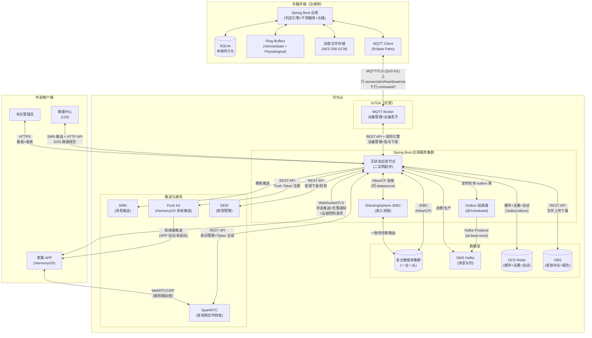

# 车载安全监测系统 基础设施/适配器层 OOD 设计方案（a_v1 / v2）

> 本文档为「智能物联——基于多传感器融合的车载安全监测系统」的**基础设施/适配器层**架构级 OOD 设计方案，承接领域层 OOD（`docs/ood_domain.md`）与应用层 OOD（`docs/ood_application.md`）。基础设施层的核心使命是：实现领域层声明的仓储接口、领域端口、事件总线契约，提供数据持久化、外部系统集成、云服务适配和安全隐私基础设施。
>
> 后端技术栈：**Java Spring Boot**，部署于**华为云**。数据库为**金仓**（兼容 PostgreSQL 协议，JPA 方言 `PostgreSQLDialect`），消息队列为**华为云 DMS Kafka**，设备接入通过**华为云 IoTDA**（MQTT），推送服务为**华为云 SMN** + Push Kit，音视频服务为**华为云 SparkRTC**，密钥管理为**华为云 DEW**。
>
> **统一主键策略**：所有聚合根表（`trip`、`driver`、`vehicle`、`system_account`、`road_rage_voice_record`）及独立实体表（`safety_alert_event`、`driver_health_profile`）的主键均采用**应用层生成 UUID**（`java.util.UUID.randomUUID().toString()`），在仓储 `save()` 调用前由领域服务或应用服务生成并赋值。理由：(a) 分布式无冲突生成——云边独立创建聚合后各自生成 UUID，同步时无主键碰撞风险，无需中心化序列分配；(b) 分片友好——UUID 不含单调递增语义，对 ShardingSphere-JDBC 一致性哈希分片无热点效应；(c) 数据库无关——不依赖数据库自增序列或 UUID 函数，边缘侧 SQLite 与云端金仓统一使用应用层生成逻辑。非聚合根的关联表（如 `guardianship`、`trip_physiological_snapshot`）主键同样采用应用层生成 UUID。

---

## 一、概述

### 设计目标

基础设施层的核心使命是：

- **实现领域契约**：为领域层声明的全部仓储接口、领域端口和事件总线契约提供面向生产环境的具体实现，将设计级的抽象契约落实为可运行的软件组件。
- **屏蔽技术细节**：将金仓数据库的 JPA 映射、华为云 DMS Kafka 的消息投递、IoTDA 的设备连接管理等技术细节封装在本层内部，上层（领域层、应用层）仅依赖接口契约，不感知具体技术选型。
- **保证数据一致性**：通过乐观锁版本号、outbox 事务性事件表和幂等去重机制，确保聚合根持久化、领域事件发布、CQRS 读模型投影之间的数据一致性。
- **支持云边协同**：为边缘侧和云端侧分别提供适合各自运行环境的实现——边缘侧以进程内同步调用和本地持久化为主，云端侧以数据库集群、消息队列和水平扩展为主。
- **内建安全隐私**：在基础设施层实现数据脱敏校验、AES-256-GCM 加密存储、二次身份验证集成等安全隐私机制，使上层无需背负加密算法和认证协议细节。

### 核心抽象层次

基础设施层在分层架构中的位置：

```
┌────────────────────────────────────────────────────────────┐
│            应用层（ood_application.md）                     │
│   六份 interface 契约 + 六份 class 实现                      │
└──────────┬───────────────────────────────────┬─────────────┘
           │ 编排调用                           │ 依赖注入
┌──────────▼───────────────────────────────────▼─────────────┐
│            领域层（ood_domain.md）                          │
│   领域服务 / 聚合根 / 仓储接口 / 端口接口 / 事件总线契约     │
└──────────┬───────────────────────────────────┬─────────────┘
           │ 接口声明                           │ 依赖注入
┌──────────▼───────────────────────────────────▼─────────────┐
│        基础设施/适配器层（本文档范围）                       │
│   仓储实现 / 端口适配器 / 事件总线实现 / 云服务适配          │
│   持久化映射 / 消息队列 / 安全加密 / MQTT 连接               │
└────────────────────────────────────────────────────────────┘
```

### 与领域层、应用层的职责边界

| 职责 | 归属层 | 说明 |
|------|--------|------|
| 仓储接口声明 | 领域层 | 以 Java `interface` 定义 |
| 仓储 JPA 实现 | 基础设施层 | 以 `@Repository` 标注，实现领域层仓储接口 |
| 端口接口声明 | 领域层 | VehicleStateBuffer、NotificationPort 等 |
| 端口适配器实现 | 基础设施层 | Ring buffer、SMN 客户端、IoTDA 连接器等 |
| 事件总线契约 | 领域层 | `publish` / `registerSyncHandler` 等 |
| 事件总线实现 | 基础设施层 | 边缘侧 Spring Event + 云端 Outbox + DMS Kafka |
| 聚合根持久化映射 | 基础设施层 | JPA `@Entity`、`@Embeddable` 注解 |
| 数据库连接池/分片 | 基础设施层 | HikariCP + ShardingSphere-JDBC |
| 安全加密/脱敏实现 | 基础设施层 | AES-256-GCM、华为云 DEW 集成 |

---

## 二、模块划分

### 2.1 模块一览

基础设施层按职责领域拆分为以下模块，各模块仅实现领域层声明的接口契约，模块间依赖方向为单向。

| 模块 | 职责 | 依赖的领域层契约 | 部署位置 |
|------|------|-----------------|:---:|
| `infra.persistence` | 聚合根 JPA 映射（Entity / Embeddable）、数据库表结构管理（Flyway/Liquibase 迁移）、乐观锁版本号管理 | 五份仓储接口 + VO 值对象定义 | 云端 |
| `infra.repository` | 仓储接口的 JPA 实现，含 Spring Data JPA `JpaRepository` 继承、自定义 JPQL/原生 SQL、EntityManager 复杂查询、乐观锁冲突重试 | 五份仓储接口 + CQRS 投影定义 | 云端 + 边缘 |
| `infra.eventbus` | 领域事件总线实现：边缘侧 Spring ApplicationEventPublisher + @EventListener 同步回调、云端 outbox 事务性写入 + DMS Kafka 投递、死信队列 | 领域事件总线契约（§3.6） | 云端 + 边缘 |
| `infra.messaging` | 消息队列连接管理：DMS Kafka 生产者/消费者配置、topic 管理、消费者组注册、消息序列化/反序列化、幂等去重缓存 | 无（纯基础设施） | 云端 |
| `infra.adapter` | 领域端口的适配器实现：VehicleStateBuffer ring buffer、PhysiologicalDataBuffer ring buffer、DrivingBehaviorTrackingPort 加速度监测回调、CameraOcclusionDetectionPort 遮挡检测回调、OTADeliveryPort IoTDA 下发、NotificationPort SMN 推送、RescueReportPort HTTP/SMN 投递、MediaSessionPort SparkRTC 集成 | 8 个领域端口接口 | 云端 + 边缘 |
| `infra.cloud` | 华为云服务适配：IoTDA MQTT 设备连接与设备影子管理、金仓数据库连接配置与分片策略、SMN 消息模板与路由、SparkRTC 房间与 Token 管理、DEW 密钥管理、Push Kit 推送集成、OBS 对象存储 | 无（纯基础设施） | 云端 |
| `infra.security` | 安全与隐私基础设施：AES-256-GCM 加密/解密、DEW 密钥下发/轮转、二次身份验证集成（华为云人机验证 + HarmonyOS 生物特征 API + SMS 验证码）、数据脱敏校验门控 | CameraOcclusionDetectionPort（解密端） | 云端 + 边缘 |
| `infra.edge` | 边缘侧专用基础设施：SQLite 本地持久化、断网数据缓冲与批量重传、MQTT 客户端管理、边缘-云端数据同步与幂等去重、本地加密文件存储 | 五份仓储接口（边缘实现）+ MQTT 下行 Topic | 边缘 |

### 2.2 依赖原则

- 基础设施层各模块**仅依赖领域层声明的接口契约**，不依赖领域层的具体实现类（领域服务、聚合根内部逻辑）。
- 基础设施层模块间允许单向调用：`infra.repository` 可依赖 `infra.persistence`；`infra.eventbus` 可依赖 `infra.messaging`；`infra.adapter` 可依赖 `infra.cloud` 和 `infra.security`。
- 基础设施层**禁止**向上依赖应用层（如直接注入应用服务实例）。
- 模块与部署位置的对应关系：除 `infra.edge` 仅在边缘侧部署、`infra.persistence` 仅在云端部署外，其余模块在两侧均有部署（但具体实现组件可能不同，如事件总线在边缘侧使用 Spring ApplicationEventPublisher、在云端使用 outbox + DMS Kafka）。

---

## 三、核心抽象

### 3.1 数据持久化映射

#### 3.1.1 聚合根表结构

基于领域层定义的五个聚合根，设计以下数据库表（金仓/PostgreSQL 类型）：

**AR-01 Trip 表（`trip`）**

| 职责 | 对应字段 | 列类型 | 约束 | 说明 |
|------|---------|--------|------|------|
| 唯一标识 | `trip_id` | `VARCHAR(64)` | PK, NOT NULL | 对应 TripId 值对象 |
| 乐观锁版本号 | `version` | `INTEGER` | NOT NULL, DEFAULT 0 | JPA `@Version`，并发控制 |
| 驾驶员引用 | `driver_id` | `VARCHAR(64)` | NOT NULL, FK→driver | 聚合间标识引用 |
| 车辆引用 | `vehicle_id` | `VARCHAR(64)` | NOT NULL, FK→vehicle | 聚合间标识引用 |
| 行程时间 | `started_at` | `TIMESTAMP` | NOT NULL | 点火时刻 |
| 行程时间 | `ended_at` | `TIMESTAMP` | NULL | 熄火时刻，NULL 表示行程进行中 |
| 行程评分 | `score_value` | `INTEGER` | NULL | VO-05 TripScore，范围 [0,100] |
| 行程评分 | `score_calculated_at` | `TIMESTAMP` | NULL | 评分计算时间 |
| 创建/更新 | `created_at` | `TIMESTAMP` | NOT NULL, DEFAULT NOW() | |
| 创建/更新 | `updated_at` | `TIMESTAMP` | NOT NULL, DEFAULT NOW() | |

**索引设计**：
- 主键索引：`(trip_id)`
- 驾驶员查询索引：`(driver_id, started_at DESC)` — 按驾驶员 + 时间范围查询行程列表（报告生成场景）
- 车辆查询索引：`(vehicle_id, started_at DESC)` — 按车辆查询行程列表

**AR-02 Driver 表（`driver`）**

| 职责 | 对应字段 | 列类型 | 约束 | 说明 |
|------|---------|--------|------|------|
| 唯一标识 | `driver_id` | `VARCHAR(64)` | PK, NOT NULL | 对应 DriverId |
| 乐观锁版本号 | `version` | `INTEGER` | NOT NULL, DEFAULT 0 | |
| 姓名 | `name` | `VARCHAR(128)` | NOT NULL | |
| 综合风险评分 | `comprehensive_score` | `INTEGER` | NULL | VO-22，范围 [0,100] |
| 脱敏特征向量 | `face_feature_vector` | `JSONB` | NULL | 仅存脱敏后的数值特征 |
| 创建/更新 | `created_at` / `updated_at` | `TIMESTAMP` | NOT NULL | |

**索引设计**：
- 主键索引：`(driver_id)`

**AR-03 Vehicle 表（`vehicle`）**

| 职责 | 对应字段 | 列类型 | 约束 | 说明 |
|------|---------|--------|------|------|
| 唯一标识 | `vehicle_id` | `VARCHAR(64)` | PK, NOT NULL | 对应 VehicleId |
| 乐观锁版本号 | `version` | `INTEGER` | NOT NULL, DEFAULT 0 | |
| 车牌号 | `license_plate` | `VARCHAR(32)` | NOT NULL, UNIQUE | |
| 车架号 | `vin` | `VARCHAR(64)` | NOT NULL, UNIQUE | |
| 终端序列号 | `terminal_sn` | `VARCHAR(64)` | NOT NULL, UNIQUE | IoTDA 设备 ID |
| 所属车队 | `fleet_id` | `VARCHAR(64)` | NOT NULL | 车辆所属车队的标识，供看板投影按车队聚合查询 |
| 固件版本 | `firmware_version` | `VARCHAR(64)` | NULL | VO-08 OTAVersion |
| 传感器自检状态 | `sensor_status` | `JSONB` | NULL | VO-06 SensorStatus，各传感器通道健康状态 |
| 脱线标记 | `offline_since` | `TIMESTAMP` | NULL | NULL 表示在线 |
| 创建/更新 | `created_at` / `updated_at` | `TIMESTAMP` | NOT NULL | |

**索引设计**：
- 主键索引：`(vehicle_id)`
- 终端序列号索引：`(terminal_sn)` — IoTDA 设备反向查找
- 车队索引：`(fleet_id)` — 看板投影按车队聚合查询
- 车牌号索引：`(license_plate)` — 运维查询

**AR-04 SystemAccount 表（`system_account`）**

| 职责 | 对应字段 | 列类型 | 约束 | 说明 |
|------|---------|--------|------|------|
| 唯一标识 | `account_id` | `VARCHAR(64)` | PK, NOT NULL | |
| 乐观锁版本号 | `version` | `INTEGER` | NOT NULL, DEFAULT 0 | |
| 手机号 | `phone` | `VARCHAR(32)` | NOT NULL, UNIQUE | |
| 角色 | `role` | `VARCHAR(16)` | NOT NULL | VO-14 AccountRole 枚举值 |
| 通知偏好 | `notification_preferences` | `JSONB` | NULL | VO-18，订阅风险等级集合 |
| 创建/更新 | `created_at` / `updated_at` | `TIMESTAMP` | NOT NULL | |

> **权限（VO-07 Permission）与监护关系**：家属对驾驶员的监护关系和权限以独立的关联表 `guardianship` 承载（非嵌入 SystemAccount 聚合），见 §3.1.2。

**索引设计**：
- 主键索引：`(account_id)`
- 手机号索引：`(phone)` — 登录查询

**AR-05 RoadRageVoiceRecord 表（`road_rage_voice_record`）**

| 职责 | 对应字段 | 列类型 | 约束 | 说明 |
|------|---------|--------|------|------|
| 唯一标识 | `record_id` | `VARCHAR(64)` | PK, NOT NULL | |
| 乐观锁版本号 | `version` | `INTEGER` | NOT NULL, DEFAULT 0 | |
| 关联告警 | `alert_id` | `VARCHAR(64)` | NOT NULL, UNIQUE | 1:1 引用 |
| 关联行程 | `trip_id` | `VARCHAR(64)` | NOT NULL | |
| 驾驶员引用 | `driver_id` | `VARCHAR(64)` | NOT NULL | |
| 车辆引用 | `vehicle_id` | `VARCHAR(64)` | NOT NULL | 冗余列，供分片路由使用 |
| 录制时间 | `started_at` / `ended_at` | `TIMESTAMP` | NOT NULL / NULL | ended_at NULL 表示录制进行中 |
| 加密文件引用 | `encrypted_file_path` | `TEXT` | NULL | 边缘侧本地路径 |
| 保留到期时间 | `expiry_time` | `TIMESTAMP` | NOT NULL | |
| 脱敏标记 | `is_sealed` | `BOOLEAN` | NOT NULL, DEFAULT FALSE | 封闭（录制结束）后为 TRUE |
| 创建/更新 | `created_at` / `updated_at` | `TIMESTAMP` | NOT NULL | |

**索引设计**：
- 主键索引：`(record_id)`
- 到期时间索引：`(expiry_time, is_sealed)` — 按到期时间批量查询待清除记录
- 告警引用索引：`(alert_id)` — 按告警 ID 查找存证
- 驾驶员引用索引：`(driver_id)` — 隐私合规审计

#### 3.1.2 实体独立表与关联表结构

**E-01 SafetyAlertEvent 表（`safety_alert_event`）**

SafetyAlertEvent 不是聚合根，但需支持跨行程独立查询（尤其车队管理员查询全队告警历史），因此设计为独立表，通过外键关联 Trip。

| 职责 | 对应字段 | 列类型 | 约束 | 说明 |
|------|---------|--------|------|------|
| 唯一标识 | `alert_id` | `VARCHAR(64)` | PK, NOT NULL | |
| 乐观锁版本号 | `version` | `INTEGER` | NOT NULL, DEFAULT 0 | |
| 关联行程 | `trip_id` | `VARCHAR(64)` | NOT NULL, FK→trip | 写侧通过此 FK 保持事务一致性 |
| 关联驾驶员 | `driver_id` | `VARCHAR(64)` | NOT NULL | 冗余以便独立查询 |
| 关联车辆 | `vehicle_id` | `VARCHAR(64)` | NOT NULL | 冗余以便车队维度查询 |
| 告警类型 | `alert_type` | `VARCHAR(32)` | NOT NULL | VO-02 AlertType 枚举值 |
| 风险等级 | `risk_level` | `VARCHAR(16)` | NOT NULL | VO-01 RiskLevel 枚举值 |
| 发生时间 | `occurred_at` | `TIMESTAMP` | NOT NULL | |
| 解析时间 | `resolved_at` | `TIMESTAMP` | NULL | 风险解除时间（如有） |
| 位置信息 | `gps_latitude` / `gps_longitude` | `DOUBLE PRECISION` | NULL | VO-04 GeoLocation |
| 特征快照 | `feature_snapshot` | `JSONB` | NULL | 异常特征摘要 |
| 创建时间 | `created_at` | `TIMESTAMP` | NOT NULL | |

**外键关系**：
- `trip_id` → `trip(trip_id)`：写侧通过 Trip 聚合根边界保证一致性
- `driver_id` → `driver(driver_id)`：冗余引用供读侧独立查询

**查询策略**：
- **读侧**：跨行程/跨驾驶员的告警历史查询、看板聚合和钻取均通过 CQRS 投影表（`alert_projection`）完成，不穿透 Trip 聚合根加载 SafetyAlertEvent 列表。查询请求直接路由至投影表，保证读模型查询性能。
- **写侧**：AlertPersistenceService 通过 TripRepository 加载 Trip 聚合、创建 SafetyAlertEvent 实体并持久化——写操作经 Trip 聚合根边界以保证事务一致性。

**索引设计**：
- 主键索引：`(alert_id)`
- Trip 关联索引：`(trip_id)` — 通过 Trip 聚合加载告警列表

> **索引策略说明**：读查询全部路由至 `alert_projection` 投影表（见 §3.2.3），主表仅承担写侧持久化和通过 `(trip_id)` 加载 Trip 聚合下属告警列表的职责。因此主表不再建立面向读侧查询的复合索引（如 `(driver_id, occurred_at DESC, alert_type, risk_level)` 和 `(vehicle_id, occurred_at DESC)`），避免索引维护拖累写性能。读侧所需的此类索引限定于 `alert_projection` 投影表。

**E-03 DriverHealthProfile 表（`driver_health_profile`）**

DriverHealthProfile 是 Driver 聚合内部的 1:1 实体，以独立表存储但通过 FK 关联 Driver 表。

| 职责 | 对应字段 | 列类型 | 约束 | 说明 |
|------|---------|--------|------|------|
| 唯一标识 | `driver_id` | `VARCHAR(64)` | PK, NOT NULL, FK→driver | 共享 Driver 主键，JPA `@OneToOne` + `@MapsId` 映射，1:1 关系 |
| 血型 | `blood_type` | `VARCHAR(8)` | NULL | |
| 过敏史 | `allergy_history` | `TEXT` | NULL | |
| 慢性病史 | `chronic_history` | `TEXT` | NULL | |
| 用药史 | `medication_history` | `TEXT` | NULL | |
| 基础生命体征 | `baseline_vitals` | `JSONB` | NULL | 静息心率、血压等 |
| 紧急联系人 | `emergency_contact` | `JSONB` | NULL | 姓名、手机号 |
| 创建/更新 | `created_at` / `updated_at` | `TIMESTAMP` | NOT NULL | |

**索引设计**：
- 主键索引：`(driver_id)` — 共享 Driver 主键，1:1 关系，同时也是 FK→driver 的外键索引

**关联表：监护关系（`guardianship`）**

Driver 与 SystemAccount（家属角色）之间的多对多监护关系以独立关联表承载。

| 职责 | 对应字段 | 列类型 | 约束 | 说明 |
|------|---------|--------|------|------|
| 驾驶员引用 | `driver_id` | `VARCHAR(64)` | NOT NULL, FK→driver | |
| 账户引用 | `account_id` | `VARCHAR(64)` | NOT NULL, FK→system_account | |
| 权限范围 | `permissions` | `JSONB` | NOT NULL | VO-07 Permission 值对象 |
| 授权时间 | `granted_at` | `TIMESTAMP` | NOT NULL | |
| 授权原因 | `grant_reason` | `VARCHAR(32)` | NOT NULL | 常规/高危/遮挡恢复 |
| 撤销时间 | `revoked_at` | `TIMESTAMP` | NULL | NULL 表示权限有效 |

**复合主键**：`(driver_id, account_id)`

**关联表：OTA 升级状态（`ota_upgrade_status`）**

VO-19 OTAUpgradeStatus 是 Vehicle 聚合内部的值对象，因其具有独立的状态生命周期和追溯需求，设计为 Vehicle 表的嵌入字段组（非独立表）以利用值对象替换模式进行不可变更新：

| 嵌入字段 | 列类型 | 约束 | 说明 |
|---------|--------|------|------|
| `ota_stage` | `VARCHAR(16)` | NULL | UpgradeStage 枚举，NULL=无升级 |
| `ota_target_version` | `VARCHAR(64)` | NULL | 目标固件版本 |
| `ota_transferred_bytes` | `BIGINT` | NULL, DEFAULT 0 | 断点续传偏移量 |
| `ota_total_bytes` | `BIGINT` | NULL | 升级包总大小 |
| `ota_stage_entered_at` | `TIMESTAMP` | NULL | 进入当前阶段的时刻 |

> **值对象嵌入策略说明**：OTAUpgradeStatus 与 Vehicle 是 1:1 的强包含关系——一个 Vehicle 同一时刻至多存在一个活跃的升级状态，生命周期完全依附于 Vehicle 聚合，无独立查询需求。因此采用嵌入 Vehicle 表（`@Embeddable` + `@Embedded`）策略，避免不必要的关联表 JOIN。状态推进由 DS-15 以不可变替换模式更新 Vehicle 聚合。

#### 3.1.3 值对象嵌入映射策略

领域层定义的 22 个值对象的 JPA 映射策略分为以下三类：

**策略 A：嵌入聚合根表（`@Embeddable` + `@Embedded`）**

适用于与聚合根 1:1 强包含、无独立查询需求的值对象：

| 值对象 | 宿主聚合根表 | 映射方式 | 说明 |
|--------|:---:|------|------|
| VO-05 TripScore | `trip` | 嵌入列字段（`score_value` + `score_calculated_at`） | 行程评分是 Trip 的持久化属性 |
| VO-04 GeoLocation | `safety_alert_event` | 嵌入列字段（`gps_latitude` + `gps_longitude`） | 告警定位 |
| VO-07 Permission | `guardianship` | JSONB 嵌入 | 监护权限集合 |
| VO-14 AccountRole | `system_account` | 嵌入列字段（`role` VARCHAR） | 角色枚举 |
| VO-18 NotificationPreference | `system_account` | JSONB 嵌入 | 通知偏好集合 |
| VO-19 OTAUpgradeStatus | `vehicle` | 嵌入列字段组 | 详见上表 |
| VO-22 DriverComprehensiveScore | `driver` | 嵌入列字段（`comprehensive_score` INTEGER） | 综合评分 |
| VO-16 DrivingBehaviorCounters | `trip` | 嵌入列字段（`hard_braking_count` + `hard_acceleration_count` INTEGER） | 两个计数字段嵌入 Trip 表 |
| VO-17 L3DurationTracker | `trip` | 嵌入列字段（`l3_started_at` + `l3_accumulated_seconds` + `l3_active` BOOLEAN） | Trip:Driver=1:1，至多一个活跃 Tracker，独立嵌入列字段（`@Embedded`），非集合 |

**策略 B：集合嵌入聚合根表（`@ElementCollection` + `@CollectionTable`）**

适用于被聚合根持有为集合、无独立标识的值对象：

| 值对象 | 宿主聚合根 | 映射方式 | 说明 |
|--------|:---:|------|------|
| VO-03 PhysiologicalSnapshot | Trip | `@ElementCollection` → 独立关联表 `trip_physiological_snapshot`（trip_id + timestamp 复合主键） | Trip 聚合持有多个快照，新增即追加 |

> **PhysiologicalSnapshot 集合映射特别说明**：Trip 持有 PhysiologicalSnapshot 的不可变集合，新增即追加。JPA 以 `@ElementCollection` 映射至独立的 `trip_physiological_snapshot` 表。该表随 Trip 聚合的 save() 操作一同持久化（级联）。查询时随 Trip 聚合整体加载，不支持仅查询部分快照列表（如仅查最近 5 条）——此类读优化需求通过 trajectory_projection 投影表满足。
> 
> **@ElementCollection 优化触发条件**：当单次行程的 PhysiologicalSnapshot 累积数量超过 500 条时（对应于 100ms 采样率下约 50 秒行程，或 500ms 采样率下约 4 分钟行程），触发优化方案——后续新增的快照不再通过 @ElementCollection 级联写入 Trip 聚合，改为仅写入 trajectory_projection 投影表。行程时间轴线上的快照数据以投影表为唯一查询入口，Trip 聚合的 @ElementCollection 集合在超阈值后标记为"已截断"并冻结不再追加。此阈值在 Spring 配置中可调（`trip.physiological-snapshot.max-collection-size`）。

**策略 C：单列映射的值对象/枚举（无需 `@Embeddable`）**

适用于以单一 VARCHAR/JSONB 列持久化、但因结构简单而无需定义为独立 `@Embeddable` 类的值对象/枚举：

| 值对象 | 持久化方式 | 所在表 | 说明 |
|--------|-----------|--------|------|
| VO-01 RiskLevel | VARCHAR(16) 列 | `safety_alert_event` | 风险等级枚举值 |
| VO-02 AlertType | VARCHAR(32) 列 | `safety_alert_event` | 告警类型枚举值 |
| VO-06 SensorStatus | JSONB 列 | `vehicle` | 传感器自检状态，JSONB 提供各通道健康状态的灵活结构 |
| VO-08 OTAVersion | VARCHAR(64) 列 | `vehicle`（`firmware_version`） | 固件版本号 |

**策略 D：不持久化的值对象（瞬时/派生）**

适用于仅在内存中承载瞬时数据、不入数据库的值对象：

| 值对象 | 说明 |
|--------|------|
| VO-09 VehicleStateSnapshot | 瞬时值对象，仅在 ring buffer 内存中存在，不入库 |
| VO-10 TimeRange | 查询参数值对象，不入库 |
| VO-11 SensorReading | 瞬时值对象，不入库 |
| VO-12 InterventionInstruction | 瞬时值对象，不入库 |
| VO-13 RescueReport | 瞬时值对象，不入库 |
| VO-15 DriverStatusSnapshot | 瞬时遥测快照，不入库（仅推送） |
| VO-20 DetectionWindow | 瞬时会话状态，不入库 |
| VO-21 OverrideSignal | 瞬时信号，不入库 |
| VO-23 RescueAuthorizationToken | 瞬时凭证，不入库 |

#### 3.1.4 乐观锁版本号统一规范

所有需要并发控制的表统一使用乐观锁版本号字段：

- **字段名**：`version`，类型 `INTEGER`，默认值 `0`
- **JPA 实现**：在聚合根 Entity 类中以 `@Version` 注解标注该字段，JPA 在每次 `save()` 时自动执行 `UPDATE ... SET version = version + 1 WHERE id = ? AND version = ?`。若受影响行数为 0，Hibernate/JPA 抛出 `OptimisticLockException`。
- **冲突处理**：仓储实现层捕获 `OptimisticLockException`，将其转换为领域层声明的 `PersistenceException.OptimisticLockConflict`，由调用方领域服务按场景决定重试或降级（见 §3.2.4）。
- **不适用场景**：DriverHealthProfile（E-03）嵌入 Driver 聚合，其乐观锁由 Driver 表统一管理；监护关系关联表（guardianship）以复合主键 `(driver_id, account_id)` 驱动权限值对象（VO-07 Permission）的不可变替换模式——权限变更以整行 DELETE + INSERT 实现（`REVOKED` 为状态标记而非物理删除），并发冲突由数据库 UNIQUE 约束兜底，无需乐观锁版本号。在并发较低（少量管理员操作）的场景下 last-write-wins 可接受。撤销优先于授予的安全语义通过应用层 DS-08 PermissionService 在执行权限写操作前先加 SystemAccount 聚合的显式行锁（SELECT ... FOR UPDATE on system_account）实现完全串行化，而非依赖乐观锁；SafetyAlertEvent 为只追加不修改实体，理论上无并发写冲突，但仍保留乐观锁以防御运维操作。

**边缘侧 JDBC 层乐观锁实现**：

边缘侧使用 JDBC 直连 SQLite，无 JPA `@Version` 机制。各仓储的 JDBC 实现在执行 UPDATE 时手动构造带版本号条件的 SQL：

```sql
UPDATE {table} SET ..., version = version + 1
WHERE id = ? AND version = ?
```

执行后检查 JDBC `PreparedStatement.executeUpdate()` 返回的受影响行数——若为 0，说明版本号不匹配（已有并发修改），仓储实现抛出 `PersistenceException.OptimisticLockConflict`，与云端 JPA 实现保持相同的异常语义。此方案适用于所有需要乐观锁的边缘侧表（Trip、SafetyAlertEvent、RoadRageVoiceRecord）。边缘侧 Driver 和 Vehicle 表在边缘侧为只读缓存（从云端同步），不需要乐观锁。

#### 3.1.5 金仓数据库分库分表策略

- **分片键**：`vehicle_id`（分片列）
- **分片算法**：ShardingSphere-JDBC **一致性哈希分片算法**（`CONSISTENT_HASH`），基于 `vehicle_id` 的哈希值进行虚拟节点路由。一致性哈希在增减分片节点时仅影响相邻节点的数据，最小化数据迁移量，支持 §3.5.2 所述的动态扩容目标
- **分片中间件**：ShardingSphere-JDBC，嵌入应用进程中（非独立代理）
- **分片范围**：
  - **按 VehicleId 分片**：`trip` 表（Trip 归属于 Vehicle）、`trip_physiological_snapshot` 集合表（随 Trip）、`safety_alert_event` 表（关联至 Trip/Vehicle）、`road_rage_voice_record` 表（含冗余 `vehicle_id` 列供分片路由）
  - **全局表（不分片）**：`driver`、`vehicle`、`system_account`、`driver_health_profile`、`guardianship`。这些表记录数相对有限（千级驾驶员/车辆），采用广播表策略（每个分片冗余一份，写操作同步广播至所有分片）
- **分片数量**：初始 4 片（ShardingSphere-JDBC 一致性哈希虚拟节点数 = 4 × 128 = 512），按数据增长动态扩容
- **扩容数据迁移方案**：增加分片节点时，ShardingSphere-JDBC 一致性哈希算法自动将受影响的虚拟节点数据迁移至新节点。迁移采用在线方式——通过 ShardingSphere-JDBC 的 scaling 模块执行增量数据同步：先全量同步存量数据，再增量追平变更，最后切换路由规则。迁移过程中业务读写不受影响（读写均路由至旧分片，切换后统一路由至新拓扑）。迁移完成后旧分片数据保留 7 天作为回滚窗口，确认无异常后手动清理

---

### 3.2 仓储实现

#### 3.2.1 JPA 实现策略总览

| 仓储接口（领域层） | 实现策略 | 核心 JPA 能力 |
|---------|------|------------|
| TripRepository | Spring Data JPA 继承 `JpaRepository<TripEntity, String>`，自定义 `@Query` 方法 | `findById` → `findById`，`save` → `save` + 乐观锁 |
| DriverRepository | 同上，附加 `@Modifying @Query` 轻量更新方法 | `updateScore` → `@Modifying @Query("UPDATE DriverEntity d SET d.comprehensiveScore = :score, d.version = d.version + 1 WHERE d.id = :id AND d.version = :version")` |
| VehicleRepository | 同上，标准 CRUD | `findById` + `save` |
| SystemAccountRepository | 同上，附加自定义查询 | `findByDriver` → `@Query("SELECT a FROM SystemAccountEntity a JOIN a.guardianships g WHERE g.driverId = :driverId")` |
| RoadRageVoiceRecordRepository | 同上，附加自定义查询与删除 | `findByExpiryBefore` → `@Query`，`delete` → `deleteById` |

#### 3.2.2 复杂查询策略

**RoadRageVoiceRecordRepository.findByExpiryBefore（到期存证批量查询）**

- 云端实现：JPQL 查询 `SELECT r FROM RoadRageVoiceRecordEntity r WHERE r.expiryTime < :deadline AND r.isSealed = TRUE`
- 边缘侧实现（SQLite）：由于边缘侧存储为本地文件系统 + SQLite 元数据表，`findByExpiryBefore` 在边缘侧的实现为扫描本地加密文件目录 + SQLite 元数据查询的组合——先通过 SQLite 查询到期记录，再验证文件确实存在且未误操作，最后执行物理删除（含加密文件的磁盘擦除）。边缘侧清除操作需经二次校验（验证文件确实过期且关联告警已封闭），防止误删。

**TripRepository 中按时间范围和 DriverId 查询行程列表**

- JPQL 查询：`SELECT t FROM TripEntity t WHERE t.driverId = :driverId AND t.startedAt >= :from AND t.endedAt <= :to ORDER BY t.startedAt DESC`
- 支持分页（`Pageable`）

**SystemAccountRepository.findByDriver（按驾驶员 ID 查询关联家属列表）**

- JPQL 查询：`SELECT a FROM SystemAccountEntity a JOIN guardianship g ON a.id = g.accountId WHERE g.driverId = :driverId AND g.revokedAt IS NULL`
- 仅返回权限当前有效的家属账户

#### 3.2.2a 边缘侧仓储 JDBC 实现策略

边缘侧以 JDBC 直连 SQLite 实现五份仓储接口，不依赖 JPA。以下说明各仓储在边缘侧的 JDBC 实现要点：

**TripRepository（边缘侧 JDBC 实现）**

- **findById**：`SELECT * FROM trip WHERE trip_id = ?`
- **save（INSERT/UPDATE）**：通过 `INSERT ... ON CONFLICT(trip_id) DO UPDATE SET ...`（SQLite 3.24+ 支持 UPSERT 语法）实现 upsert。若不存在 → INSERT；若存在 → 按版本号条件更新：`UPDATE trip SET ... , version = version + 1 WHERE trip_id = ? AND version = ?`，受影响行数为 0 则抛出 `OptimisticLockConflict`。注意边缘侧不支持 JPA `@ElementCollection`——PhysiologicalSnapshot 集合改为直接写入 `trip_physiological_snapshot` 表，由 JDBC batch INSERT 按批次写入
- **findByDriverAndTimeRange**：`SELECT * FROM trip WHERE driver_id = ? AND started_at >= ? AND (ended_at IS NULL OR ended_at <= ?) ORDER BY started_at DESC`
- **生理快照集合替代方案**：边缘侧不使用 @ElementCollection 级联。PhysiologicalSnapshot 的 JDBC 写入流程为：① 采集组件按固定频率生成 PhysiologicalSnapshot → ② 调用 `tripPhysiologicalSnapshotJdbcTemplate.batchUpdate(...)` 批量 INSERT 至 `trip_physiological_snapshot` 表 → ③ 加载 Trip 时通过 `SELECT * FROM trip_physiological_snapshot WHERE trip_id = ?` 单独查询快照列表。此方式避免 JPA 级联的内存开销，且支持按时间戳范围分页查询（仅查最近 N 条快照）

**DriverRepository（边缘侧 JDBC 实现）**

- 边缘侧的 Driver 数据为**云端驱动的只读缓存**——边缘侧不修改 Driver 聚合。Driver 数据通过 IoTDA MQTT 下行通道从云端同步至边缘侧 SQLite（仅在驾驶员切换或将车辆分配给新驾驶员时触发同步）
- `findById`：`SELECT * FROM driver WHERE driver_id = ?`
- `updateScore`：边缘侧不实现（评分计算在云端执行，结果写回云端 Driver 表）

**VehicleRepository（边缘侧 JDBC 实现）**

- 边缘侧的 Vehicle 数据为**云端驱动的只读缓存**（同 Driver），存储车辆基础信息（终端序列号、固件版本等）
- `findById`：`SELECT * FROM vehicle WHERE vehicle_id = ?`
- `save`：边缘侧不实现（Vehicle 聚合修改仅在云端执行，如 OTA 升级状态推进由云端 DS-15 驱动）

**SystemAccountRepository（边缘侧 JDBC 实现）**

- 边缘侧的 SystemAccount 数据为**云端驱动的只读缓存**——仅在权限变更事件（FamilyAccessGrantedEvent / FamilyAccessRevokedEvent）到达边缘侧时，由消费方同步更新本地缓存。缓存内容为 `account_id`、`role`、`notification_preferences` 及当前有效的 guardianship 权限
- `findByDriver`：`SELECT a.* FROM system_account a JOIN guardianship g ON a.account_id = g.account_id WHERE g.driver_id = ? AND g.revoked_at IS NULL`
- `save`：边缘侧仅在收到云端事件时执行本地缓存更新（upsert），不独立修改 SystemAccount

**RoadRageVoiceRecordRepository（边缘侧 JDBC 实现）**

- 已在 §3.2.2 首段描述。补充说明：`save` 操作同样使用版本号条件 UPDATE 实现乐观锁。边缘侧 `delete` 需先校验文件存在后执行 `DELETE FROM road_rage_voice_record WHERE record_id = ?` + 加密文件物理擦除

> **边缘侧仓储设计原则**：边缘侧只写 `trip`、`safety_alert_event`、`road_rage_voice_record` 三张表（当前活跃行程相关数据）。`driver`、`vehicle`、`system_account` 三张表为云端驱动的只读缓存，通过 MQTT/事件同步更新。边缘侧不部署 JPA——所有仓储实现基于 JDBC `JdbcTemplate` + SQLite，手动管理乐观锁版本号、SQL 语句和对象映射。此设计避免在资源受限的边缘设备上引入 Hibernate 框架开销。

#### 3.2.3 CQRS 读模型投影表设计

以下是三张 CQRS 投影表的字段设计与数据同步策略。投影表在数据库中独立存在，不参与领域层的聚合根事务边界。写侧由 AlertPersistenceService、ScoringService 等产出领域事件后，由投影同步器异步写入投影表。

**投影表 P1：alert_projection（告警历史查询投影表）**

| 字段 | 类型 | 说明 |
|------|------|------|
| `alert_id` | `VARCHAR(64)` PK | 与 SafetyAlertEvent 主键一致 |
| `driver_id` | `VARCHAR(64)` NOT NULL | |
| `vehicle_id` | `VARCHAR(64)` NOT NULL | |
| `trip_id` | `VARCHAR(64)` NOT NULL | |
| `alert_type` | `VARCHAR(32)` NOT NULL | |
| `risk_level` | `VARCHAR(16)` NOT NULL | |
| `occurred_at` | `TIMESTAMP` NOT NULL | |
| `resolved_at` | `TIMESTAMP` NULL | |
| `gps_latitude` / `gps_longitude` | `DOUBLE PRECISION` NULL | |
| `driver_name` | `VARCHAR(128)` NOT NULL | 冗余展示字段 |
| `license_plate` | `VARCHAR(32)` NOT NULL | 冗余展示字段 |

**索引**：
- 复合查询索引：`(driver_id, occurred_at DESC, alert_type, risk_level)` — 支持多条件过滤
- 车辆查询索引：`(vehicle_id, occurred_at DESC)`
- 时间范围索引：`(occurred_at DESC)`

**数据同步机制**：采用**应用层事件驱动异步写入**。AlertPersistenceService 创建 SafetyAlertEvent 后发出 `AlertTriggeredEvent`，投影同步器订阅该事件，将告警摘要（含冗余的驾驶员姓名和车牌号）异步写入 `alert_projection` 表。同步延迟 SLO ≤ 3s（P99）。同步失败（如投影表写入异常）时记录失败日志并在下一轮事件同步中重试，不阻塞主告警链路。选择应用层异步而非数据库层触发器的理由：触发器对 DDL 变更敏感，升级维护困难；应用层异步写入允许灵活的同步失败重试和延迟监控。

**投影表 P2：fleet_dashboard_projection（看板聚合查询投影表）**

| 字段 | 类型 | 说明 |
|------|------|------|
| `fleet_id` | `VARCHAR(64)` | 车队标识 |
| `risk_level` | `VARCHAR(16)` | 风险等级 |
| `alert_type` | `VARCHAR(32)` | 告警类型 |
| `driver_count` | `INTEGER` | 该等级/类型下的驾驶员数量 |
| `heatmap_data` | `JSONB` | 热力图坐标序列（GeoJSON） |
| `refreshed_at` | `TIMESTAMP` NOT NULL | 投影刷新时间 |

**缓存/物化视图策略**：看板投影表本身即为计算结果表。刷新策略为每 5 分钟定时刷新——由基础设施层 Scheduled Task 每 5 分钟触发一次聚合查询：以 `fleet_id` 为聚合维度，JOIN `vehicle` 表获取车辆→车队的归属映射（`vehicle.fleet_id`），再 JOIN `safety_alert_event`、`trip` 等表按车队分组聚合告警数和热力图坐标，将结果覆盖写入 `fleet_dashboard_projection` 表。Vehicle 表中有 `fleet_id VARCHAR(64) NOT NULL` 列维护车辆与车队的归属关系。同时，应用层 IFleetManagementService 维护 Redis 缓存层——缓存 TTL 5 分钟，与投影刷新周期对齐。事件驱动的缓存失效机制：当 AlertTriggeredEvent（含 RiskLevel=L3）到达时，通过 Vehicle 表获取该车辆对应的 `fleet_id`，主动失效对应车队的 Redis 缓存条目，下次查询即触发即时重算。

**投影表 P3：trajectory_projection（轨迹点查询投影表）**

| 字段 | 类型 | 说明 |
|------|------|------|
| `trajectory_id` | `BIGSERIAL` PK | 自增主键 |
| `trip_id` | `VARCHAR(64)` NOT NULL | |
| `vehicle_id` | `VARCHAR(64)` NOT NULL | 冗余以供按车辆查询 |
| `driver_id` | `VARCHAR(64)` NOT NULL | 冗余以供按驾驶员查询 |
| `timestamp` | `TIMESTAMP` NOT NULL | 轨迹点时间戳 |
| `gps_latitude` | `DOUBLE PRECISION` NOT NULL | |
| `gps_longitude` | `DOUBLE PRECISION` NOT NULL | |
| `speed` | `DOUBLE PRECISION` NULL | 车速 (km/h) |

**索引**：
- 车辆查询索引：`(vehicle_id, timestamp)` — 按车辆 + 时间范围查询
- 驾驶员查询索引：`(driver_id, timestamp)` — 按驾驶员 + 时间范围查询
- Trip 查询索引：`(trip_id, timestamp)` — 按行程查询轨迹点序列

**数据同步机制**：边缘侧按固定间隔（如每 10 秒）将 Trip 的最新 GPS 位置通过 MQTT 上报云端，云端投影同步器消费 GPS 位置数据后写入 `trajectory_projection` 表。不同于 alert_projection 的"事件驱动"模式——轨迹点为高频遥测，体量大，不适合通过领域事件逐点触发。而是采用**批量写入**策略：云端接收 GPS 数据后在内存中缓冲至一定阈值或时间窗，再批量 INSERT 至投影表。

#### 3.2.4 乐观锁冲突的重试策略

仓储层在发生乐观锁冲突时（`OptimisticLockException`），向上抛出 `PersistenceException.OptimisticLockConflict`。不同业务场景的重试策略如下：

| 场景 | 重试策略 | 仓储层支持 |
|------|---------|-----------|
| 评分计算（DS-09 写回 TripScore） | 指数退避重试（50ms → 100ms → 200ms），最多 3 次 | 仓储层不封装重试，由领域服务 DS-09 捕获冲突后自行重试 |
| OTA 升级状态推进（DS-15） | 在重试上限内（5 次）按固定间隔（100ms）重试 | 同上，由 DS-15 在调用 VehicleRepository.save 时处理 |
| 传感器自检状态更新（DS-14） | 立即重试一次（间隔 0ms） | 同上，由 DS-14 处理 |
| 家属权限授予/撤销（DS-08） | 不重试，直接返回失败——权限变更以最后一次成功写入为准 | 领域层不重试 |
| 告警持久化（DS-19） | 不重试，记录错误日志——告警事件为只追加，理论上无冲突 | 领域层不重试 |

> **仓储层设计原则**：仓储层保持纯粹——仅负责持久化操作和冲突检测，不封装业务重试逻辑。重试策略的具体间隔、次数和退避算法由领域服务根据业务场景自行决定，仓储层仅忠实返回冲突信号。这样设计保持仓储层的可测试性和可替换性。

---

### 3.3 领域事件基础设施

#### 3.3.1 事件总线实现方案

基础设施层为领域事件总线契约（领域层 §3.6）提供两套实现，分别对应边缘侧和云端侧：

**边缘侧实现：进程内同步 EventBus**

- **底层机制**：基于 Spring Framework 的 `ApplicationEventPublisher` + `@EventListener` 注解实现。
- **行为语义**：`publish(event)` 在边缘侧同步执行——在 publish 返回前，所有通过 `registerSyncHandler` 注册的消费方（InterventionService、PermissionService、AlertPersistenceService 等）已在同一线程中同步执行完毕。
- **同步回调保证**：安全攸关的 RiskDeterminedEvent → InterventionService 的判定→干预链路在进程内同步完成，满足 ≤500ms 端到端时延（分心 ≤0.5s）。
- **注册方式**：
  - **声明式注册**：消费方在 `@Component` 标注的类中通过 `@EventListener` 注解标注消费方法，Spring 在 IoC 容器初始化时自动注册。
  - **编程式注册**：通过 EventBus 契约的 `registerSyncHandler(eventTypeName, handler)` 方法编程式注册（用于动态注册场景）。底层维护一个 `ConcurrentHashMap<String, List<Consumer<DomainEvent>>>` 的 handler 注册表。
- **错误隔离**：单个 handler 内部异常不阻断其他 handler 的执行——事件总线捕获异常并记录日志，但不向 publish 调用方传播。

**云端侧实现：Outbox 事务性事件表 + DMS Kafka 异步投递**

- **核心组件**：
  - **OutboxPersister**：负责在聚合根状态更新事务中同步写入事件至 `domain_event_outbox` 表。通过 Spring 的 `@TransactionalEventListener(phase = TransactionPhase.BEFORE_COMMIT)` 或直接在 Application Service 的事务方法中调用 `outboxPersister.persist(event)` 实现——事件写入与聚合根保存在同一数据库事务中提交。
  - **OutboxRelayer**（独立线程）：Spring `@Scheduled` 定时任务，以 1s 固定间隔轮询 `domain_event_outbox` 表中 `published = FALSE` 且已过退避等待期的记录，按 `last_attempt_at ASC NULLS FIRST` 排序获取待投递事件，投递至 DMS Kafka 对应 topic。投递成功后标记 `published = TRUE`。
  - **DeadLetterHandler**：将超过最大重试次数的事件移入 `domain_event_dlq` 表，通过 SMN 推送告警通知运维人员，或按计划批量回放。
- **投递保证级别**：at-least-once——outbox 投递器保证每条已持久化的事件至少被投递一次。消费方须基于 `event_id` 实现幂等去重。
- **事务边界**：outbox 表与聚合根状态更新在同一数据库事务中提交——若事务回滚，outbox 记录也不对外可见，保证"状态变更"与"事件已发布"的一致性。

#### 3.3.2 事件持久化表结构（`domain_event_outbox`）

| 字段 | 列类型 | 约束 | 索引角色 |
|------|--------|------|---------|
| `event_id` | `UUID` | PK, NOT NULL | 幂等去重键 |
| `event_type` | `VARCHAR(128)` | NOT NULL | 事件类型判别符（如 `RiskDeterminedEvent`） |
| `aggregate_id` | `VARCHAR(256)` | NOT NULL | AggregateId.value 字面值 |
| `aggregate_type` | `VARCHAR(64)` | NOT NULL | AggregateId.aggregateType 枚举值 |
| `payload` | `JSONB` | NOT NULL | 事件完整载荷（Jackson 序列化） |
| `occurred_at` | `TIMESTAMP` | NOT NULL | 事件发生时间 |
| `created_at` | `TIMESTAMP` | NOT NULL, DEFAULT NOW() | outbox 记录创建时间 |
| `last_attempt_at` | `TIMESTAMP` | NULL | 最近一次投递尝试的时间，NULL 表示从未尝试投递 |
| `published` | `BOOLEAN` | NOT NULL, DEFAULT FALSE | 投递状态 |
| `retry_count` | `INTEGER` | NOT NULL, DEFAULT 0 | 当前重试次数 |
| `last_error` | `TEXT` | NULL | 最近一次投递错误信息 |

**索引设计**：
- PK：`(event_id)`
- 投递器轮询索引：`(published, last_attempt_at)` — WHERE published = FALSE ORDER BY last_attempt_at ASC NULLS FIRST（NULL 优先，确保新事件尽快投递），轮询条件增加 `AND (last_attempt_at IS NULL OR last_attempt_at < NOW() - 退避间隔)`
- 审计追踪索引：`(aggregate_type, aggregate_id)` — 按聚合根追溯事件
- 事件重放索引：`(event_type, occurred_at)` — 按事件类型 + 时间范围重放

#### 3.3.3 死信表结构（`domain_event_dlq`）

| 字段 | 列类型 | 说明 |
|------|--------|------|
| `dlq_id` | `BIGSERIAL` PK | 自增主键 |
| `event_id` | `UUID` NOT NULL | 原始事件标识 |
| `event_type` | `VARCHAR(128)` NOT NULL | |
| `aggregate_id` | `VARCHAR(256)` NOT NULL | |
| `payload` | `JSONB` NOT NULL | |
| `occurred_at` | `TIMESTAMP` NOT NULL | |
| `moved_at` | `TIMESTAMP` NOT NULL, DEFAULT NOW() | 移入死信时间 |
| `retry_count` | `INTEGER` NOT NULL | 最终重试次数 |
| `last_error` | `TEXT` NOT NULL | 最后一次投递失败原因 |

#### 3.3.4 消息队列选型与 Topic 设计

**选型**：华为云 DMS Kafka（分布式消息队列）。

**选型理由**：
- 高吞吐、低延迟：满足车载安全告警的准实时推送需求
- 持久化消息存储：消息写入磁盘后多副本复制，保证 at-least-once 投递
- 消费者组机制：每个应用服务作为独立 consumer group 订阅对应 topic，支持水平扩展
- 华为云托管：运维成本低，与 IoTDA、SMN 等服务同区域部署降低网络延迟

**Topic 命名规范**：`iot.safety.{domain}.{eventType}`（小写 + 点分隔）

| Topic 名称 | 对应领域事件 | 消费方 |
|-----------|-------------|--------|
| `iot.safety.risk.determined` | RiskDeterminedEvent | 云端：告警持久化投影写入、通知推送、看板缓存失效 |
| `iot.safety.risk.resolved` | RiskResolvedEvent | 云端：投影更新、看板缓存失效 |
| `iot.safety.alert.triggered` | AlertTriggeredEvent | 云端：家属通知推送、看板缓存失效 |
| `iot.safety.life.detected` | LifeDetectedEvent | 云端：家属告警推送 |
| `iot.safety.emergency.activated` | EmergencyActivatedEvent | 云端：救援上报、家属激活通知 |
| `iot.safety.trip.scored` | TripScoredEvent | 云端：报告生成、趋势统计 |
| `iot.safety.driver.score.updated` | DriverScoreUpdatedEvent | 云端：Driver 聚合评分写回 |
| `iot.safety.performance.warning` | PerformanceWarningEvent | 云端：管理员通知推送 |
| `iot.safety.family.access.granted` | FamilyAccessGrantedEvent | 云端：家属 APP Push 通知 |
| `iot.safety.family.access.revoked` | FamilyAccessRevokedEvent | 云端：家属 APP 会话清理 |
| `iot.safety.ota.upgrade.completed` | OTAUpgradeCompletedEvent | 云端：车队管理日志、CAN 干预恢复 |
| `iot.safety.ota.upgrade.failed` | OTAUpgradeFailedEvent | 云端：车队管理日志 |
| `iot.safety.driver.deactivated` | DriverDeactivatedEvent | 云端：隐私清理 |

#### 3.3.5 重试与死信策略

**Outbox 投递器重试逻辑**：

- **轮询间隔**：固定 1s
- **退避策略**：指数退避——各事件的单次投递失败后，不立即重试同一事件，而是由下一轮轮询（已过退避时间）再次投递。退避间隔 = `min(2^retryCount × 1s, 60s)`——retryCount 为当前已失败次数（失败后递增前的值，首次投递失败时 retryCount=0）。据此：首次失败后延迟 1s（2^0 × 1s），第 2 次 2s（2^1），第 3 次 4s（2^2），第 4 次 8s（2^3），第 5 次 16s（2^4），第 6 次及以后固定 60s
- **`last_attempt_at` 字段职责**：每次投递尝试（无论成功或失败）后更新 `last_attempt_at = NOW()`。OutboxRelayer 轮询查询条件为 `WHERE published = FALSE AND (last_attempt_at IS NULL OR last_attempt_at < NOW() - 退避间隔)`，以此实现指数退避——仅当事件已过当前退避等待期才纳入轮询范围。`last_attempt_at IS NULL` 表示新事件首次投递，直接纳入轮询
- **最大重试次数**：10 次
- **超限处理**：超限后该事件移入 `domain_event_dlq` 表，同时通过 SMN 推送 "事件投递失败" 告警至运维人员。死信事件支持两种恢复方式：① 运维人员手动审核后回放至指定 topic；② 定时任务（如每日凌晨）批量回放死信事件
- **投递超时**：每次 Kafka 投递等待 Ack 超时 = 5s

**消费方幂等去重**：

- 每个消费方在 Redis 中维护已处理事件 ID 的 LRU 缓存（最近 N=10000 条），键为 `consumer_group:event_id`，TTL = 24h
- 消费方收到事件后先查询 Redis `EXISTS`，若已存在则跳过处理；若不存在则执行消费逻辑，成功后 `SET` 事件 ID 进 Redis
- 该方法保证 at-least-once 投递下的幂等处理，避免重复通知推送或重复投影写入

**MQTT 下行消息重试（IoTDA 维度的独立策略）**：

IoTDA 设备消息（下行指令如干预指令、车窗控制、OTA 下发）的重试由 IoTDA 平台自身管理——IoTDA 支持离线消息缓存（默认 24h），车辆重新上线后自动下发。应用层下发指令到 IoTDA 后，IoTDA 负责 MQTT 层的可靠投递。基础设施层的 `infra.cloud` 模块仅实现与 IoTDA REST API 的连接和指令转换，不封装 MQTT 层重试。

#### 3.3.6 事件消费者注册配置表（事件→消费方映射）

| 事件类型 | 消费方（领域服务/应用服务） | 消费模式 | 投递保证 |
|---------|-------------------------|:---:|:---:|
| RiskDeterminedEvent | InterventionService（边缘）、PermissionService（边缘）、PrivacyProtectionService（边缘）、AlertPersistenceService（边缘）、告警投影写入（云端） | 边缘同步 / 云端异步 | 边缘进程内 / at-least-once |
| RiskResolvedEvent | InterventionService（边缘）、PermissionService（边缘）、PrivacyProtectionService（边缘）、告警投影更新（云端） | 边缘同步 / 云端异步 | 边缘进程内 / at-least-once |
| AlertTriggeredEvent | 家属通知推送（云端）、看板缓存失效（云端）、投影写入（云端）、家属 APP Push（云端） | 异步 | at-least-once |
| LifeDetectedEvent | AlertPersistenceService（边缘）、家属告警推送（云端）、HMI 控制（边缘） | 边缘同步 / 云端异步 | 边缘进程内 / at-least-once |
| EmergencyActivatedEvent | EmergencyRescueService（云端）、PermissionService（边缘）、AlertPersistenceService（边缘）、救援上报（云端）、家属激活通知（云端） | 边缘同步 / 云端异步 | 边缘进程内 / at-least-once |
| TripScoredEvent | 报告生成（云端）、趋势统计（云端） | 异步 | at-least-once |
| DriverScoreUpdatedEvent | DriverScoreUpdateService（云端） | 异步 | at-least-once |
| PerformanceWarningEvent | 管理员通知推送（云端） | 异步 | at-least-once |
| FamilyAccessGrantedEvent | 家属 APP Push（云端）、家属端会话建立（云端）、HMI 声光提示（边缘） | 边缘同步 / 云端异步 | 边缘进程内 / at-least-once |
| FamilyAccessRevokedEvent | 家属 APP 会话清理（云端） | 异步 | at-least-once |
| OTAUpgradeCompletedEvent | 车队管理日志（云端）、CAN 干预恢复（边缘） | 边缘同步 / 云端异步 | 边缘进程内 / at-least-once |
| OTAUpgradeFailedEvent | 车队管理日志（云端） | 异步 | at-least-once |
| SensorFailureEvent | 车队看板脱线标记（云端）、HMI 语音提示（边缘） | 边缘同步 / 云端异步 | 边缘进程内 / at-least-once |
| CameraOcclusionDetectedEvent | PermissionService（边缘、权限临时撤销）、HMI 遮挡提示（边缘） | 边缘同步 | 边缘进程内 |
| CameraOcclusionRemovedEvent | PermissionService（边缘、权限恢复判断）、HMI 解除提示（边缘） | 边缘同步 | 边缘进程内 |
| VehicleIgnitionOffLockedEvent | LifeDetectionService（边缘） | 边缘同步 | 边缘进程内 |
| DriverDeactivatedEvent | PermissionService（云端）、PrivacyProtectionService（云端） | 异步 | at-least-once |
| FamilyManualRescueRequestedEvent | 救援链路上报（云端）、家属 APP 确认推送（云端） | 异步 | at-least-once |

> **DriverStatusSnapshot（VO-15）的推送特别说明**：≥1Hz 常态快照不建模为领域事件（不走 outbox 表），而是通过独立的轻量推送通道——边缘侧 MQTT 直连云端推送网关 → 家属 APP WebSocket 长连接。这避免高频遥测数据（每秒 1 条/驾驶员）淹没 outbox 表和 Kafka topic。

---

### 3.4 外部端口适配器

#### 3.4.1 VehicleStateBuffer 适配器（30s ring buffer）

**角色与职责**：实现领域层 VehicleStateBuffer 端口，为 DS-06 EmergencyResponseService 提供事故前 30 秒车辆状态快照回取能力。

**实现方式**：
- **数据结构**：定长环形缓冲区（ring buffer），基于 Java `ArrayDeque`（固定容量）实现。边缘侧采集组件按固定频率（如 100ms）生成 VehicleStateSnapshot（VO-09）并追加至缓冲。缓冲区容量按采样频率和 30s 时间窗计算——如 100ms 采样率则容量 ≥300 槽。
- **线程安全**：边缘侧单线程环境（感知采集→判定链路串行执行）保证无并发竞争，无需额外同步。若未来多线程部署，改为 `ConcurrentLinkedDeque` 或对 `ArrayDeque` 加 `ReentrantLock`。
- **回取接口**：实现 `getSnapshots(tripId, window)` → 按时间窗过滤缓冲区内的快照，返回按时序排列的 `List<VehicleStateSnapshot>`。若请求窗口超出缓冲保留范围（如行程刚开始不足 30s），抛出 `BufferException.WindowNotCoveredException`，DS-06 据此降级上报（以可得数据标注"快照不完整"）。
- **生命周期**：边缘侧随行程开始创建（点火时初始化），随行程结束销毁。一个 EdgeSessionContext 对应一个 VehicleStateBuffer 实例。

#### 3.4.2 PhysiologicalDataBuffer 适配器（≥10s 滚动缓冲）

**角色与职责**：实现领域层 PhysiologicalDataBuffer 端口，为 DS-06 提供碰撞前后 ≥10 秒生理数据回取能力。

**实现方式**：与 VehicleStateBuffer 同理，定长环形缓冲区，每个槽存储 PhysiologicalSnapshot（VO-03，含时间戳、心率、血氧、情绪指数）。边缘侧生理采集组件持续写入。容量按采样频率和 ≥10s 时间窗计算。回取接口实现 `getReadings(tripId, window)`，错误语义与 VehicleStateBuffer 一致。

**与 VehicleStateBuffer 的区分**：两缓冲分别服务于不同数据维度（车辆状态 vs 生理读数），由基础设施层分别独立实现和维护各自的 ring buffer 组件，互不共享缓冲空间。

#### 3.4.2a EdgeSessionContext 会话容器

**角色与职责**：EdgeSessionContext 是边缘侧的**非 Spring 管理 POJO**，作为单次行程（点火→熄火）期间所有边缘侧基础设施组件的生命周期容器。其核心职责是：(a) 管理 VehicleStateBuffer 和 PhysiologicalDataBuffer 的实例生命周期；(b) 持有当前行程的临时状态引用（如 `tripId`、`vehicleId`、`driverId`）；(c) 在行程结束时统一触发资源清理。EdgeSessionContext 实例的创建与销毁由 Spring 管理的 `SessionLifecycleManager`（`@Component`）通过工厂方法和销毁方法执行——EdgeSessionContext 本身不注册为 Spring Bean，避免 singleton scope 不支持运行时销毁再重建的限制。

**生命周期管理方式**：

- **实例化方式**：EdgeSessionContext 为纯 POJO，通过 `EdgeSessionContext.create(tripId, vehicleId, driverId)` 工厂方法创建实例。边缘侧同一时刻仅一个活跃行程，熄火后旧实例销毁、下次点火再创建新实例。
- **创建触发**：由 `VehicleIgnitionOnEvent` 驱动——`infra.edge` 模块的 `SessionLifecycleManager`（`@Component`）订阅该事件，调用工厂方法 `EdgeSessionContext.create(tripId, vehicleId, driverId)` 创建实例并持有引用，同步初始化 VehicleStateBuffer 和 PhysiologicalDataBuffer 两个 ring buffer 实例。
- **实例绑定关系**：一个 EdgeSessionContext 实例包含：
  - 一个 `VehicleStateBuffer`（30s ring buffer，由 EdgeSessionContext 构造时初始化）
  - 一个 `PhysiologicalDataBuffer`（≥10s 滚动缓冲，同上）
  - 对当前行程 `tripId`、`vehicleId`、`driverId` 的只读引用
- **销毁时机**：由 `VehicleIgnitionOffEvent` 驱动——`SessionLifecycleManager` 订阅该事件，执行 `EdgeSessionContext.destroy()`：
  1. 将 VehicleStateBuffer 和 PhysiologicalDataBuffer 中尚存的数据（碰撞前窗口内的快照）序列化写入 SQLite 本地持久化（供紧急救援事后回取）
  2. 清空内存缓冲区
  3. 释放 EdgeSessionContext 引用于 GC
- **重启恢复策略**：若边缘侧进程在行程中崩溃重启，`SessionLifecycleManager` 在启动时扫描 SQLite 中标记为 `IN_PROGRESS` 的 Trip 记录——若存在，以该 Trip 的标识重新构建 EdgeSessionContext，并从 SQLite 恢复最近一次持久化的缓冲快照（尽管可能存在少量丢帧）。此策略保证在短暂重启后判定链路可恢复运行。

> **设计考量**：EdgeSessionContext 本身不是领域层端口——它是基础设施层内部的编排组件，封装了缓冲创建/销毁和会话生命周期管理的横切关注点。领域层不感知 EdgeSessionContext 的存在，仅通过 VehicleStateBuffer 和 PhysiologicalDataBuffer 端口接口与缓冲交互。SessionLifecycleManager 通过 Spring 事件间接驱动 EdgeSessionContext 的创建/销毁，领域层仅发布 VehicleIgnitionOnEvent / VehicleIgnitionOffEvent。

#### 3.4.3 DrivingBehaviorTrackingPort 适配器（加速度事件检测）

**角色与职责**：实现领域层 DrivingBehaviorTrackingPort 端口，全程持续监测加速度信号，在检测到急刹/急加速事件时回调端口方法通知领域层。

**实现方式**：
- **加速度信号采集**：边缘侧独立组件（区别于 VehicleStateBuffer 的 ring buffer）按固定频率（如 50ms）采样加速度传感器读数。
- **急刹/急加速检测**：当加速度采样值超过配置的可调阈值（减速度 > X m/s²、加速度 > Y m/s²）时，组装 `HardBrakingEvent` 或 `HardAccelerationEvent`（携带时间戳、加速度幅值）并通过端口回调方法 `onHardBrakingDetected` / `onHardAccelerationDetected` 同步通知领域层的 DS-17 DrivingBehaviorTrackingService。
- **阈值配置**：急刹/急加速阈值通过 Spring `@ConfigurationProperties` 注入（`hard-braking.threshold`、`hard-acceleration.threshold`），具体数值由车型/传感器标定确定。验收测试时以固定阈值（如减速度 > 3.5 m/s²，加速度 > 3.0 m/s²）注入以确保可复现性。
- **回调同步性**：回调在边缘侧进程内同步执行，DS-17 在回调中完成 Trip 聚合计数器更新，保证计数确定性。

#### 3.4.4 CameraOcclusionDetectionPort 适配器（遮挡检测回调）

**角色与职责**：实现领域层 CameraOcclusionDetectionPort 端口，通过视觉帧比对算法检测摄像头物理遮挡，并将遮挡/移除信号回调通知 DS-14 SensorSelfCheckService。

**实现方式**：
- **检测算法**（本期模拟）：定期比对连续帧画面差异——画面长时间无明显变化且非纯色（排除镜头盖完全覆盖），判定为物理遮挡。本期以模拟数据源直接注入遮挡/移除信号——模拟数据源在指定时间点发送 "OcclusionDetectedSignal" 或 "OcclusionRemovedSignal" 事件，端口适配器接收后回调 DS-14 的 `onOcclusionDetected` / `onOcclusionRemoved` 方法。
- **回调语义**：遮挡状态判断由端口适配器内部完成（本期为模拟数据驱动），DS-14 通过回调仅获知状态变更结果，并据此产出 CameraOcclusionDetectedEvent / CameraOcclusionRemovedEvent。
- **与 BR-08 传感器故障的区分**：遮挡检测是本端口的独立职责，不影响 Vehicle 聚合的 SensorStatus（传感器健康但被遮挡）。BR-08 故障路径由 DS-14 的 `runSelfCheck` 自检另行覆盖。

#### 3.4.5 OTADeliveryPort 适配器（IoTDA 升级包下发）

**角色与职责**：实现领域层 OTADeliveryPort 端口，通过 IoTDA MQTT 通道向车载终端下发 OTA 升级包。

**实现方式**：
- **MQTT 文件分片传输**：升级包（存储在 OBS）在云端侧按 64KB 分片大小切分，每片携带序号、总片数和 CRC32 校验和。分片通过 IoTDA 下行 Topic `iot/{vehicleId}/command/ota` 下发。
- **断点续传**：OTADeliveryPort 的 `deliverPackage` 方法接收 `resumeFrom` 参数——若为 `Optional.of(offset)`，则从已传输偏移量对应的分片开始下发，跳过已确认的分片。车载终端接收后按序号组装，传输中断后从最后确认的分片续传。
- **进度回调**：每片传输完成后通过 IoTDA 上行 Topic `iot/{vehicleId}/ota/progress` 接收终端的确认，OTADeliveryPort 据此更新 `DeliveryProgress` 并返回给 DS-15 驱动状态机。
- **传输超时**：单分片传输等待 Ack 超时 = 30s，超时视为传输中断，DS-15 据此进入重试/回滚分支。

#### 3.4.6 NotificationPort 适配器（SMN 推送 + Push Kit）

**角色与职责**：实现领域层 NotificationPort 端口，向家属 APP、管理员和救援中心推送各类通知。

**实现方式**：
- **SMN Topic 路由**：
  - `iot-safety-alert` → 家属 APP 告警推送（含告警类型、风险等级、时间、位置、驾驶员脱敏状态色）
  - `iot-safety-sos` → 救援中心 SOS 救援报告推送（含 GPS 坐标、生命体征摘要、车辆状态快照）
  - `iot-safety-performance` → 管理员绩效预警推送（含驾驶员标识、评分值、所属周期、主要扣分项）
- **HarmonyOS Push Kit 组合**：家属 APP 端推送同时走两条通道——SMN 模板消息作为消息载体，华为云 Push Kit 作为 HarmonyOS 系统级推送通道（实现 APP 在后台/未启动时仍可接收通知）。NotificationPort 适配器内部封装了 SMN Topic 选取 + Push Kit 投递的组合逻辑。
- **消息模板**：SMN 消息体以模板化方式生成——模板定义于华为云 SMN 控制台，NotificationPort 仅传递模板变量（如告警类型、风险等级等），由 SMN 渲染最终消息。
- **家属离线消息缓存**：家属 APP 离线期间的告警事件存入离线消息队列（Redis List，TTL 7 天），重连后按时间倒序补推（最多 20 条），超出部分仅推摘要。离线消息体以 AES-256-GCM 加密存储，隐私约束见领域层 S3。

#### 3.4.7 RescueReportPort 适配器（救援中心投递）

**角色与职责**：实现领域层 RescueReportPort 端口，向 120/救援中心投递 SOS 救援报告。

**实现方式**：
- **投递路径**：首选通过 SMN Topic `iot-safety-sos` 推送（与 NotificationPort 共享 SMN 通道）；备选通过 HTTP API 直连救援中心接口规范（对外 RESTful 端点）。
- **指数退避重试**：退避算法 1s → 2s → 4s → 8s → 16s，最多 5 次。第 5 次失败后转人工干预——通过 SMN 推送 "SOS 投递失败" 通知至救援中心值班人员，救援记录状态标记为 "待人工补发"。
- **投递超时**：每次投递等待 Ack 超时 = 30s

#### 3.4.8 MediaSessionPort 适配器（SparkRTC 音视频会话）

**角色与职责**：实现领域层 MediaSessionPort 端口，通过华为云 SparkRTC 建立/拆除家属与车载终端之间的音视频对讲会话。

**实现方式**：
- **SparkRTC 房间管理**：
  - 房间 ID 格式：`{driverId}_{familyAccountId}_{timestamp}`
  - 房间创建：适配器调用 SparkRTC 服务端 REST API 创建房间，返回 roomId
  - Token 生成：通过 SparkRTC 服务端 SDK 生成临时鉴权 Token，有效期与会话时长一致（默认最长 30 分钟，需在到期前续期）
- **音频流管理**：默认仅音频（低带宽场景）。家属端可通过 `SessionType.VIDEO` 请求升级为视频（低码率）。视频流经 BR-04 隐私约束——云端不存储原始音视频流，仅 SparkRTC 实时转发（端到端加密）。
- **会话终止**：`terminateSession` 调用 SparkRTC REST API 销毁房间，释放参与者资源。
- **异常处理**：SparkRTC 信令通道故障时抛出 `MediaSessionException.SessionEstablishFailedException`，由应用层 S3 处理并返回 `AppError.SessionEstablishFailed` 给家属 APP。

---

### 3.5 华为云服务集成

#### 3.5.1 IoTDA 设备接入集成

**角色与职责**：管理车辆作为 IoTDA 设备的注册、连接、消息路由和设备影子同步。

**核心设计**：

- **设备注册**：
  - 设备 ID = Vehicle 的 `terminal_sn`（终端序列号），确保设备 ID 全局唯一
  - 设备注册通过 IoTDA REST API 在车辆首次激活时完成，注册时关联设备元数据（VehicleId、车牌号、固件版本）
  - 设备认证采用 X.509 证书（IoTDA 设备级 TLS 双向认证），证书由云端在注册时签发

- **设备影子（Device Shadow）**：
  - **desired 状态**（云端 → 车载终端）：云端应用服务通过 IoTDA REST API 更新设备影子的 desired 字段——车窗控制指令（`window.desired = {position: CLOSED}`）、车门锁控制指令
  - **reported 状态**（车载终端 → 云端）：车载终端通过 MQTT 上报实际执行状态（`window.reported = {position: CLOSED, result: SUCCESS}`）
  - 设备影子同步采用 IoTDA 的 delta 机制——云端更新 desired 后，IoTDA 自动计算 desired vs reported 的差异并通过 MQTT 下发 delta 给终端

- **MQTT Topic 路由设计**：

| Topic 模式 | 方向 | 数据内容 | QoS |
|-----------|:---:|------|:---:|
| `iot/{vehicleId}/sensor/data` | 上行 | 感知数据（SensorReading 序列化 JSON） | 0（频高，允许丢失） |
| `iot/{vehicleId}/alert/event` | 上行 | 告警事件摘要 | 1（至少一次） |
| `iot/{vehicleId}/status/heartbeat` | 上行 | 心跳包（终端在线/离线） | 0 |
| `iot/{vehicleId}/ota/progress` | 上行 | OTA 升级进度（分片确认） | 1 |
| `iot/{vehicleId}/command/intervention` | 下行 | 干预指令（VO-12 序列化 JSON） | 1 |
| `iot/{vehicleId}/command/ota` | 下行 | OTA 升级包分片 | 1 |
| `iot/{vehicleId}/command/window` | 下行 | 车窗控制指令 | 1（通过设备影子实现） |
| `iot/family/{accountId}/alert` | 下行 | 云端内部路由——IoTDA 规则引擎将告警消息转发至云端应用服务，再由应用服务通过 WebSocket/Push Kit 推送至家属 APP | 1 |
| `iot/family/{accountId}/status` | 下行 | 云端内部路由——IoTDA 规则引擎将状态快照转发至云端应用服务，再由应用服务通过 WebSocket 推送至家属 APP | 0 |

> **家属 APP 连接方式**：家属 APP 不直接连接 IoTDA MQTT——而是通过 WebSocket 长连接直连云端 Spring Boot 应用服务。告警推送和状态快照均由应用服务通过 WebSocket 推送给家属 APP，同时通过 Push Kit 作为系统级推送通道的补充（APP 在后台/未启动时）。家属 APP → 云端应用服务 → IoTDA → 车载终端的指令下发路径中，家属 APP 不感知 IoTDA 的存在。

#### 3.5.2 金仓数据库连接与分片配置

- **连接配置**：
  - JDBC 驱动：`com.kingbase8.Driver`
  - JPA 方言：`org.hibernate.dialect.PostgreSQLDialect`（金仓兼容 PostgreSQL 10 协议）
  - 连接池：HikariCP（Spring Boot 默认），配置最大连接数 = 20 * 分片数，最小空闲连接 = 5 * 分片数，连接超时 = 30s，空闲超时 = 10min
- **分片配置**（ShardingSphere-JDBC）：
  - 分片算法：ShardingSphere-JDBC 内置 `CONSISTENT_HASH` 一致性哈希分片算法，以 `vehicle_id` 为分片键，虚拟节点数 = 分片数 × 128。该算法保证增减分片时仅相邻虚拟节点数据受影响，最小化全量重分布范围
  - 分片表配置：`trip`、`trip_physiological_snapshot`、`safety_alert_event`、`road_rage_voice_record` 四张表按 VehicleId 一致性哈希分片
  - 广播表配置：`driver`、`vehicle`、`system_account`、`driver_health_profile`、`guardianship` 作为广播表（每个分片冗余一份）
  - `domain_event_outbox` 和 `domain_event_dlq` 表按**广播表**策略配置——每个分片数据库冗余一份完整的 outbox/DLQ 副本。写操作时 ShardingSphere-JDBC 同步广播至所有分片。此策略确保任意业务聚合根（无论路由至哪个分片）的 outbox 写入均与聚合根状态变更发生在**同一本地数据库事务**中——ShardingSphere-JDBC 对广播表的写入与同 shard 分片表的写入在同一个物理数据库上执行，由数据库本地事务保证原子性，outbox 模式的"聚合根状态变更与事件持久化原子提交"核心前提成立。OutboxRelayer 轮询时仅扫描**一个指定分片**（如 shard-0）的 outbox 表（避免重复投递），其余分片的 outbox 副本仅用于事务原子性保证，不参与投递

#### 3.5.3 SMN 消息模板与 Push Kit 组合

- **消息模板注册**：三类 SMN 消息模板在华为云 SMN 控制台预先注册，NotificationPort 适配器在推送时选择模板并传递变量值
- **Push Kit 集成**：家属 APP（HarmonyOS）在首次启动时向华为云 Push Kit 注册设备 Token，云端应用服务存储 Token 映射（`AccountId → PushToken`）。推送时 NotificationPort 先走 SMN 模板生成消息体，再通过 Push Kit REST API 将消息体推至目标设备。

#### 3.5.4 SparkRTC 集成

- **服务端 SDK 集成**：云端 Spring Boot 应用服务集成 SparkRTC 服务端 Java SDK，通过 REST API 管理房间生命周期
- **临时 Token 生成**：应用服务使用 SparkRTC 的 `appId` + `appKey` 签名生成临时鉴权 Token，Token 含 roomId、userId、权限（发布/订阅）、过期时间戳。家属 APP 和车载终端使用 Token 加入房间进行音视频通信。
- **视频流隐私约束**：SparkRTC 仅提供端到端加密的实时音视频流转发，不提供云端录制或存储能力——这从技术层面强制 BR-04 的"云端不留存原始录像"约束。

#### 3.5.5 DEW 密钥管理与轮转策略

**设备主密钥生命周期**：

- **生成**：车辆在 IoTDA 首次注册激活时，云端应用服务调用 DEW API 为每个 `terminal_sn` 生成独立的 AES-256 设备主密钥。密钥由 DEW 托管，应用服务不存储密钥明文
- **下发**：DEW 通过 TLS 安全通道将设备主密钥下发至车载终端的 KeyStore/TEE 安全区域。下发过程使用 DEW 的安全传输信封加密（envelope encryption）
- **轮转周期**：设备主密钥默认每 **90 天**轮转一次。轮转触发条件：
  - 定时轮转：距上次轮转超过 90 天
  - 强制轮转：检测到密钥泄露风险事件（如终端异常登录、固件越狱等），由安全审计事件触发立即轮转
- **轮转流程**：
  1. DEW 生成新版本设备主密钥（保留旧版本作为解密密钥）
  2. 云端应用服务通过 IoTDA MQTT 下行通道向车载终端下发新密钥（TLS 加密传输）
  3. 车载终端接收后替换 KeyStore 中的设备主密钥，向云端确认轮转完成
  4. DEW 将旧版本标记为 `DECRYPT_ONLY`——仅用于解密历史数据，不再用于新数据的加密
  5. 旧版本密钥保持 `DECRYPT_ONLY` 状态，直至所有使用该密钥版本的加密文件均被删除或重新加密后，方可安全删除旧密钥版本。删除触发条件与数据保留策略挂钩——例如路怒语音存证按法规要求可能保留数年，（a）过期后文件被物理清除时触发旧密钥版本删除检查；(b) 或引入密钥归档机制，将旧密钥迁移至长期离线存储（如 DEW 的密钥归档功能），在解密归档数据时通过审批流程临时激活。不再采用固定 90 天自动删除策略——避免加密文件尚需保留但密钥已删除导致的永久不可解密风险
- **密钥版本管理**：所有加密数据在密文中携带密钥版本标识（`key_version` 字段），解密时 DEW 根据该标识定位对应版本的解密密钥。确保轮转前后的加密文件均能正确解密
- **临时解密密钥**：用于语音存证授权解密场景（见 §3.6.2）的临时密钥由 DEW 签发，有效期 1 小时，单次使用后即从 DEW 中移除。临时密钥通过 HKDF 从当前活跃版本的设备主密钥派生，使用受限权限（仅能解密单个 recordId 对应的文件）
- **灾备**：DEW 对所有密钥版本提供跨 AZ 容灾备份。极端场景下（如 DEW 服务不可用），边缘侧使用本地安全区域缓存的当前设备主密钥继续执行加密操作，解密操作排队等待 DEW 服务恢复

---

### 3.6 安全与隐私基础设施

#### 3.6.1 数据脱敏（人脸关键点提取）的边缘侧实现

**实现方式**：

- **数据流管道**：DMS 视觉感知组件接收原始摄像头帧 → 提取人脸关键点（本期以模拟数据源直接提供预提取的 landmark 数组和 PERCLOS/眨眼频率值，无需真实 CV 算法）→ 关键点提取完成后**立即丢弃**原始图像帧（不写入任何持久化存储、不进入 MQTT 上行通道）
- **脱敏校验门控**：在数据上云 MQTT 通道之前，基础设施层校验数据体中不包含 `raw_image` 字段（以 JSON Schema 验证）。若检测到原始图像数据，拒绝上云并记录安全审计日志
- **本期模拟验证**：模拟数据源直接提供"已脱敏的特征向量"字段（如 `face_landmarks: [[x1,y1], ...]` 和 `perclos: 0.32`），验证原始图像字段不在数据通道中出现

#### 3.6.2 语音存证边缘加密存储

**加密方案**：

- **算法**：AES-256-GCM（Galois/Counter Mode），提供认证加密（AEAD），防篡改
- **密钥管理**：
  - 设备密钥（Device Key）：每个车载终端预置独立的设备密钥，由华为云 DEW（Data Encryption Workshop）在设备注册时生成并下发至终端。密钥存储在终端的安全区域（如 TEE 或操作系统 KeyStore）
   - 音频加密：每次路怒存证录制启动时，使用设备密钥派生的会话密钥（Session Key = HKDF-Expand(DeviceKey, recordId)）进行 AES-256-GCM 加密。每个存证文件使用独立的密钥（防跨文件密钥复用攻击）。**HKDF 依赖说明**：HKDF（HMAC-based Key Derivation Function）不在 JDK 标准 `javax.crypto` 包中，需引入 BouncyCastle（`org.bouncycastle:bcprov-jdk18on`）作为依赖，或使用 Java 11+ 的 `javax.crypto` 手动实现 HKDF-Extract/Expand 步骤
- **存储**：加密文件写入 `/data/iot/road_rage_evidence/{record_id}.enc`，文件名包含存证 ID
- **清除**：边缘侧定期扫描到期存证，通过 RecordId 定位加密文件并物理删除。清除前执行二次校验——验证文件对应的 RoadRageVoiceRecord 元数据确认 `expiryTime < NOW()` 且 `isSealed = TRUE`，防止误删
- **授权解密**：仅在交通事故定责、路怒投诉受理、司法协查三类场景下，经二次授权后由 PrivacyProtectionService 发起解密。解密流程：云端 DEW 下发临时解密密钥（单次使用，用完即弃）→ 边缘侧以临时密钥解密音频 → 解密后的音频仅存于内存中用于播放/传输，不落盘

#### 3.6.3 二次身份验证集成

**角色与职责**：实现领域层 PermissionService 的二次身份验证门控要求。基础设施层提供两种验证方案，通过统一的 `SecondaryAuthProvider` 接口抽象，PermissionService 仅依赖该接口进行门控校验。

**方案一（推荐）**：华为云人机验证服务 + HarmonyOS 生物特征认证 API

- 家属端 HarmonyOS APP 调用系统生物特征 API（指纹/人脸）获取生物特征 Token
- 云端应用服务通过华为 Account Kit 校验 Token 的有效性
- `SecondaryAuthProvider.verify(token, operation)` 返回通过/失败结果，PermissionService 据此决定是否进入后续权限判定

**方案二（备选）**：短信动态验证码

- 家属端请求发送短信验证码至注册手机号
- 通过华为云 SMS 服务实现验证码生成与发送
- 家属端输入验证码后，`SecondaryAuthProvider.verify(code, operation)` 校验验证码有效性

**高危失能场景豁免**：`SecondaryAuthProvider` 接口包含 `requiresSecondaryAuth(operation, scenario)` 方法——当 scenario 为 `EMERGENCY_ACTIVATED`（BR-06 自动激活）时返回 false，PermissionService 据此跳过门控。

---

### 3.7 边缘-云部署拓扑

#### 3.7.1 组件部署图

**边缘侧（车载终端）**：

| 组件 | 技术栈 | 说明 |
|------|--------|------|
| Spring Boot 应用实例 | Java/Spring Boot | 运行判定引擎 + 干预服务 + 仓储（边缘实现） |
| 感知数据模拟源 | Java | 本期以模拟数据注入感知输入，按固定频率生成 SensorReading |
| VehicleStateBuffer | 内存 ArrayDeque | 30s ring buffer |
| PhysiologicalDataBuffer | 内存 ArrayDeque | ≥10s 滚动缓冲 |
| 加速度事件检测组件 | Java | 全程加速度监测 + DrivingBehaviorTrackingPort 回调 |
| 摄像头遮挡检测组件 | Java（本期模拟） | 模拟数据驱动 CameraOcclusionDetectionPort 回调 |
| 语音存证加密存储 | Java + AES-256-GCM | 路怒音频加密/解密、本地文件管理 |
| 本地持久化 | SQLite / H2 Embedded | Trip、SafetyAlertEvent、RoadRageVoiceRecord 的边缘侧持久化 |
| MQTT 客户端 | Eclipse Paho / Spring Integration MQTT | 连接华为云 IoTDA，TLS 加密 |
| OTA 升级客户端 | Java | 接收升级包分片、校验、组装、刷写（本期模拟刷写） |
| 断网缓冲模块 | Java + 内存队列 | 断网时本地缓存待上报数据（MQTT 消息），网络恢复后批量重传 |

**云端（华为云）**：

| 组件 | 技术栈 | 说明 |
|------|--------|------|
| Spring Boot 应用服务集群 | Java/Spring Boot | 无状态，可水平扩展，二实例起步 |
| IoTDA 设备接入服务 | 华为云 IoTDA（托管） | MQTT Broker，设备管理，设备影子 |
| 金仓数据库集群 | 金仓（主从复制） | 持久化存储，一主一从 |
| HikariCP 连接池 | Java/HikariCP | 数据库连接池，与应用共置 |
| ShardingSphere-JDBC | Java/ShardingSphere | 分片路由，嵌入应用进程 |
| DMS Kafka | 华为云 DMS Kafka（托管） | 消息队列，领域事件异步投递 |
| Outbox 投递器 | Spring @Scheduled | 应用进程内定时轮询 outbox 表并投递 Kafka |
| SMN 消息推送 | 华为云 SMN（托管） | 告警/救援/绩效通知模板推送 |
| Push Kit | 华为云 Push Kit | HarmonyOS 设备系统级推送 |
| SparkRTC 音视频服务 | 华为云 SparkRTC（托管） | 音视频房间管理 + 实时转发 |
| OBS 对象存储 | 华为云 OBS | 路怒语音存证加密文件、报告 PDF/Excel 导出文件 |
| Redis 缓存 | 华为云 DCS Redis | 看板缓存（5min TTL）、家属 WebSocket 会话管理、幂等去重缓存（event_id LRU, 24h TTL） |
| DEW 密钥管理 | 华为云 DEW | 设备密钥生成/下发、临时解密密钥签发 |

#### 3.7.2 整体部署架构图

以下 Mermaid flowchart 描述所有组件之间的网络连线关系，含协议标注：



**关键网络路径汇总**：

| 路径 | 协议 | 方向 | 说明 |
|------|------|:---:|------|
| 车载终端 → IoTDA | MQTT/TLS | 双向 | 上行感知/告警/心跳，下行指令/OTA |
| IoTDA → 云端应用服务 | REST + 规则引擎 | 双向 | 云端通过 REST API 下发指令；IoTDA 规则引擎转发上行数据 |
| 云端应用服务 → 金仓 | JDBC (HikariCP) | 双向 | 读写业务数据 + outbox 表，经 ShardingSphere-JDBC 分片路由 |
| 云端应用服务 → Kafka | Kafka 协议 | 生产/消费 | Outbox 投递器生产，投影同步器等消费 |
| 云端应用服务 → Redis | Redis 协议 | 双向 | 缓存看板、幂等去重、WebSocket 会话管理 |
| 云端应用服务 → OBS | HTTPS (REST API) | 上传/下载 | 语音存证加密文件、报告导出 |
| 家属 APP → 云端应用服务 | WebSocket/TLS | 双向 | ≥1Hz 状态推送、告警通知、远程控制请求 |
| 家属 APP ← Push Kit | HarmonyOS 推送通道 | 下行 | APP 在后台/未启动时的系统级通知 |
| 救援中心 → 云端应用服务 | SMN + HTTPS | 接收 | 接收 SOS 救援报告 |
| 车队管理员 → 云端应用服务 | HTTPS | 请求 | 看板查询、报告导出 |
| 家属 APP + 车载终端 → SparkRTC | WebRTC/UDP | 双向 | 端到端加密音视频流（云端不存储） |
| 车载终端 → DEW | HTTPS (TLS) | 下发 | 设备主密钥下发（注册时）、临时解密密钥签发 |

#### 3.7.3 MQTT 信道拓扑

```
┌──────────────────┐     MQTT/TLS      ┌─────────────────────┐
│  车载终端 (边缘)  │ ◄──────────────► │   华为云 IoTDA       │
│  (MQTT Client)   │   上行: sensor    │   (MQTT Broker)      │
│                  │    /alert/heartbeat│                      │
│                  │   下行: command/*  │                      │
└──────────────────┘                   └──────────┬──────────┘
                                                  │ 规则引擎 / 消息路由
                                                  ▼
┌──────────────────┐   WebSocket/TLS   ┌─────────────────────┐
│  家属 APP        │ ◄──────────────► │  Spring Boot         │
│  (HarmonyOS)     │  状态推送/告警    │  应用服务集群 (云端)  │
└──────────────────┘                   └──────────┬──────────┘
                                                  │ REST API
                                                  ▼
┌──────────────────┐                   ┌─────────────────────┐
│  救援中心        │ ◄──────────────► │  RescueReportPort    │
│  (120)           │   SMN / HTTP API  │  (云端)              │
└──────────────────┘                   └─────────────────────┘
```

**通信路径说明**：

1. **车载终端 ↔ IoTDA**：MQTT/TLS 双向通信。上行 Topic 上报感知数据、告警事件、心跳、OTA 进度。下行 Topic 接收干预指令、OTA 升级包、车窗控制指令。
2. **云端应用服务 ↔ IoTDA**：云端应用服务通过 IoTDA REST API 下发指令（干预、OTA、车窗控制）和更新设备影子 desired 状态；通过 IoTDA 规则引擎订阅上行 Topic 获取车载终端上报数据。
3. **家属 APP ↔ 云端应用服务**：WebSocket/TLS 长连接。云端应用服务通过此通道推送 DriverStatusSnapshot（≥1Hz）、告警通知；家属 APP 通过此通道发起远程对讲/视频/车窗控制请求和订阅/取消订阅操作。Push Kit 作为后台推送补充通道。
4. **救援中心 ↔ 云端应用服务**：SMN 模板推送 + HTTP API 备选，含指数退避重试。

#### 3.7.4 断网状态下的边缘侧正常运行策略

- **判定引擎**：RiskDeterminationService 及其子判定服务、LifeDetectionService、EmergencyResponseService 均在边缘侧本地运行，不依赖云端。断网时疲劳/分心/路怒/活体遗留/碰撞失能全部正常判定。
- **HMI 反馈**：InterventionService 生成的 InterventionInstruction 由边缘侧本地 HMI 适配器渲染——氛围灯变色、语音播报、座椅震动等直接通过本地 CAN/HMI 接口执行，无云端依赖。
- **数据缓冲**：Trip 状态变更和 SafetyAlertEvent 创建在边缘侧 SQLite 本地持久化，待网络恢复后通过 MQTT 批量上报云端。上报使用聚合标识 + 告警标识作为幂等键，云端通过幂等去重（Redis LRU）防止重复处理。
- **PhysiologicalSnapshot 批量同步**：边缘侧 JDBC 写入 SQLite 本地 `trip_physiological_snapshot` 表的快照数据，在断网恢复后同样通过 MQTT 批量上报至云端。云端 `infra.adapter` 模块的 `SnapshotSyncAdapter` 消费快照批量消息后，以 JDBC batch INSERT 直接写入金仓 `trip_physiological_snapshot` 表（绕过 JPA `@ElementCollection` 级联路径）。该表同时作为云端 JPA `@ElementCollection` 映射的存储表——后续加载 Trip 聚合时，JPA 从同一张表加载所有快照（含云端原生写入和边缘同步写入），数据完整性不受影响。同步批次按 `(trip_id, timestamp)` 复合主键幂等去重（`INSERT ... ON CONFLICT DO NOTHING`），防止断网期间部分批次重复传输。
- **断网兜底闭环**：感知数据采集 → 判定 → 干预指令下发链条在边缘侧完全闭合，端到端 ≤500ms 在断网状态下仍然成立。断网缓冲模块维护一个内存中的待上报消息队列，按 FIFO 顺序批量重传。
- **存储空间监控**：边缘侧缓冲模块监控本地存储空间和消息队列积压深度——当积压超过阈值（如队列深度 > 10000 条或磁盘可用 < 10%），触发降级策略：丢弃低优先级的生理快照（保留告警事件），优先保证核心安全数据的存储和上报。

#### 3.7.5 断网状态下云端功能的优雅降级

| 云端功能 | 降级行为 |
|---------|---------|
| 家属 APP 状态快照（≥1Hz） | 展示 "Disconnected" 状态 + 最后同步时间戳。WebSocket 连接感知断线后主动发送状态更新 |
| 车队看板 | 该车辆的最新数据标注"监测脱线"标记（基于心跳超时 90s = 3 个心跳周期 × 30s 判定）。心跳检测由 `infra.cloud` 模块的独立定时任务每 30s 扫描 Vehicle 表的心跳时间戳 |
| 远程对讲/视频/车窗控制 | 云端无法与车载终端建立连接，应用层返回 `AppError.IoTDAChannelFailure`。家属 APP 展示 "车辆离线，功能暂不可用" |
| 云端判定/评分/报告 | 使用云端已持久化的历史数据正常服务（按已有数据计算，缺失时段在报告中标注） |
| OTA 升级 | 升级指令排队等待，车辆重新上线后 IoTDA 利用离线消息缓存能力自动下发（缓存最长 24h） |
| 网络恢复后 | 边缘侧批量上报缓存数据 → 云端按幂等键去重后写入数据库 → 家属 APP 恢复实时状态推送 → 车队看板清除脱线标记 |

---

## 四、关键行为契约

### 场景 1：聚合根持久化与乐观锁冲突处理

1. 领域服务 DS-09 ScoringService 计算 TripScore 后，调用 `TripRepository.findById(tripId)` 加载 Trip 聚合（含当前版本号）。
2. DS-09 将 TripScore 值对象写入 Trip 聚合的评分字段。
3. DS-09 调用 `TripRepository.save(trip)`，TripRepository 的 JPA 实现执行 `EntityManager.merge(tripEntity)`。
4. Hibernate 在 flush 时检测到并发修改（version 不匹配），抛出 `OptimisticLockException`。
5. TripRepository 实现捕获异常，转换为 `PersistenceException.OptimisticLockConflict` 抛出。
6. DS-09 捕获冲突，按评分计算的重试策略（指数退避 50ms→100ms→200ms，最多 3 次）重新执行步骤 1-5。
7. 若 3 次均冲突，DS-09 记录错误日志并放弃本次评分写入（不阻塞后续行程的评分计算）。

### 场景 2：Outbox 事件投递全链路

1. 应用服务在事务中调用 OutboxPersister.persist(event)：将事件（event_id、event_type、payload 等）INSERT 到 `domain_event_outbox` 表，与聚合根状态更新在同一事务内。
2. 事务提交成功后，outbox 表中的 event 变为对外可见（`published = FALSE`）。
3. OutboxRelayer 的 `@Scheduled(fixedDelay = 1000)` 定时任务触发，执行 `SELECT * FROM domain_event_outbox WHERE published = FALSE AND (last_attempt_at IS NULL OR last_attempt_at < NOW() - 退避间隔) ORDER BY last_attempt_at ASC NULLS FIRST LIMIT 100`。各事件的退避间隔按 `min(2^retryCount × 1s, 60s)` 计算，`last_attempt_at IS NULL` 的新事件退避间隔视为 0（首次投递直接纳入轮询）。此查询利用索引 `(published, last_attempt_at)` 高效过滤和排序——`NULLS FIRST` 确保新事件优先于已失败重试事件投递。
4. 对每条待投递事件：调用 DMS Kafka Producer 发送消息至对应 topic（按 event_type 路由）。由于 WHERE 条件已过滤掉未过退避期的事件，遍历中无需额外判断——但若未来改为无 WHERE 过滤 + 遍历内判断的模式，则利用 ORDER BY last_attempt_at ASC 的特性：遇首条不满足退避间隔的事件即可终止本轮轮询（后续事件 last_attempt_at 更晚，必定也不满足）。
5. Kafka 发送成功 → UPDATE `published = TRUE`。
6. Kafka 发送失败 → UPDATE `retry_count = retry_count + 1, last_error = errorMessage`，等待下一轮轮询重试。
7. retry_count 达到 10 次后 → INSERT 到 `domain_event_dlq` 表 + DELETE 原 outbox 记录 + 发送 SMN 运维告警。

### 场景 3：CQRS 投影数据同步

1. AlertPersistenceService 创建 SafetyAlertEvent 后发出 AlertTriggeredEvent（边缘侧同步）。
2. 在云端侧：AlertTriggeredEvent 经 outbox 表 → DMS Kafka → 投影同步器消费。
3. 投影同步器收到 AlertTriggeredEvent 后，提取告警摘要信息，执行 `INSERT INTO alert_projection (...) VALUES (...)`。
4. 若 INSERT 失败（如数据库连接异常）：投影同步器记录失败日志，程序继续（不中断其他事件的投影同步）。投影写入失败不阻塞主告警链路。
5. 看板缓存失效：同时，投影同步器（或独立的缓存失效监听器）检测到 AlertType 和 RiskLevel 匹配高危条件（如 L3），调用 Redis `DEL` 失效对应车队的看板缓存条目。下次看板查询时触发即时重算。

### 场景 4：边缘断网数据缓冲与恢复同步

1. 边缘侧 MQTT 客户端检测到与 IoTDA 的连接断开。
2. 断网缓冲模块将后续所有待上报的 MQTT 消息（告警事件、Trip 状态变更）缓存至内存队列 + SQLite 持久化（防进程重启丢失）。
3. 边缘侧判定和干预链路继续正常运行（不依赖 MQTT 连接）。
4. MQTT 客户端持续尝试重连（指数退避：1s→2s→4s→8s→16s，最大 60s）。
5. 网络恢复、MQTT 连接重建后，断网缓冲模块按 FIFO 顺序批量发送缓存消息至对应 Topic。
6. 云端接收到消息后，通过幂等键（aggregate_id + 事件序列号）在 Redis 中查重。若已处理则跳过；若未处理则正常处理并标记。批量重传的重复消息被幂等机制静默丢弃。

---

## 五、错误处理策略

### 5.1 错误分类

基础设施层的错误分为三类：

**A 类——持久化故障**：数据库连接不可用、分片中间件路由异常、乐观锁冲突等。此类错误在仓储层捕获并转换为领域层声明的 `PersistenceException` 及其子类型（`ConnectionFailedException`、`OptimisticLockConflict`、`UnknownPersistenceException`），向上抛给调用方领域服务处理。

**B 类——外部服务集成故障**：IoTDA 连接中断、SMN 推送失败、SparkRTC 信令通道故障、Kafka 投递失败等。此类错误在适配器层捕获并按场景处理——短期故障（如暂时网络超时）由适配器内部重试；长期故障（如服务不可用）向上抛给领域层处理（领域层执行降级策略）。

**C 类——配置与环境异常**：分片键配置错误、MQTT Topic 未创建、金仓方言不兼容等。此类错误在应用启动阶段暴露，通过 Spring Boot 的 `ApplicationContext` 初始化校验机制在启动时检测并阻止启动。

### 5.2 错误表达方式选择

| 场景 | 策略 | 理由 |
|------|------|------|
| 仓储加载聚合根但记录不存在 | 返回 `Optional.empty()` | 与领域层仓储接口契约一致——不存在是正常业务情形 |
| 数据库连接不可用 | 抛出 `PersistenceException.ConnectionFailedException` | C 类系统级故障，调用方决定重试或熔断 |
| 乐观锁版本冲突 | 抛出 `PersistenceException.OptimisticLockConflict` | 调用方按场景决定重试策略 |
| Outbox 表持久化失败（与聚合根同事务） | 事务回滚，聚合根状态也不保存 | outbox 模式保证"状态变更"与"事件已发布"的原子性 |
| Kafka 投递失败（已出事务，outbox 已持久化） | outbox 投递器捕获并标记重试状态，不向上传播 | post-transaction 投递失败不影响聚合根状态的正确性 |
| IoTDA MQTT 连接断开 | 断网缓冲模块接管，MQTT 客户端持续重连 | 边缘侧判定链路不受影响 |
| SMN 推送失败 | NotificationPort 适配器内部重试 3 次后抛出 NotificationException | 调用方决定是否降级（如改用备用推送通道） |
| SparkRTC 房间创建失败 | 抛出 MediaSessionException | 应用层返回 AppError.SessionEstablishFailed 给家属 APP |
| DEW 密钥下发失败 | 抛出 SecurityException | 加密操作无法继续，调用的领域服务（PrivacyProtectionService）据此降级为"存证标记为加密失败、等待人工处理" |
| 分片键为 NULL 或无效 | 在应用启动时通过 ShardingSphere 配置校验抛出错误 | 防止运行时静默写入错误分片 |

### 5.3 整体原则

- 仓储层严格遵守领域层仓储接口契约——通过 `Optional<T>` 表达 "不存在" 的正常业务情形，通过 `PersistenceException`（unchecked）表达持久化故障。
- 适配器层对外接口与领域端口契约的返回类型一致——使用 `Result<T, E>` 或抛出 unchecked exception，与领域层的错误分类体系（§5.1-5.2）对齐。
- outbox 投递器和 IoTDA 重连客户端作为独立的后台线程运行，其内部的失败和重试不向上传播——失败由内部状态机管理，只将最终不可恢复的故障（如事件移入死信队列）通过 SMN 运维告警通知。
- 边缘侧缓冲模块采用"先内存后磁盘"的降级写入策略——内存队列满后溢出至 SQLite 磁盘存储，确保高负载下数据不丢失。

---

## 六、并发设计

### 6.1 整体线程模型

**边缘侧（车载终端）**：

单线程串行处理——感知数据采集、风险判定、干预指令生成在同一进程中按流水线方式串行执行。`EdgeSessionContext` 的临时状态（ActiveRiskSet、DetectionWindow）和持久化的 Trip 聚合均由该单线程顺序访问，无需加锁。边缘侧不承受高并发压力，重点在于确定性实时响应而非并发吞吐。

**云端侧（华为云）**：

Spring Boot 应用服务集群，多线程处理来自多车辆、多家属、多管理员的并发请求。并发控制重点在以下层面：

- **数据库层**：聚合根持久化使用乐观锁版本号（`@Version`），避免写冲突。
- **消息队列层**：DMS Kafka topic 按分区并行消费，同一分区的消息保证顺序性。投影同步器作为独立 consumer group 成员，与业务请求处理线程隔离。
- **缓存层**：Redis 缓存多客户端共享，看板缓存以 TTL 自然过期 + 事件驱动主动失效相结合。

### 6.2 共享状态管理

- **聚合根乐观锁**：Trip、Driver、Vehicle、SystemAccount、RoadRageVoiceRecord 五个表均使用 `version` INTEGER 列 + JPA `@Version` 实现乐观并发控制。冲突时底层事务回滚，领域服务根据场景决定重试或降级。
- **Outbox 表**：`domain_event_outbox` 表由 OutboxRelayer 定时任务串行扫描，无并发写冲突（写入仅发生在聚合根事务中，扫描侧的 UPDATE `published=TRUE` 以 `event_id` 为条件原子更新，不依赖版本号）。
- **CQRS 投影表**：`alert_projection`、`fleet_dashboard_projection`、`trajectory_projection` 三张投影表以 INSERT/UPDATE 为主——投影同步器按 `event_id` 幂等写入，同一条告警不会并发写入两次。看板投影的周期性刷新以 `INSERT ... ON CONFLICT DO UPDATE` 保证原子覆盖。
- **家属 WebSocket 会话**：每个家属账户在云端至多维持 1 条活跃 WebSocket 连接。连接映射（`AccountId → WebSocketSession`）以 `ConcurrentHashMap` 维护，put/remove 为原子操作。同一账户重复连接时，旧连接被主动关闭并替换为新连接。

### 6.3 并发场景的具体策略

| 场景 | 策略 |
|------|------|
| 多个管理员同时查询车队看板 | 看板数据从 Redis 缓存或投影表只读查询，无写竞争。缓存 TTL 5min 自然过期，事件驱动的高危告警缓存失效确保 ≤3s 延迟 |
| 评分计算与告警事件并发写入同一 Trip | Trip 聚合根乐观锁，冲突时评分计算重试（见 §3.2.4） |
| OTA 升级状态更新与传感器自检状态更新同时对 Vehicle 聚合写 | Vehicle 聚合乐观锁，后提交者检测到冲突后按各自场景策略重试 |
| 家属权限授予/撤销的并发 | Guardianship 表以复合主键 + 值对象不可变替换模式写入。撤销优先于授予的安全语义由 DS-08 PermissionService 在写操作前对 SystemAccount 聚合加显式行锁（SELECT ... FOR UPDATE）实现串行化，不依赖乐观锁版本号 |
| Outbox 投递器多实例部署（水平扩展） | 每条 outbox 记录的投递由 `published=FALSE + last_attempt_at` 索引保证被唯一实例获取和处理。投递器在 UPDATE `published=TRUE` 时加 `WHERE published=FALSE` 条件，避免多实例重复投递 |
| Kafka 消费者组内多实例竞争 | 同一 consumer group 内各实例消费不同分区，Kafka 保证单个分区内消息顺序 |
| 投影同步器并发写入同一投影表 | 按 `event_id` 幂等写入，数据库 UNIQUE 约束兜底。INSERT 冲突时以 `ON CONFLICT DO NOTHING` 忽略重复写入 |

---

## 七、设计决策

### 决策 1：JPA `@Embeddable` 策略的选择标准

**理由**：领域层值对象的映射策略（§3.1.3）遵循以下选择标准：

- **嵌入聚合根表（@Embedded）**：值对象与聚合根是 1:1 强包含关系、无独立查询需求、字段数量有限（≤5 个）。如 TripScore 嵌入 Trip 表，OTAUpgradeStatus 嵌入 Vehicle 表。
- **独立集合表（@ElementCollection）**：值对象被聚合根持有为集合、集合大小不可预知（如 PhysiologicalSnapshot 集合）。因 JPA 集合级联操作的性能开销，建议在实现时评估集合大小——若单次行程的 PhysiologicalSnapshot 数量高达数千（如 100ms 采样率 × 数小时行程），则 @ElementCollection 的级联加载会成为瓶颈，届时可优化为仅通过 trajectory_projection 投影表查询而非持久化全部快照至 Trip 聚合。
- **JSONB 嵌入式**：值对象结构灵活、字段可扩展、无独立查询需求。如 Permission 权限集合、NotificationPreference 通知偏好。JSONB 方案牺牲了关系型查询能力，但提供了值对象结构的灵活性。
- **单列映射（无需 @Embeddable）**：值对象/枚举结构简单（单值枚举或值对象只含一个字段），以 VARCHAR/JSONB 单列存储于宿主表，无需定义为独立的 @Embeddable 类。如 RiskLevel、AlertType 枚举、SensorStatus、OTAVersion。
- **瞬时/不持久化**：值对象仅作为内存中的瞬时数据载体（如 VehicleStateSnapshot、InterventionInstruction），不入库。

### 决策 2：CQRS 投影采用应用层事件驱动异步写入而非数据库触发器/物化视图

**理由**：
- **应用层事件驱动异步写入**：投影同步器订阅领域事件后异步写入投影表。优点：(a) 与数据库引擎解耦——不依赖特定数据库的触发器和物化视图能力，迁移到其他数据库时改动小；(b) 灵活的同步失败处理——写入失败可在应用层重试或记录错误日志，不影响主业务链路；(c) 可观测——投影写入延迟、失败率可作为应用层指标监控。
- **数据库触发器**：触发器在 DDL 层面与业务表耦合，升级维护困难（修改主表结构需同步更新触发器）。触发器内执行的 SQL 错误难以调试和重试。
- **物化视图**：依赖于数据库引擎的物化视图刷新能力（如 PostgreSQL 的 `REFRESH MATERIALIZED VIEW CONCURRENTLY`）。金仓是否完全支持并发刷新需确认。此外物化视图的刷新策略（全量/增量）在数据库层配置，灵活性不如应用层控制。

**选型结论**：采用应用层事件驱动异步写入。

### 决策 3：事件总线在边缘侧使用 Spring ApplicationEventPublisher，在云端侧使用 Outbox + DMS Kafka

**理由**：
- **边缘侧 Spring ApplicationEventPublisher**：边缘侧判定链路是单线程同步的，Spring Event 的进程内同步回调天然满足 ≤500ms 端到端时延约束。无需引入消息队列的序列化/反序列化和网络延迟开销。
- **云端侧 Outbox + DMS Kafka**：云端需要跨服务（甚至未来可能跨进程）投递事件，且需保证事件不丢失。Outbox 模式提供事务性保证（事件与聚合根同事务提交），DMS Kafka 提供高吞吐、持久化和消费者组水平扩展能力。
- 两套实现共享同一领域事件总线接口契约（`EventBus.publish`、`registerSyncHandler`、`registerAsyncHandler`），消费方代码不感知底层实现差异——依赖注入时，边缘侧注入 SpringEventBus 实现，云端侧注入 OutboxEventBus 实现。

### 决策 4：边缘侧本地持久化使用 SQLite，不追求与云端的完全同构

**理由**：
- 边缘侧资源受限（内存和磁盘），SQLite 作为轻量嵌入式数据库，无需独立数据库进程，部署和维护成本极低。
- 边缘侧的持久化需求与云端不同——边缘侧仅需存储当前活跃行程的 Trip、告警和存证元数据，数据量和查询复杂度远低于云端（无需看板聚合、跨行程查询）。
- 边缘侧 SQLite 的 persistence 实现与云端 JPA 实现共用同一仓储接口（TripRepository 等在领域层以 interface 声明），但实现细节各自独立。边缘侧的实现不依赖 JPA（改用 JDBC 直接操作 SQLite），避免引入不必要的框架重载。

### 决策 5：ShardingSphere-JDBC 嵌入应用进程而非独立分片代理

**理由**：
- **嵌入应用进程**：ShardingSphere-JDBC 以 jar 依赖形式嵌入 Spring Boot 应用，通过配置（`application.yml` 中的分片规则）驱动分片路由。优点：(a) 无额外部署节点——不需要维护独立的 ShardingSphere-Proxy 进程，减少网络跳数和运维复杂度；(b) 性能优势——分片路由在进程内完成，无代理层的额外网络往返延迟；(c) 部署简单——分片配置随应用一起打包和部署。
- 缺点：分片配置变更需要重启应用（代理模式可在线变更）。在当前项目规模下（千辆车量级），嵌入式方案的维护成本更低且性能更优。
- 若未来数据量和节点数大幅增长需要独立的计算节点，可平滑迁移至 ShardingSphere-Proxy——二者配置规则兼容。

### 决策 6：OTA 升级包分片大小为 64KB

**理由**：
- 64KB 分片在 MQTT 消息体限制（IoTDA 默认最大 256KB）内留有足够余量，即使加上分片元数据（序号、校验和、总分片数）也不会超出上限。
- 分片过小（如 4KB）增加分片数量而导致 MQTT 收发开销比例升高；分片过大（如 256KB）增加单次传输失败后重传的代价。
- 64KB 是 MQTT 大文件传输中的常见经验值，与车载终端的有限带宽和内存环境相匹配。

### 决策 7：语音存证加密使用 AES-256-GCM 且每个文件独立密钥

**理由**：
- **AES-256-GCM**：GCM 模式提供认证加密（Authenticated Encryption with Associated Data），不仅加密数据，还生成认证标签（Authentication Tag）验证数据完整性——任何对加密文件的篡改都会被检测到（解密时认证标签校验失败 → 判定文件已损坏/篡改），满足"防篡改"需求。
- **每个文件独立密钥**：通过 HKDF-Expand 从设备主密钥派生出每个存证文件的独立会话密钥（派生因子 = recordId）。即使单个文件的密钥被泄露，不影响同一终端下其他存证文件的安全性（前向安全）。
- **设备主密钥存储于 DEW**：每个车载终端的设备主密钥由华为云 DEW 在注册时生成并安全下发至终端。终端的密钥存储利用操作系统的 KeyStore/TEE 能力——避免密钥以明文形式存储在文件系统中。

### 决策 8：家属常态状态快照不纳入领域事件体系

**理由**：
- DriverStatusSnapshot（VO-15）按 ≥1Hz 频率生成——若每 1 秒产生一条快照，按 1000 个活跃驾驶员计算，每秒 1000 条 outbox 写入 + Kafka 消息，这个体量会淹没 outbox 表（每日 8640 万条）和 Kafka topic，使真正关键的安全事件（RiskDeterminedEvent、EmergencyActivatedEvent）被淹没在高频遥测中。
- 领域事件体系的定位是"业务事实的状态变更信号"，而 DriverStatusSnapshot 是"常态遥测"——前者是离散的、有业务意义的事件，后者是连续的、高频的周期数据。二者语义上不匹配。
- 设计上采用独立的轻量推送通道——边缘侧 MQTT Topic（QoS 0，允许丢失）直连云端推送网关 → 家属 APP WebSocket。若某帧快照在 MQTT 层丢失，下一帧（1s 后）会自然覆盖，不影响家属端的常态感知。

---

## 修订说明（v2）

| 审查意见 | 修改措施 |
|---------|---------|
| §3.5.2 中 outbox 表/DLQ 表的放置方案提供"独立的事件数据库实例或不分片"两个选项，其中"独立数据库实例"选项与 §3.3.1 及 §4 场景 2 中"outbox 写入与聚合根保存同在数据库事务中提交"的核心设计前提相矛盾 | 已删除"独立的事件数据库实例"备选方案。§3.5.2 现明确表述：outbox 表和 DLQ 表与业务聚合根表位于同一数据库实例中、仅不参与 VehicleId 分片路由，固定于 shard-0 所在物理数据库。补充说明 ShardingSphere-JDBC 对同一 datasource 中分片表和非分片表的同一事务操作提供完整事务性保证，outbox 模式原子提交前提成立 |
| Guardianship 关联表未设计乐观锁版本号（§3.1.4），但 §6.3 的并发策略表中将其归于 SystemAccount 聚合乐观锁保护范围，而 guardianship 独立于 SystemAccount 表，不受该乐观锁保护 | §3.1.4 已补充说明：guardianship 以复合主键 + 权限值对象不可变替换模式实现，撤销优先于授予的安全语义由 DS-08 PermissionService 在写操作前对 SystemAccount 聚合加显式行锁（SELECT ... FOR UPDATE）实现完全串行化。§6.3 并发策略表已同步更新，移除对 SystemAccount 乐观锁的依赖表述 |
| Vehicle 表（§3.1.1）的显式列清单中缺少 `sensor_status` JSONB 列，该列在表格下方说明文字中被提及但未出现在列结构清单中 | 已在 Vehicle 表列清单中补入 `sensor_status JSONB` 行，并移除下方独立说明段落以避免重复 |
| PhysiologicalSnapshot 集合映射采用 @ElementCollection 级联加载策略，设计自身已在 §7 决策 1 中承认性能风险但未给出优化触发条件阈值 | §3.1.3 已补充明确的优化触发条件：当单次行程的 PhysiologicalSnapshot 累积数量超过 500 条时，后续快照不再通过 @ElementCollection 级联写入，改为仅写入 trajectory_projection 投影表。阈值通过 Spring 配置属性 `trip.physiological-snapshot.max-collection-size` 可调 |

## 修订说明（v3）

| 审查意见 | 修改措施 |
|---------|---------|
| **严重**：`road_rage_voice_record` 表分片键与表结构不匹配——§3.1.5 按 VehicleId 分片，但表结构中无 `vehicle_id` 列 | §3.1.1 已在 `road_rage_voice_record` 表中增加冗余 `vehicle_id VARCHAR(64) NOT NULL` 列，供分片路由使用。§3.1.5 分片范围说明已同步更新 |
| **严重**：分片策略使用取模运算 `hash(vehicle_id) % 4` 而非一致性哈希，与扩容目标矛盾 | §3.1.5 分片算法已改为 ShardingSphere-JDBC 内置 `CONSISTENT_HASH` 一致性哈希分片算法，含虚拟节点配置（4×128=512）。§3.5.2 分片配置已同步更新。同时补充了扩容数据迁移方案：在线 scaling 增量同步 + 切换路由 + 7 天回滚窗口 |
| **中等**：`EmergencyRescueService` 部署位置标注错误——§3.3.6 标注为"边缘"，但其职责依赖云端网络连通性 | §3.3.6 事件消费者注册表中 EmergencyActivatedEvent 的 EmergencyRescueService 消费方已改为"云端" |
| **中等**：`SafetyAlertEvent` 主表存在与 CQRS 读模型投影冗余的复合索引——`(driver_id, occurred_at DESC, alert_type, risk_level)` 和 `(vehicle_id, occurred_at DESC)` | §3.1.2 SafetyAlertEvent 索引设计已移除这两条复合索引，仅保留 `(alert_id)` PK 和 `(trip_id)` FK 索引。新增索引策略说明段落：读查询全部路由至 `alert_projection` 投影表，主表不维护读侧索引以避免拖累写性能 |
| **中等**：`EdgeSessionContext` 被多处引用但基础设施层未定义其管理方式 | 新增 §3.4.2a「EdgeSessionContext 会话容器」小节，详细说明：Spring Bean 作用域（进程级单例）、创建触发（VehicleIgnitionOnEvent → SessionLifecycleManager）、实例绑定（VehicleStateBuffer + PhysiologicalDataBuffer）、销毁时机（VehicleIgnitionOffEvent → destroy() 含缓冲持久化 + 资源释放）、重启恢复策略（SQLite 扫描 IN_PROGRESS Trip 重建） |
| **中等**：边缘侧仓储实现仅描述了 1/5，其余 4 个仓储的边缘实现缺失 | 新增 §3.2.2a「边缘侧仓储 JDBC 实现策略」小节，逐仓储说明：TripRepository（含 PhysiologicalSnapshot 集合替代方案——JDBC batch INSERT 替代 @ElementCollection）、DriverRepository（云端驱动只读缓存）、VehicleRepository（云端驱动只读缓存）、SystemAccountRepository（云端驱动只读缓存）、RoadRageVoiceRecordRepository（补充说明）。明确了边缘侧不部署 JPA、所有实现基于 JDBC + SQLite 的原则 |
| **中等**：outbox 表缺少指数退避重试所需的 `last_attempt_at` 字段 | §3.3.2 outbox 表结构已增加 `last_attempt_at TIMESTAMP NULL` 字段。轮询索引改为 `(published, last_attempt_at)`，轮询条件增加退避间隔判断。§3.3.5 退避策略已补充 `last_attempt_at` 的职责说明：每次投递尝试后更新，OutboxRelayer 据此判断各事件是否已过退避等待期。§6.3 并发策略表已同步更新引用 |
| **轻微**：MQTT Topic `iot/family/...` 用途与通信拓扑不一致——§3.5.1 明确家属 APP 不直接连接 IoTDA MQTT，但 Topic 路由表中存在这两个下行 Topic | §3.5.1 Topic 路由表中这两个 Topic 的用途已明确为"云端内部路由"——IoTDA 规则引擎将消息转发至云端应用服务，再由应用服务通过 WebSocket/Push Kit 推送至家属 APP。删除了"家属 APP 告警推送"等误导性描述 |
| **轻微**：部署架构图缺失 | 新增 §3.7.2「整体部署架构图」，包含：Mermaid flowchart 图（覆盖车载终端、华为云 IoTDA/应用服务集群/数据层/推送通信层、外部客户端，所有连线标注协议）；关键网络路径汇总表（含协议、方向、说明）。原有 §3.7.2 MQTT 信道拓扑图重新编号为 §3.7.3，后续小节编号顺延 |
| **轻微**：VO-16 DrivingBehaviorCounters 映射归类不准确——被列在策略 B（@ElementCollection）下，但实际为嵌入列字段 | VO-16 已从策略 B 表格移至策略 A 表格。策略 B 表格中对应行已删除 |
| **轻微**：各表缺少显式主键生成策略说明 | 设计文档头部（§一概述下方）已新增"统一主键策略"段落，说明所有聚合根表及独立实体表主键均采用应用层生成 UUID `java.util.UUID.randomUUID().toString()`，并给出三条理由（分布式无冲突、分片友好、数据库无关） |
| **轻微**：边缘侧 SQLite 环境下乐观锁实现方案未说明——§3.1.4 仅描述 JPA @Version，不适用于边缘侧 JDBC + SQLite | §3.1.4 已新增"边缘侧 JDBC 层乐观锁实现"小节，说明 JDBC 层手动构造带版本号条件的 UPDATE 语句（`WHERE id = ? AND version = ?`），受影响行数为 0 时抛出 `OptimisticLockConflict`，与云端 JPA 保持相同异常语义。同时明确了边缘侧哪些表需要乐观锁 |
| **诊断报告覆盖缺口**：分片扩容数据迁移方案缺失 | §3.1.5 扩容数据迁移方案已补充：ShardingSphere-JDBC scaling 模块在线增量同步（全量→增量→追平→切换路由），迁移期间业务读写不受影响，旧分片数据保留 7 天回滚窗口 |
| **诊断报告覆盖缺口**：DEW 密钥过期/轮转策略未说明 | 新增 §3.5.5「DEW 密钥管理与轮转策略」小节，说明：90 天定时轮转 + 强制轮转触发条件、轮转五阶段流程（生成→下发→确认→旧密钥标记 DECRYPT_ONLY→90 天后删除）、密钥版本标识嵌入密文、临时解密密钥 1 小时有效期、跨 AZ 灾备缓存策略 |

## 修订说明（v4）

| 审查意见 | 修改措施 |
|---------|---------|
| **一般**：Outbox 轮询查询三处描述不一致——§3.3.2 索引设计为 `(published, last_attempt_at)` + `ORDER BY last_attempt_at ASC NULLS FIRST`，§3.3.5 退避策略含退避间隔条件，但 §4 场景 2 步骤 3 使用 `ORDER BY created_at ASC` 且无退避间隔条件 | §4 场景 2 步骤 3 的轮询查询已改为与 §3.3.2 和 §3.3.5 一致：`WHERE published = FALSE AND (last_attempt_at IS NULL OR last_attempt_at < NOW() - 退避间隔) ORDER BY last_attempt_at ASC NULLS FIRST`。步骤 4 补充说明：当前 WHERE 条件已过滤未过退避期的事件，遍历中无需额外判断；若未来改为无 WHERE 过滤模式，可利用 `ORDER BY last_attempt_at ASC` 提前终止遍历 |
| **一般**：DriverHealthProfile 持久化模式与乐观锁归属矛盾——§3.1.2 设计为独立表（独立 PK `profile_id`），§3.1.4 描述为"嵌入 Driver 聚合，其乐观锁由 Driver 表统一管理" | §3.1.2 DriverHealthProfile 表结构已修正：`profile_id` 独立主键移除，改为 `driver_id` 同时作为 PK 和 FK→driver（JPA `@OneToOne` + `@MapsId` 映射，共享 Driver 主键）。索引设计同步简化为单一主键索引 `(driver_id)`。与 §3.1.4 中"乐观锁由 Driver 表统一管理"的描述一致——DriverHealthProfile 通过 Driver 级联保存，并发控制由 Driver 的 `@Version` 保证 |
| **一般**：看板投影 `fleet_dashboard_projection` 以 `fleet_id` 聚合，但数据模型缺少 `fleet_id` 来源 | Vehicle 表已增加 `fleet_id VARCHAR(64) NOT NULL` 列（含所属车队说明）和 `(fleet_id)` 索引。§3.2.3 P2 的缓存/刷新策略描述已补充：刷新 SQL 以 `fleet_id` 为聚合维度，JOIN `vehicle` 表获取 `fleet_id`→车队映射后再 JOIN 告警/行程表按车队分组聚合。事件驱动的缓存失效路径同样通过 Vehicle 表获取 `fleet_id` 定位对应缓存条目 |
| **轻微**：§3.3.6 DriverDeactivatedEvent 消费方标注格式为"边缘/云端"，与表中其他条目的格式不一致 | 已统一为"（云端）"标注，与 DriverDeactivatedEvent 实际为云端事件的语义一致 |

## 修订说明（v5）

| 审查意见 | 修改措施 |
|---------|---------|
| §3.1.3 策略 C 分类标题"不持久化的值对象（瞬时/派生）"与表中内容矛盾——VO-01 RiskLevel、VO-02 AlertType、VO-06 SensorStatus、VO-08 OTAVersion 实际会被持久化（以 VARCHAR/JSONB 列存储），不应归入"不持久化"类别。VO-23 RescueAuthorizationToken 描述"不入库"与"可持久化于审计表"自相矛盾 | 已将原策略 C 拆分为两个独立策略：(a) **策略 C：单列映射的值对象/枚举（无需 @Embeddable）**——涵盖 VO-01 RiskLevel、VO-02 AlertType、VO-06 SensorStatus、VO-08 OTAVersion，说明它们以单列 VARCHAR/JSONB 持久化但因结构简单无需 @Embeddable；(b) **策略 D：不持久化的值对象（瞬时/派生）**——涵盖 VO-09 至 VO-23 的真正瞬时值对象。VO-23 RescueAuthorizationToken 的矛盾描述已消除，统一为"瞬时凭证，不入库"。§7 决策 1 的映射策略选择标准已同步增补单列映射策略条目 |

## 修订说明（v5）

| 审查意见 | 修改措施 |
|---------|---------|
| VO-17 L3DurationTracker 映射策略归类错误——§3.1.3 策略 B 表格中归为 `@ElementCollection` + `@CollectionTable`，但实际映射为嵌入列字段，Trip:Driver=1:1 基数下仅有一个活跃 Tracker，不具备集合语义 | VO-17 已从策略 B 表格移至策略 A 表格，归类为嵌入列字段（`@Embedded`），并注明其"单例嵌入"特征以区别于集合值对象 |
| 边缘-云端 PhysiologicalSnapshot 同步机制缺失——边缘侧 JDBC 直写 SQLite 本地表，云端 JPA `@ElementCollection` 管理。断网恢复后边缘侧 PhysiologicalSnapshot 如何同步至云端未给出方案 | §3.7.4 已补充 PhysiologicalSnapshot 批量同步机制：边缘侧通过 MQTT 批量上报快照至云端，云端 `SnapshotSyncAdapter` 以 JDBC batch INSERT 直接写入金仓 `trip_physiological_snapshot` 表。该表同时作为 JPA `@ElementCollection` 映射的存储表，后续加载 Trip 聚合时数据完整性不受影响。同步按 `(trip_id, timestamp)` 复合主键幂等去重 |
| 跨 shard 的 outbox 事务性保证未说明——§3.5.2 将 outbox 固定于 shard-0，但业务聚合根可能路由至其他物理数据库，outbox 写入与聚合变更不在同一事务内 | §3.5.2 已将 outbox/DLQ 表策略从"固定于 shard-0"改为**广播表**——每个分片冗余一份 outbox/DLQ 副本，写操作同步广播至所有分片。任意聚合根的 outbox 写入均与同 shard 业务变更在同一本地事务中原子提交。OutboxRelayer 仅扫描 shard-0 的 outbox 表投递，其余分片副本仅用于事务原子性保证 |
| EdgeSessionContext 的 Spring 集成方式描述矛盾——§3.4.2a 同时称其为"Spring Bean"和需要"手动生命周期管理"，但 singleton scope 不支持运行时销毁再重建 | §3.4.2a 已修正：明确 EdgeSessionContext 为**非 Spring 管理 POJO**，由 `SessionLifecycleManager`（`@Component`）通过工厂方法创建并持有引用。移除了"会话作用域 Bean"及"@Scope"等矛盾表述。生命周期管理段落从"Spring 集成方式"改为"生命周期管理方式" |
| DEW 密钥删除策略与数据保留策略不对齐——§3.5.5 规定旧版本密钥 90 天后自动删除，但路怒语音存证需长期保留（司法协查等场景远超 90 天） | §3.5.5 已修改旧版本密钥删除策略：不再采用固定 90 天自动删除。旧密钥保持 `DECRYPT_ONLY` 状态直至所有关联加密文件均被删除或重新加密。删除触发与数据保留策略挂钩——文件物理清除时触发密钥删除检查。同时引入密钥归档机制（DEW 密钥归档）作为长期保留旧密钥的备选方案 |
| HKDF-Expand 依赖未注明——§3.6.2 语音存证加密方案使用 HKDF-Expand，但不在 JDK 标准 `javax.crypto` 包中 | §3.6.2 已在 HKDF-Expand 调用处增加依赖说明：需引入 BouncyCastle（`org.bouncycastle:bcprov-jdk18on`）或使用 Java 11+ 手动实现 HKDF-Extract/Expand |
| 退避策略公式与示例不一致——§3.3.5 公式 `min(2^retryCount × 1s, 60s)` 与示例"第 1 次重试延迟 1s"存在数值偏差（若 retryCount 从 0 起始，首次失败后递增为 1，退避间隔为 2s，非 1s） | §3.3.5 已统一公式与示例：明确 retryCount 为当前已失败次数（失败后递增前的值），首次投递失败时 retryCount=0，退避间隔 = 2^0 × 1s = 1s，与示例"第 1 次重试延迟 1s"一致。描述了 retryCount 取值的语义边界，消除公式-示例歧义 |

